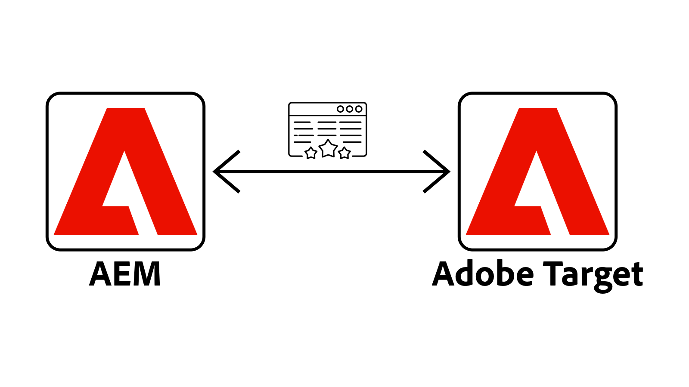
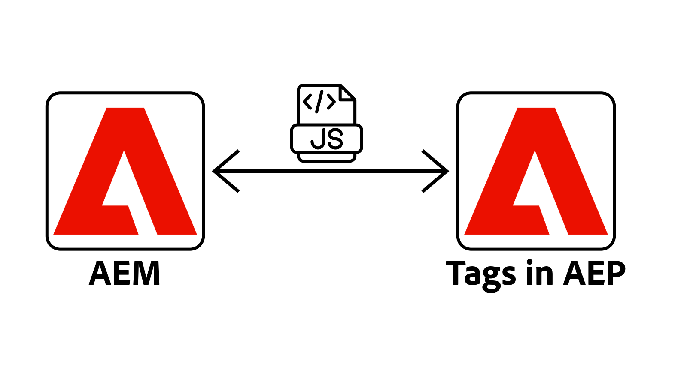
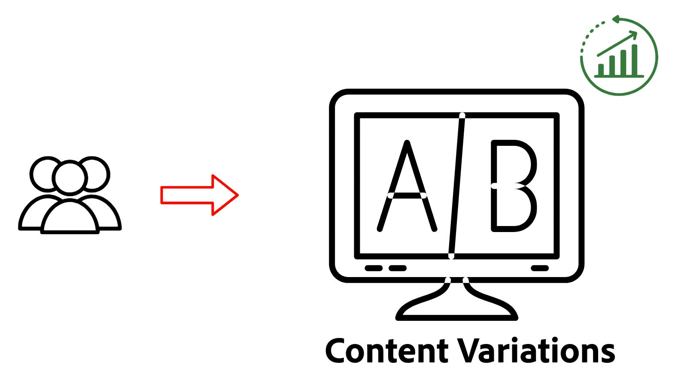
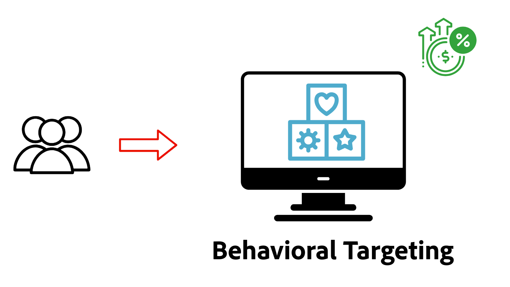
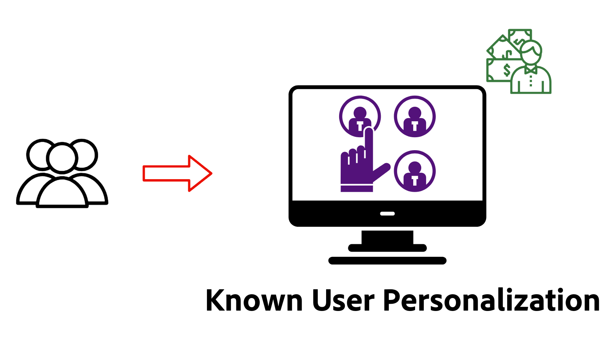

# Personalization Overview

Learn how AEM as a Cloud Service (AEMCS) integrates with Adobe Target and Adobe Experience Platform (AEP) to deliver personalized experiences. Using Experience Fragments as personalized content, discover how to run A/B tests, target users based on real-time behavior, or personalize content using unified customer profiles built from data across systems.

## Prerequisites

To demonstrate various personalization scenarios, this tutorial uses the sample [AEM WKND](https://github.com/adobe/aem-guides-wknd/) project. To follow along, you need:

- An Adobe org with access to:
  - **AEM as a Cloud Service environment** – to create and manage content
  - **Adobe Target** – to compose and deliver personalized experiences
  - **Adobe Experience Platform applications** – to manage customer profiles and audiences
  - **Tags (formerly Launch) in AEP** – to deploy the Web SDK and custom JavaScript for data collection and personalization

- A basic understanding of AEM components and Experience Fragments

- The [AEM WKND](https://github.com/adobe/aem-guides-wknd/) project deployed to your AEM as a Cloud Service environment.

## Get Started

Before exploring specific use cases, you first configure AEM as a Cloud Service for personalization. Begin by integrating Adobe Target and Tags to enable client-side personalization using the Web SDK. These foundational steps allow your AEM pages to support experimentation, audience targeting, and real-time personalization.

<!-- CARDS
{target = _self}

* ./setup/integrate-adobe-target.md
  {title = Integrate Adobe Target}
  {description = Integrate AEMCS with Adobe Target to activate personalized content, such as Experience Fragments, as offers.}
  {image = ./assets/setup/integrate-target.png}
  {cta = Integrate Target}

* ./setup/integrate-adobe-tags.md
  {title = Integrate Tags}
  {description = Integrate AEMCS with Tags to inject the Web SDK and custom JavaScript for data collection and personalization.}
  {image = ./assets/setup/integrate-tags.png}
  {cta = Integrate Tags}
  
-->
<!-- START CARDS HTML - DO NOT MODIFY BY HAND -->

    

        

            

                <figure class="image x-is-16by9">
                    
                </figure>
            

            

                

                    

                        <a href="./setup/integrate-adobe-target.md" target="_self" rel="referrer" title="Integrate Adobe Target">Integrate Adobe Target</a>
                    

                    
Integrate AEMCS with Adobe Target to activate personalized content, such as Experience Fragments, as offers.

                

                <a href="./setup/integrate-adobe-target.md" target="_self" rel="referrer" class="spectrum-Button spectrum-Button--outline spectrum-Button--primary spectrum-Button--sizeM" style="align-self: flex-start; margin-top: 1rem;">
                    Integrate Target
                </a>
            

        

    

    

        

            

                <figure class="image x-is-16by9">
                    
                </figure>
            

            

                

                    

                        <a href="./setup/integrate-adobe-tags.md" target="_self" rel="referrer" title="Integrate Tags">Integrate Tags</a>
                    

                    
Integrate AEMCS with Tags to inject the Web SDK and custom JavaScript for data collection and personalization.

                

                <a href="./setup/integrate-adobe-tags.md" target="_self" rel="referrer" class="spectrum-Button spectrum-Button--outline spectrum-Button--primary spectrum-Button--sizeM" style="align-self: flex-start; margin-top: 1rem;">
                    Integrate Tags
                </a>
            

        

    

<!-- END CARDS HTML - DO NOT MODIFY BY HAND -->

## Use Cases

Explore the following common personalization use cases supported by AEMCS, Adobe Target, and Adobe Experience Platform.

<!-- CARDS
{target = _self}

* ./use-cases/experimentation.md
    {title = Experimentation (A/B Testing)}
    {description = Learn how to test different content variations on an AEMCS website using Adobe Target for A/B testing.}
    {image = ./assets/use-cases/experiment/experimentation.png}
    {cta = Learn Experimentation}

* ./use-cases/behavioral-targeting.md
    {title = Behavioral Targeting}
    {description = Learn how to personalize content based on user behavior using Adobe Experience Platform and Adobe Target.}
    {image = ./assets/use-cases/behavioral-targeting/behavioral-targeting.png}
    {cta = Learn Behavioral Targeting}

* ./use-cases/known-user-personalization.md
    {title = Known-user personalization}
    {description = Learn how to personalize content based on known user data by stitching information from multiple systems into a complete customer profile.}
    {image = ./assets/use-cases/known-user-personalization/known-user-personalization.png}
    {cta = Learn Known-user personalization}
-->
<!-- START CARDS HTML - DO NOT MODIFY BY HAND -->

    

        

            

                <figure class="image x-is-16by9">
                    
                </figure>
            

            

                

                    

                        <a href="./use-cases/experimentation.md" target="_self" rel="referrer" title="Experimentation (A/B Testing)">Experimentation (A/B Testing)</a>
                    

                    
Learn how to test different content variations on an AEMCS website using Adobe Target for A/B testing.

                

                <a href="./use-cases/experimentation.md" target="_self" rel="referrer" class="spectrum-Button spectrum-Button--outline spectrum-Button--primary spectrum-Button--sizeM" style="align-self: flex-start; margin-top: 1rem;">
                    Learn Experimentation
                </a>
            

        

    

    

        

            

                <figure class="image x-is-16by9">
                    
                </figure>
            

            

                

                    

                        <a href="./use-cases/behavioral-targeting.md" target="_self" rel="referrer" title="Behavioral Targeting">Behavioral Targeting</a>
                    

                    
Learn how to personalize content based on user behavior using Adobe Experience Platform and Adobe Target.

                

                <a href="./use-cases/behavioral-targeting.md" target="_self" rel="referrer" class="spectrum-Button spectrum-Button--outline spectrum-Button--primary spectrum-Button--sizeM" style="align-self: flex-start; margin-top: 1rem;">
                    Learn Behavioral Targeting
                </a>
            

        

    

    

        

            

                <figure class="image x-is-16by9">
                    
                </figure>
            

            

                

                    

                        <a href="./use-cases/known-user-personalization.md" target="_self" rel="referrer" title="Known-user personalization">Known-user personalization</a>
                    

                    
Learn how to personalize content based on known user data by stitching information from multiple systems into a complete customer profile.

                

                <a href="./use-cases/known-user-personalization.md" target="_self" rel="referrer" class="spectrum-Button spectrum-Button--outline spectrum-Button--primary spectrum-Button--sizeM" style="align-self: flex-start; margin-top: 1rem;">
                    Learn Known-user personalization
                </a>
            

        

    

<!-- END CARDS HTML - DO NOT MODIFY BY HAND -->
