# Integrate Tags in Adobe Experience Platform

Learn how to integrate AEM as a Cloud Service (AEMCS) with Tags in Adobe Experience Platform. The Tags (aka Launch) integration enables you to deploy the Adobe Web SDK and inject custom JavaScript for data collection and personalization into your AEM pages.

The integration allows your marketing or development team to manage and deploy JavaScript for personalization and data collection—without needing to redeploy AEM code.

## High-Level Steps

The integration process involves four main steps that establish the connection between AEM and Tags:

1. **Create, configure, and publish a Tags property in Adobe Experience Platform**
2. **Verify an Adobe IMS configuration for Tags in AEM**
3. **Create a Tags configuration in AEM**
4. **Apply the Tags configuration to your AEM pages**

## Create, Configure, and Publish a Tags Property in Adobe Experience Platform

Start by creating a Tags property in Adobe Experience Platform. This property helps you manage the deployment of the Adobe Web SDK and any custom JavaScript required for personalization and data collection.

1. Go to the [Adobe Experience Platform](https://experience.adobe.com/platform), sign in with your Adobe ID, and navigate to **Tags** from the left-hand menu.  
   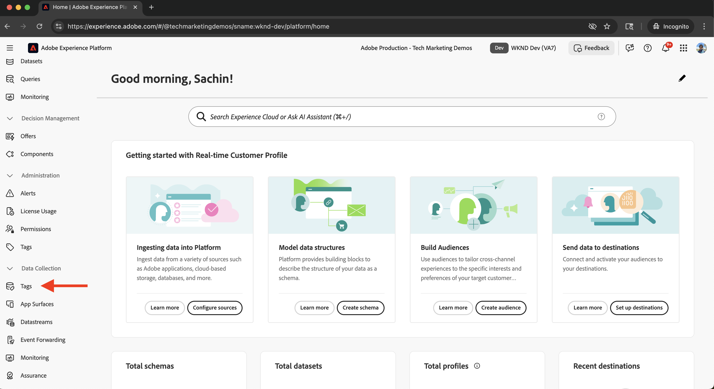

2. Click **New Property** to create a new Tags property.  
   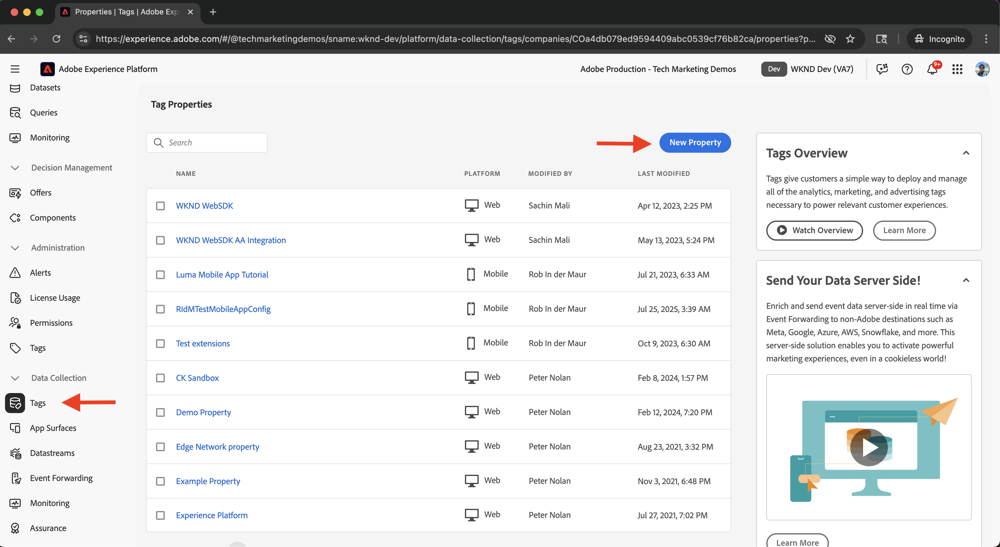

3. In the **Create Property** dialog, enter the following:
   - **Property Name**: A name for your Tags property
   - **Property Type**: Select **Web**
   - **Domain**: The domain where you deploy the property (for example, `.adobeaemcloud.com`)
   
   Click **Save**.  
   
   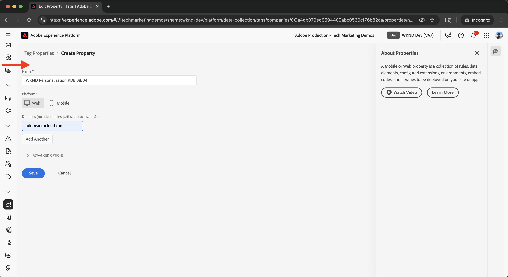

4. Open the new property. The **Core** extension should already be included. Later, you are going to add the **Web SDK** extension  when setting up the Experimentation use case, as it requires additional configuration such as the **Datastream ID**.  
   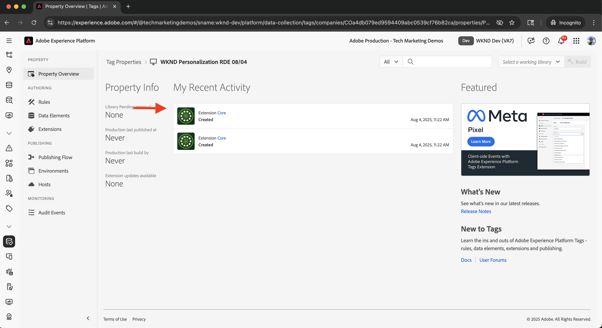

5. Publish the Tags property by going to **Publishing Flow** and clicking **Add Library** to create a deployment library.
   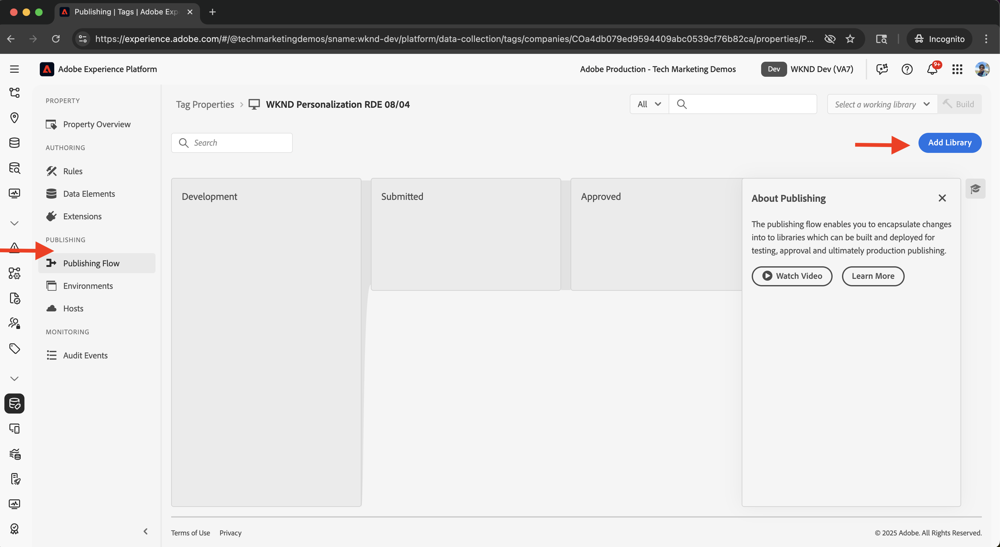

6. In the **Create Library** dialog, provide:
   - **Name**: A name for your library
   - **Environment**: Select **Development**
   - **Resource Changes**: Choose **Add All Changed Resources**  
   
   Click **Save & Build to Development**.  
   
   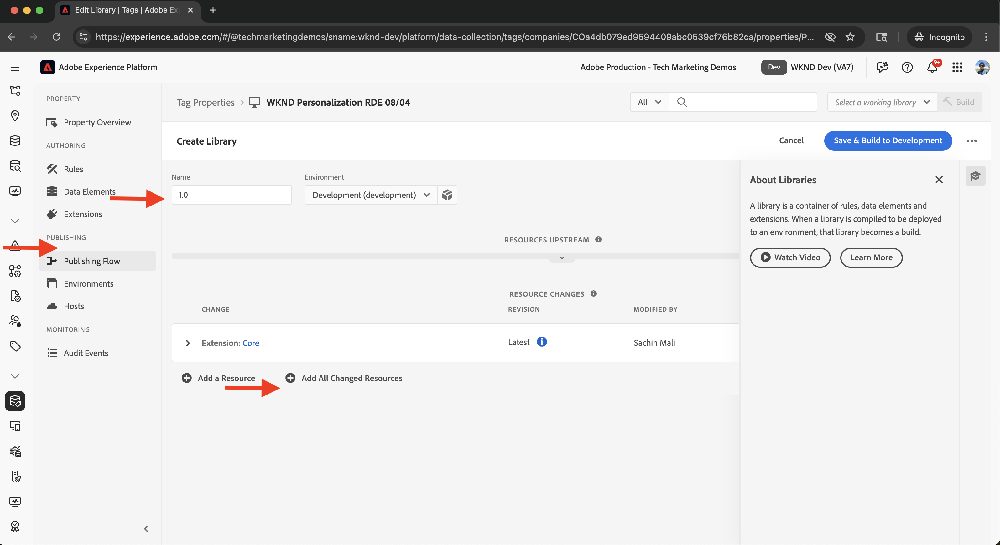

7. To publish the library to production, click **Approve & Publish to Production**. Once the publishing is complete, the property is ready for use in AEM.  
   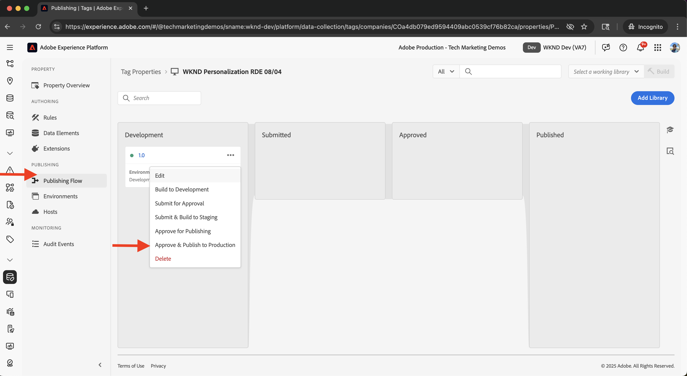

## Verify an Adobe IMS Configuration for Tags in AEM

When an AEMCS environment is provisioned, it automatically includes an Adobe IMS configuration for Tags, along with a corresponding Adobe Developer Console project. This configuration ensures secure API communication between AEM and Tags.

1. In AEM, navigate to **Tools** > **Security** > **Adobe IMS Configurations**.  
   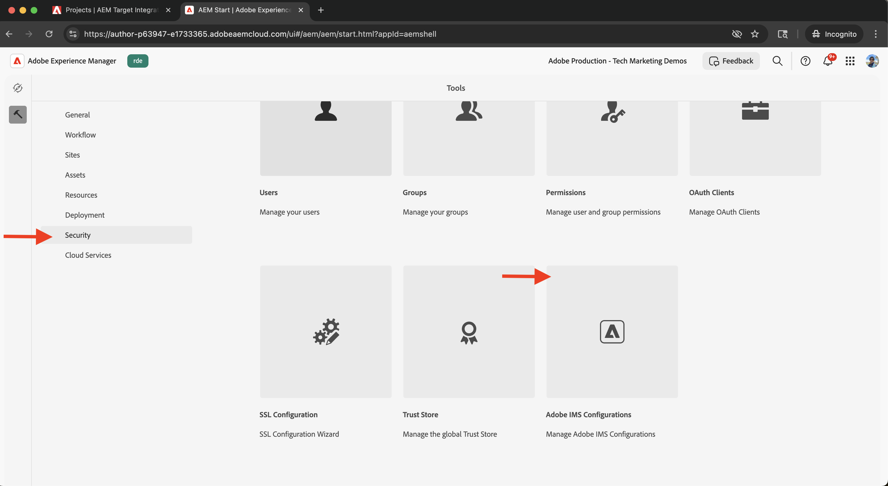

2. Locate the **Adobe Launch** configuration. If available, select it and click **Check Health** to verify the connection. You should see a success response.  
   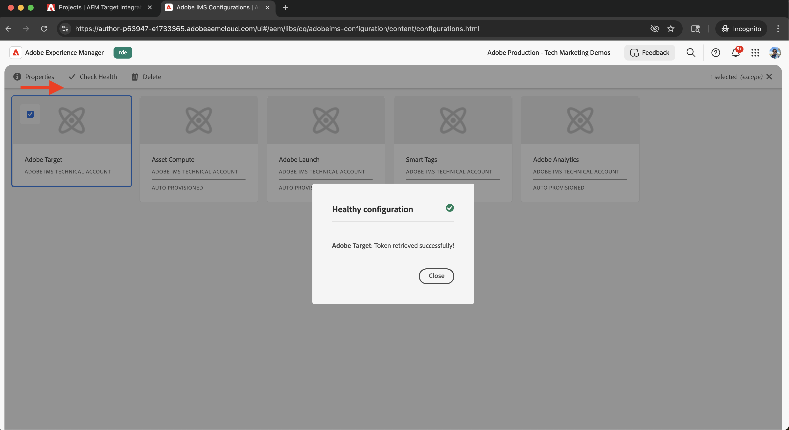

## Create a Tags Configuration in AEM

Create a Tags configuration in AEM to specify the property and settings needed for your site pages.

1. In AEM, go to **Tools** > **Cloud Services** > **Adobe Launch Configurations**.  
   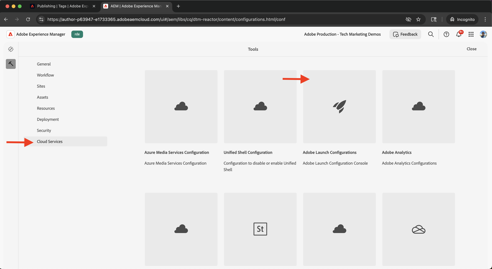

2. Select the root folder of your site (for example, WKND Site) and click **Create**.  
   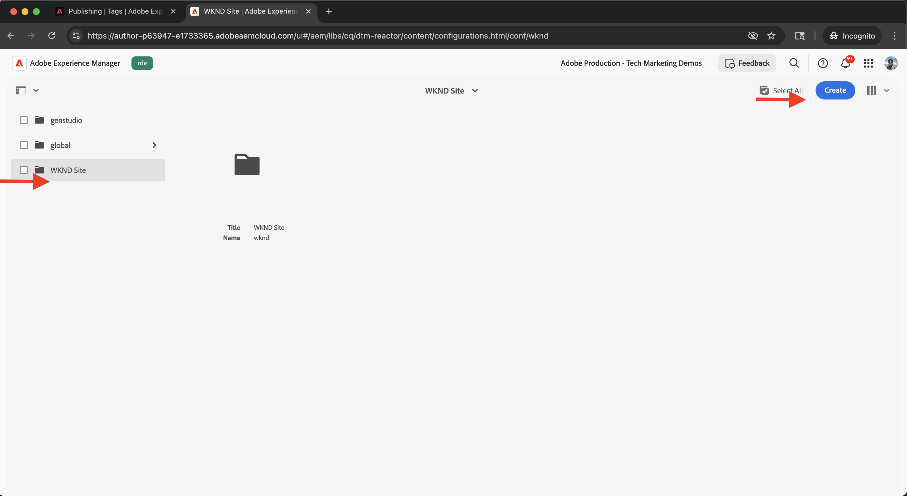

3. In the dialog, enter the following:
   - **Title**: For example, "Adobe Tags"
   - **IMS Configuration**: Select the verified **Adobe Launch** IMS configuration
   - **Company**: Select the company linked to your Tags property
   - **Property**: Choose the Tags property created earlier  
   
   Click **Next**.  
   
   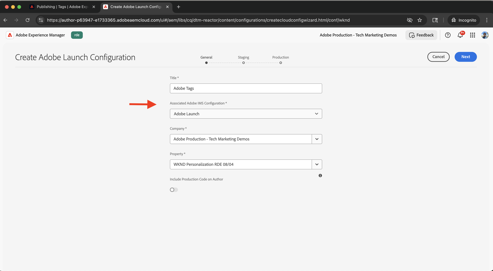

4. For demonstration purposes, keep the default values for **Staging** and **Production** environments. Click **Create**.  
   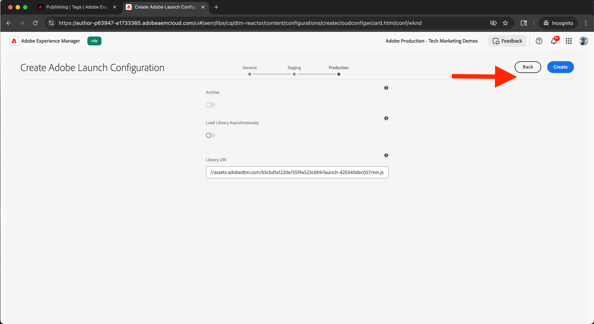

5. Select the newly created configuration and click **Publish** to make it available to your site pages.  
   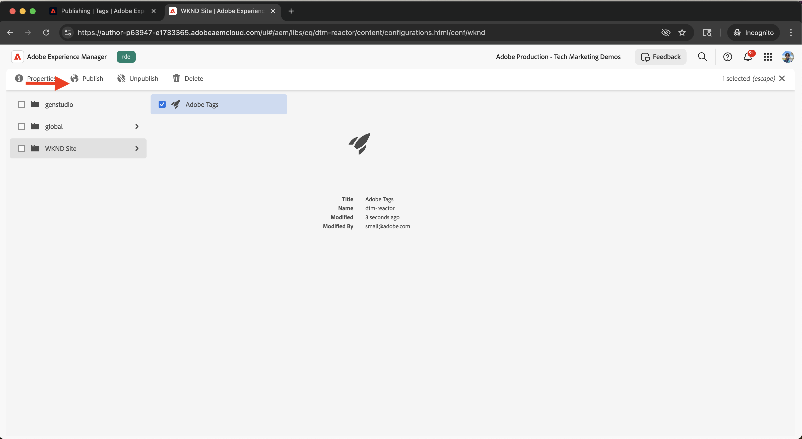

## Apply the Tags Configuration to Your AEM Site

Apply the Tags configuration to inject the Web SDK and personalization logic into your site pages.

1. In AEM, go to **Sites**, select your root site folder (for example, WKND Site), and click **Properties**.  
   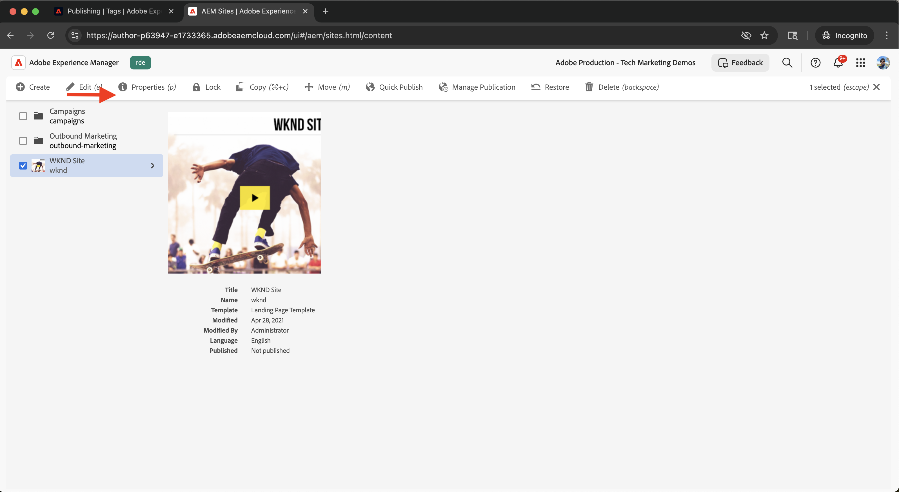

2. In the **Site Properties** dialog, open the **Advanced** tab. Under **Configurations**, ensure `/conf/wknd` is selected for **Cloud Configuration**.  
   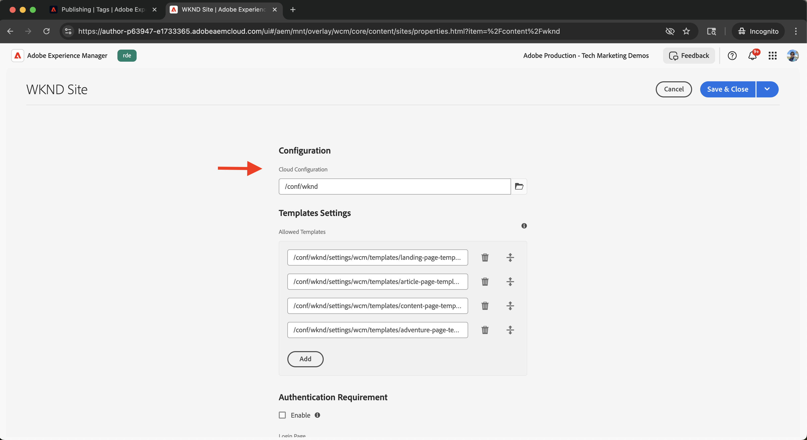

## Verify the Integration

To confirm that the Tags configuration is working correctly, you can:

1. Check the view source of an AEM publish page or inspect it using browser developer tools
2. Use the [Adobe Experience Platform Debugger](https://chromewebstore.google.com/detail/adobe-experience-platform/bfnnokhpnncpkdmbokanobigaccjkpob) to validate Web SDK and JavaScript injection

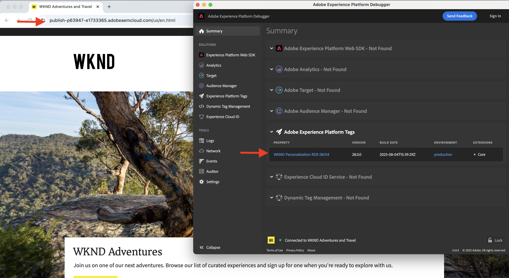

## Additional Resources

- [Adobe Experience Platform Debugger overview](https://experienceleague.adobe.com/en/docs/experience-platform/debugger/home)
- [Tags overview](https://experienceleague.adobe.com/en/docs/experience-platform/tags/home)
