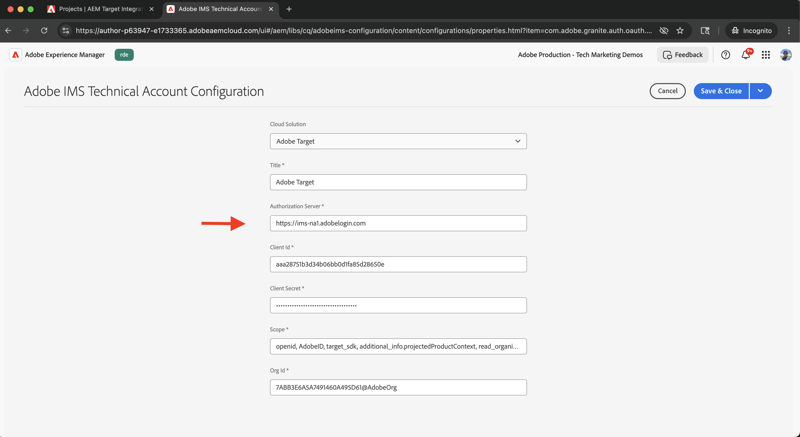

# Integrate Adobe Target

Learn how to integrate AEM as a Cloud Service (AEMCS) with Adobe Target to activate personalized content, such as Experience Fragments, as offers in Adobe Target.

The integration enables your marketing team to create and manage personalized content centrally in AEM. This content can then be seamlessly activated as offers in Adobe Target.

>[!IMPORTANT]
>
>The integration step is optional if your team prefers to manage offers entirely within Adobe Target, without using AEM as a centralized content repository.

## High-Level Steps

The integration process involves four main steps that establish the connection between AEM and Adobe Target:

1. **Create and configure an Adobe Developer Console project**  
2. **Create an Adobe IMS configuration for Target in AEM**  
3. **Create a legacy Adobe Target configuration in AEM**  
4. **Apply the Adobe Target configuration to Experience Fragments**

## Create and Configure an Adobe Developer Console Project

To enable AEM to communicate securely with Adobe Target, you must configure an Adobe Developer Console project using OAuth server-to-server authentication. You can use an existing project or create a new one.

1. Go to the [Adobe Developer Console](https://developer.adobe.com/console) and sign in with your Adobe ID.

2. Create a new project or select an existing one.  
   

3. Click **Add API**. In the **Add an API** dialog, filter by **Experience Cloud**, select **Adobe Target**, and click **Next**.  
   

4. In the **Configure API** dialog, select the **OAuth Server-to-Server** authentication method and click **Next**.  
   

5. In the **Select Product Profiles** step, select the **Default Workspace** and click **Save Configured API**.  
   

6. In the left navigation, select **OAuth Server-to-Server** and review the configuration details. Note the Client ID and Client Secret - you need these values to configure the IMS integration in AEM.
   

## Create an Adobe IMS Configuration for Target in AEM

In AEM, create an Adobe IMS configuration for Target using the credentials from the Adobe Developer Console. This configuration enables AEM to authenticate with the Adobe Target APIs.

1. In AEM, navigate to **Tools** > **Security** and select **Adobe IMS Configurations**.  
   

2. Click **Create**.  
   

3. On the **Adobe IMS Technical Account Configuration** page, enter the following:
   - **Cloud Solution**: Adobe Target
   - **Title**: A label for the configuration, such as "Adobe Target"
   - **Authorization Server**: `https://ims-na1.adobelogin.com`
   - **Client ID**: From the Adobe Developer Console
   - **Client Secret**: From the Adobe Developer Console
   - **Scope**: From the Adobe Developer Console
   - **Org ID**: From the Adobe Developer Console  
   
   Then click **Create**.  
   
   

4. Select the configuration and click **Check Health** to verify the connection. A success message confirms that AEM can connect to Adobe Target.  
   

## Create a Legacy Adobe Target Configuration in AEM

To export Experience Fragments as offers to Adobe Target, create a legacy Adobe Target configuration in AEM.

1. In AEM, navigate to **Tools** > **Cloud Services** and select **Legacy Cloud Services**.  
   

2. In the **Adobe Target** section, click **Configure Now**.  
   

3. In the **Create Configuration** dialog, enter a name such as "Adobe Target Legacy" and click **Create**.  
   

4. On the **Adobe Target Legacy Configuration** page, provide the following:
   - **Authentication**: IMS
   - **Client Code**: Your Adobe Target client code (found in Adobe Target under **Administration** > **Implementation**)
   - **IMS Configuration**: The IMS configuration you created earlier  
   
   Click **Connect to Adobe Target** to validate the connection.  
   
   

## Apply the Adobe Target Configuration to Experience Fragments

Associate the Adobe Target configuration with your Experience Fragments so they can be exported and used as offers in Target.

1. In AEM, go to **Experience Fragments**.  
   

2. Select the root folder that contains your Experience Fragments (for example, `WKND Site Fragments`) and click **Properties**.  
   

3. On the **Properties** page, open the **Cloud Services** tab. In the **Cloud Service Configurations** section, select your Adobe Target configuration.  
   

4. In the **Adobe Target** section that appears, complete the following:
   - **Adobe Target Export Format**: HTML
   - **Adobe Target Workspace**: Select the workspace to use (for example, "Default Workspace")
   - **Externalizer Domains**: Enter the domains for generating external URLs  
   
   

5. Click **Save & Close** to apply the configuration.

## Verify the Integration

To confirm that the integration works correctly, test the export functionality:

1. In AEM, create a new Experience Fragment or open an existing one. Click **Export to Adobe Target** from the toolbar.  
   

2. In Adobe Target, go to the **Offers** section and verify that the Experience Fragment appears as an offer.  
   

## Additional Resources

- [Target API overview](https://experienceleague.adobe.com/en/docs/target-dev/developer/api/target-api-overview)
- [Target Offer](https://experienceleague.adobe.com/en/docs/target/using/experiences/offers/manage-content)
- [Adobe Developer Console](https://developer.adobe.com/developer-console/docs/guides/)
- [Experience Fragments in AEM](https://experienceleague.adobe.com/en/docs/experience-manager-learn/sites/experience-fragments/experience-fragments-feature-video-use)
