# Behavioral Targeting

Learn how to personalize content based on user behavior using Adobe Experience Platform (AEP) and Adobe Target.

Behavioral targeting helps you deliver next-page personalization based on user behavior such as the pages they have visited, the products or categories they have browsed. Common scenarios include:

- **Hero Section Personalization**: Display personalized hero content on the next page based on the user's browsing activity
- **Content Element Customization**: Change headlines, images, or call-to-action buttons based on the user's browsing activity  
- **Page Content Adaptation**: Modify the entire page content based on the user's browsing activity

## Demo Use Case

In this tutorial, the process demonstrates how **anonymous users** who have visited either _Bali Surf Camp_, _Riverside Camping_, or _Tahoe Skiing_ adventure pages see a personalized hero displayed above the **Next Adventures** section on the WKND home page.

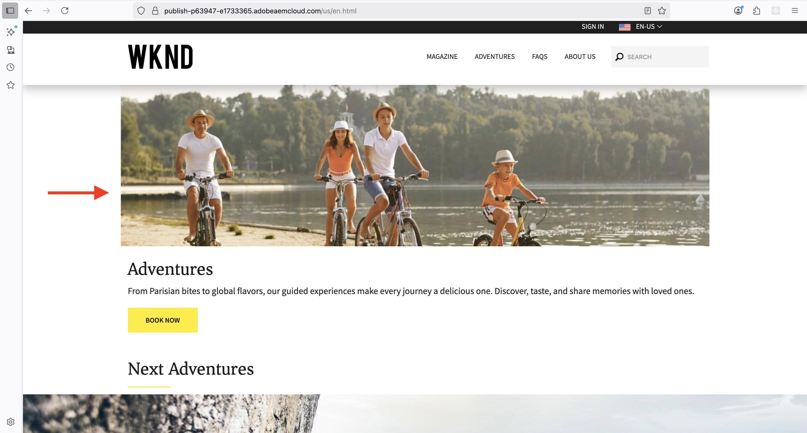

For demo purposes, users with this browsing behavior are categorized as the **Family Travelers** audience.

### Live Demo

Visit the [WKND Enablement website](https://wknd.enablementadobe.com/us/en.html) to see behavioral targeting in action. The site features three different behavioral targeting experiences:

- **Home Page**: When users visit the home page after browsing either _Bali Surf Camp_, _Riverside Camping_, or _Tahoe Skiing_ adventure pages, they are categorized as the **Family Travelers** audience and see a personalized hero section above the _Next Adventures_ section.

- **Adventure Page**: When users view _Bali Surf Camp_ or _Surf Camp In Costa Rica_ adventure pages, they are categorized as **Surfing Interest** audience and see a personalized hero section on the adventure page.

- **Magazine Page**: When users read _three or more_ articles, they are categorized as **Magazine Readers** audience and see a personalized hero section on the magazine page.

>[!VIDEO](https://video.tv.adobe.com/v/3474001/?learn=on&enablevpops)

>[!TIP]
>
>The first audience uses **Edge** evaluation for real-time personalization, while the second and third audiences use **Batch** evaluation for personalization, which is ideal for returning visitors.

## Prerequisites

Before proceeding with the behavioral targeting use case, ensure you have completed the following:

- [Integrate Adobe Target](../setup/integrate-adobe-target.md): Enables teams to create and manage personalized content centrally in AEM and activate it as offers in Adobe Target.
- [Integrate Tags in Adobe Experience Platform](../setup/integrate-adobe-tags.md): Allows teams to manage and deploy JavaScript for personalization and data collection without needing to redeploy AEM code.

Also be familiar with [Adobe Experience Cloud Identity Service (ECID)](https://experienceleague.adobe.com/en/docs/id-service/using/home) and [Adobe Experience Platform](https://experienceleague.adobe.com/en/docs/experience-platform/landing/home) concepts, such as Schema, Datastream, Audiences, Identities, and Profiles.

While you can create simple audiences in Adobe Target, Adobe Experience Platform (AEP) provides the modern approach to create and manage audiences and build complete customer profiles using various data sources such as behavioral and transactional data.

## High-Level Steps

The behavioral targeting setup process involves steps across Adobe Experience Platform, AEM, and Adobe Target.

1. **In Adobe Experience Platform:**
    1. Create and configure a Schema
    2. Create and configure a Dataset
    3. Create and configure a Datastream
    4. Create and configure a Tag property
    5. Configure Merge Policy for the Profile
    6. Set up (V2) Adobe Target Destination
    7. Create and configure an Audience

2. **In AEM:**
    1. Create personalized offers using Experience Fragment
    2. Integrate and inject Tags property into AEM pages
    3. Integrate Adobe Target and export personalized offers to Adobe Target
    
3. **In Adobe Target:**
    1. Verify the Audiences and offers
    2. Create and configure an activity

4. **Verify the behavioral targeting implementation on your AEM pages**

The AEP's various solutions are used to collect, manage, and harvest behavioral data to create audiences. These audiences are then activated in Adobe Target. Using activities in Adobe Target, personalized experiences are delivered to the users.

## Adobe Experience Platform Steps

To create audiences based on behavioral data, it is necessary to collect and store data when users visit or interact with your website. In this example, to categorize a user as **Family Travelers** audience, page view data needs to be collected. The process starts in the Adobe Experience Platform to set up the necessary components to collect this data.

Login to [Adobe Experience Cloud](https://experience.adobe.com/) and navigate to **Experience Platform** from the App Switcher or Quick Access section.

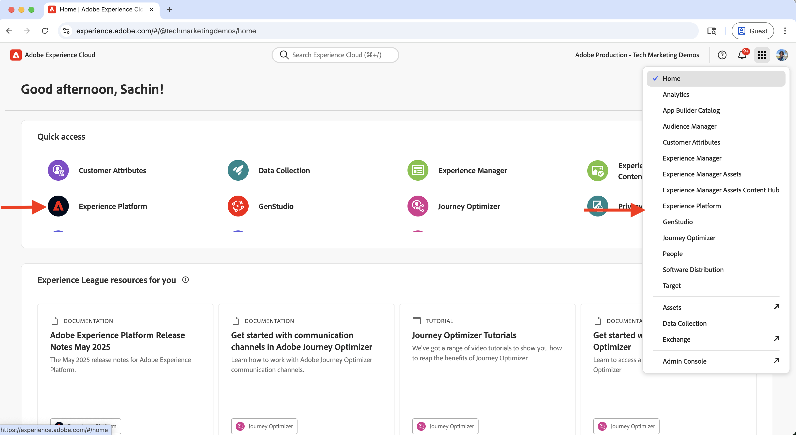

### Create and Configure a Schema

A schema defines the structure and format of data that you collect in Adobe Experience Platform. It ensures data consistency and enables you to create meaningful audiences based on standardized data fields. For behavioral targeting, a schema is needed that can capture page view events and user interactions.

Create a schema to collect page view data for behavioral targeting.

- In the **Adobe Experience Platform** home page, click **Schemas** from the left navigation and click **Create schema**.
  
  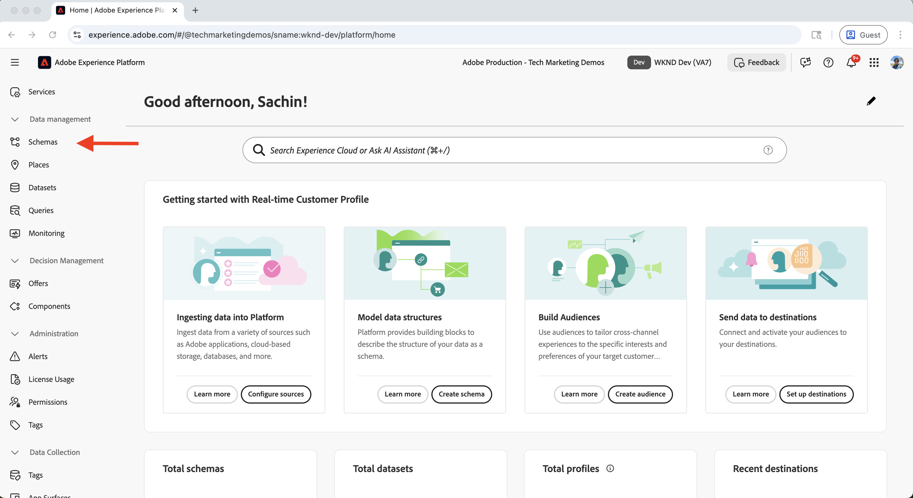

- In the **Create Schema** wizard, for **Schema details** step, select the **Experience Event** option and click **Next**.

  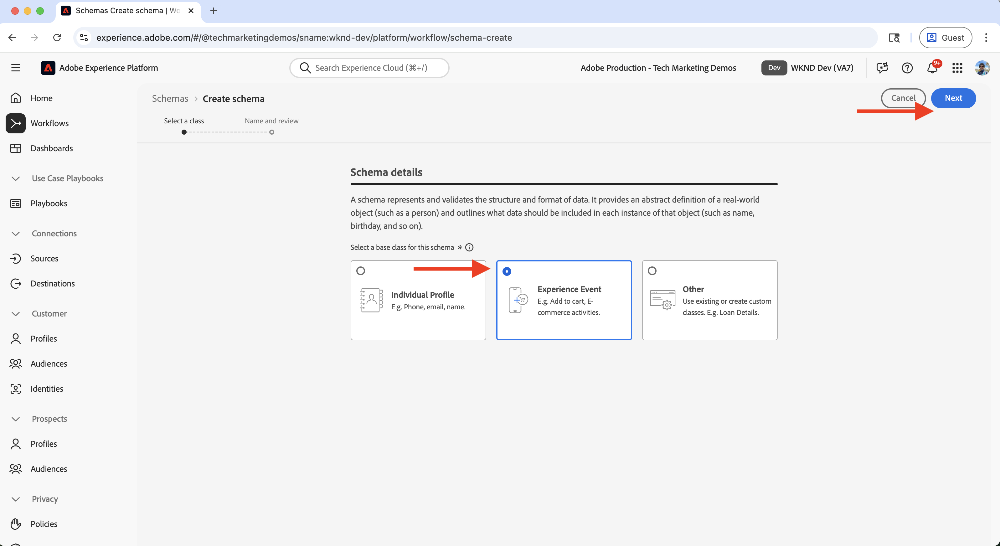

- For **Name and review** step, enter the following:
    - **Schema display name**: WKND-RDE-Behavioral-Targeting
    - **Class selected**: XDM ExperienceEvent

  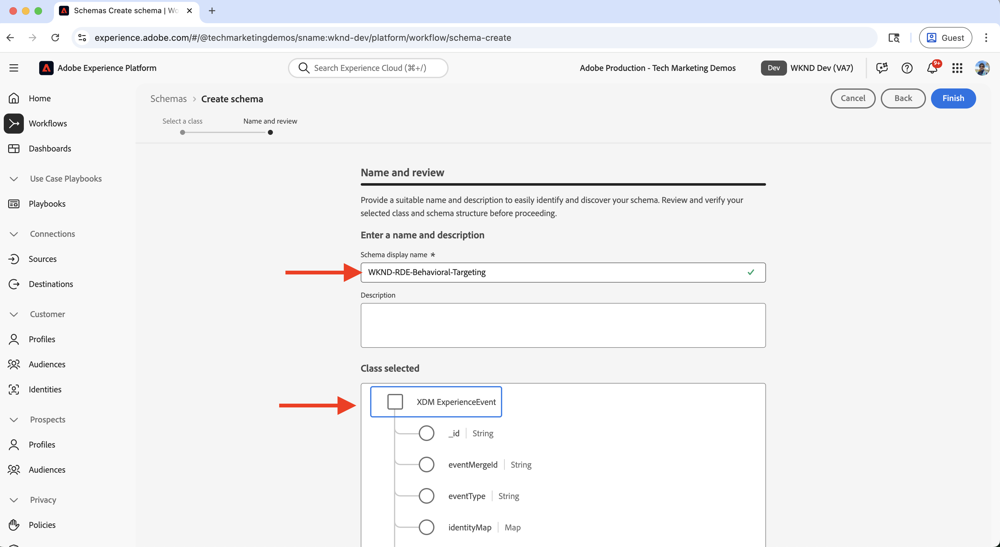

- Update the schema as follows:
    - **Add field group**: AEP Web SDK ExperienceEvent
    - **Profile**: Enable

    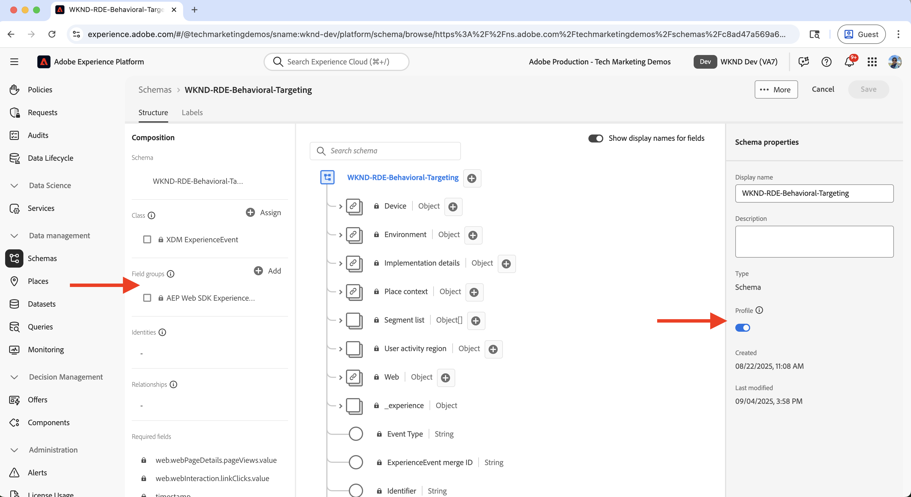

- Click **Save** to create the schema.

### Create and Configure a Dataset

A dataset is a container for data that follows a specific schema. It acts as a storage location where behavioral data is collected and organized. The dataset must be enabled for Profile to allow audience creation and personalization.

Let's create a dataset to store the page view data.

- In **Adobe Experience Platform**, click **Datasets** from the left navigation and click **Create dataset**.
  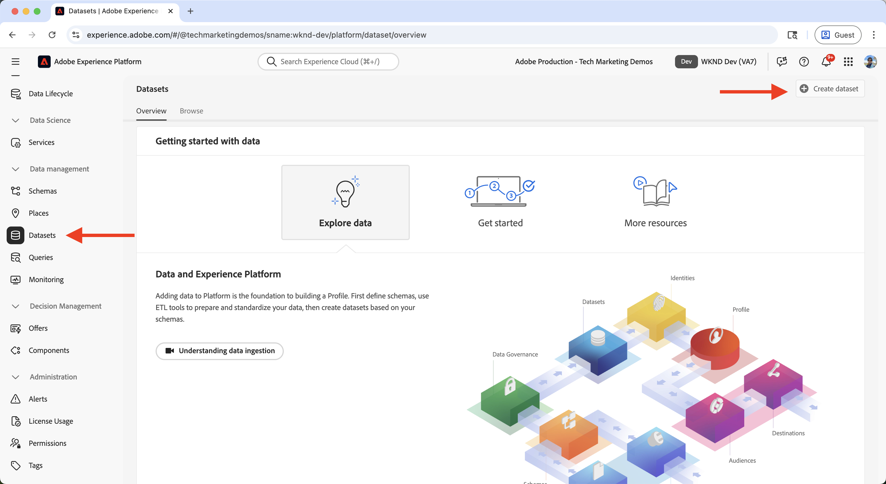

- In the **Create dataset** step, select **Create dataset from schema** option and click **Next**.
  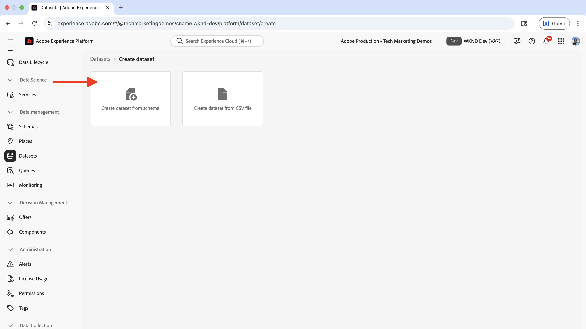

- In the **Create dataset from schema** wizard, for **Select schema** step, select the **WKND-RDE-Behavioral-Targeting** schema and click **Next**.
  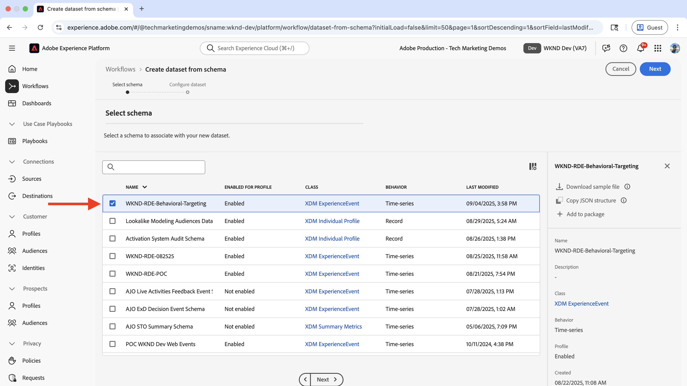

- For **Configure dataset** step, enter the following:
    - **Name**: WKND-RDE-Behavioral-Targeting
    - **Description**: Dataset to store page view data

  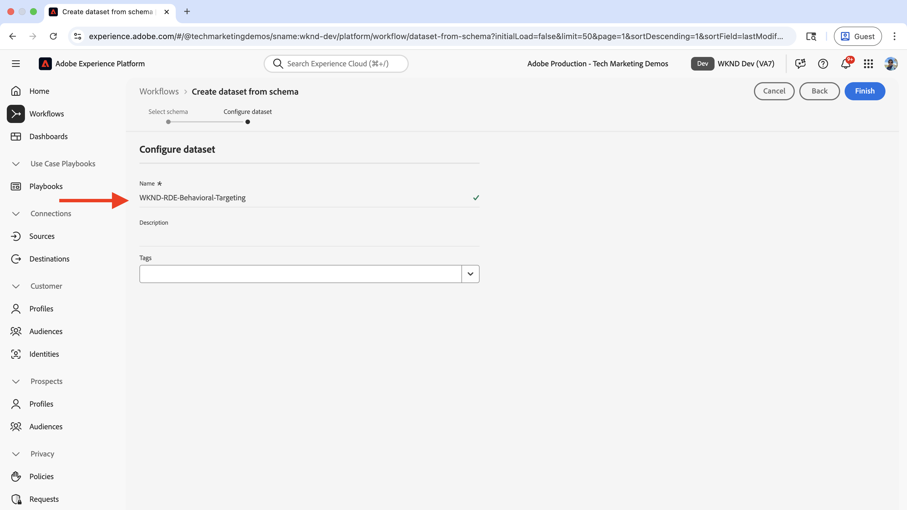

  Click **Finish** to create the dataset.

- Update the dataset as follows:
    - **Profile**: Enable

  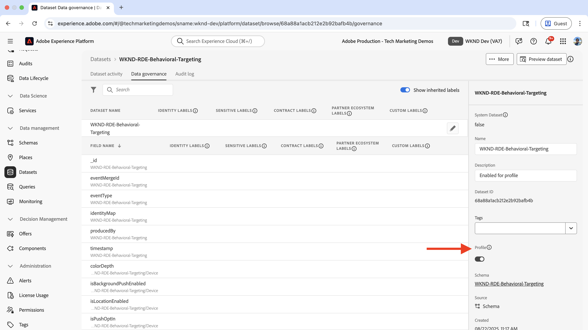

### Create and Configure a Datastream

A datastream is a configuration that defines how data flows from your website to Adobe Experience Platform via the Web SDK. It acts as a bridge between your website and the platform, ensuring data is properly formatted and routed to the correct datasets. For behavioral targeting, we need to enable specific services like Edge Segmentation and Personalization Destinations.

Let's create a datastream to send page view data to Experience Platform via the Web SDK.

- In **Adobe Experience Platform**, click **Datastreams** from the left navigation and click **Create datastream**.

- In the **New datastream** step, enter the following:
    - **Name**: WKND-RDE-Behavioral-Targeting
    - **Description**: Datastream to send page view data to Experience Platform
    - **Mapping Schema**: WKND-RDE-Behavioral-Targeting
    Click **Save** to create the datastream.

  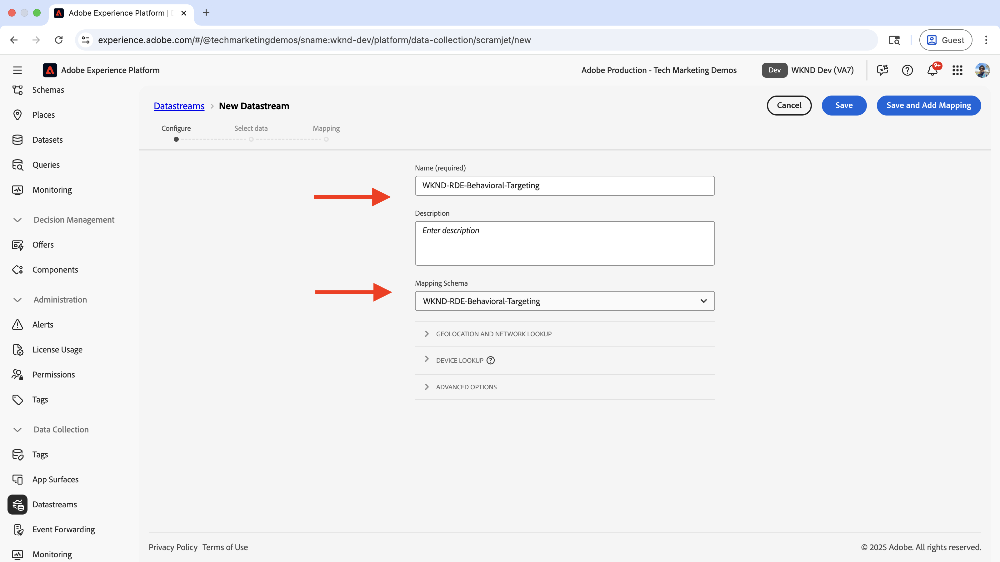

- Once the Datastream is created, click **Add Service**.

  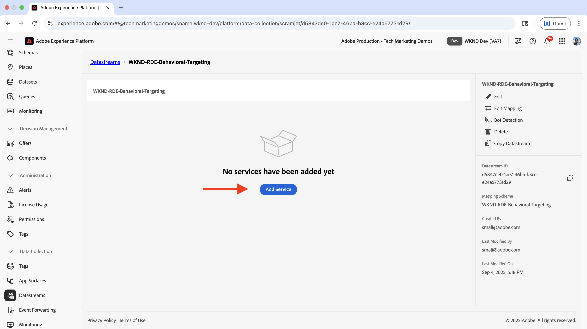

- In the **Add Service** step, select **Adobe Experience Platform** from the dropdown and enter the following:
    - **Event Dataset**: WKND-RDE-Behavioral-Targeting
    - **Profile Dataset**: WKND-RDE-Behavioral-Targeting
    - **Offer Decisioning**: Enable
    - **Edge Segmentation**: Enable
    - **Personalization Destinations**: Enable

  Click **Save** to add the service.
  
  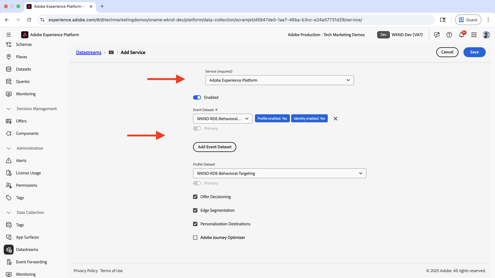

- In the **Add Service** step, select **Adobe Target** from the dropdown and enter the **Target Environment ID**. You can find the Target Environment ID in Adobe Target under **Administration** > **Environments**. Click **Save** to add the service.
  

### Create and Configure a Tag Property

A Tags property is a container for JavaScript code that collects data from your website and sends it to Adobe Experience Platform. It acts as the data collection layer that captures user interactions and page views. For behavioral targeting, we collect specific page details like page name, URL, site section, and host name to create meaningful audiences.

Let's create a Tags property that captures page view data when users visit your website.

For this use case, page details such as the page name, URL, site section, and host name are collected. These details are used to create behavioral audiences.

You can update the Tags property you created in the [Integrate Adobe Tags](../setup/integrate-adobe-tags.md) step. However, to keep it simple, a new Tags property is created.

#### Create Tags Property

To create a Tags property, complete the following steps:

- In **Adobe Experience Platform**, click **Tags** from the left navigation and click the **New Property** button.
  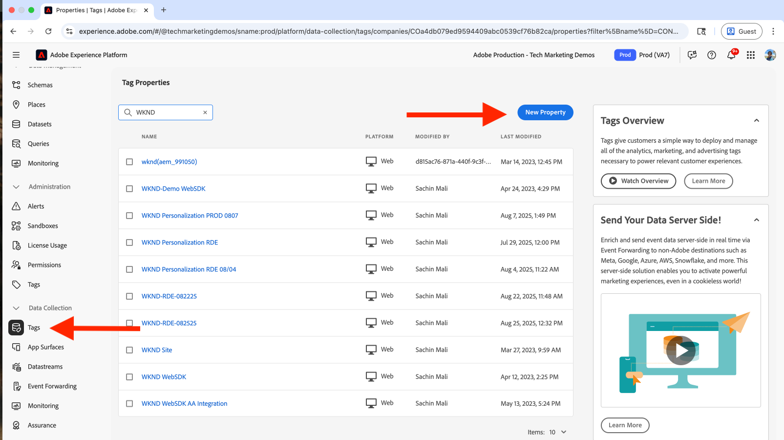

- In the **Create Property** dialog, enter the following:
    - **Property Name**: WKND-RDE-Behavioral-Targeting
    - **Property Type**: Select **Web**
    - **Domain**: The domain where you deploy the property (for example, `.adobeaemcloud.com`)

  Click **Save** to create the property.

  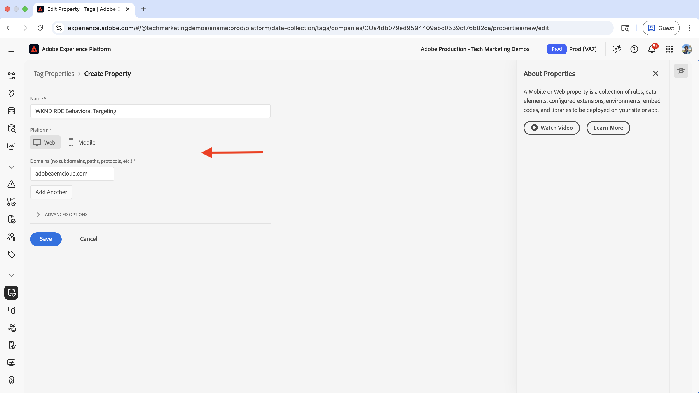

- Open the new property, and click **Extensions** from the left navigation, and click the **Catalog** tab. Search for **Web SDK** and click the **Install** button.
  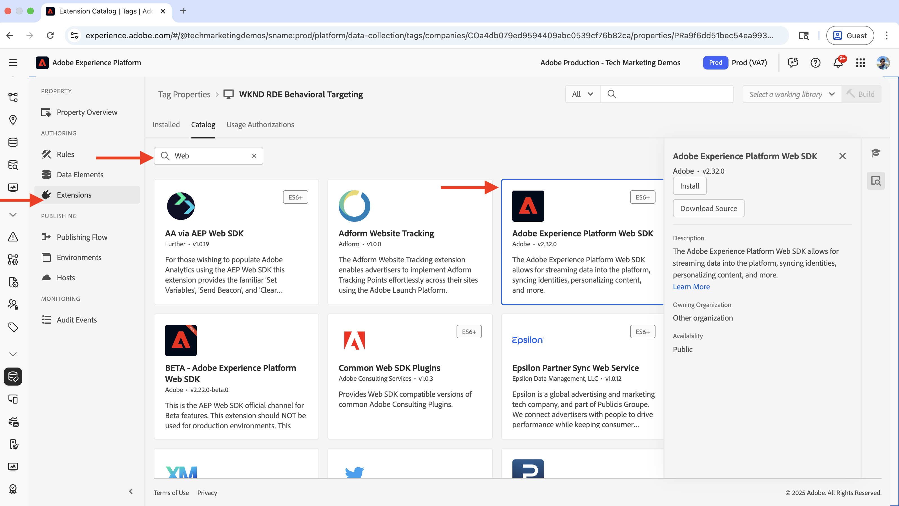

- In the **Install Extension** dialog, select the **Datastream** you created earlier and click **Save**.
  

#### Add Data Elements

Data elements are variables that capture specific data points from your website and make them available for use in rules and other Tags configurations. They act as the building blocks for data collection, allowing you to extract meaningful information from user interactions and page views. For behavioral targeting, page details like host name, site section, and page name need to be captured to create audience segments.

Create the following data elements to capture the important page details.

- Click **Data Elements** from the left navigation and click the **Create New Data Element** button.
  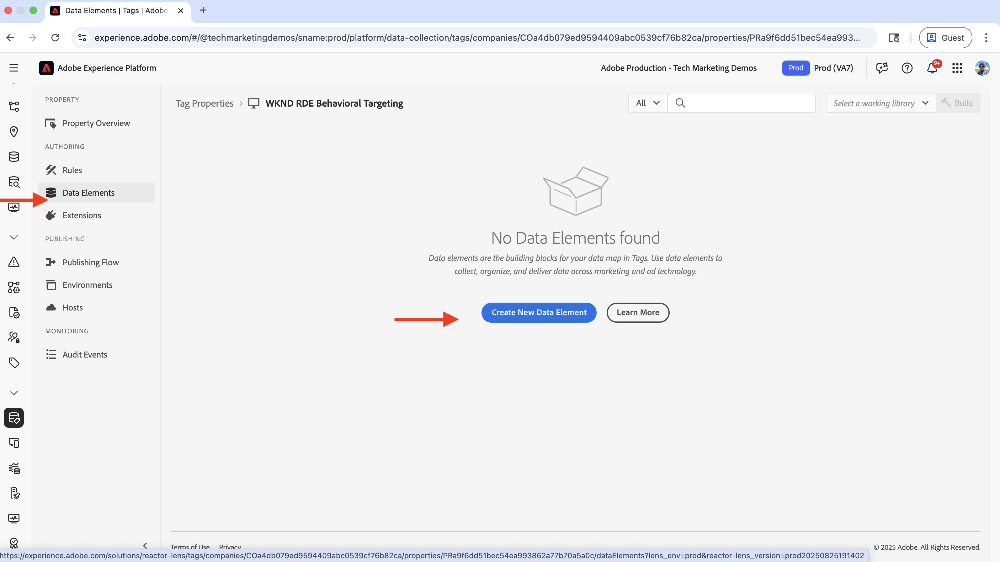

- In the **Create New Data Element** dialog, enter the following:
    - **Name**: Host Name
    - **Extension**: Select **Core**
    - **Data Element Type**: Select **Custom Code**
    - **Open Editor** button and enter the following code snippet:

        ```javascript
        if(window && window.location && window.location.hostname) {
            return window.location.hostname;
        }
        ```
    
  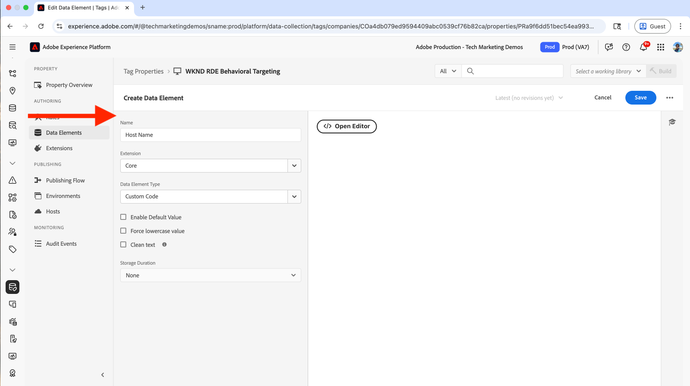

- Likewise, create the following data elements:

    - **Name**: Site Section
    - **Extension**: Select **Core**
    - **Data Element Type**: Select **Custom Code**
    - **Open Editor** button and enter the following code snippet:

        ```javascript
        if(event && event.component && event.component.hasOwnProperty('repo:path')) {
            let pagePath = event.component['repo:path'];
            
            let siteSection = '';
        
            //Check for html String in URL.
            if (pagePath.indexOf('.html') > -1) { 
            siteSection = pagePath.substring(0, pagePath.lastIndexOf('.html'));

            //replace slash with colon
            siteSection = siteSection.replaceAll('/', ':');
            
            //remove `:content`
            siteSection = siteSection.replaceAll(':content:','');
            }
            
            return siteSection 
        }        
        ```

    - **Name**: Page Name
    - **Extension**: Select **Core**
    - **Data Element Type**: Select **Custom Code**
    - **Open Editor** button and enter the following code snippet:

        ```javascript
        if(event && event.component && event.component.hasOwnProperty('dc:title')) {
            // return value of 'dc:title' from the data layer Page object, which is propagated via 'cmp:show' event
            return event.component['dc:title'];
        }        
        ```

- Next, create a data element of **Variable** type. This data element is populated with the page details before sending it to the Experience Platform.

    - **Name**: XDM-Variable Pageview
    - **Extension**: Select **Adobe Experience Platform Web SDK**
    - **Data Element Type**: Select **Variable**
    
    In the right panel,

    - **Sandbox**: Select your sandbox
    - **Schema**: Select the **WKND-RDE-Behavioral-Targeting** schema

    Click **Save** to create the data element.

    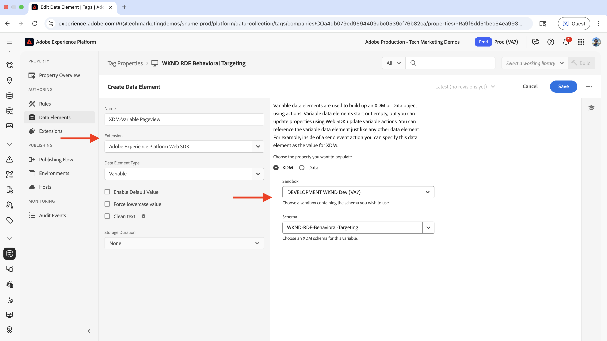

- In your **Data Elements** list, you should have four data elements:

  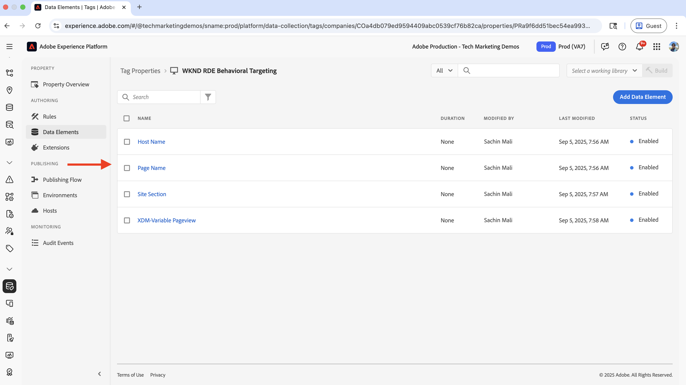

#### Add Rules

Rules define when and how data is collected and sent to Adobe Experience Platform. They act as the logic layer that determines what happens when specific events occur on your website. For behavioral targeting, rules are created that capture page view events and populate data elements with the collected information before sending it to the platform.

Create a rule to populate the **XDM-Variable Pageview** data element using the other data elements before sending it to the Experience Platform. The rule is triggered when a user browses the WKND website.

- Click **Rules** from the left navigation and click the **Create New Rule** button.
  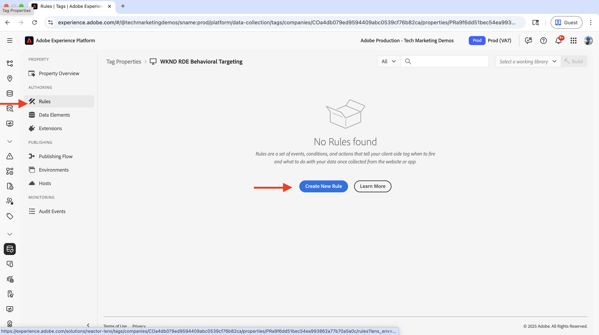

- In the **Create New Rule** dialog, enter the following:
    
    - **Name**: all pages - on load
    
    - For the **Events** section, click **Add** to open the **Event Configuration** wizard.
        - **Extension**: Select **Core**
        - **Event Type**: Select **Custom Code**
        - **Open Editor** button and enter the following code snippet:

            ```javascript
            var pageShownEventHandler = function(evt) {
                // defensive coding to avoid a null pointer exception
                if(evt.hasOwnProperty("eventInfo") && evt.eventInfo.hasOwnProperty("path")) {
                    //trigger Launch Rule and pass event
                    console.debug("cmp:show event: " + evt.eventInfo.path);
                    var event = {
                        //include the path of the component that triggered the event
                        path: evt.eventInfo.path,
                        //get the state of the component that triggered the event
                        component: window.adobeDataLayer.getState(evt.eventInfo.path)
                    };

                    //Trigger the Launch Rule, passing in the new 'event' object
                    // the 'event' obj can now be referenced by the reserved name 'event' by other Launch data elements
                    // i.e 'event.component['someKey']'
                    trigger(event);
                }
            }

            //set the namespace to avoid a potential race condition
            window.adobeDataLayer = window.adobeDataLayer || [];

            //push the event listener for cmp:show into the data layer
            window.adobeDataLayer.push(function (dl) {
                //add event listener for 'cmp:show' and callback to the 'pageShownEventHandler' function
                dl.addEventListener("cmp:show", pageShownEventHandler);
            });
            ```
        
    - For the **Conditions** section, click **Add** to open the **Condition Configuration** wizard.
        - **Logic Type**: Select **Regular**
        - **Extension**: Select **Core**
        - **Condition Type**: Select **Custom Code**
        - **Open Editor** button and enter the following code snippet:
        
            ```javascript
            if(event && event.component && event.component.hasOwnProperty('@type') && event.component.hasOwnProperty('xdm:template')) {
                console.log('The cmp:show event is from PAGE HANDLE IT');
                return true;
            }else{
                console.log('The cmp:show event is NOT from PAGE IGNORE IT');
                return false;
            }            
            ```

    - For the **Actions** section, click **Add** to open the **Action Configuration** wizard.
        - **Extension**: Select **Adobe Experience Platform Web SDK**
        - **Action Type**: Select **Update variable**
        - Map the **web** > **webPageDetails** > **name** to the **Page Name** data element

          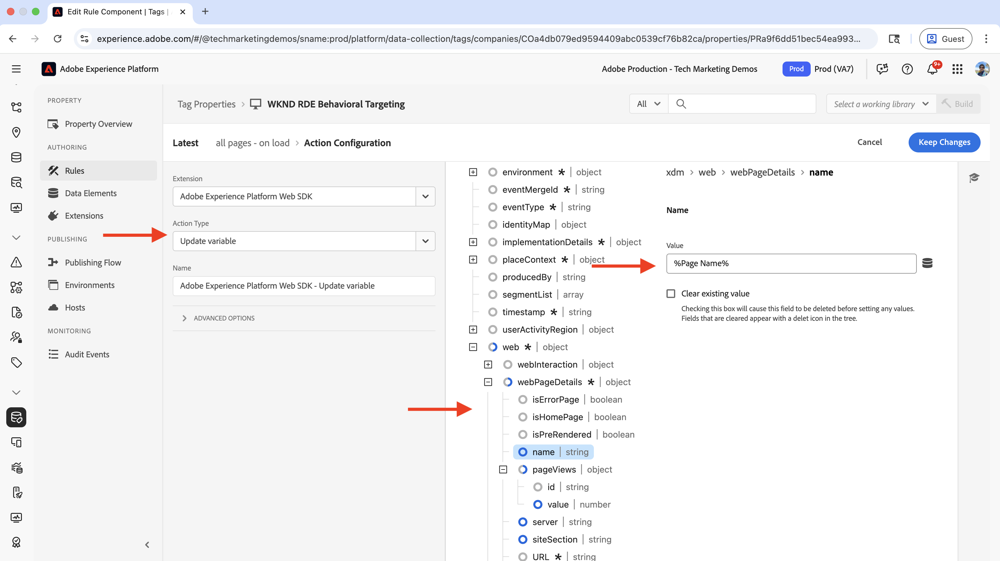

        - Likewise, map the **server** to the **Host Name** data element and **siteSection** to the **Site Section** data element. For **pageView** > **value** enter `1`, to indicate a page view event.
        
        - Click **Keep Changes** to save the action configuration.
    
    - Again, click **Add** to add another action and open the **Action Configuration** wizard.
        - **Extension**: Select **Adobe Experience Platform Web SDK**
        - **Action Type**: Select **Send event**
        - In the right panel's **Data** section, map the **XDM-Variable Pageview** data element to the **Web Webpagedetails Page Views** type.

        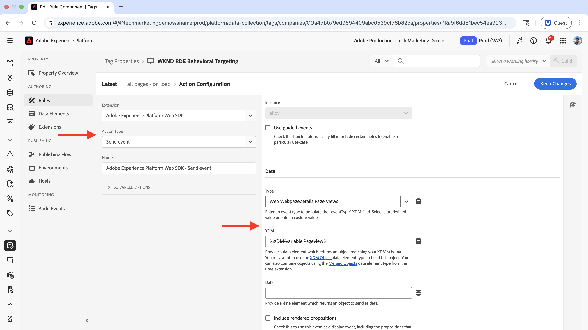

        - Also, in the right panel's **Personalization** section, check the **Render visual personalization decisions** option.  Then, click **Keep Changes** to save the action.  

        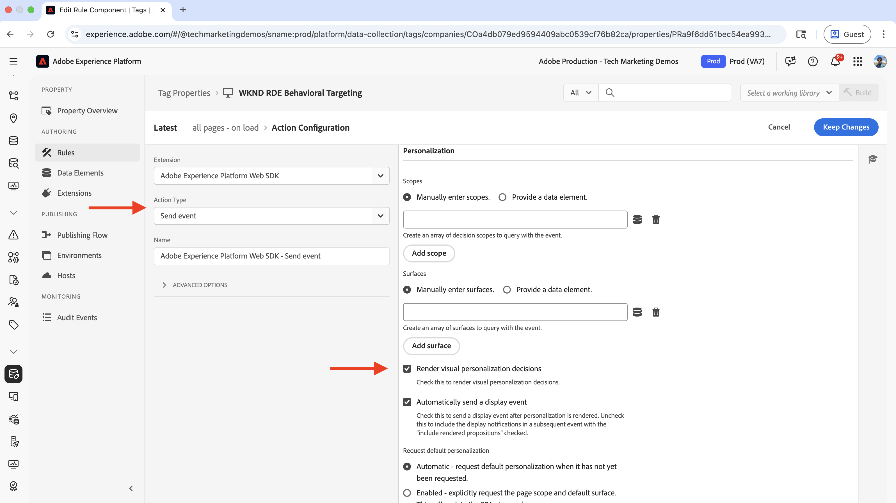

    - Click **Keep Changes** to save the rule.

- Your rule should look like this:

  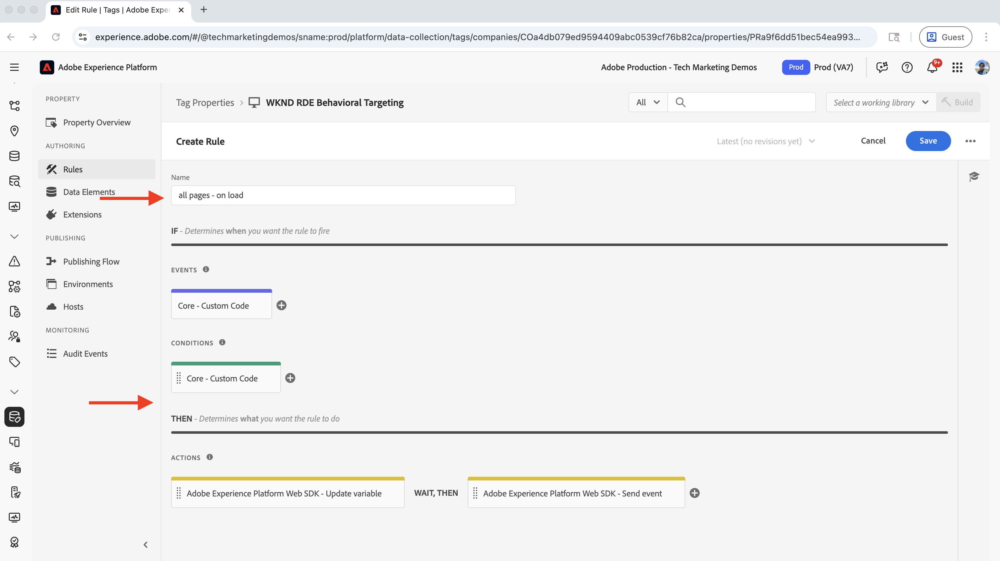

The above rule creation steps have a considerable number of details so be careful while creating the rule. It might sound complex but remember these config steps make it plug and play without needing to update AEM code and re-deploying the application.

#### Add Library and Publish it

A library is a collection of all your Tags configurations (data elements, rules, extensions) that gets built and deployed to your website. It packages everything together so data collection works properly. For behavioral targeting, the library is published to make the data collection rules active on your website.

- Click **Publishing Flow** from the left navigation and click the **Add Library** button.
  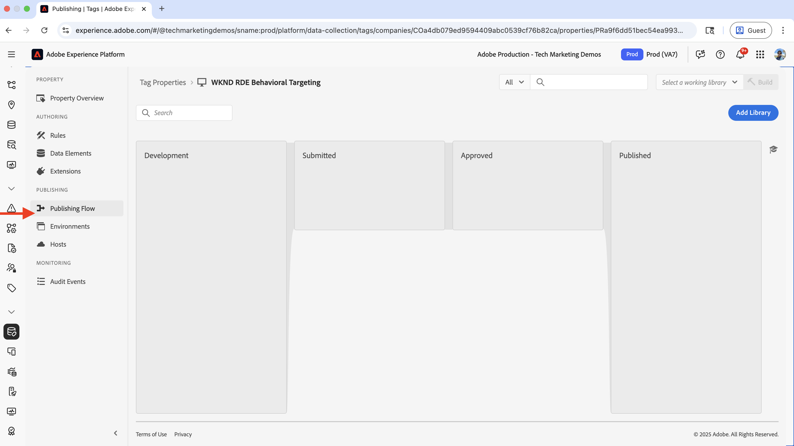

- In the **Add Library** dialog, enter the following:
    - **Name**: 1.0
    - **Environment**: Select **Development**
    - Click **Add All Changed Resources** to select all the resources.

  Click **Save & Build to Development** to create the library.

  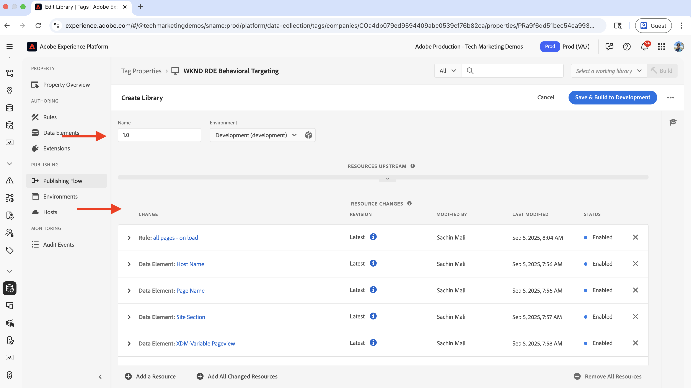

- Once the library is built for the **Development** swim lane, click the ellipses (three dots) and select the **Approve & Publish to Production** option.
  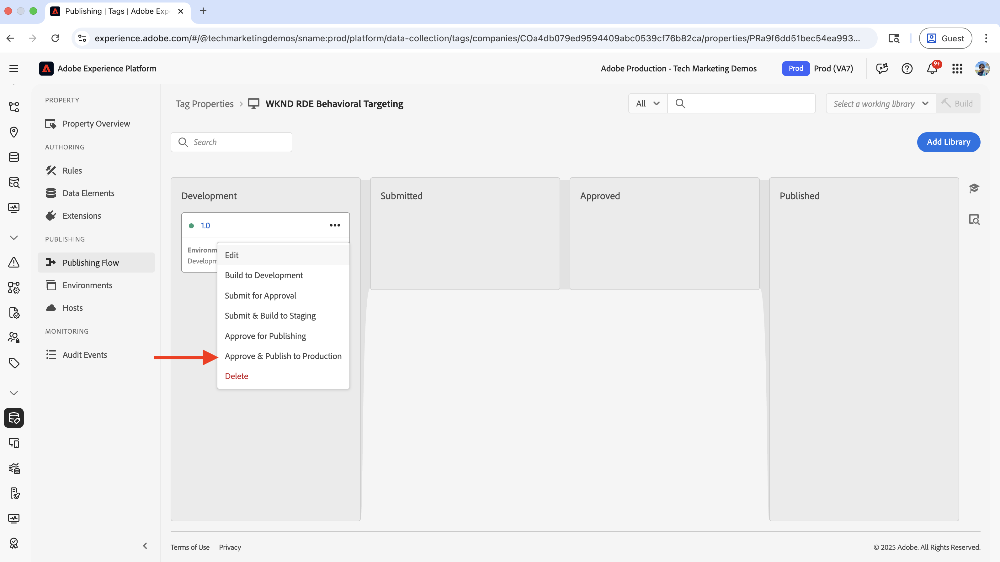

Congratulations! You have created the Tags property with the rule to collect page details and send them to Experience Platform. This is the foundational step to create behavioral audiences.

### Configure Merge Policy for the Profile

A merge policy defines how customer data from multiple sources gets unified into a single profile. It determines which data takes precedence when there are conflicts, ensuring you have a complete and consistent view of each customer for behavioral targeting.

For the purpose of this use case, a merge policy is created or updated that is:

- **Default merge policy**: Enable
- **Active-On-Edge Merge Policy**: Enable

To create a merge policy, complete the following steps:

- In **Adobe Experience Platform**, click **Profiles** from the left navigation and click the **Merge Policies** tab.

  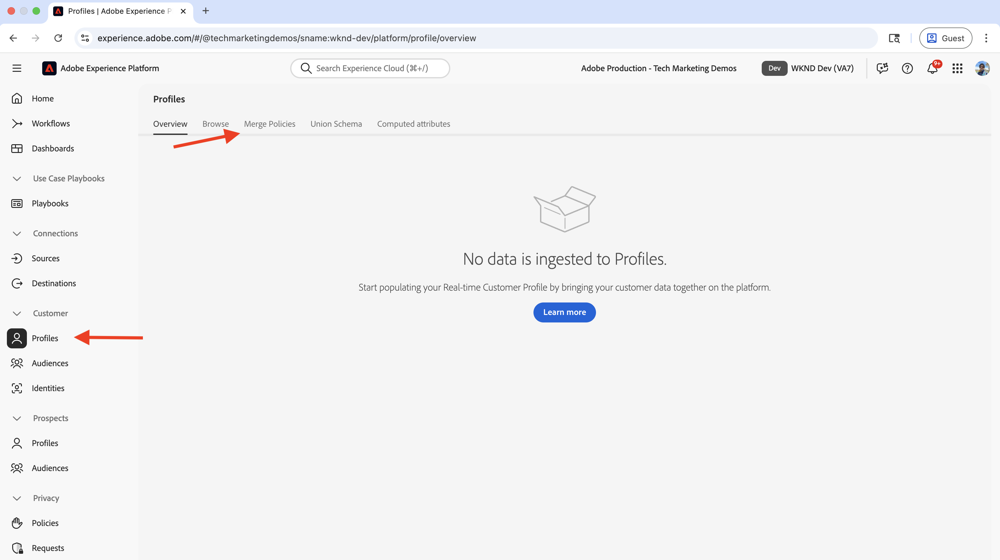

- You can use an existing merge policy, but for this tutorial, a new merge policy is created with the following configuration:

  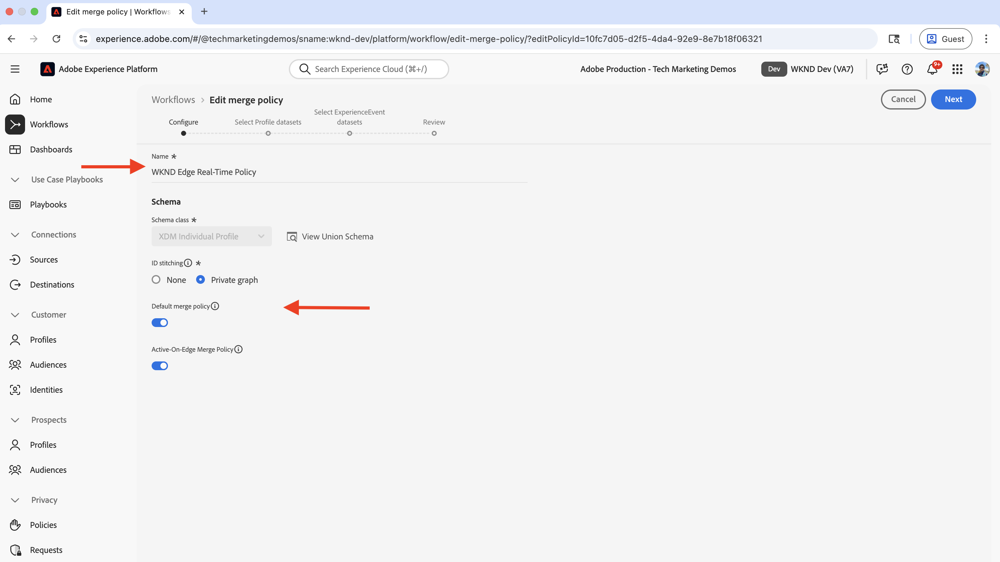

- Make sure to enable both **Default merge policy** and **Active-On-Edge Merge Policy** options. These settings ensure that your behavioral data is properly unified and available for real-time audience evaluation.

### Set up (V2) Adobe Target Destination

The Adobe Target Destination (V2) enables you to activate behavioral audiences created in Experience Platform directly in Adobe Target. This connection allows your behavioral audiences to be used for personalization activities in Adobe Target.

- In **Adobe Experience Platform**, click **Destinations** from the left navigation and click the **Catalog** tab and filter by **Personalization** and select **(v2) Adobe Target** destination.

  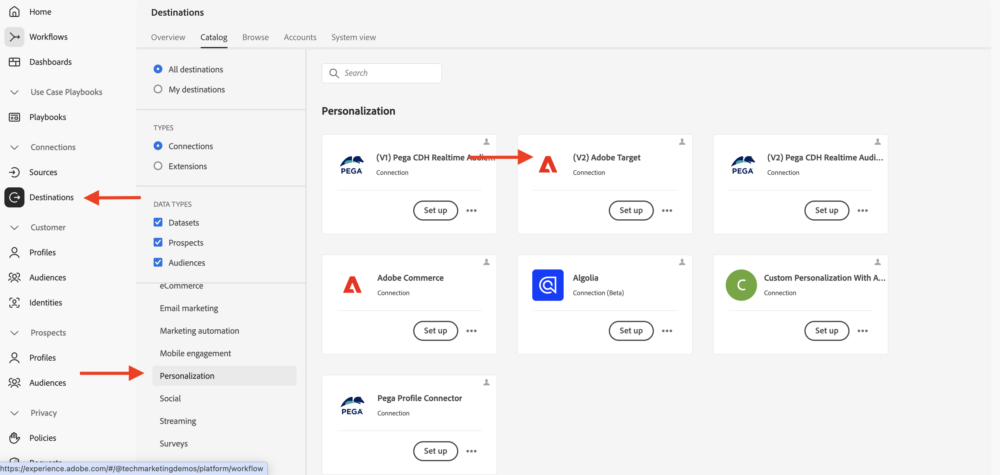

- In the **Activate Destinations** step, provide a name for the destination and click the **Connect to destination** button.
  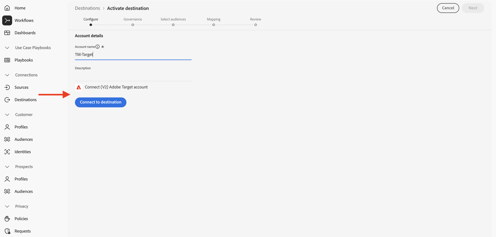

- In the **Destination details** section, enter the following:
    - **Name**: WKND-RDE-Behavioral-Targeting-Destination
    - **Description**: Destination for behavioral targeting audiences
    - **Datastream**: Select the **Datastream** that you created earlier
    - **Workspace**: Select your Adobe Target workspace

  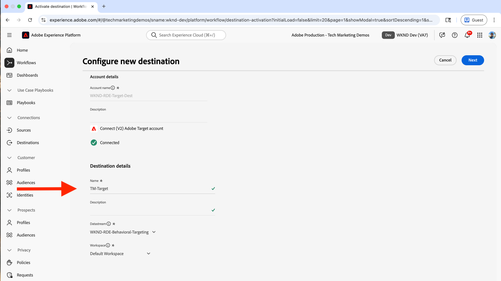

- Click **Next** and complete the destination configuration.

Once configured, this destination allows you to activate behavioral audiences from Experience Platform to Adobe Target for use in personalization activities.

### Create and Configure an Audience

An audience defines a specific group of users based on their behavioral patterns and characteristics. In this step, a "Family Travelers" audience is created using the behavioral data rules.

To create an audience, complete the following steps:

- In **Adobe Experience Platform**, click **Audiences** from the left navigation and click the **Create Audience** button.
  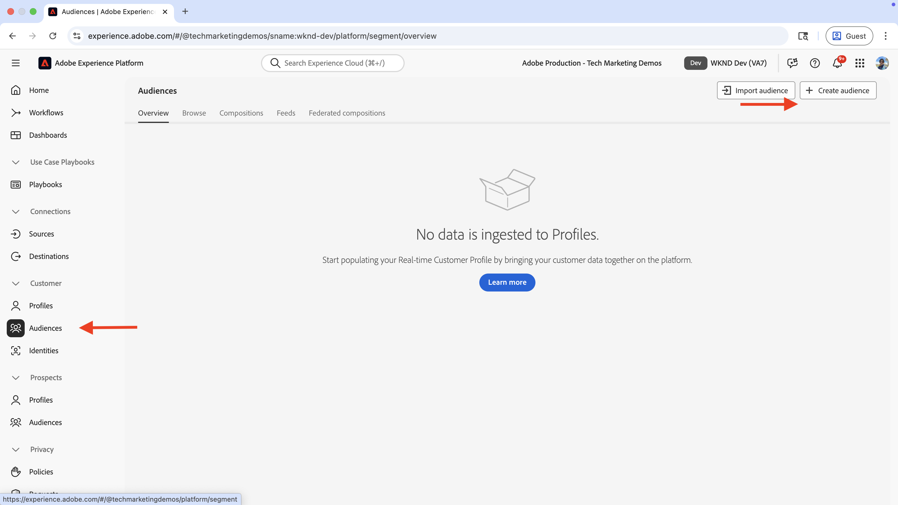

- In the **Create Audience** dialog, select the **Build-rule** option and click the **Create** button.
  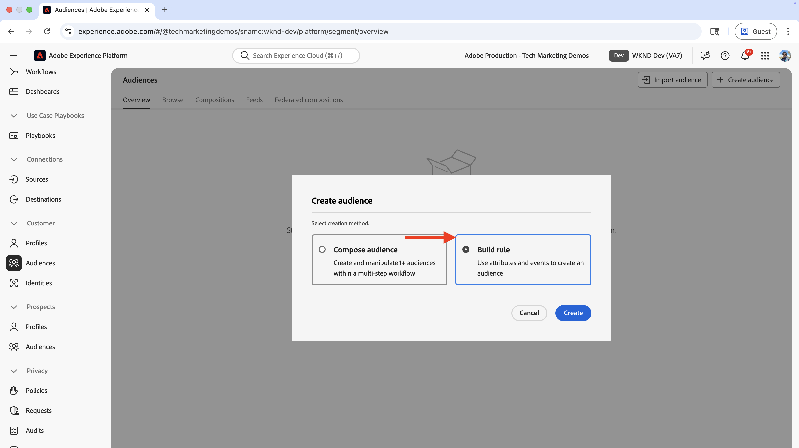

- In the **Create** step, enter the following:
    - **Name**: Family Travelers
    - **Description**: Users who have visited family-friendly adventure pages
    - **Evaluation method**: Select **Edge** (for real-time audience evaluation)

  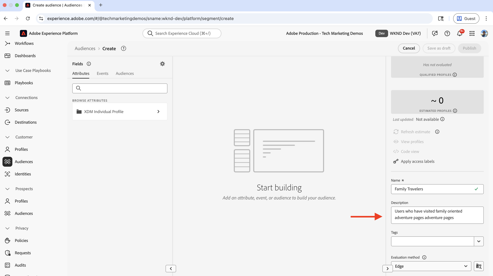

- Then, click the **Events** tab and navigate to the **Web** > **Web Page Details** and drag and drop the **URL** field to the **Event Rules** section. Drag the **URL** field two more times to the **Event Rules** section. Enter the following values:
    - **URL**: Select **contains** option and enter `riverside-camping-australia`
    - **URL**: Select **contains** option and enter `bali-surf-camp`
    - **URL**: Select **contains** option and enter `gastronomic-marais-tour`

  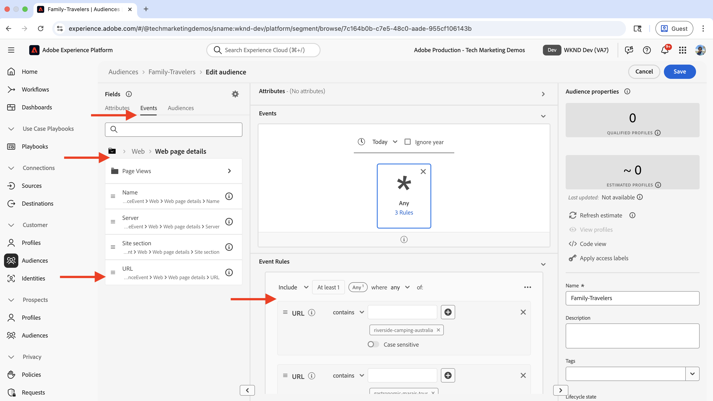

- In the **Events** section, select the **Today** option. Your audience should look like this:

  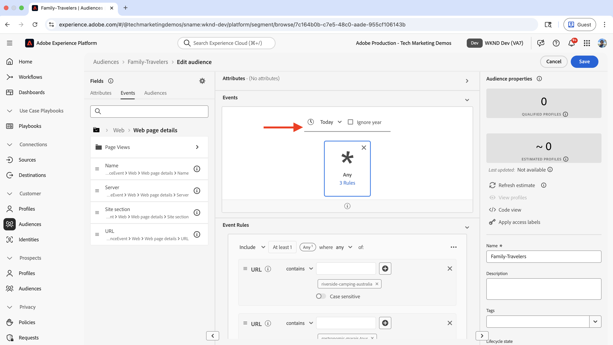

- Review the audience and click the **Activate to destination** button.

  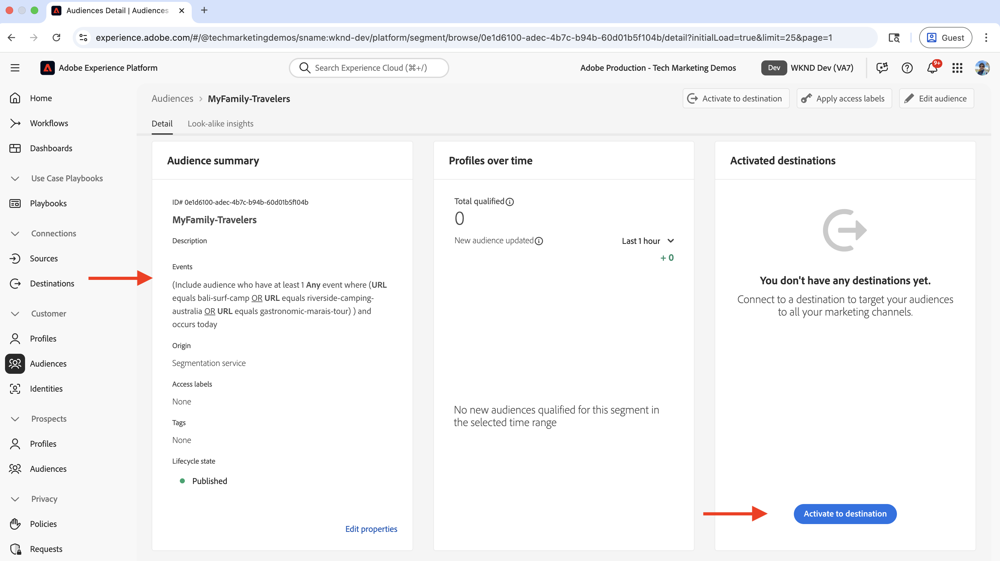

- In the **Activate to destination** dialog, select the Adobe Target destination you created earlier and follow the steps to activate the audience.

  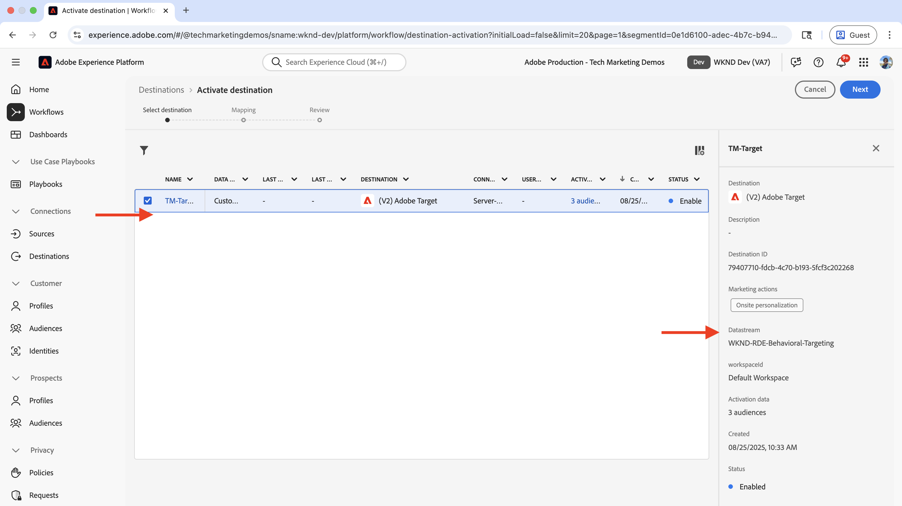

- There is no data in AEP yet, so the audience count is 0. Once users start visiting the website, data is collected and the audience count increases.

  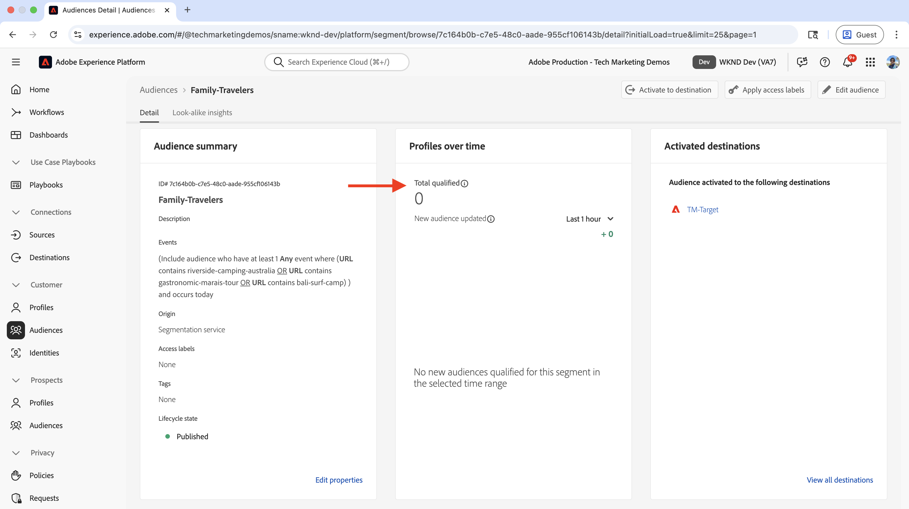

Congratulations! You have created the audience and activated it to the Adobe Target destination.

This completes the Adobe Experience Platform steps and the process is ready to create the personalized experience in AEM and use it in Adobe Target.

## AEM Steps

In AEM, the Tags property is integrated to collect page view data and send it to Experience Platform. Adobe Target is also integrated and personalized offers are created for the **Family Travelers** audience. These steps enable AEM to work with the behavioral targeting setup created in Experience Platform.

We start by logging in to the AEM Author service to create and configure the personalized content.

- Login to [Adobe Experience Cloud](https://experience.adobe.com/) and navigate to **Experience Manager** from the App Switcher or Quick Access section.

  

- Navigate to your AEM Author environment and click the **Sites** button.
  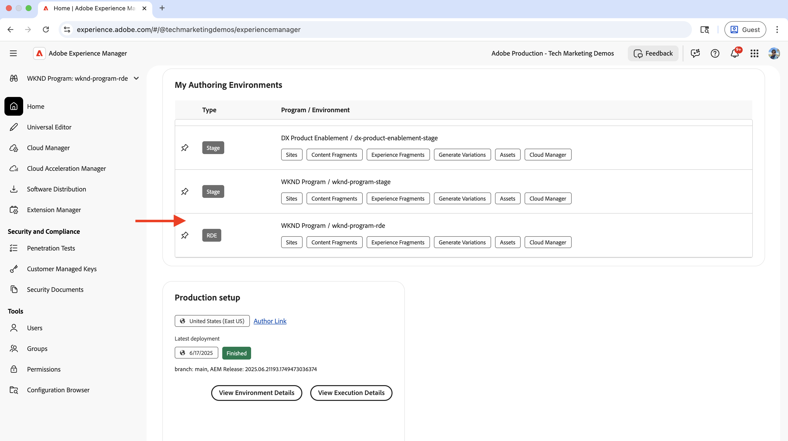

### Integrate and Inject Tags Property into AEM Pages

This step integrates the Tags property that was created earlier into your AEM pages, enabling data collection for behavioral targeting. The Tags property automatically captures page view data and sends it to Experience Platform when users visit your website.

To integrate the Tags property into AEM pages, follow the steps from [Integrate Tags in Adobe Experience Platform](../setup/integrate-adobe-tags.md).

Make sure to use the **WKND-RDE-Behavioral-Targeting** Tags property that was created earlier, not a different property.

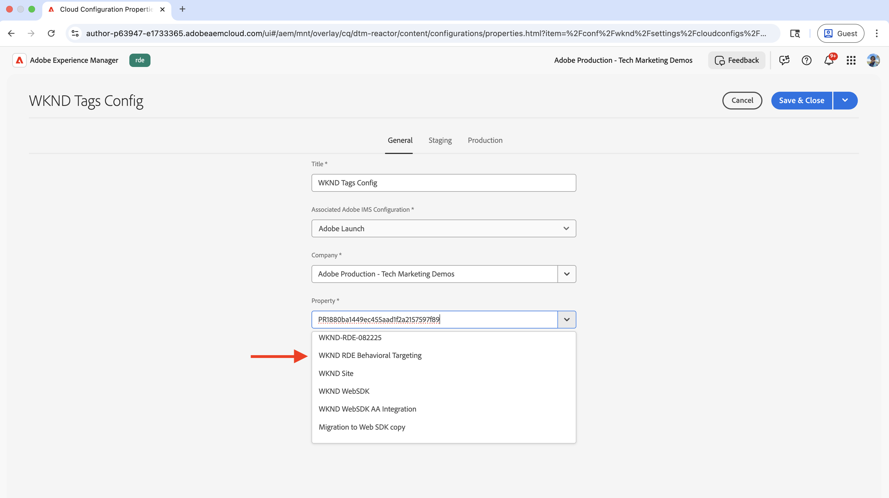

Once integrated, the Tags property begins collecting behavioral data from your AEM pages and sending it to Experience Platform for audience creation.

### Integrate Adobe Target and Export Personalized Offers to Adobe Target

This step integrates Adobe Target with AEM and enables the export of personalized content (Experience Fragments) to Adobe Target. This connection allows Adobe Target to use the content created in AEM for personalization activities with the behavioral audiences created in Experience Platform.

To integrate Adobe Target and export the **Family Travelers** audience offers to Adobe Target, follow the steps from [Integrate Adobe Target in Adobe Experience Platform](../setup/integrate-adobe-target.md).

Make sure that Target configuration is applied to the Experience Fragments so they can be exported to Adobe Target for use in personalization activities.

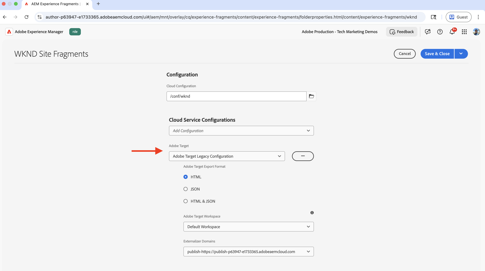

Once integrated, you can export Experience Fragments from AEM to Adobe Target, where they are used as personalized offers for the behavioral audiences.

### Create Personalized Offers for the Targeted Audiences

Experience Fragments are reusable content components that can be exported to Adobe Target as personalized offers. For behavioral targeting, content is created specifically designed for the **Family Travelers** audience that is displayed when users match the behavioral criteria.

Create a new Experience Fragment with personalized content for the Family Travelers audience.

- In AEM, click **Experience Fragments**

  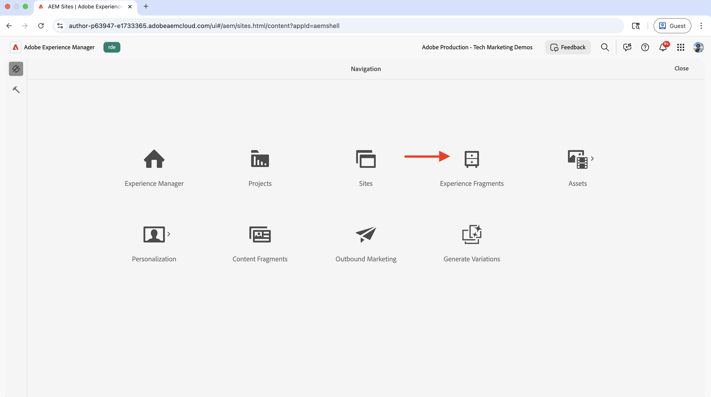

- Navigate to the **WKND Site Fragments** folder, then navigate to the **Featured** subfolder and click the **Create** button.

  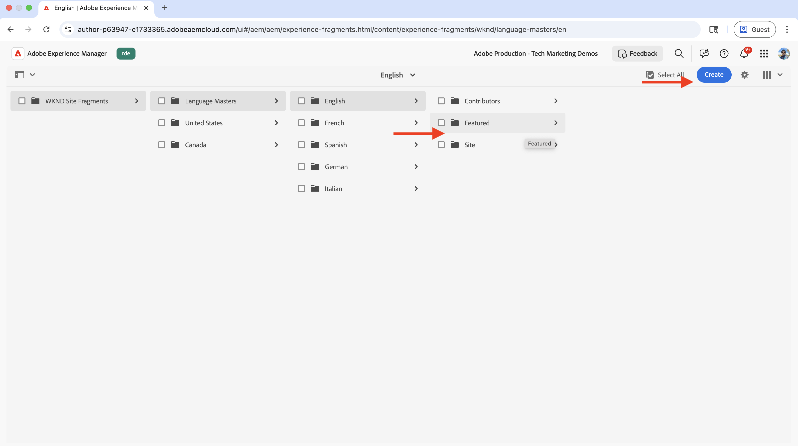

- In the **Create Experience Fragment** dialog, select Web Variation Template and click **Next**.

  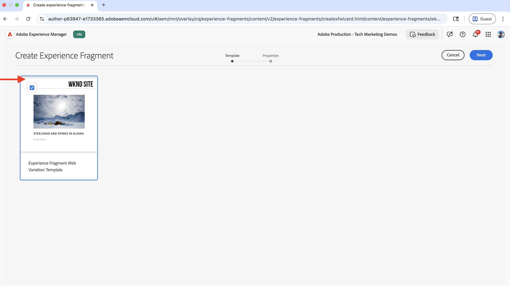

- Author the newly created Experience Fragment by adding a Teaser component and customize it with content relevant to family travelers. Add a compelling headline, description, and call-to-action that appeals to families interested in adventure travel.

  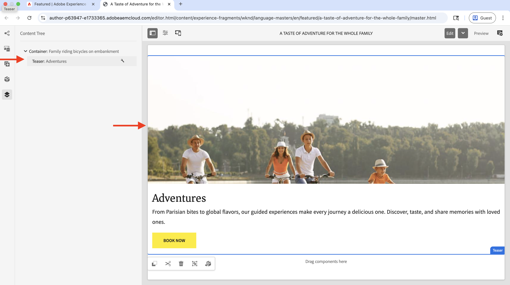

- Select the authored Experience Fragment and click the **Export to Adobe Target** button.

  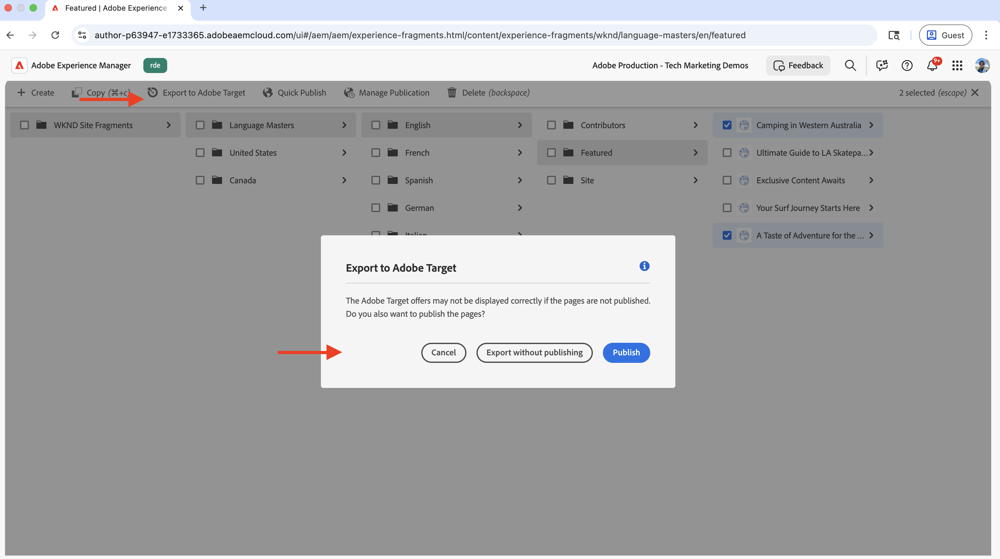

Congratulations! You have authored and exported the **Family Travelers** audience offers to Adobe Target. The Experience Fragment is now available in Adobe Target as a personalized offer that can be used in personalization activities.

## Adobe Target Steps

In Adobe Target, the behavioral audiences created in Experience Platform and the personalized offers exported from AEM are verified to be properly available. Then, an activity is created that combines the audience targeting with the personalized content to deliver the behavioral targeting experience.

- Login to [Adobe Experience Cloud](https://experience.adobe.com/) and navigate to **Adobe Target** from the App Switcher or Quick Access section.

  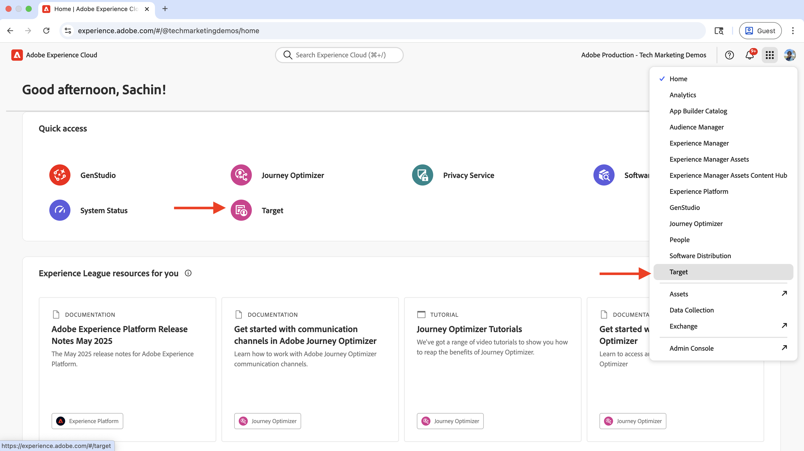

### Verify the Audiences and Offers

Before creating the personalization activity, the behavioral audiences from Experience Platform and the personalized offers from AEM are verified to be properly available in Adobe Target. This ensures that all the components needed for behavioral targeting are in place.

- In Adobe Target, click **Audiences** and verify that the Family Travelers audience is created.

  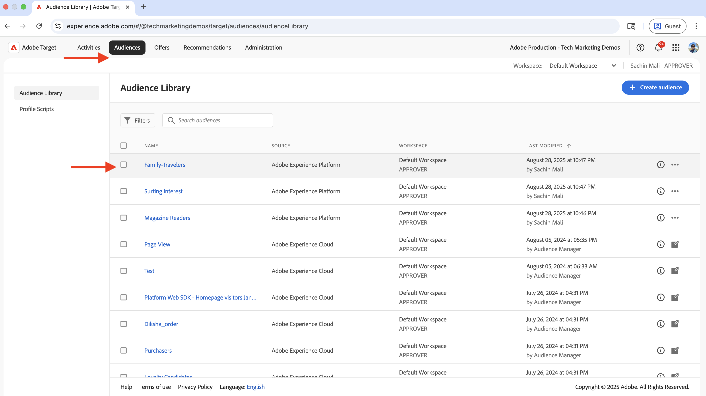

- By clicking on the audience, you can see the audience details and verify it's properly configured.

  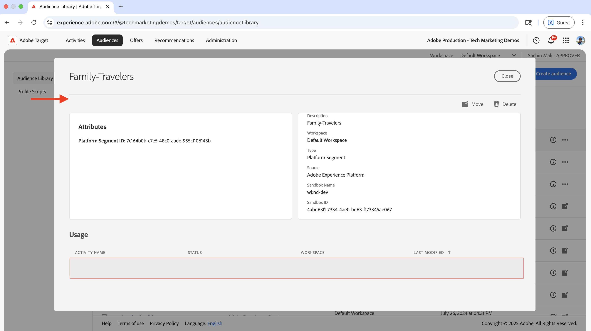

- Next, click **Offers** and verify that the AEM exported offer exists. In my case, the offer (or Experience Fragment) is called **A Taste of Adventure for the Whole Family**.

  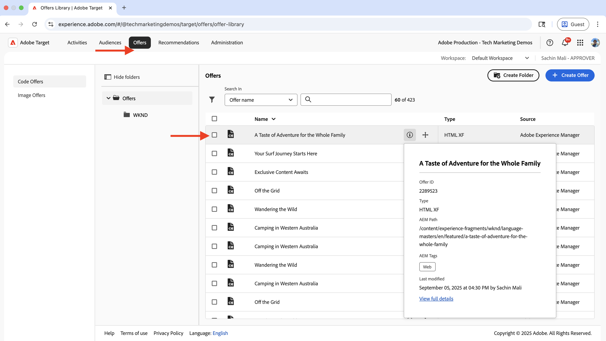

### Create and Configure an Activity

An activity in Adobe Target is a personalization campaign that defines when and how personalized content is delivered to specific audiences. For behavioral targeting, an activity is created that shows the personalized offer to users who match the Family Travelers audience criteria.

Now, an activity is created to deliver the personalized experience to the home page for the **Family Travelers** audience.

- In Adobe Target, click **Activities** and click the **Create Activity** button and select **Experience Targeting** activity type.
  

- In the **Create Experience Targeting Activity** dialog, select the **Web** type and **Visual** composer option, and enter the WKND site home page URL. Click the **Create** button to create the activity.

  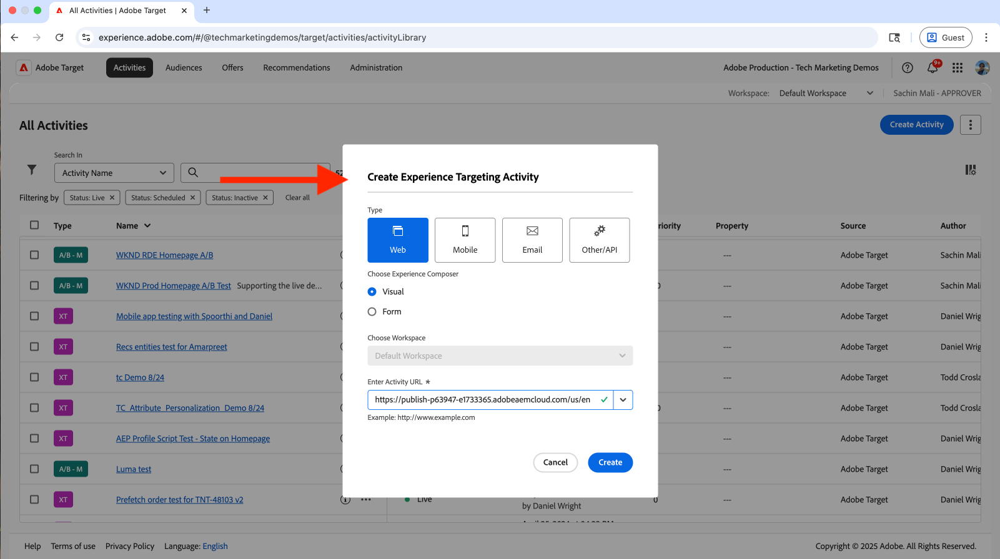

- In the editor, select the **Family Travelers** audience and add the **A Taste of Adventure for the Whole Family** offer before the **Next Adventure** section. Please see the below screenshot for reference.

  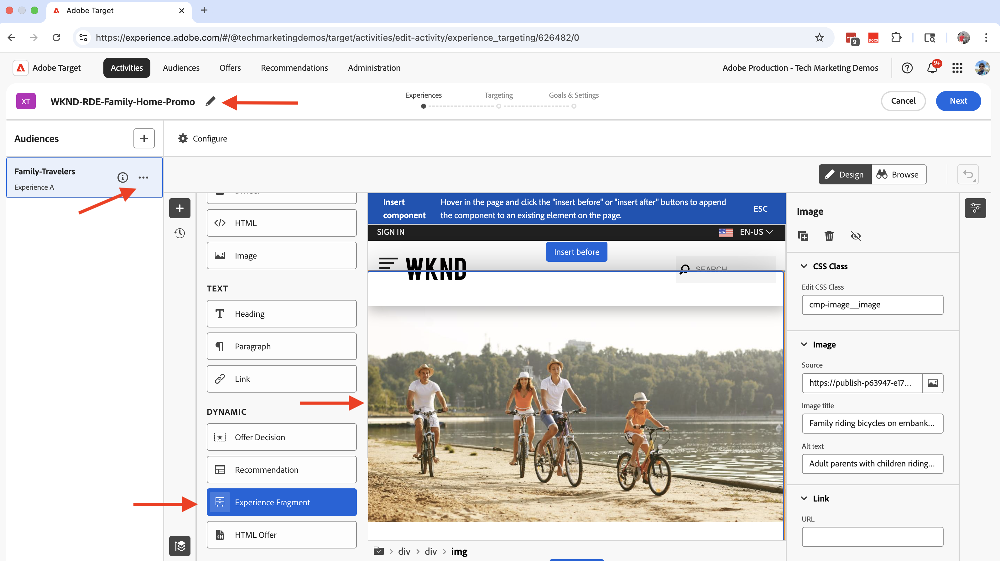

- Click **Next** and configure the **Goals and Settings** section with appropriate goals and metrics, then activate it to push the changes live.

  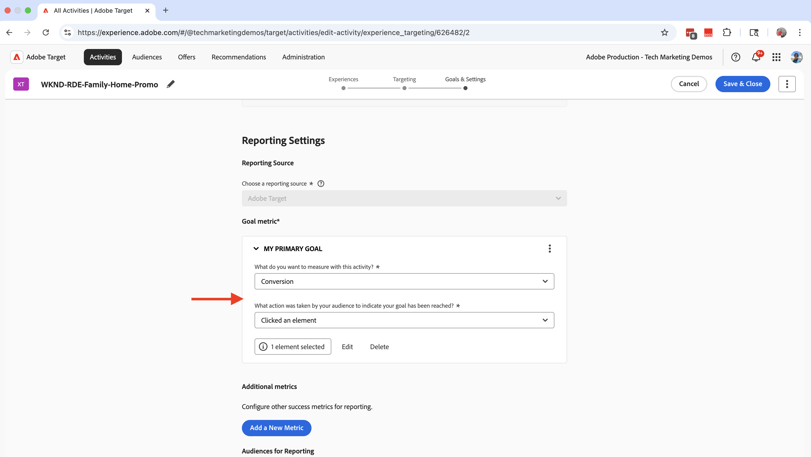

Congratulations! You have created and launched the activity to deliver the personalized experience to the **Family Travelers** audience on the WKND site home page. The activity is now live and shows personalized content to users who match the behavioral criteria.

## Verify the Behavioral Targeting Implementation on Your AEM Pages

Now that the complete behavioral targeting flow has been set up, everything is verified to be working correctly. This verification process ensures that data collection, audience evaluation, and personalization are all functioning as expected.

Verify the behavioral targeting implementation on your AEM pages.

- Visit the published site (for example, the [WKND Enablement website](https://wknd.enablementadobe.com/us/en.html)) and browse either _Bali Surf Camp_ or _Riverside Camping_ or _Tahoe Skiing_ adventure pages. Make sure to spend at least 30 seconds on the page to trigger the page view event and allow the data to be collected.

- Then, revisit the home page, and you should see the personalized experience for the **Family Travelers** audience before the **Next Adventure** section.

  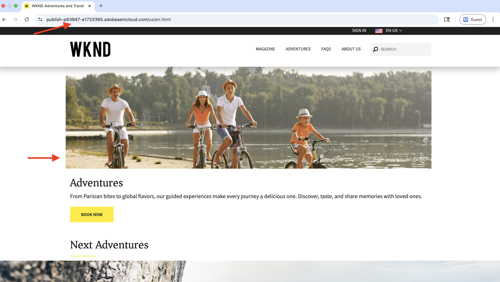

- Open your browser's developer tools and check the **Network** tab. Filter by `interact` to find the Web SDK request. The request should show the Web SDK event details.

  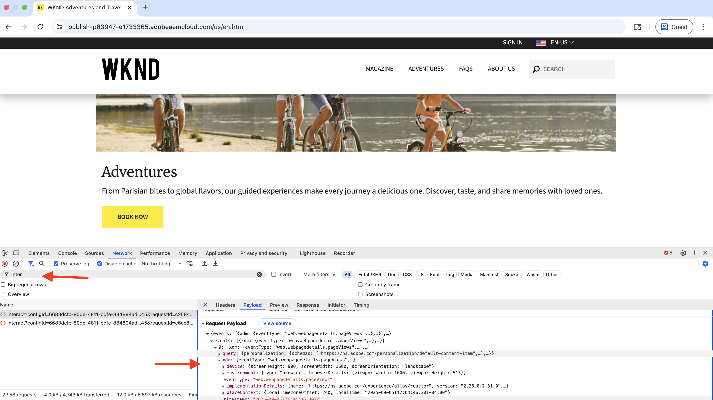

- The response should include the personalization decisions made by Adobe Target, indicating you are in the **Family Travelers** audience.

  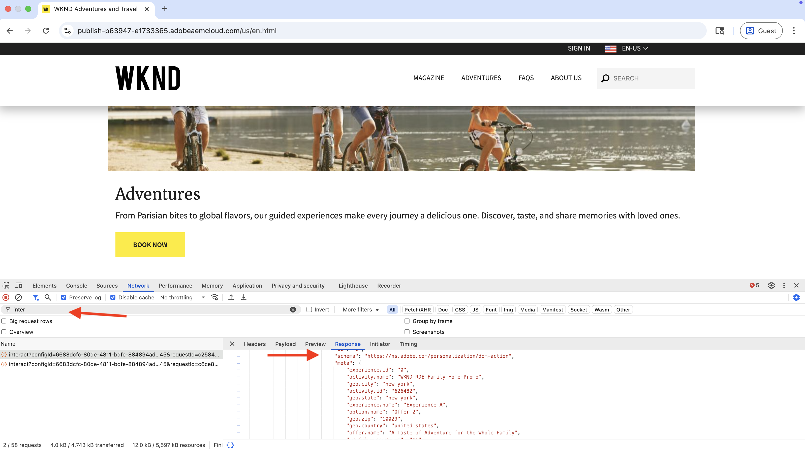

Congratulations! You have verified the behavioral targeting implementation on your AEM pages. The complete flow from data collection to audience evaluation to personalization is now working correctly.

## Live Demo

To see the behavioral targeting in action, visit the [WKND Enablement website](https://wknd.enablementadobe.com/us/en.html). There are three different behavioral targeting experiences:

- **Home Page**: For Family Travelers audiences, a personalized hero offer is displayed above the _Next Adventures_ section. When a user visits the home page and has visited either _Bali Surf Camp_ or _Riverside Camping_ or _Tahoe Skiing_ adventure pages, the user is categorized as the **Family Travelers** audience. The audience type is **Edge**, so evaluation happens in real-time.

- **Adventure Page**: For Surfing enthusiasts, the adventure page is displayed with a personalized hero section. When a user views _Bali Surf Camp_ or _Surf Camp In Costa Rica_ adventure pages, the user is categorized as the **Surfing Interest** audience. The audience type is **Batch**, so evaluation is not in real-time but over a period of time like a day. It's useful for returning visitors.

  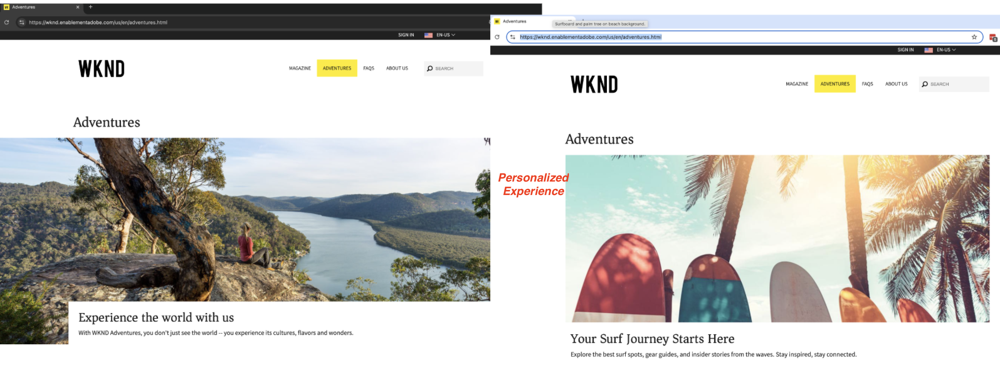

- **Magazine Page**: For Magazine readers, the magazine page is displayed with a personalized hero section. When a user reads _three or more_ articles, the user is categorized as the **Magazine Readers** audience. The audience type is **Batch**, so evaluation is not in real-time but over a period of time like a day. It's useful for returning visitors.
  
  

The first audience uses **Edge** evaluation for real-time personalization, while the second and third audiences use **Batch** evaluation for personalization, which is ideal for returning visitors.
  

## Additional Resources

- [Adobe Experience Platform Web SDK](https://experienceleague.adobe.com/en/docs/experience-platform/web-sdk/home)
- [Datastreams overview](https://experienceleague.adobe.com/en/docs/experience-platform/datastreams/overview)
- [Visual Experience Composer (VEC)](https://experienceleague.adobe.com/en/docs/target/using/experiences/vec/visual-experience-composer)
- [Edge segmentation](https://experienceleague.adobe.com/en/docs/experience-platform/segmentation/methods/edge-segmentation)
- [Audience types](https://experienceleague.adobe.com/en/docs/experience-platform/segmentation/types/overview)
- [Adobe Target connection](https://experienceleague.adobe.com/en/docs/experience-platform/destinations/catalog/personalization/adobe-target-connection)
