# Known-user personalization

Learn how to personalize content based on known-user data such as purchase history, CRM data, or other data that is collected about the user.

Known-user personalization helps you deliver personalized experiences to users based on data that you have collected about them. The _user data could have been collected via different systems_ or channels such as website, mobile app, call center, etc. This _data is then stitched together to create a complete user profile_ and used to personalize the experiences.

Common scenarios include:

- **Content personalization**: Display personalized experiences based on the user's profile data. For example, display a personalized hero on the home page based on the user's purchase history.
- **Upsell and cross-sell**: Display personalized upsell and cross-sell recommendations based on the user's purchase history. For example, display a personalized upsell recommendation for the user's purchase history.
- **Loyalty program**: Display personalized loyalty program benefits based on the user's purchase history. For example, display a personalized loyalty program benefit for the user's purchase history.
 
Your organization might have different use cases for known-user personalization. The above are just some examples.

## Example use case


In this tutorial, using the [sample WKND site](https://github.com/adobe/aem-guides-wknd), the process demonstrates how **logged in users** who have purchased any **Ski** adventure see a personalized hero on the **WKND home page**.

The hero experience tries to _upsell_ the essential ski equipment to the users who have purchased any **Ski** adventure. The users who have not purchased any **Ski** adventure see the default hero content. Thus, the hero experience is personalized to the users based on their purchase history and login status. To enable this personalization, data from different systems is stitched together to create a complete customer profile and used for personalization activities.

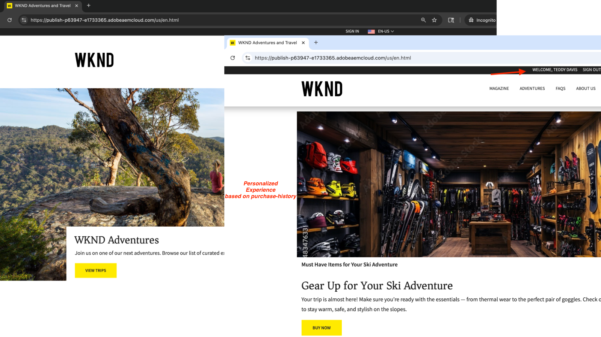

### User data management across systems

For demo purposes, assume that WKND user data is in the following systems. Each system stores different types of data that can be classified into two categories:

- **Behavioral data**: Captures user interactions and activities on digital channels (page views, clicks, site navigation, login status, browsing patterns)
- **Transactional data**: Records completed business transactions and customer profile information (purchases, order history, profile details, preferences)

|System| Purpose|What data is stored?| Data type|
|------|------|------|------|
|AEM| Content Management System (CMS), Adventure listings and bookings, and Log in functionality|User interactions: page views, login status, site navigation. Minimal user identifiers like user ID, name, email.| Behavioral data|
|Other systems| User profile and purchase transaction records as a complete system of record.|Complete customer profiles: user ID, name, address, phone number, purchase history, order details, preferences.| Transactional data|

The other system could be an Order Management System (OMS), Customer Relationship Management (CRM) system, Master Data Management (MDM) system, or any other system that stores the transactional data.

It is also assumed that the WKND site has a User Interface (UI) that allows users to purchase/book the **Adventures**. The AEM is integrated with the other system to store the adventure purchase data. Also, before or during the purchase, the user has created an account on the WKND site.

The logical diagram shows the user interaction with the WKND site and how behavioral and transactional data are collected and fed into the Experience Platform.

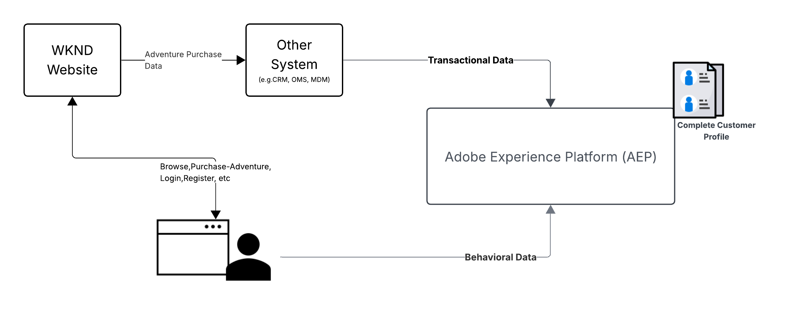

This is an oversimplified version to demonstrate the concept of known-user personalization. In a real-world scenario, you might have multiple systems in which behavioral and transactional data are collected and stored. 

### Key takeaways

- **Distributed data storage**: User data is stored across multiple systems - AEM stores minimal user data (user id, name, email) for login functionality, while other systems (OMS, CRM, MDM) maintain complete user profile and transactional data like purchase history.
- **Identity stitching**: Systems are linked using a common identifier (WKND user ID - `wkndUserId`) that uniquely identifies users across different platforms and channels.
- **Complete profile creation**: The objective is to stitch user data from these distributed systems to create a unified customer profile, which is then used to deliver personalized experiences.

Your use case might have different systems and data storage. The key is to identify a common identifier that uniquely identifies users across different platforms and channels.

## Prerequisites

Before proceeding with the known-user personalization use case, ensure you have completed the following:

- [Integrate Adobe Target](../setup/integrate-adobe-target.md): Enables teams to create and manage personalized content centrally in AEM and activate it as offers in Adobe Target.
- [Integrate Tags in Adobe Experience Platform](../setup/integrate-adobe-tags.md): Allows teams to manage and deploy JavaScript for personalization and data collection without needing to redeploy AEM code.

Also be familiar with [Adobe Experience Cloud Identity Service (ECID)](https://experienceleague.adobe.com/en/docs/id-service/using/home) and [Adobe Experience Platform](https://experienceleague.adobe.com/en/docs/experience-platform/landing/home) concepts, such as Schema, Dataset, Datastream, Audiences, Identities, and Profiles.

In this tutorial, you learn about identity stitching and build a customer profile in Adobe Experience Platform. Thus, combining the behavioral data with the transactional data to create a complete customer profile.

## High-level steps

The known-user personalization setup process involves steps across Adobe Experience Platform, AEM, and Adobe Target.

1. **In Adobe Experience Platform:**
    1. Create _Identity Namespace_ for the WKND user ID (`wkndUserId`)
    1. Create and configure two XDM (Experience Data Model) schemas - standardized data structures that define how data is organized and validated - one for the behavioral data and one for the transactional data
    1. Create and configure two datasets, one for the behavioral data and one for the transactional data
    1. Create and configure a Datastream
    1. Create and configure a Tag property
    1. Configure Merge Policy for the Profile
    1. Set up (V2) Adobe Target Destination

2. **In AEM:**
    1. Enhance the WKND site Login functionality to store the user id in the browser's session storage.
    1. Integrate and inject Tags property into AEM pages
    1. Verify data collection on AEM pages
    1. Integrate Adobe Target
    1. Create personalized offers

3. **In Adobe Experience Platform:**
    1. Verify the behavioral data and profile creation
    1. Ingest the transactional data 
    1. Verify behavioral and transactional data stitching
    1. Create and configure an Audience
    1. Activate the Audience to Adobe Target

4. **In Adobe Target:**
    1. Verify the Audiences and offers
    1. Create and configure an activity

5. **Verify the known-user personalization implementation on your AEM pages**

The Adobe Experience Platform's (AEP) various solutions are used to collect, manage, identify and stitch the user data across systems. Using the stitched user data, the audiences are created and activated in Adobe Target. Using activities in Adobe Target, personalized experiences are delivered to the users that match the audiences criteria.

## Adobe Experience Platform setup

To create a complete customer profile, it is necessary to collect and store both behavioral (page view data) and transactional (WKND Adventure purchases) data. The behavioral data is collected using the Tags property and the transactional data is collected using the WKND Adventure purchase system. 

The transactional data is then ingested into the Experience Platform and stitched with the behavioral data to create a complete customer profile.

In this example, to categorize a user who has purchased any **Ski** adventure, page view data along with their adventure purchase data is needed. The data is stitched together using the WKND user ID (`wkndUserId`), which is a common identifier across systems.

Let's start by logging in to the Adobe Experience Platform to set up the necessary components to collect and stitch the data.

Log in to [Adobe Experience Cloud](https://experience.adobe.com/) and navigate to **Experience Platform** from the App Switcher or Quick Access section.

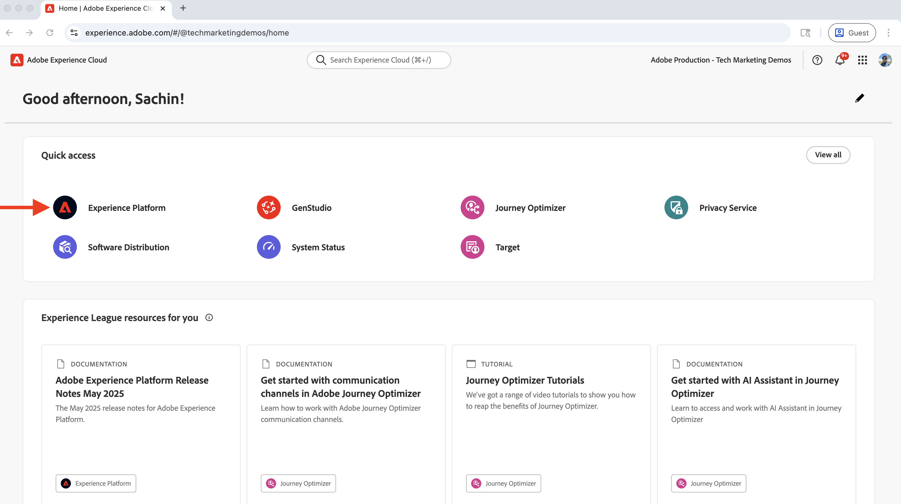

### Create Identity Namespace

An identity namespace is a logical container that provides context to identities, helping Experience Platform understand which ID system is being used (for example, email, CRM ID, or loyalty ID). To relate two or more discrete pieces of profile data, an identity namespace is used. When both of these discrete pieces of profile data have the same value for an attribute and share the same namespace, they are stitched together. To qualify an attribute as an identity stitching attribute, they must be of the same namespace.

In this example, the WKND user ID (`wkndUserId`) is the common identifier across behavioral and transactional data. Using this common identifier, the data is stitched together to create a complete customer profile.

Let's create an identity namespace for the WKND user ID (`wkndUserId`).

- In **Adobe Experience Platform**, click **Identities** from the left navigation. Then click the **Create identity namespace** button from the top right.

  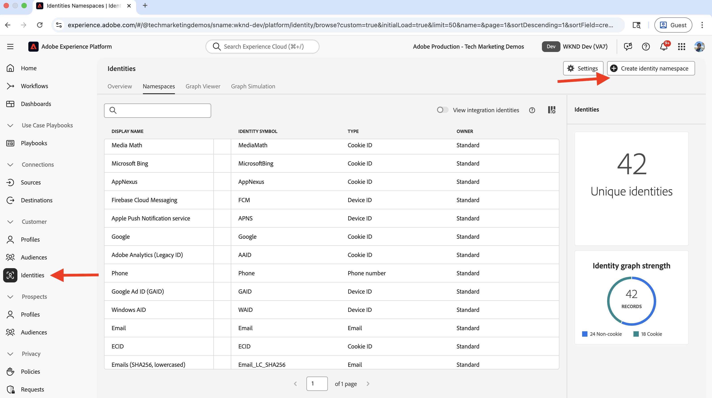

- In the **Create identity namespace** dialog, enter the following:
  - **Display name**: WKND User Id
  - **Description**: User ID or username of the logged-in WKND user
  - **Select a type**: Individual cross-device ID

  Click **Create** to create the identity namespace.

  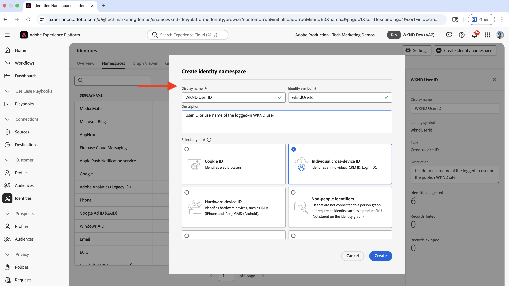

### Create Schemas

A schema defines the structure and format of data that you collect in Adobe Experience Platform. It ensures data consistency and enables you to create meaningful audiences based on standardized data fields. For known-user personalization, two schemas are needed, one for the behavioral data and one for the transactional data.

#### Behavioral Data Schema

First, create a schema to collect the behavioral data like page view events and user interactions.

- In **Adobe Experience Platform**, click **Schemas** from the left navigation, click the **Create schema** button from the top right. Then select the **Manual** option and click the **Select** button.

  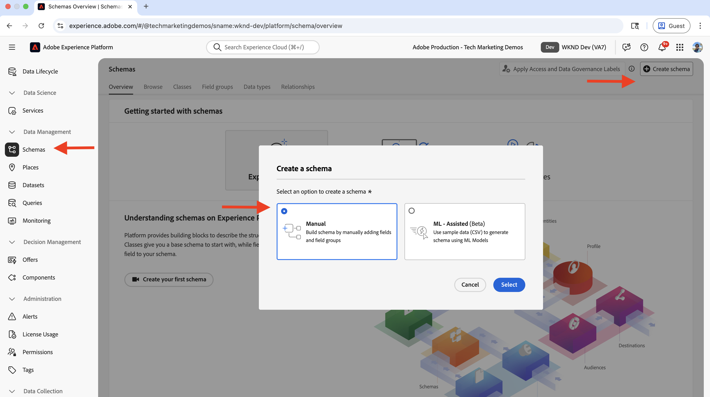

- In the **Create Schema** wizard, for **Schema details** step, select the **Experience Event** option (for time-series data like page views, clicks, and user interactions) and click **Next**.

  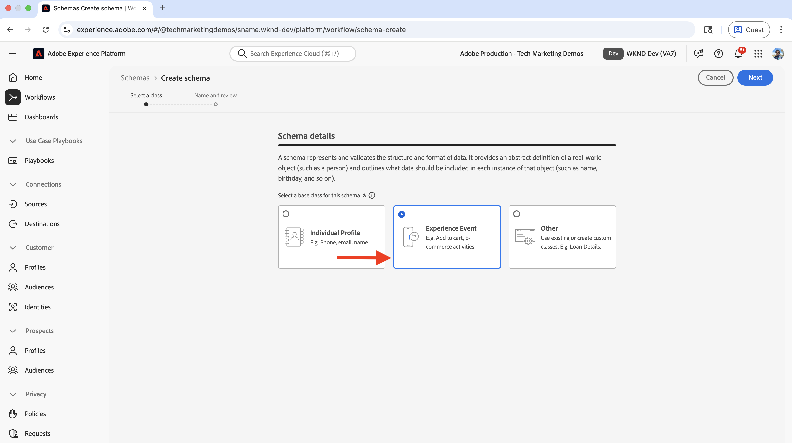

- For **Name and review** step, enter the following:
    - **Schema display name**: WKND-RDE-Known-User-Personalization-Behavioral
    - **Class selected**: XDM ExperienceEvent

  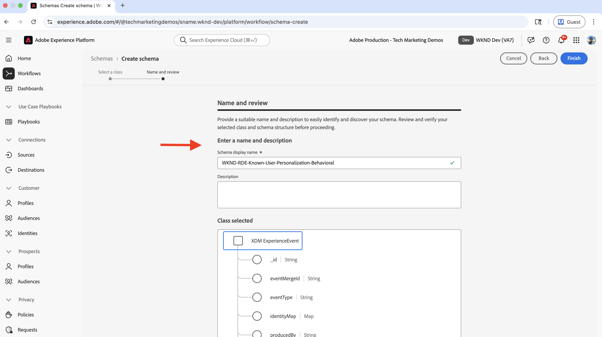

- Update the schema as follows:
    - **Add field group**: AEP Web SDK ExperienceEvent
    - **Profile**: Enable

    Click **Save** to create the schema.

  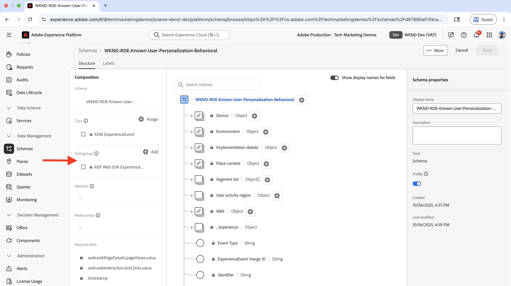

- To know if the user is logged in (authenticated) or anonymous, add a custom field to the schema. In this use case, the goal is to personalize the content for known-users who have purchased any **Ski** adventure. Thus, identifying if the user is logged in (authenticated) or anonymous is important.


  - Click the **+** button next to the schema name.
  - In the **Field properties** section, enter the following:
    - **Field name**: wkndLoginStatus
    - **Display name**: WKND Login Status
    - **Type**: String
    - **Assign to**: Field group > `wknd-user-details`

    Scroll down and click the **Apply** button.

    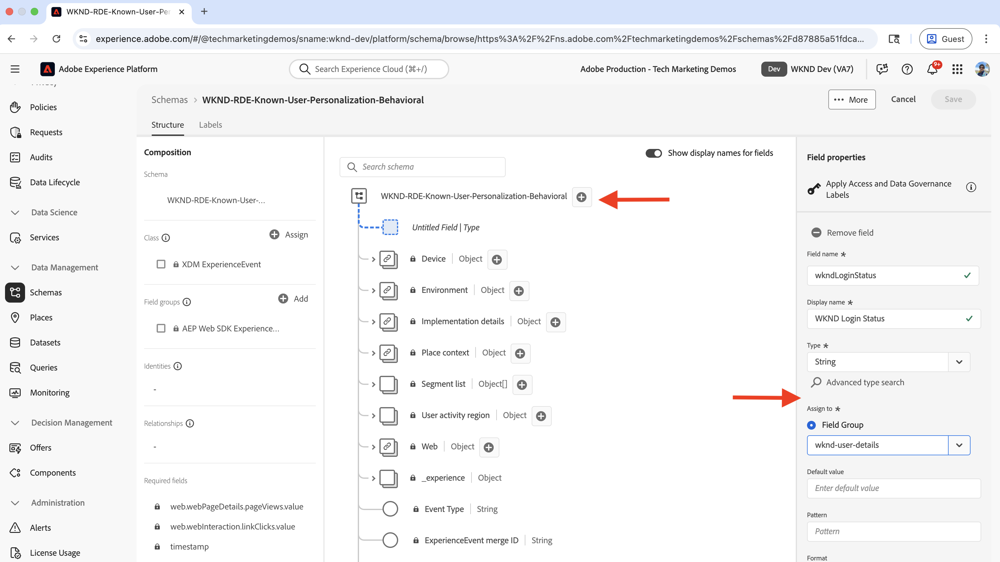

- The final behavioral data schema should look like this:
  
  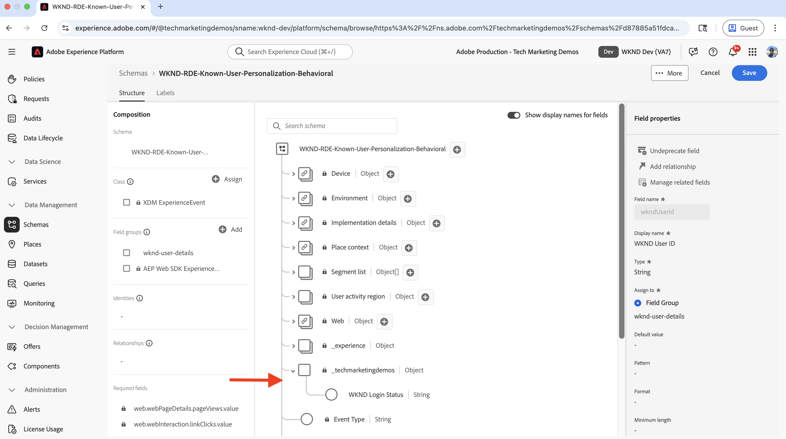

#### Transactional Data Schema

Next, create a schema to collect the transactional data like WKND Adventure purchases.

- In the **Create Schema** wizard, for **Schema details** step, select the **Individual Profile** option (for record-based data like customer attributes, preferences, and purchase history) and click **Next**.

  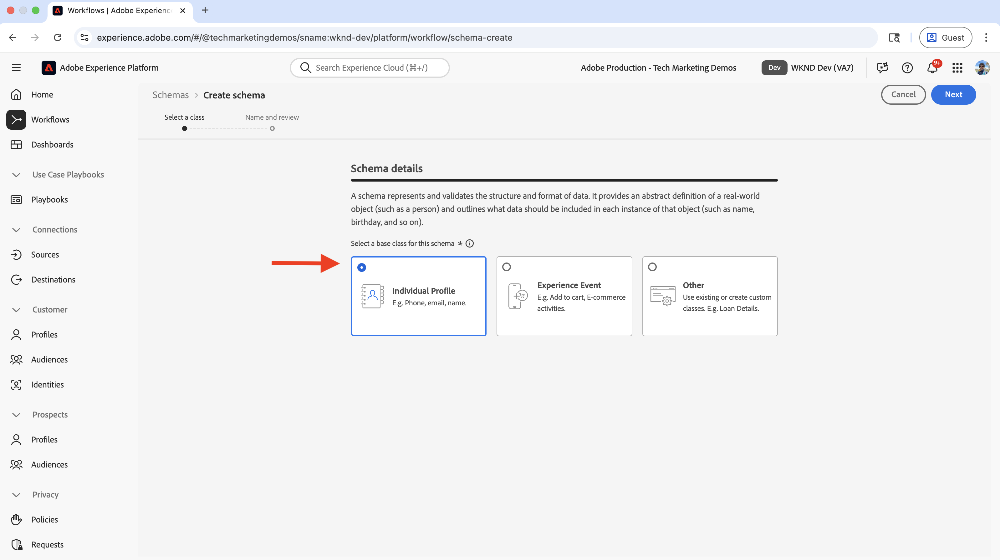

- For **Name and review** step, enter the following:
    - **Schema display name**: WKND-RDE-Known-User-Personalization-Transactional
    - **Class selected**: XDM Individual Profile

  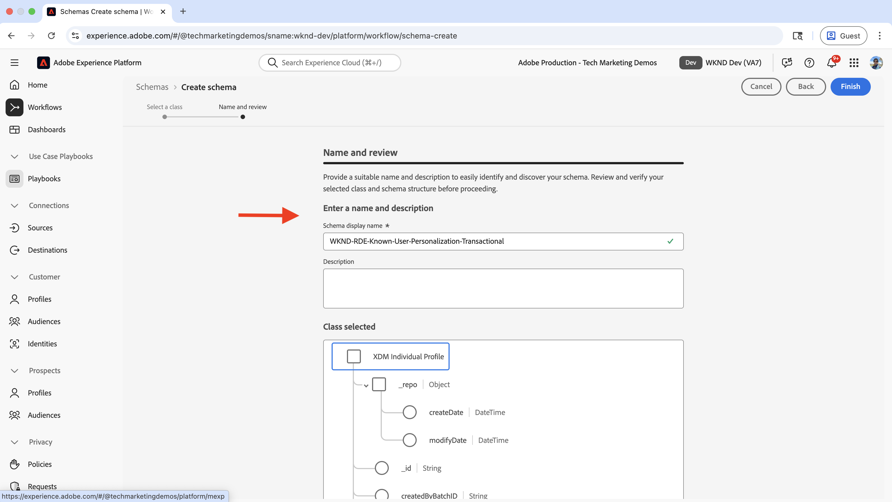

- To store a user's WKND Adventure purchase details, let's first add a custom field that serves as an identifier for the purchase. Remember, the WKND user ID (`wkndUserId`) is the common identifier across systems.
  - Click the **+** button next to the schema name.
  - In the **Field properties** section, enter the following:
    - **Field name**: wkndUserId
    - **Display name**: WKND User ID
    - **Type**: String
    - **Assign to**: Field group > `wknd-user-purchase-details`

  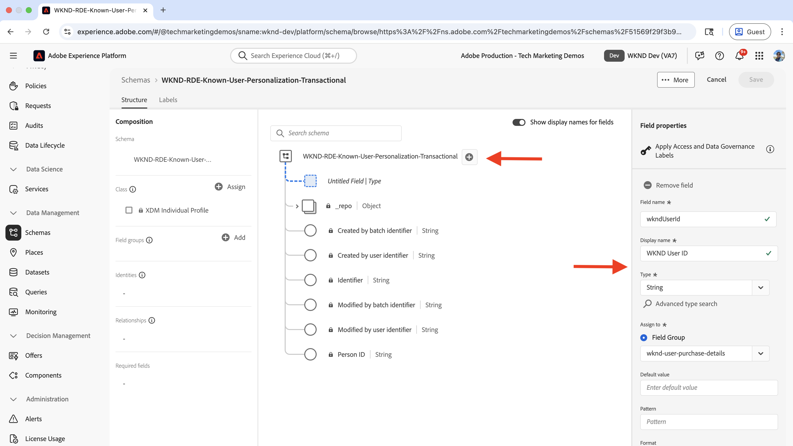

  - Scroll down, check **Identity**, check **Primary identity** (the main identifier used to stitch data from different sources into a unified profile) and in the **Identity namespace** dropdown select **WKND User Id**. Finally, click the **Apply** button.

  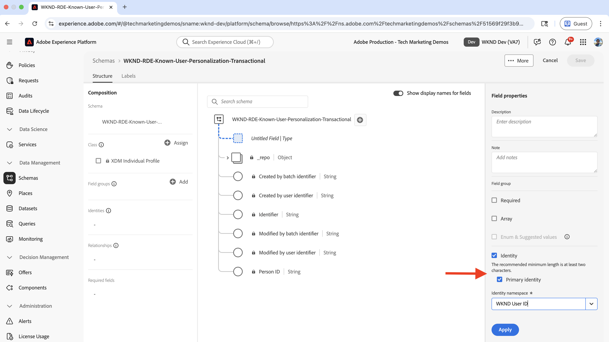

- After adding the custom primary identity field, the schema should look like this:

  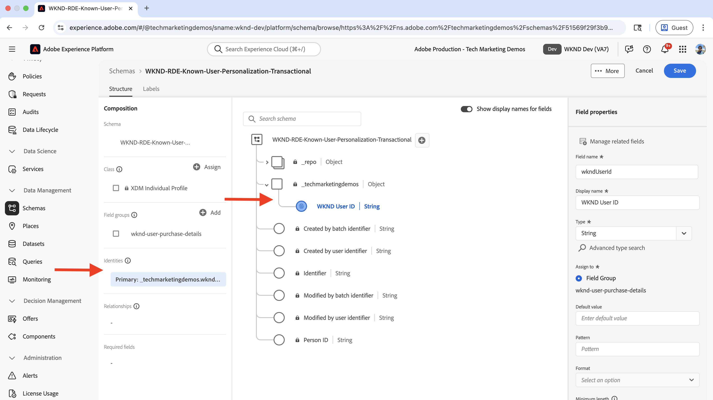

- Likewise, add the following fields to store additional user and adventure purchase details:

  |Field name|Display name|Type|Assign to|
  |----------|------------|----|---------|
  |adventurePurchased|Adventure Purchased|String|Field group > `wknd-user-purchase-details`|
  |adventurePurchaseAmount|Adventure Purchase Amount|Double|Field group > `wknd-user-purchase-details`|
  |adventurePurchaseQuantity|Adventure Purchase Quantity|Integer|Field group > `wknd-user-purchase-details`|
  |adventurePurchaseDate|Adventure Purchase Date|Date|Field group > `wknd-user-purchase-details`|
  |adventureStartDate|Adventure Start Date|Date|Field group > `wknd-user-purchase-details`|
  |adventureEndDate|Adventure End Date|Date|Field group > `wknd-user-purchase-details`|
  |firstName|First Name|String|Field group > `wknd-user-purchase-details`|
  |lastName|Last Name|String|Field group > `wknd-user-purchase-details`|
  |email|Email|Email address|Field group > `wknd-user-purchase-details`|
  |phone|Phone|Object|Field group > `wknd-user-purchase-details`|
  |gender|Gender|String|Field group > `wknd-user-purchase-details`|
  |age|Age|Integer|Field group > `wknd-user-purchase-details`|
  |address|Address|String|Field group > `wknd-user-purchase-details`|
  |city|City|String|Field group > `wknd-user-purchase-details`|
  |state|State|String|Field group > `wknd-user-purchase-details`|
  |country|Country|String|Field group > `wknd-user-purchase-details`|
  |zipCode|Zip Code|String|Field group > `wknd-user-purchase-details`|

  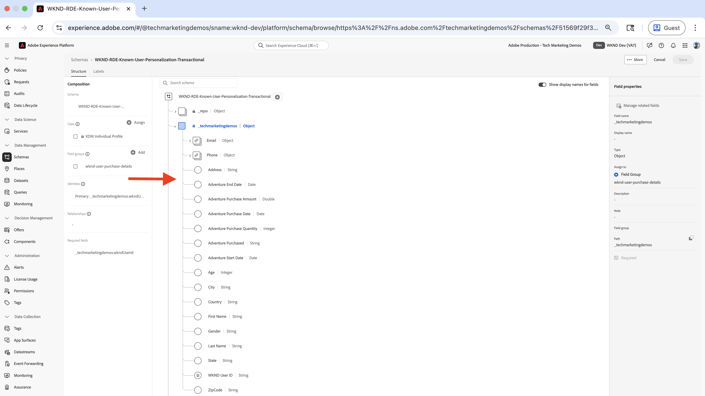
  
- Enable Profile for the schema.

  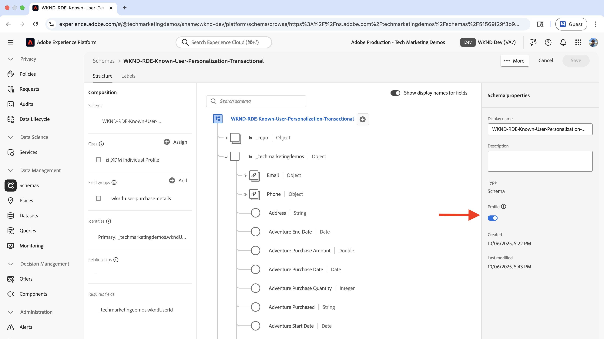

You have now created both schemas for the behavioral and transactional data.

### Create and configure Datasets

A dataset is a container for data that follows a specific schema. In this example, create two datasets, one for the behavioral data and one for the transactional data.

#### Behavioral Data Dataset

- In **Adobe Experience Platform**, click **Datasets** from the left navigation, click the **Create dataset** button from the top right. Then select the **Schema-based** option and click **Next**.

  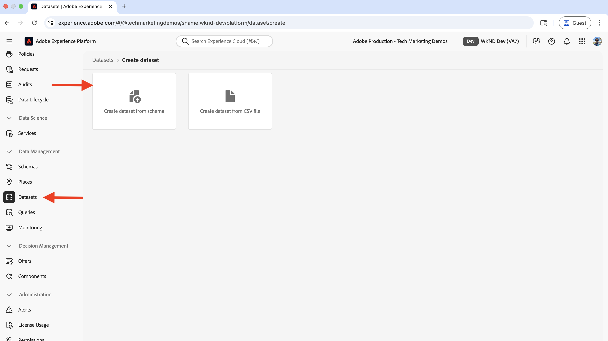

- For **Select schema** step, select the **WKND-RDE-Known-User-Personalization-Behavioral** schema and click **Next**.

  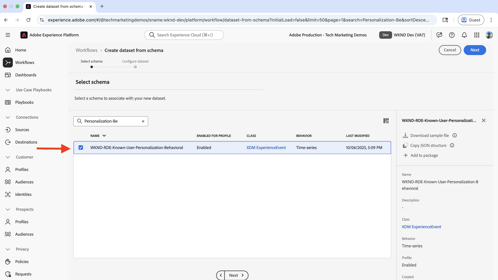

- For **Configure dataset** step, enter the following:
    - **Name**: WKND-RDE-Known-User-Personalization-Behavioral
    - **Description**: Dataset for the behavioral data such as page views with user login status.

    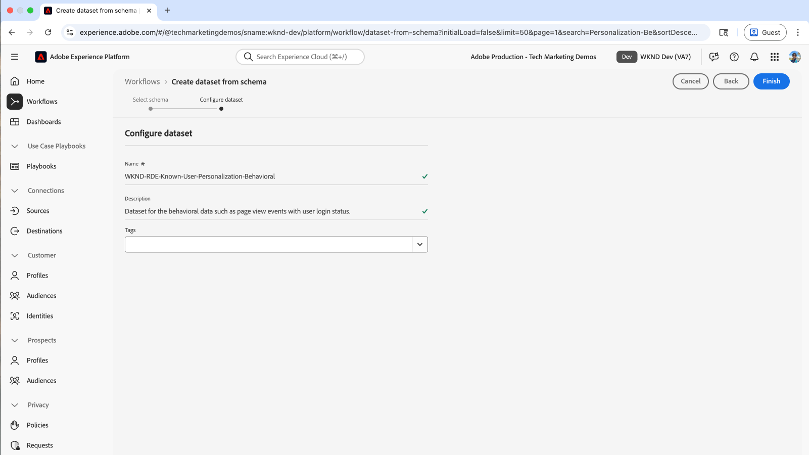

    Click **Finish** to create the dataset.
  
- Toggle the **Profile** switch to enable the dataset for Profile.

  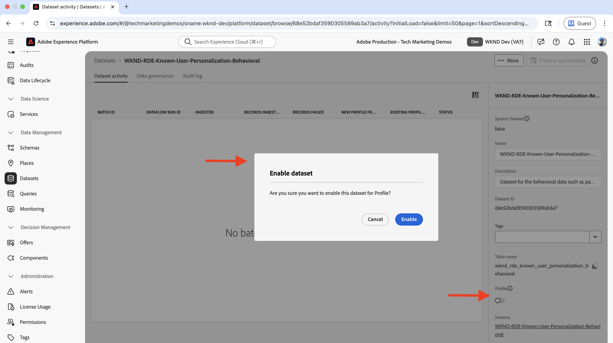

#### Transactional Data Dataset

- Repeat the same steps for the transactional data dataset. The only difference is the schema and dataset name.

  - **Schema**: WKND-RDE-Known-User-Personalization-Transactional
  - **Dataset**: WKND-RDE-Known-User-Personalization-Transactional
  - **Description**: Dataset for the transactional data such as WKND Adventure purchases.
  - **Profile**: Enable

  The final transactional data dataset should look like this:

  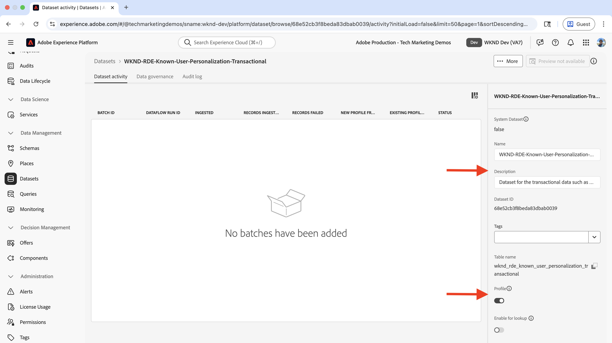

With both datasets in place, you can now create a datastream to enable data flow from your website to Experience Platform.

### Create and configure a Datastream

A datastream is a configuration that defines how data flows from your website to Adobe Experience Platform via the Web SDK. It acts as a Bridge between your website and the platform, ensuring data is properly formatted and routed to the correct datasets. For known-user personalization, enable the services like Edge Segmentation and Personalization Destinations.

Let's create a datastream to send the _behavioral_ (and not transactional) data to Experience Platform via the Web SDK. 

- In **Adobe Experience Platform**, click **Datastreams** from the left navigation and click **Create datastream**.

  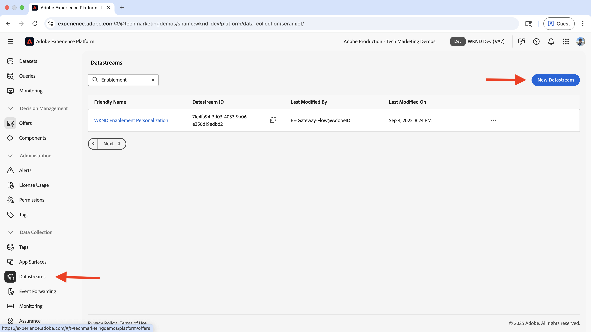

- In the **New datastream** step, enter the following:

  - **Name**: WKND-RDE-Known-User-Personalization-Behavioral
  - **Description**: Datastream to send behavioral data to Experience Platform
  - **Mapping Schema**: WKND-RDE-Known-User-Personalization-Behavioral

  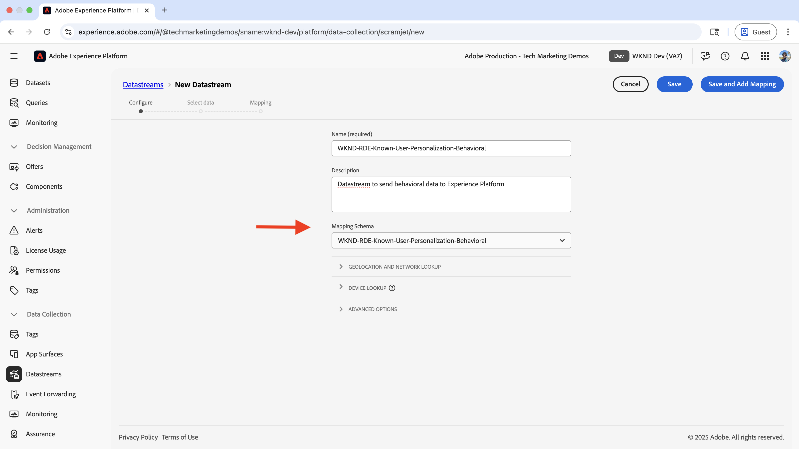

  Click **Save** to create the datastream.

- Once the Datastream is created, click **Add Service**.

  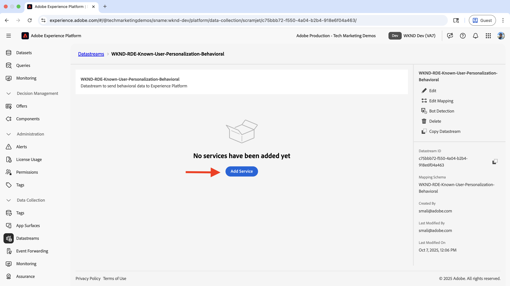

- In the **Add Service** step, select **Adobe Experience Platform** from the dropdown and enter the following:
  - **Event Dataset**: WKND-RDE-Known-User-Personalization-Behavioral
  - **Profile Dataset**: WKND-RDE-Known-User-Personalization-Behavioral
  - **Offer Decisioning**: Enable (allows Adobe Target to request and deliver personalized offers in real-time)
  - **Edge Segmentation**: Enable (evaluates audiences in real-time at the edge network for immediate personalization)
  - **Personalization Destinations**: Enable (allows audience sharing with personalization tools like Adobe Target)

  Click **Save** to add the service.

  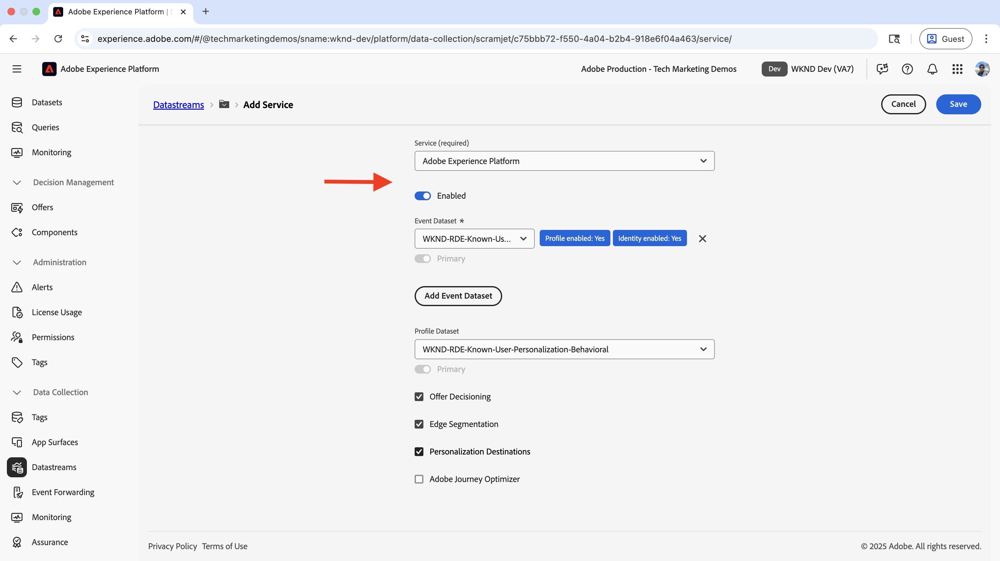

- In the **Add Service** step, select **Adobe Target** from the dropdown and enter the **Target Environment ID**. You can find the Target Environment ID in Adobe Target under **Administration** > **Environments**. Click **Save** to add the service.
  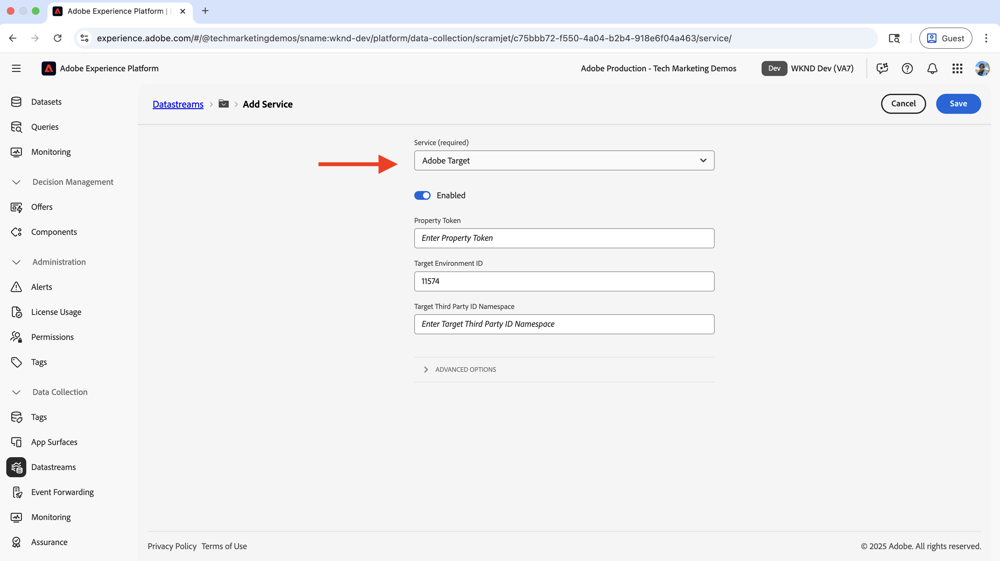

- The final datastream should look like this:

  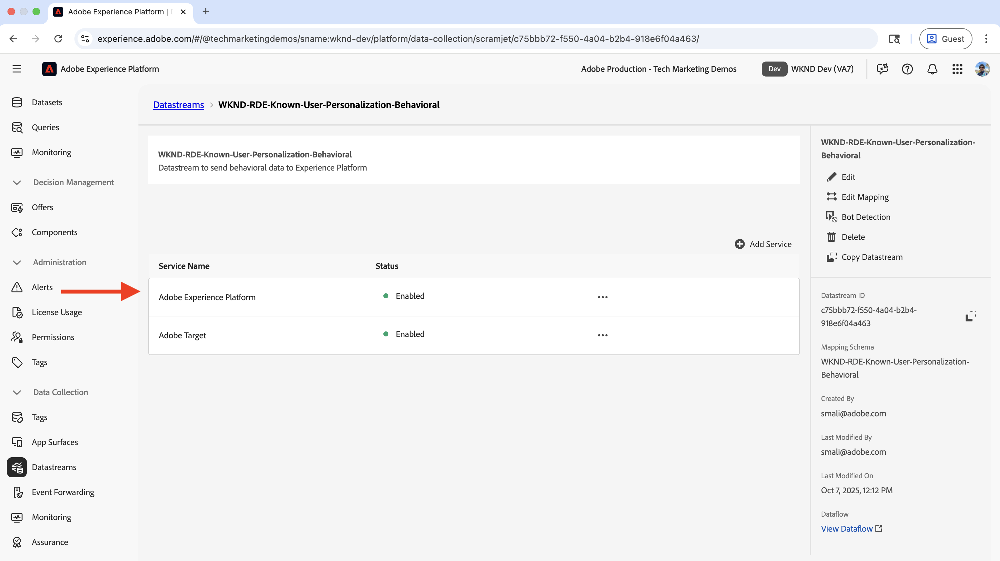

The datastream is now configured to send behavioral data to Experience Platform via the Web SDK.

Note that the _transactional_ data is ingested into Experience Platform using batch ingestion (a method for uploading large datasets at scheduled intervals rather than in real-time). The WKND Adventure purchase data is collected using the WKND site and stored in the other system (for example, OMS or CRM or MDM). The data is then ingested into Experience Platform using batch ingestion. 

It is also possible to ingest that data directly from the website to Experience Platform, which is not covered in this tutorial. The use case want to highlight the process of stitching the user data across systems and creating a complete customer profile.

## Create and configure a Tags Property

A Tags property is a container for JavaScript code that collects data from your website and sends it to Adobe Experience Platform. It acts as the data collection layer that captures user interactions and page views. For known-user personalization, along with page view data (for example, page name, URL, site section, and host name), the user login status and WKND user ID are also collected. The WKND user ID (`wkndUserId`) is sent as part of the Identity Map object. 

Let's create a Tags property that captures the page view data and user login status + user ID (if logged in) when users visit the WKND site. 

You can update the Tags property you created in the [Integrate Adobe Tags](../setup/integrate-adobe-tags.md) step. However, to keep it simple, a new Tags property is created.

### Create Tags Property

- In **Adobe Experience Platform**, click **Tags** from the left navigation and click the **New Property** button.

  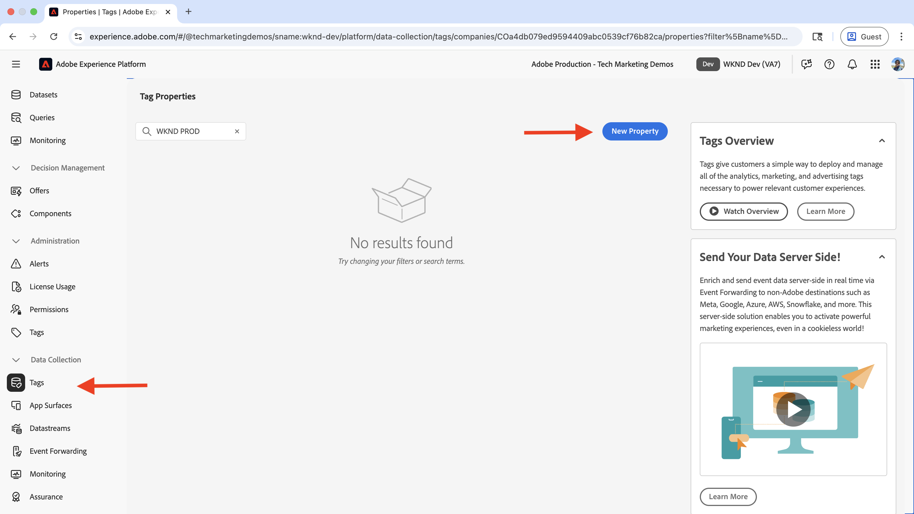

- In the **Create Property** dialog, enter the following:
    - **Property Name**: WKND-RDE-Known-User-Personalization
    - **Property Type**: Select **Web**
    - **Domain**: The domain where you deploy the property (for example, `adobeaemcloud.com`)

  Click **Save** to create the property.

  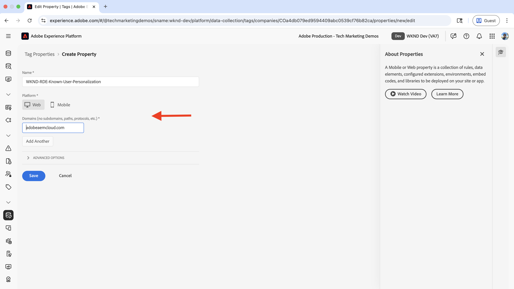

- Open the new property, and click **Extensions** from the left navigation, and click the **Catalog** tab. Search for **Web SDK** and click the **Install** button.
  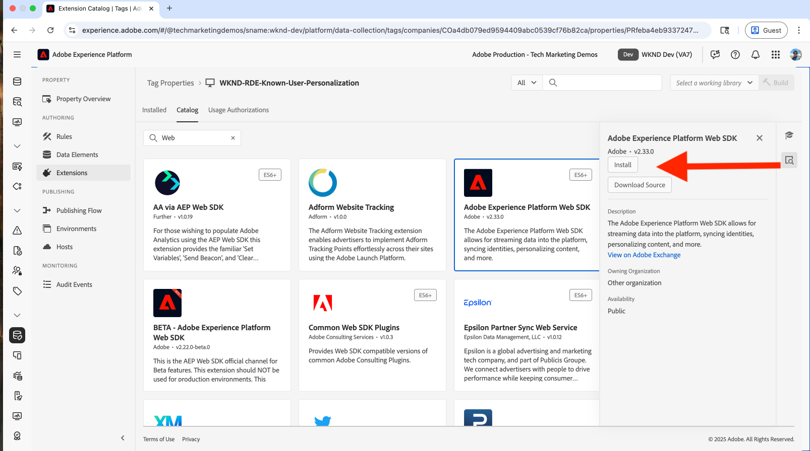

- In the **Install Extension** dialog, select the **Datastream** you created earlier and click **Save**.
  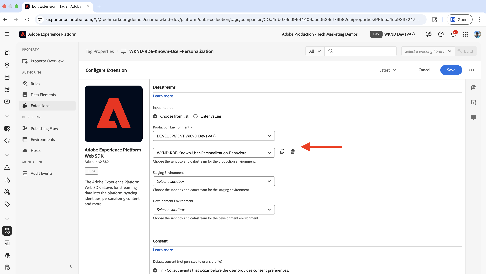

#### Add Data Elements

Data elements are variables that capture specific data points from your website and make them available for use in rules and other Tags configurations. They act as the building blocks for data collection, allowing you to extract meaningful information from user interactions and page views. For known-user personalization, page details like host name, site section, and page name need to be captured to create audience segments. Along with it, the user login status and WKND user ID (if logged in) need to be captured.

Create the following data elements to capture the important page details.

- Click **Data Elements** from the left navigation and click the **Create New Data Element** button.
  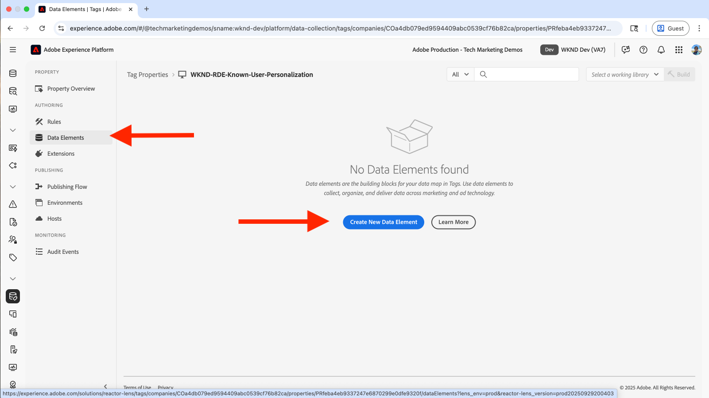

- In the **Create New Data Element** dialog, enter the following:
    - **Name**: Host Name
    - **Extension**: Select **Core**
    - **Data Element Type**: Select **Custom Code**
    - **Open Editor** button and enter the following code snippet:

        ```javascript
        if(window && window.location && window.location.hostname) {
            return window.location.hostname;
        }        
        ```

    

- Likewise, create the following data elements:

    - **Name**: Site Section
    - **Extension**: Select **Core**
    - **Data Element Type**: Select **Custom Code**
    - **Open Editor** button and enter the following code snippet:

        ```javascript
        if(event && event.component && event.component.hasOwnProperty('repo:path')) {
            let pagePath = event.component['repo:path'];
            
            let siteSection = '';
          
            //Check of html String in URL.
            if (pagePath.indexOf('.html') > -1) { 
            siteSection = pagePath.substring(0, pagePath.lastIndexOf('.html'));

            //replace slash with colon
            siteSection = siteSection.replaceAll('/', ':');
            
            //remove `:content`
            siteSection = siteSection.replaceAll(':content:','');
            }
            
            return siteSection 
        }        
        ```

    

    - **Name**: Page Name
    - **Extension**: Select **Core**
    - **Data Element Type**: Select **Custom Code**
    - **Open Editor** button and enter the following code snippet:

        ```javascript
        if(event && event.component && event.component.hasOwnProperty('dc:title')) {
            // return value of 'dc:title' from the data layer Page object, which is propogated via 'cmp:show' event
            return event.component['dc:title'];
        }
        ```

    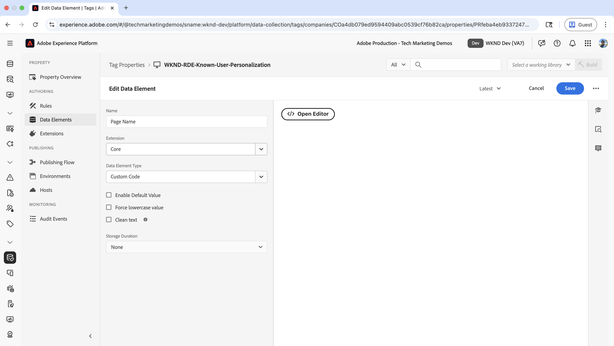


    - **Name**: WKND User ID
    - **Extension**: Select **Core**
    - **Data Element Type**: Select **Custom Code**
    - **Open Editor** button and enter the following code snippet:

        ```javascript
        // Data element for WKND User ID
        if(event && event.user && event.user.userId) {
            console.log('UserID:', event.user.userId);
            return event.user.userId;
        } else {
            console.log('UserID:');
            return "";
        }        
        ```

    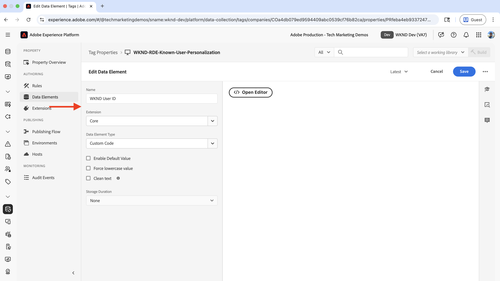


    - **Name**: WKND User Status
    - **Extension**: Select **Core**
    - **Data Element Type**: Select **Custom Code**
    - **Open Editor** button and enter the following code snippet:

        ```javascript
        // Data element for user login status
        if(event && event.user && event.user.status) {
            console.log('User status:', event.user.status);
            return event.user.status;
        } else {
            console.log('User status:anonymous');
            return 'anonymous';
        }        
        ```

    

- Next, create a data element of **Identity map** type. The Identity Map is a standard XDM structure that stores multiple user identifiers and links them together, enabling identity stitching across systems. This data element is used to store the WKND user ID (if logged in) as part of the Identity Map object.

    - **Name**: IdentityMap-WKND User ID
    - **Extension**: Select **Adobe Experience Platform Web SDK**
    - **Data Element Type**: Select **Identity map**

    In the right panel,
    - **Namespace**: Select **wkndUserId**
    - **ID**: Select **WKND User ID** data element
    - **Authentication state**: Select **Authenticated**
    - **Primary**: Select **true**
    
    
    Click **Save** to create the data element.

    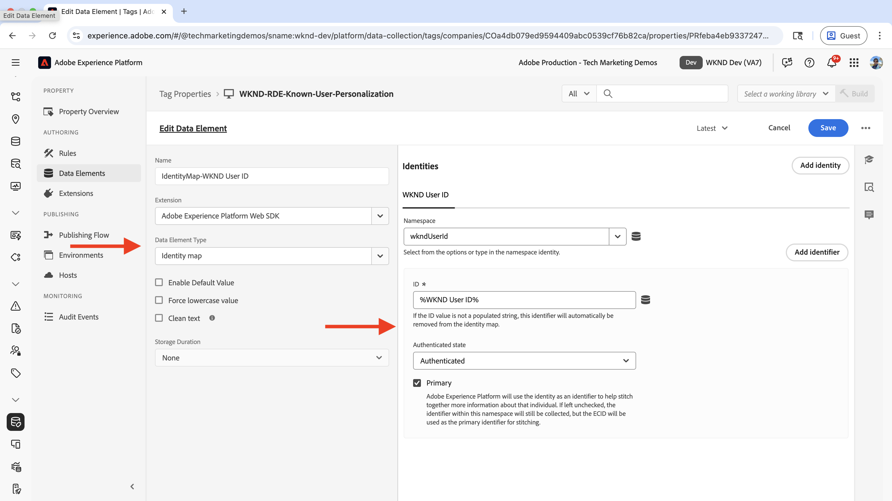

- Next, create a data element of **Variable** type. This data element is populated with the page details before sending it to the Experience Platform.

    - **Name**: XDM-Variable Pageview
    - **Extension**: Select **Adobe Experience Platform Web SDK**
    - **Data Element Type**: Select **Variable**

    In the right panel,
    - **Sandbox**: Select your sandbox
    - **Schema**: Select the **WKND-RDE-Known-User-Personalization** schema

    Click **Save** to create the data element.

    

  - The final data elements should look like this:

    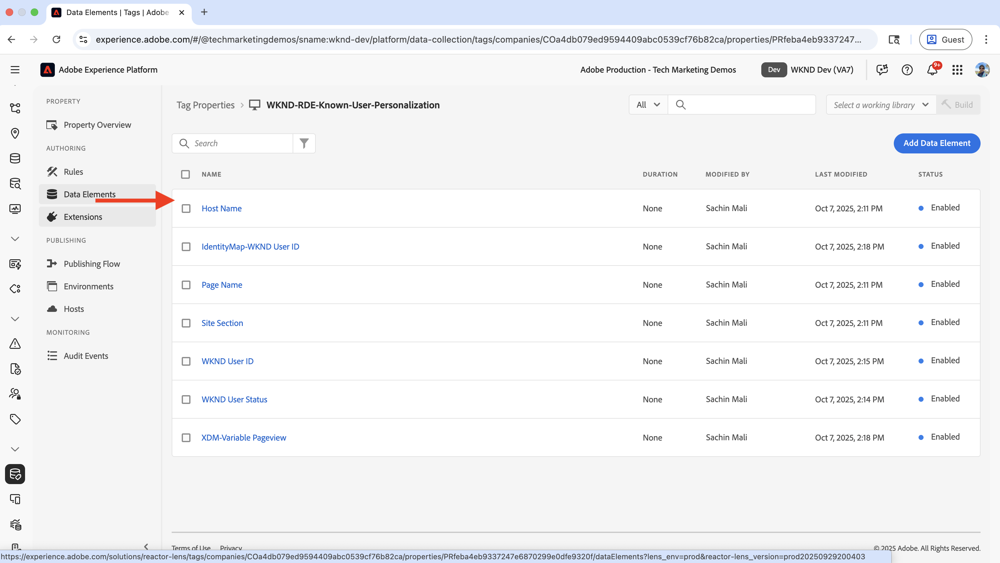

#### Add Rules

Rules define when and how data is collected and sent to Adobe Experience Platform. They act as the logic layer that determines what happens when specific events occur on your website. For known-user personalization, create rules to capture the page view data and user login status + user ID (if logged in) when users visit the WKND site.

Create a rule to populate the **XDM-Variable Pageview** data element using the other data elements before sending it to the Experience Platform. The rule is triggered when a user browses the WKND website.

- Click **Rules** from the left navigation and click the **Create New Rule** button.
  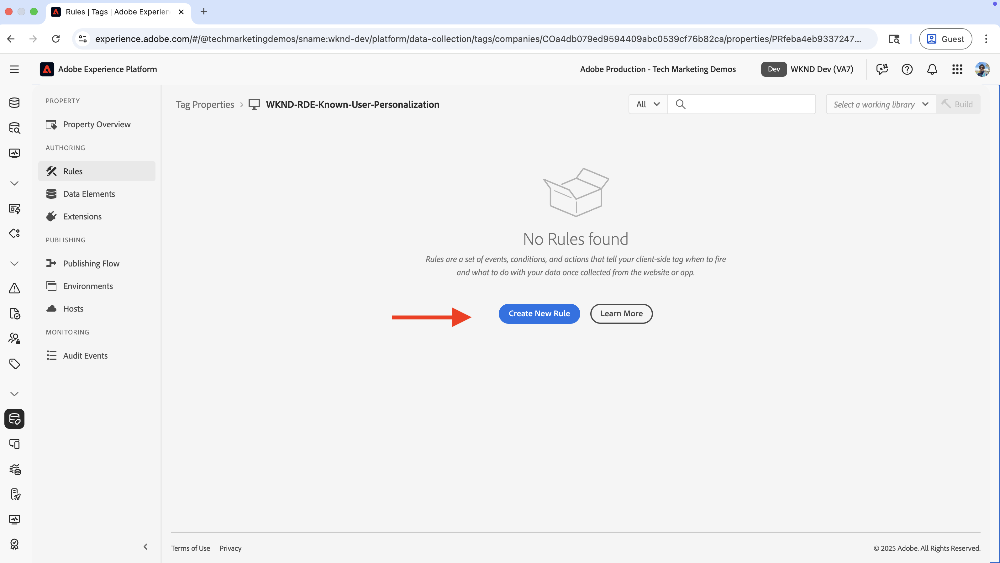

- In the **Create New Rule** dialog, enter the following:
    - **Name**: all pages - on load - with user data

    - For the **Events** section, click **Add** to open the **Event Configuration** wizard.
        - **Extension**: Select **Core**
        - **Event Type**: Select **Custom Code**
        - **Open Editor** button and enter the following code snippet:

        ```javascript
        var pageShownEventHandler = function(evt) {
            // defensive coding to avoid a null pointer exception
            if(evt.hasOwnProperty("eventInfo") && evt.eventInfo.hasOwnProperty("path")) {
                //trigger Launch Rule and pass event
                console.debug("cmp:show event: " + evt.eventInfo.path);
                
                // Get user data from session storage
                var userData = getUserDataFromSession();
                
                var event = {
                    //include the path of the component that triggered the event
                    path: evt.eventInfo.path,
                    //get the state of the component that triggered the event
                    component: window.adobeDataLayer.getState(evt.eventInfo.path),
                    //include user data in the event
                    user: userData
                };

                //Trigger the Launch Rule, passing in the new 'event' object
                trigger(event);
            }
        }

        /**
         * Get user data from session storage
        */
        function getUserDataFromSession() {
            var userData = {
                userId: null,
                status: 'anonymous'
            };
            
            try {
                var cachedUserState = sessionStorage.getItem('wknd_user_state');
                
                if (cachedUserState) {
                    var userState = JSON.parse(cachedUserState);
                    var userInfo = userState.data;
                    
                    // Validate user data structure before transformation
                    if (userInfo && typeof userInfo === 'object' && userInfo.hasOwnProperty('authorizableId')) {
                        // Transform AEM user data to minimal AEP format
                        userData = {
                            userId: userInfo.authorizableId !== 'anonymous' ? userInfo.authorizableId : null,
                            status: userInfo.authorizableId === 'anonymous' ? 'anonymous' : 'authenticated',
                        };
                        
                        //console.log('User details from session storage:', userData.username || 'Anonymous');
                    } else {
                        console.warn('Invalid user data structure in session storage');
                        console.log('Using anonymous user data');
                    }
                } else {
                    console.log('No user data in session storage, using anonymous');
                }
            } catch (e) {
                console.warn('Failed to read user data from session storage:', e);
                console.log('Using anonymous user data');
            }
            
            return userData;
        }

        //set the namespace to avoid a potential race condition
        window.adobeDataLayer = window.adobeDataLayer || [];

        //push the event listener for cmp:show into the data layer
        window.adobeDataLayer.push(function (dl) {
            //add event listener for 'cmp:show' and callback to the 'pageShownEventHandler' function
            dl.addEventListener("cmp:show", pageShownEventHandler);
        });
        ``` 

        Note that, the `getUserDataFromSession` function is used to get the user login status and WKND user ID (if logged in) from the session storage. The AEM code is responsible for populating the session storage with the user login status and WKND user ID. In the AEM specific step, you enhanced the WKND site Login functionality to store the user ID in the browser's session storage.

    - For the **Conditions** section, click **Add** to open the **Condition Configuration** wizard.
        - **Logic Type**: Select **Regular**
        - **Extension**: Select **Core**
        - **Condition Type**: Select **Custom Code**
        - **Open Editor** button and enter the following code snippet:

        ```javascript
        if(event && event.component && event.component.hasOwnProperty('@type') && event.component.hasOwnProperty('xdm:template')) {
            console.log('The cmp:show event is from PAGE HANDLE IT');
            return true;
        } else {
            console.log('The event is NOT from PAGE - IGNORE IT');
            return false;
        }
        ``` 

    - For the **Actions** section, click **Add** to open the **Action Configuration** wizard.
        - **Extension**: Select **Adobe Experience Platform Web SDK**
        - **Action Type**: Select **Update variable**

        - Map the XDM fields to the data elements:

          |XDM Field|Data Element|
          |----------|------------|
          |web.webPageDetails.name|Page Name|
          |web.webPageDetails.server|Host Name|
          |web.webPageDetails.siteSection|Site Section|
          |web.webPageDetails.value|1|
          |identityMap|IdentityMap-WKND User ID|
          |_$YOUR_NAMESPACE$.wkndLoginStatus|WKND User Status|

        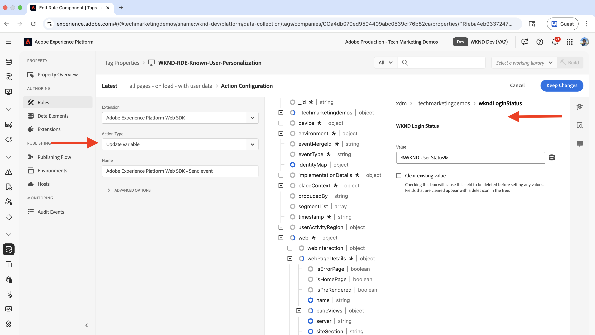

        - Click **Keep Changes** to save the action configuration.

    - Again, click Add to add another action and open the Action Configuration wizard.

        - **Extension**: Select **Adobe Experience Platform Web SDK**
        - **Action Type**: Select **Send event**
        - In the right panel's **Data** section, map the **XDM-Variable Pageview** data element to the **Web Webpagedetails Page Views** type.

        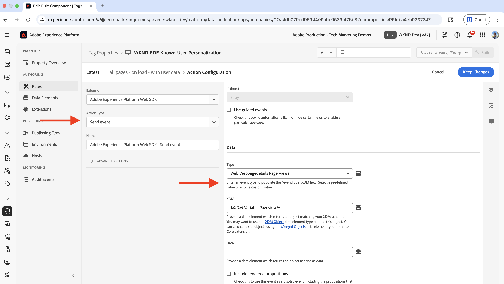

    - Also, in the right panel's **Personalization** section, check the **Render visual personalization decisions** option. Then click **Keep Changes** to save the action.

        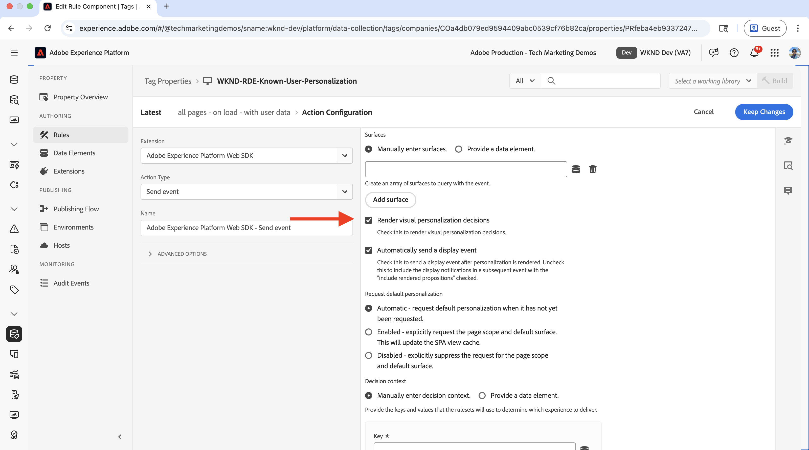

- Your rule should look like this:

  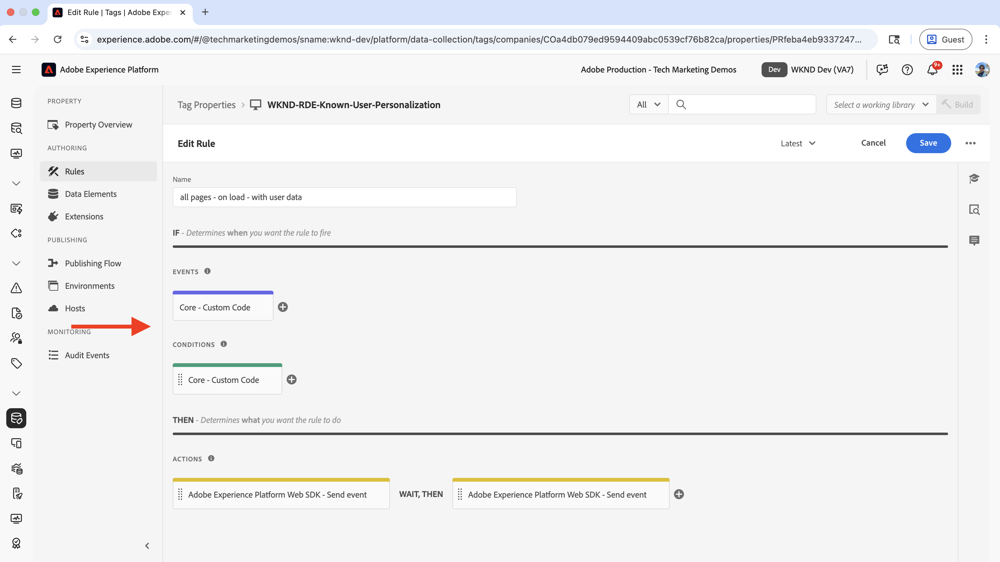

The rule is now configured to send page view data and user login status + user ID (if logged in) to Experience Platform.

The above rule creation steps have a considerable number of details so be careful while creating the rule. It might sound complex but remember these config steps make it plug and play without needing to update AEM code and re-deploying the application.

#### Add and publish Tags Library

A library is a collection of all your Tags configurations (data elements, rules, extensions) that gets built and deployed to your website. It packages everything together so data collection works properly. For known-user personalization, the library is published to make the data collection rules active on your website.

- Click **Publishing Flow** from the left navigation and click the **Add Library** button.
  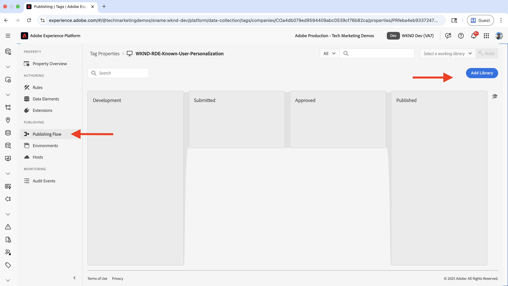

- In the **Add Library** dialog, enter the following:
    - **Name**: 1.0
    - **Environment**: Select **Development**
    - Click **Add All Changed Resources** to select all the resources.

  Click **Save & Build to Development** to create the library.

  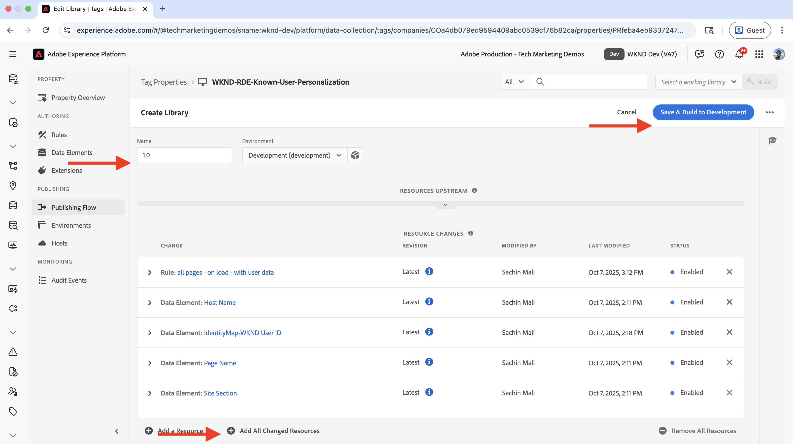

- To publish the library to production, click **Approve & Publish to Production**. Once the publishing is complete, the property is ready for use in AEM.
  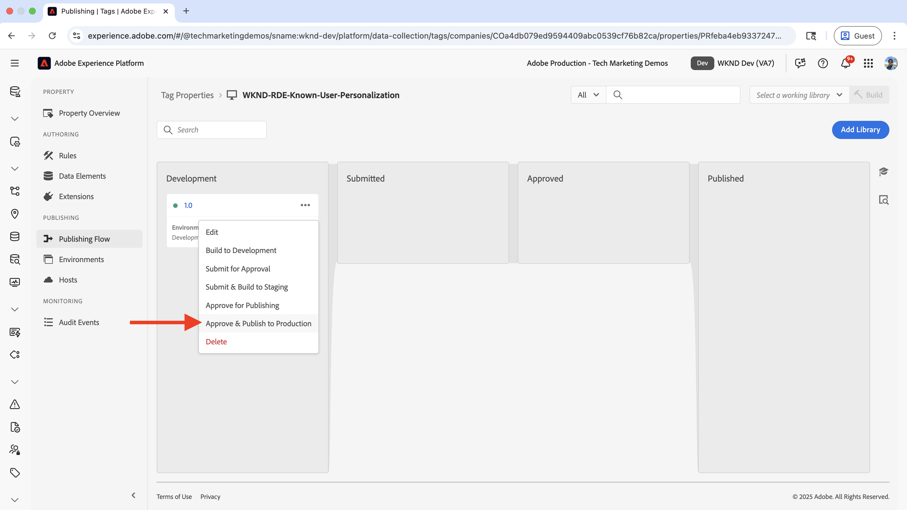

The library is now published and ready to collect data from your AEM pages.

### Configure Merge Policy for the Profile

A merge policy defines how customer data from multiple sources gets unified into a single profile. It determines which data takes precedence when there are conflicts, ensuring you have a complete and consistent view of each customer for known-user personalization.

- In **Adobe Experience Platform**, click **Profiles** from the left navigation and click the **Merge Policies** tab.

  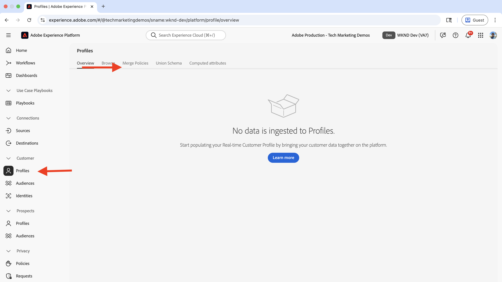

For the purpose of this use case, a merge policy is created. However, you can use an existing merge policy if you have one. Make sure to enable both **Default merge policy** and **Active-On-Edge Merge Policy** options (which enables profile data to be available at the edge network for real-time personalization decisions). 

These settings ensure that your behavioral and transactional data are properly unified and available for real-time audience evaluation.

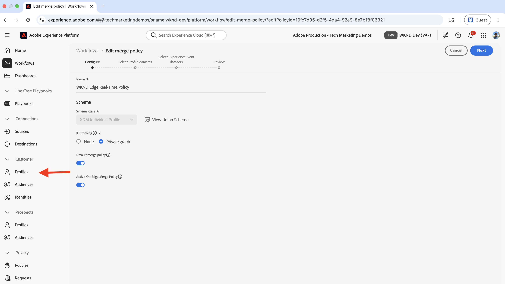

### Set up (V2) Adobe Target Destination

The Adobe Target Destination (V2) enables you to activate audiences created in Experience Platform directly in Adobe Target. This connection allows your audiences to be used for personalization activities in Adobe Target.

- In **Adobe Experience Platform**, click **Destinations** from the left navigation and click the **Catalog** tab. Search for **Personalization** and select **(v2) Adobe Target** destination.

  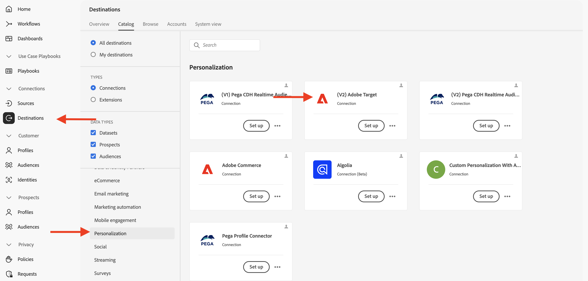

- In the **Activate Destinations** step, provide a name for the destination and click the **Connect to destination** button.
  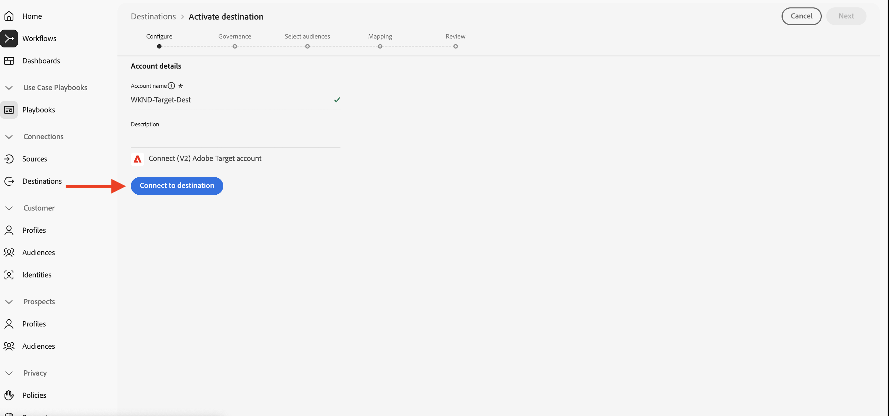

- In the **Destination details** section, enter the following:
    - **Name**: WKND-RDE-Known-User-Personalization-Destination
    - **Description**: Destination for the known-user personalization
    - **Datastream**: Select the **Datastream** that you created earlier
    - **Workspace**: Select your Adobe Target workspace

  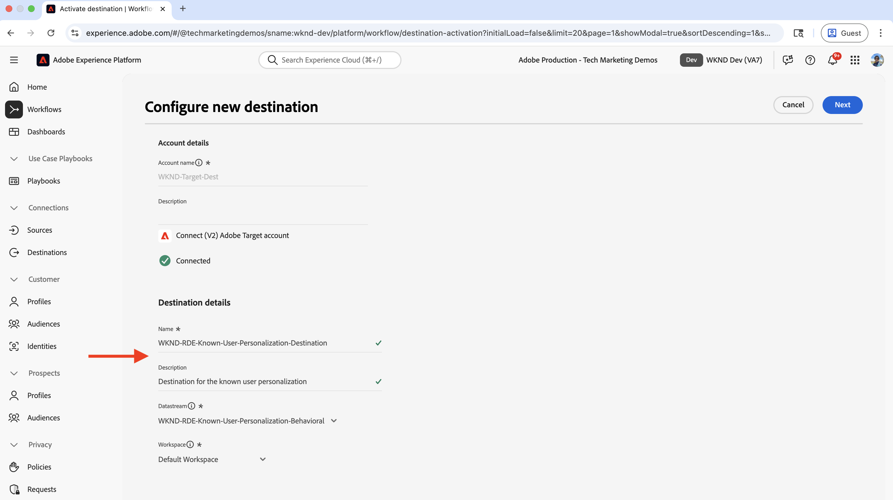

- Click **Next** and complete the destination configuration.

  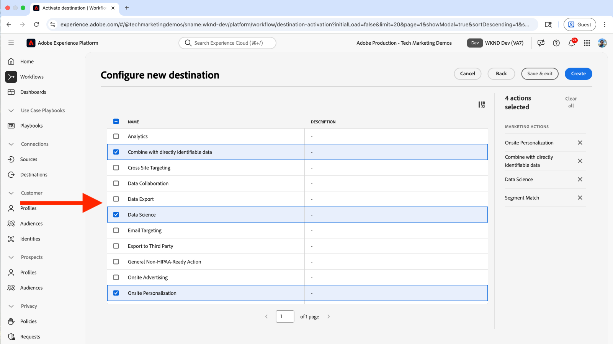

Once configured, this destination allows you to activate audiences created in Experience Platform to Adobe Target for use in personalization activities.

## AEM setup

In the following steps, you enhance the WKND site Login functionality to store the user ID in the browser's session storage and integrate and inject Tags property into AEM pages.

The tags property is injected into AEM pages to collect the page view data and user login status + user ID (if logged in) when users visit the WKND site. The Adobe Target integration enables you to export personalized offers to Adobe Target.

### Enhance the WKND site login functionality

To enhance the WKND site Login functionality, clone the [WKND site project](https://github.com/adobe/aem-guides-wknd) from GitHub, create a new feature branch, and open it in your favorite IDE.

```shell
$ mkdir -p ~/Code
$ git clone git@github.com:adobe/aem-guides-wknd.git
$ cd aem-guides-wknd
$ git checkout -b feature/known-user-personalization
```

- Navigate to the `ui.frontend` module and open the `ui.frontend/src/main/webpack/components/form/sign-in-buttons/sign-in-buttons.js` file. Review the code, after making AJAX call to `currentuser.json`, it either shows the Sign In or Sign Out button based on the user login status.

- Update the code to store the user ID in browser's session storage and also optimize the code to avoid making multiple AJAX calls to `currentuser.json`.

  ```javascript
  import jQuery from "jquery";

  jQuery(function($) {
      "use strict";

      (function() {
          const currentUserUrl = $('.wknd-sign-in-buttons').data('current-user-url'),
              signIn = $('[href="#sign-in"]'),
              signOut = $('[href="#sign-out"]'),
              greetingLabel = $('#wkndGreetingLabel'),
              greetingText = greetingLabel.text(),
              body = $('body');

          // Cache configuration
          const CACHE_KEY = 'wknd_user_state';
          const CACHE_DURATION = 5 * 60 * 1000; // 5 minutes in milliseconds

          /**
           * Get cached user state from session storage
           */
          function getCachedUserState() {
              try {
                  const cached = sessionStorage.getItem(CACHE_KEY);
                  if (cached) {
                      const userState = JSON.parse(cached);
                      const now = Date.now();
                      
                      // Check if cache is still valid
                      if (userState.timestamp && (now - userState.timestamp) < CACHE_DURATION) {
                          return userState.data;
                      } else {
                          // Cache expired, remove it
                          sessionStorage.removeItem(CACHE_KEY);
                      }
                  }
              } catch (e) {
                  console.warn('Failed to read cached user state:', e);
                  sessionStorage.removeItem(CACHE_KEY);
              }
              return null;
          }

          /**
           * Cache user state in session storage
           */
          function cacheUserState(userData) {
              try {
                  const userState = {
                      data: userData,
                      timestamp: Date.now()
                  };
                  sessionStorage.setItem(CACHE_KEY, JSON.stringify(userState));
              } catch (e) {
                  console.warn('Failed to cache user state:', e);
              }
          }

          /**
           * Clear cached user state
           */
          function clearCachedUserState() {
              try {
                  sessionStorage.removeItem(CACHE_KEY);
              } catch (e) {
                  console.warn('Failed to clear cached user state:', e);
              }
          }

          /**
           * Update UI based on user state
           */
          function updateUI(userData) {
              const isAnonymous = 'anonymous' === userData.authorizableId;

              if(isAnonymous) {
                  signIn.show();
                  signOut.hide();
                  greetingLabel.hide();
                  body.addClass('anonymous');
              } else {
                  signIn.hide();
                  signOut.show();
                  greetingLabel.text(greetingText + ", " + userData.name);
                  greetingLabel.show();
                  body.removeClass('anonymous');
              }
          }

          /**
           * Fetch user data from AEM endpoint
           */
          function fetchUserData() {
              return $.getJSON(currentUserUrl + "?nocache=" + new Date().getTime())
                  .fail(function(xhr, status, error) {
                      console.error('Failed to fetch user data:', error);
                      updateUI({ authorizableId: 'anonymous' });
                  });
          }

          /**
           * Initialize user state (check cache first, then fetch if needed)
           */
          function initializeUserState() {
              const cachedUserState = getCachedUserState();
              
              if (cachedUserState) {
                  updateUI(cachedUserState);
              } else {
                  fetchUserData().done(function(currentUser) {
                      updateUI(currentUser);
                      cacheUserState(currentUser);
                  });
              }
          }

          // Initialize user state
          initializeUserState();

          // Clear cache on sign-in/sign-out clicks
          $(document).on('click', '[href="#sign-in"], [href="#sign-out"]', function() {
              clearCachedUserState();
          });

          // Clear cache when modal is shown
          $('body').on('wknd-modal-show', function() {
              clearCachedUserState();
          });

          // Clear cache when on dedicated sign-in page
          if (window.location.pathname.includes('/sign-in') || window.location.pathname.includes('/errors/sign-in')) {
              clearCachedUserState();
          }

          // Clear cache when sign-in form is submitted
          $(document).on('submit', 'form[id*="sign-in"], form[action*="login"]', function() {
              clearCachedUserState();
          });

          // Clear cache on successful login redirect
          const urlParams = new URLSearchParams(window.location.search);
          if (urlParams.has('login') || urlParams.has('success') || window.location.hash === '#login-success') {
              clearCachedUserState();
          }

          // Debug function for testing
          window.debugUserState = function() {
              console.log('Cache:', sessionStorage.getItem('wknd_user_state'));
              clearCachedUserState();
              initializeUserState();
          };

      })();
  });
  ```

  Note that the Tags property rule relies on the user ID being stored in the browser's session storage. The `wknd_user_state` key is common contract between the AEM code and the Tags property rule for storing and retrieving the user ID.

- Verify changes locally by building the project and running it locally.

  ```shell
  $ mvn clean install -PautoInstallSinglePackage
  ```
  
  Login using `asmith/asmith` (or any other user you created) credentials, they are [included](https://github.com/adobe/aem-guides-wknd/blob/main/ui.content.sample/src/main/content/jcr_root/home/users/wknd/l28HasMYWAMHAaGkv-Lj/.content.xml) in the `aem-guides-wknd` project.

  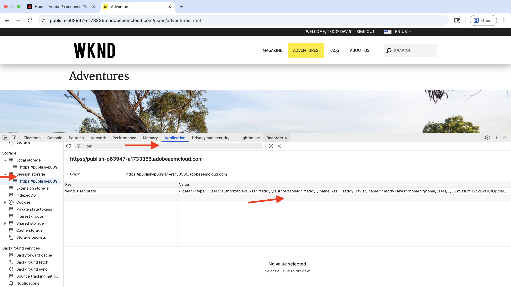

  In my case, I created a new user with the id `teddy` for testing.

- After confirming the user ID is stored in the browser's session storage (using the browser's developer tools), commit and push the changes to the Adobe Cloud Manager remote repository. 

  ```shell
  $ git add .
  $ git commit -m "Enhance the WKND site Login functionality to store the user ID in browser's session storage"
  $ git push adobe-origin feature/known-user-personalization
  ```

- Deploy the changes to the AEM as a Cloud Service environment either using Cloud Manager pipelines or using the AEM RDE command.

### Integrate and inject Tags Property into AEM pages

This step integrates the Tags property that was created earlier into your AEM pages, enabling data collection for known-user personalization. The Tags property automatically captures page view data and user login status + user ID (if logged in) when users visit the WKND site.

To integrate the Tags property into AEM pages, follow the steps from [Integrate Tags in Adobe Experience Platform](../setup/integrate-adobe-tags.md).

Make sure to use the **WKND-RDE-Known-User-Personalization** Tags property that was created earlier, not a different property.

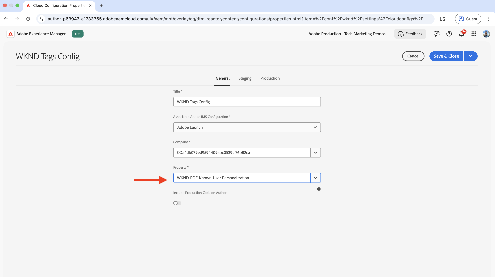

Once integrated, the Tags property begins collecting known-user personalization data from your AEM pages and sending it to Experience Platform for audience creation.

### Verify Data Collection on AEM pages

To verify the data collection from AEM pages, you can use the browser's developer tools to inspect the network requests and see the data being sent to Experience Platform. You can also use the [Experience Platform Debugger](https://chromewebstore.google.com/detail/adobe-experience-platform/bfnnokhpnncpkdmbokanobigaccjkpob) to verify the data collection.

- In the browser, navigate to the WKND site deployed to your AEM as a Cloud Service environment. Being anonymous, you should see similar data collection requests.

  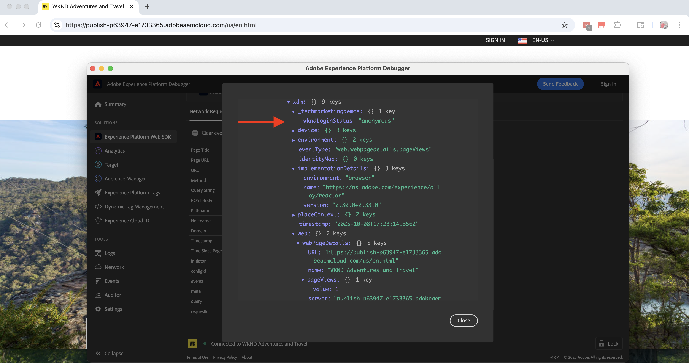

- Login using `asmith/asmith` credentials, you should see similar data collection requests.

  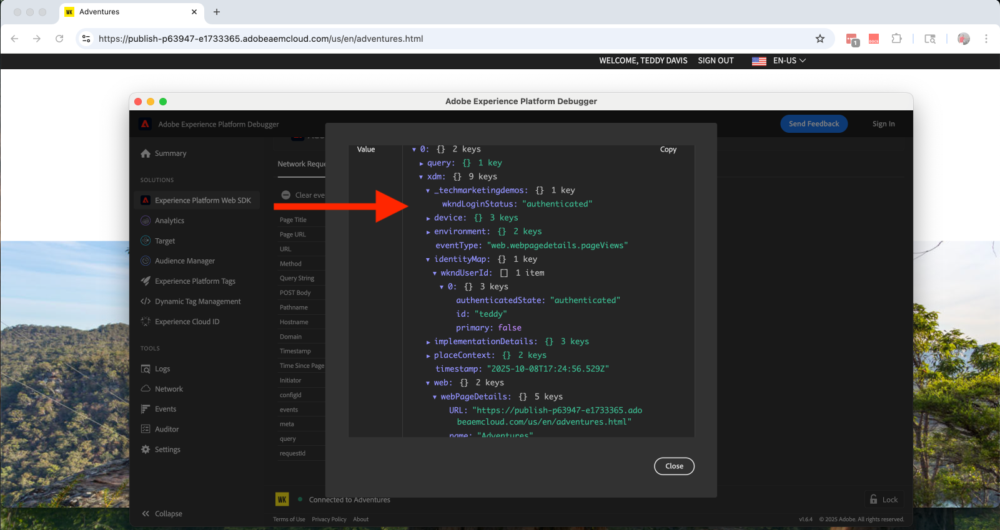

Notice the `identityMap` and `_YOUR_NAMESPACE.wkndLoginStatus` variables are set to the user ID and login status respectively.

### Integrate Adobe Target

This step integrates Adobe Target with AEM and enables the export of personalized content (Experience Fragments) to Adobe Target. This connection allows Adobe Target to use the content created in AEM for personalization activities with the known-user audiences created in Experience Platform.

To integrate Adobe Target and export the **WKND-RDE-Known-User-Personalization** audience offers to Adobe Target, follow the steps from [Integrate Adobe Target in Adobe Experience Platform](../setup/integrate-adobe-target.md).

Make sure that Target configuration is applied to the Experience Fragments so they can be exported to Adobe Target for use in personalization activities.

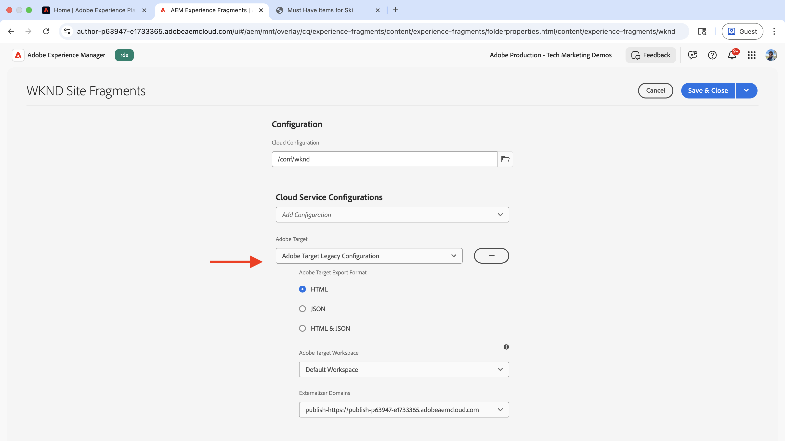

Once integrated, you can export Experience Fragments from AEM to Adobe Target, where they are used as personalized offers for the known-user audiences.

### Create personalized offers

Experience Fragments are reusable content components that can be exported to Adobe Target as personalized offers. For known-user personalization, let's _upsell_ the ski equipment by creating a new Experience Fragment.

- In AEM, click **Experience Fragments** and navigate to the **WKND Site Fragments** folder. In the desired location, create a new Experience Fragment.

  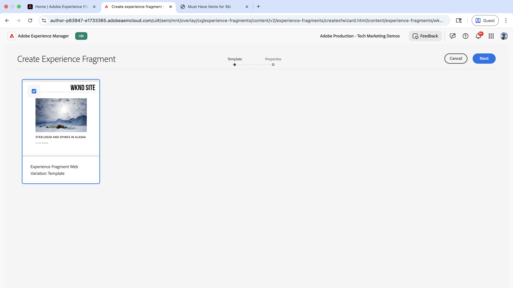

- Author the Experience Fragment by adding a Teaser component and customize it with content relevant to upselling the ski equipment.

  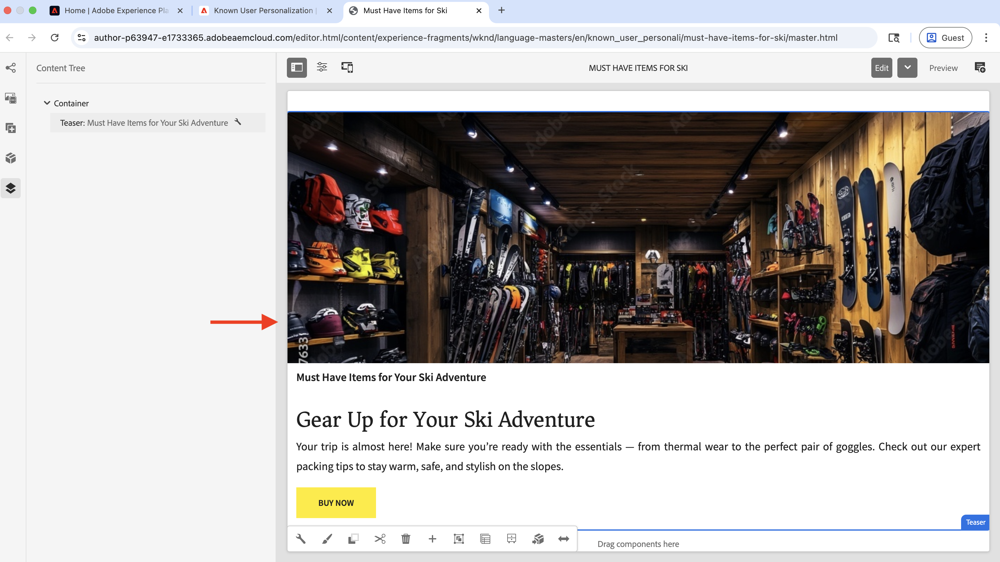

- Export the Experience Fragment to Adobe Target.

  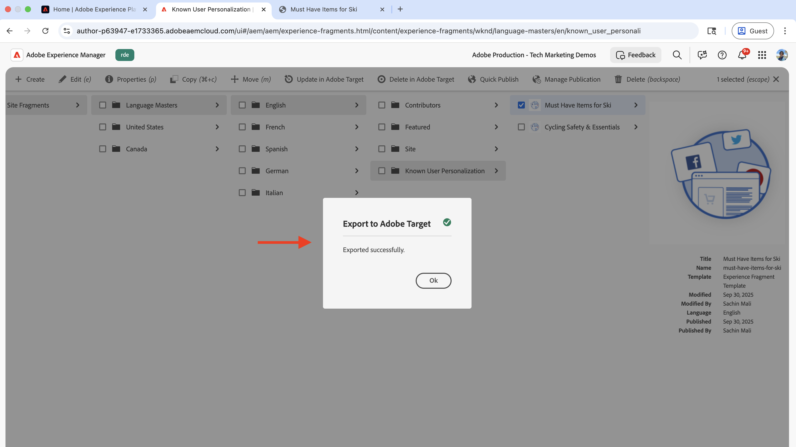

Your personalized offer is now available in Adobe Target for use in activities.

## Adobe Experience Platform setup

Revisit the Adobe Experience Platform, to verify the behavioral data is collected, and related profiles are created. Then ingest the transactional data, verify behavioral and transactional data stitching, create and configure an Audience, and activate the Audience to Adobe Target.

### Verify behavioral data and profile creation

Let's verify the behavioral data is collected and related profiles are created.

- In Adobe Experience Platform, click **Datasets** and open the **WKND-RDE-Known-User-Personalization-Behavioral** dataset. Make sure that the ingested data stats are valid.

  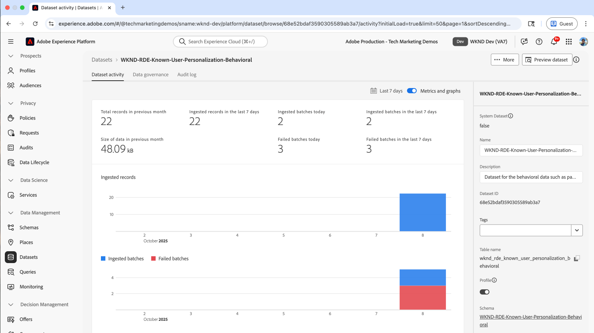

- To verify the profiles are created, click **Profiles** from the left navigation. Then navigate to the **Browse** tab and filter using the following criteria:
    - **Merge policy**: $YOUR_MERGE_POLICY_NAME
    - **Identity namespace**: ECID (Experience Cloud ID, a unique identifier automatically assigned by Adobe to every visitor's browser)
    - **Identity value**: Find using the browser's developer tools or Experience Platform Debugger. It is the AMCV_$NAMESPACE$ cookie value without the `MCMID|` prefix.

    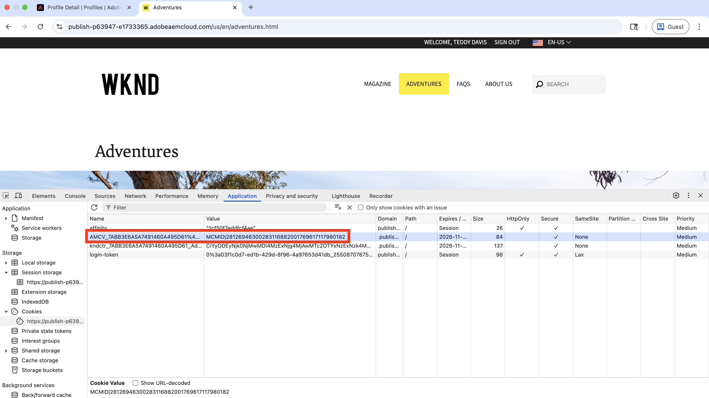
  
- Click, **View** button.
  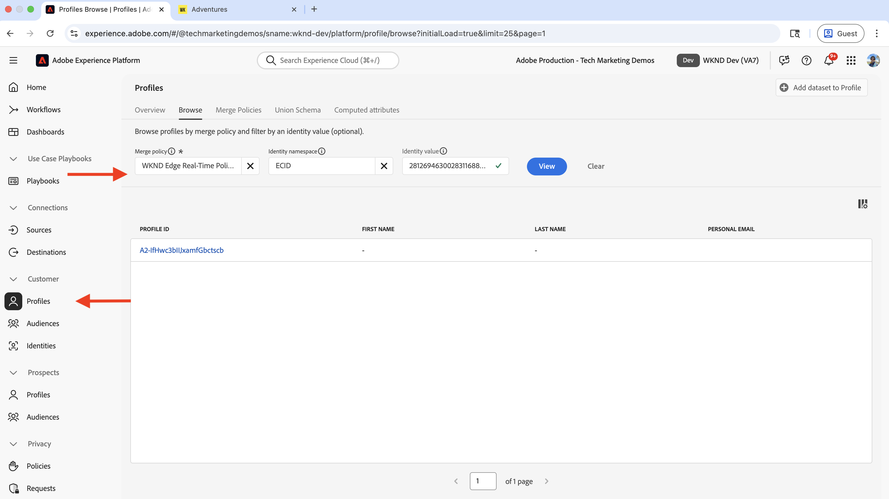

- Click on the profile, you should see the details of the profile.
  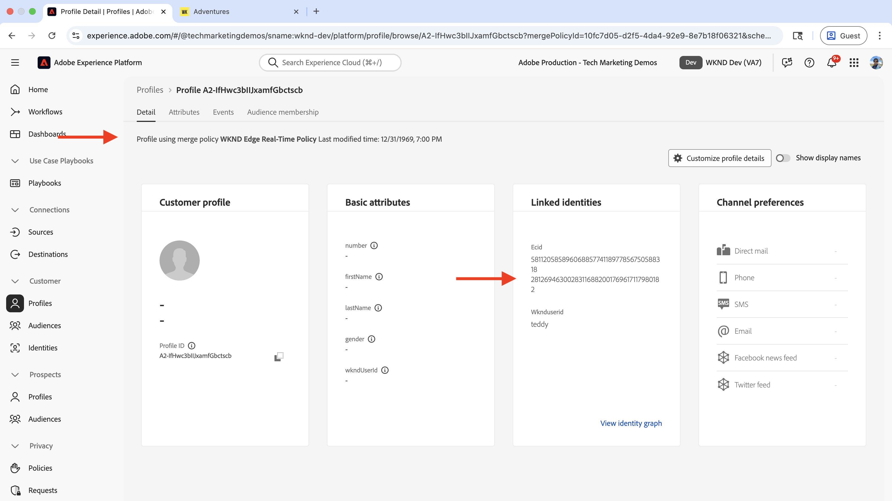

  In my case, I accessed my WKND site from two different browsers, so I have two ECIDs associated with user `teddy`. The data from both the ECIDs are stitched together to create the profile. You have started realizing the power of identity stitching and how it is used to create a complete customer profile. Soon the transactional data is stitched with the behavioral data to create a complete customer profile.

- Click on the **Events** tab, you should see the events related to the profile.
  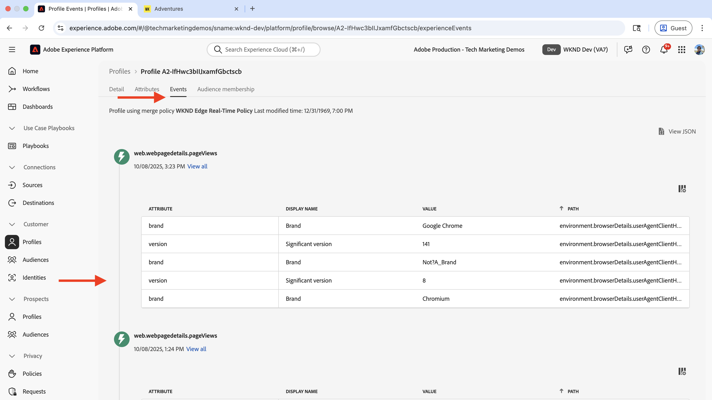

### Ingest the transactional data

Next, you ingest the dummy transactional data into Experience Platform. In this example, the transactional data is stored in the other system (for example, OMS or CRM or MDM) and ingested into Experience Platform using the batch ingestion. The transactional data contains the WKND user ID, which is used to stitch the behavioral and transactional data.

- In Adobe Experience Platform, click **Datasets** and open the **WKND-RDE-Known-User-Personalization-Transactional** dataset. 

  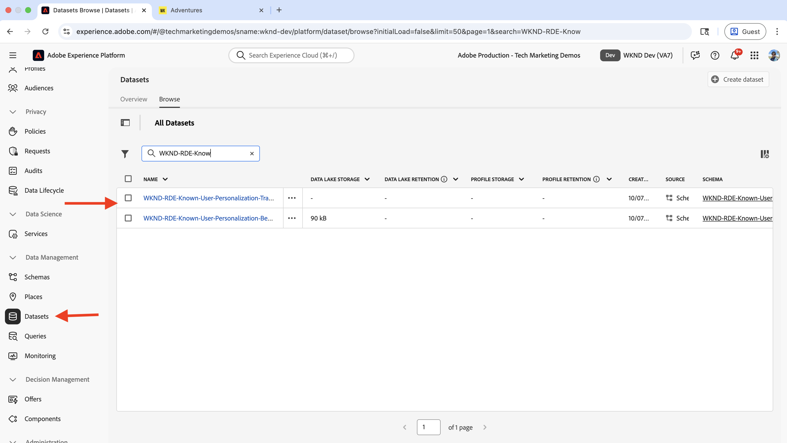

- In the right panel, look for the **ADD DATA** section and drag the[ski-adventure-purchase-data.json](../assets/use-cases/known-user-personalization/ski-adventure-purchase-data.json) file to it. This file contains the dummy transactional data for the WKND Adventure purchases. In a real world scenario, this data is ingested from the other system (for example, OMS or CRM or MDM) using the batch or streaming ingestion.
  
  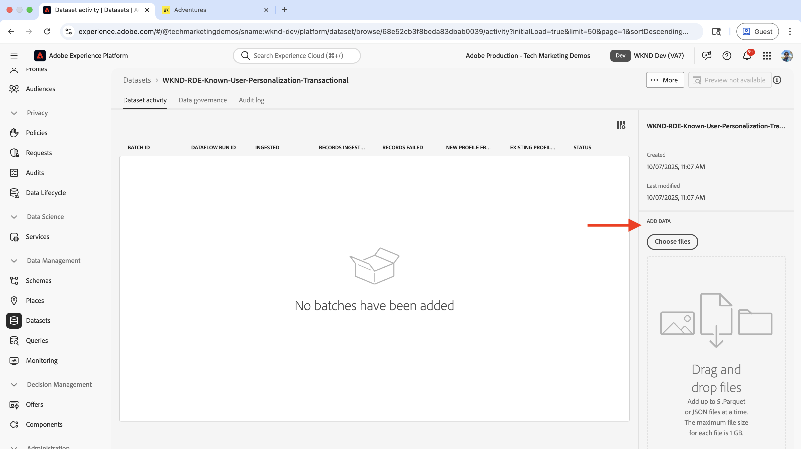

- Wait for the data processing to complete.
  
  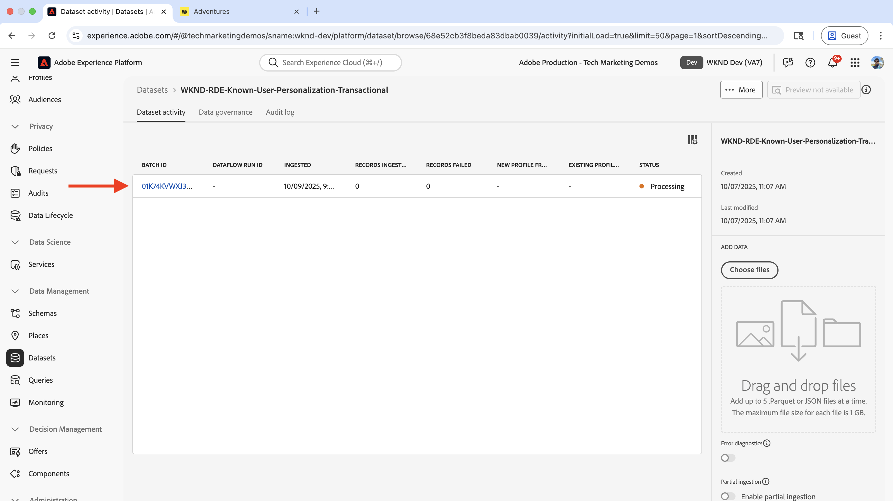

- Once the data processing is complete, refresh the dataset page.
  
  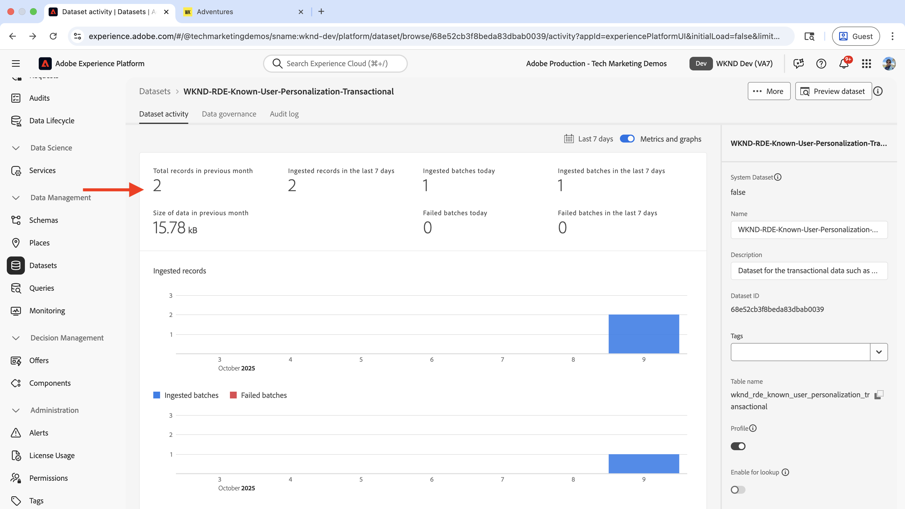

### Verify behavioral and transactional data stitching

Next, you verify the behavioral and transactional data stitching, the most important part of the known-user personalization use case. Remember, the WKND site user id is the common identifier across systems and is used to stitch the data. In this example, the user id `teddy` is used to stitch the data.

- Click **Profiles** from the left navigation. Then navigate to the **Browse** tab and filter using the following criteria:
    - **Merge policy**: $YOUR_MERGE_POLICY_NAME
    - **Identity namespace**: ECID
    - **Identity value**: Use the same ECID value that you used to filter the behavioral data and associated profile.

    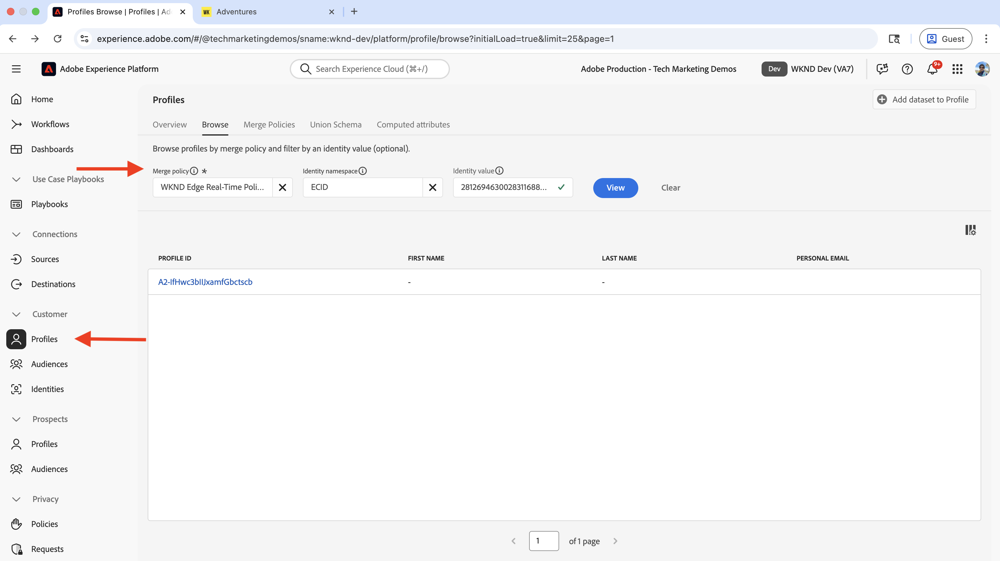

- Click on the profile, you should see the details of the profile. The transactional data is stitched with the behavioral data to create the complete customer profile.
  
  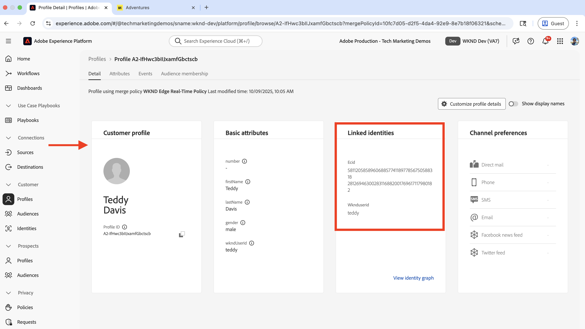

- Click on the **Attributes** tab, you should see the transactional and behavioral data details associated with the profile.
  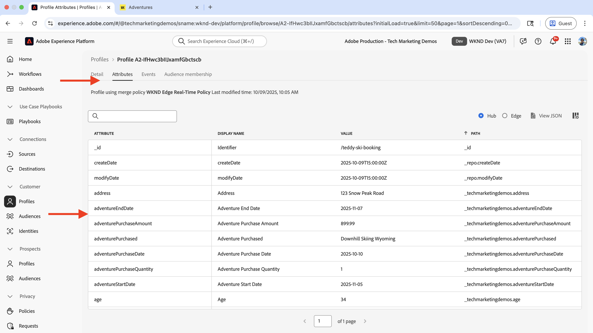

- Click on the **View identity graph** link to see the identity graph of the profile.
  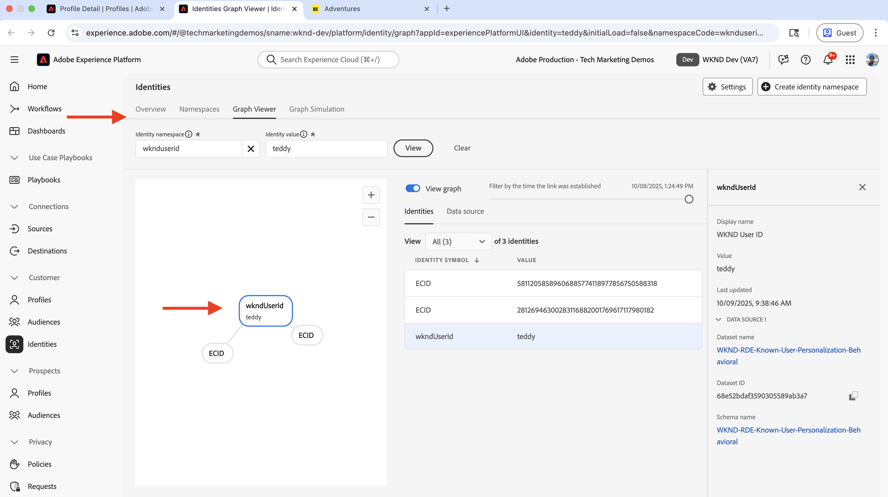

Congratulations! You have stitched the behavioral and transactional data to create a complete customer profile.

Identity stitching is a powerful capability that creates a complete customer profile by combining data from multiple systems. For demo purposes, only two systems are used to stitch the data. In a real world scenario, you might have multiple systems like Mobile App, Call Center, Chatbot, Point of Sale, etc. that collect the data and store it in their respective systems. Using the common identifier, the data is stitched together to create a complete customer profile and used for personalization activities. This approach modernizes the customer experience by delivering personalized experiences to the users, replacing static, one-size-fits-all content with tailored experiences based on individual customer profiles.

#### Profile lookup using WKND User ID

It is possible to look up the profile using the WKND user ID (not ECID) in Experience Platform.

- Click **Profiles** from the left navigation. Then navigate to the **Browse** tab and filter using the following criteria:
    - **Merge policy**: $YOUR_MERGE_POLICY_NAME
    - **Identity namespace**: WKND User Id
    - **Identity value**: `teddy` or `asmith` or any other user ID that you have used.

    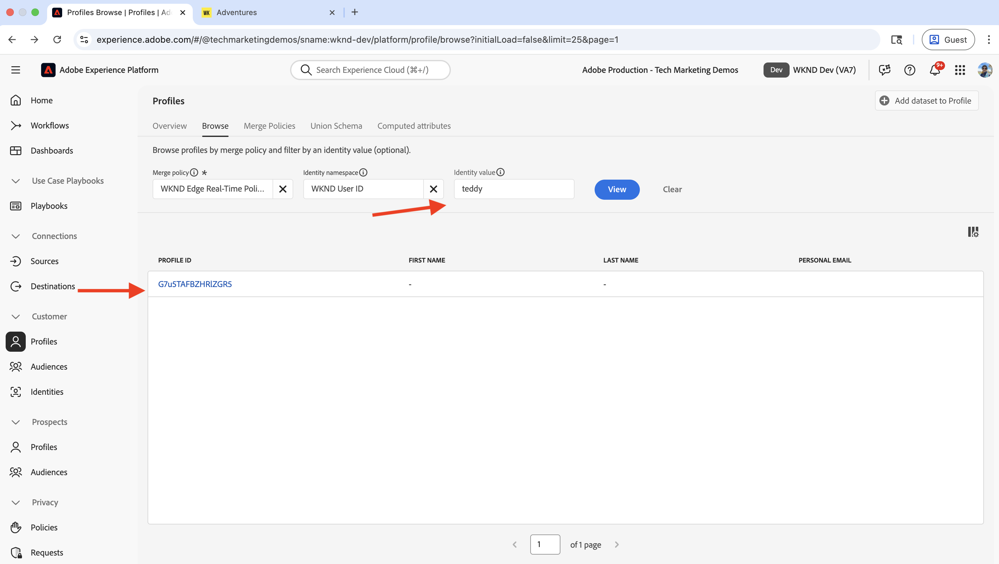

- Click on the profile, you should see the same profile details as the one you saw in the previous step.
  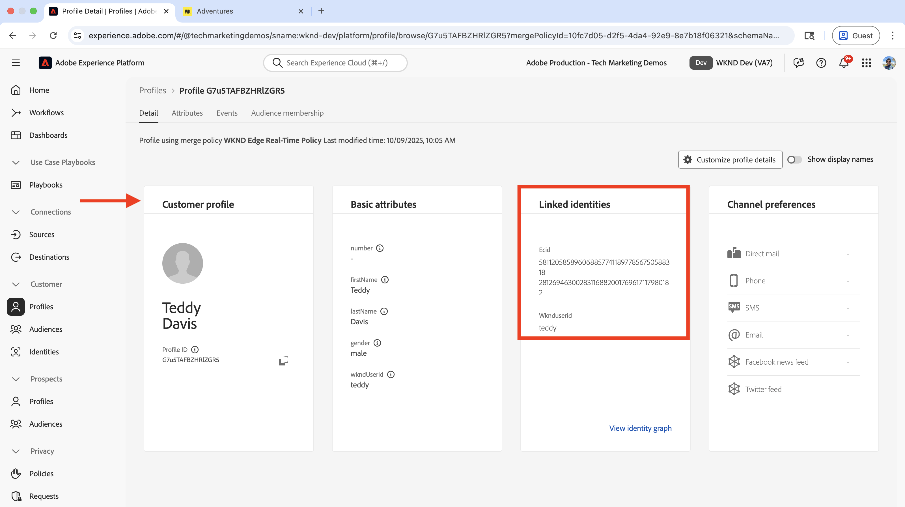

### Create and configure an Audience

An audience defines a specific group of users based on their behavioral and transactional data. In this example, an audience is created that qualifies users who have purchased any **Ski** adventure and are logged in to the WKND site.

To create an audience, complete the following steps:

- In Adobe Experience Platform, click **Audiences** from the left navigation and click the **Create Audience** button. Then select the **Build-rule** option and click the **Create** button.
  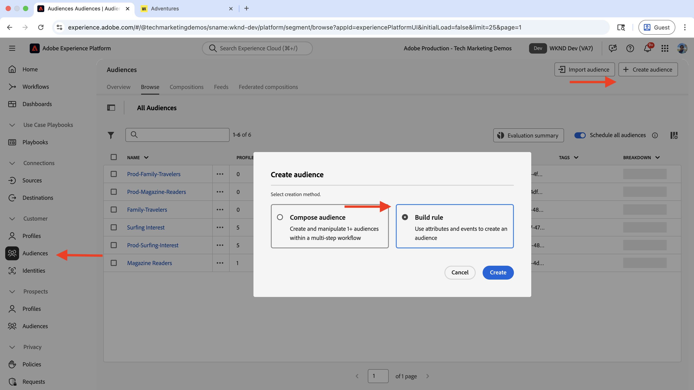

- In the **Create** step, enter the following:
    - **Name**: UpSell-Ski-Equipment-To-Authenticated
    - **Description**: Users who are logged in and have purchased any ski adventure
    - **Evaluation method**: Select **Edge** (evaluates audience membership in real-time as users browse, enabling instant personalization)
    
  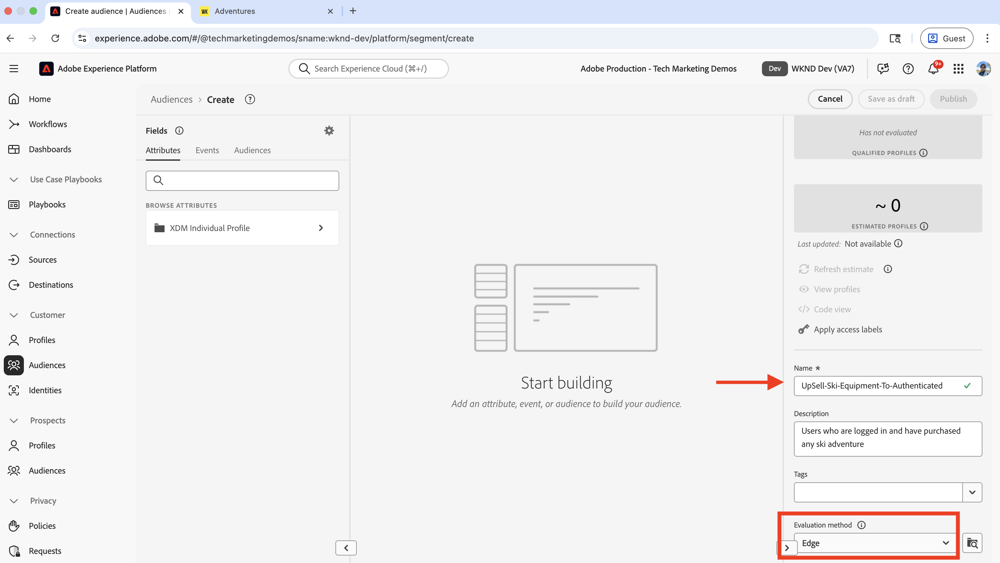

- Then click the **Attributes** tab and navigate to the **Techmarketingdemos** (or your $NAMESPACE$) field group. Drag and drop the **Adventure Purchased** field to the **Start building** section. Enter the following details:

  **Adventure Purchased**: Select **Contains** and enter the value **ski**.

  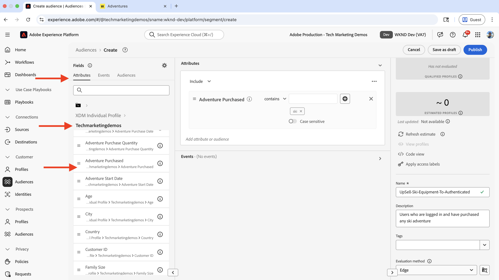

- Then, switch to the **Events** tab and navigate to the **techmarketingdemos** (or your $NAMESPACE$) field group. Drag and drop the **WKND Login Status** field to the **Events** section. Enter the following details:

  **WKND Login Status**: Select **Equals** and enter the value **authenticated**.
  
  Also, select the **Today** option.

  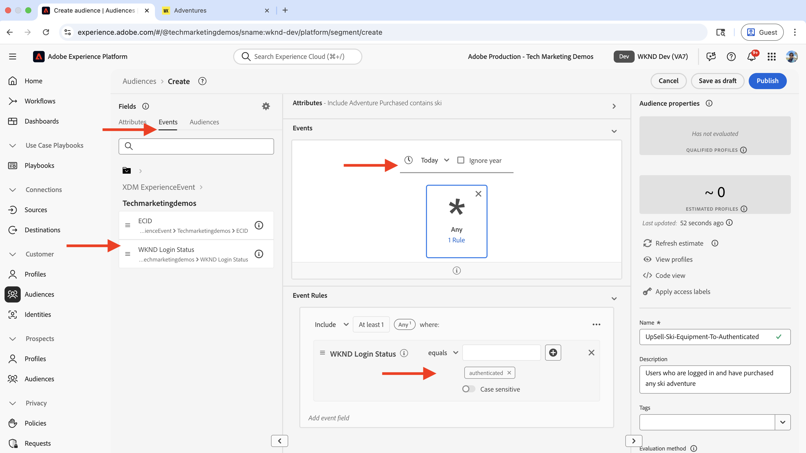

- Review the audience and click the **Activate to destination** button.

  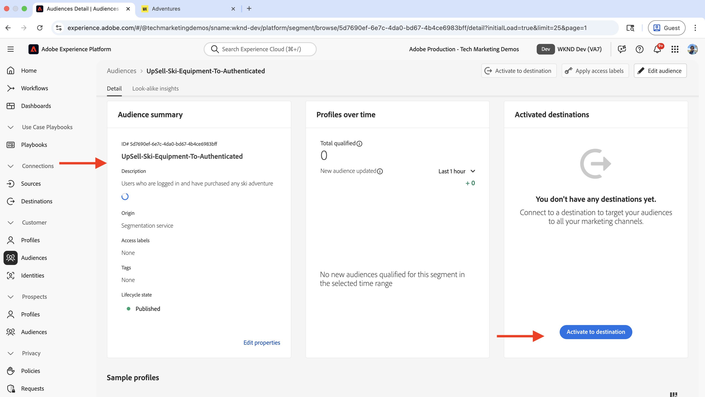

- In the **Activate to destination** dialog, select the Adobe Target destination you created earlier and follow the steps to activate the audience. Click **Next** and complete the destination configuration.

  

Congratulations! You have created the audience and activated it to the Adobe Target destination.

## Adobe Target setup

In Adobe Target, the audience created in Experience Platform and the personalized offers exported from AEM are verified to be properly available. Then, an activity is created that combines the audience targeting with the personalized content to deliver the known-user personalization experience.

- Log in to Adobe Experience Cloud and navigate to **Adobe Target** from the App Switcher or Quick Access section.

  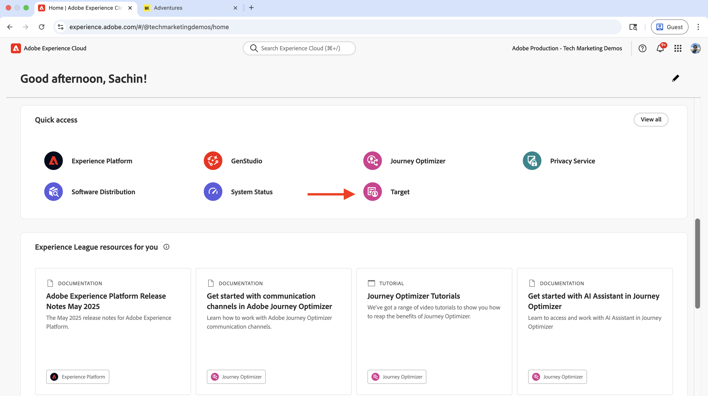

### Verify Audiences and Offers

Let's verify the audiences and offers are properly available in Adobe Target.

- In Adobe Target, click **Audiences** and verify that the **UpSell-Ski-Equipment-To-Authenticated** audience is created.

  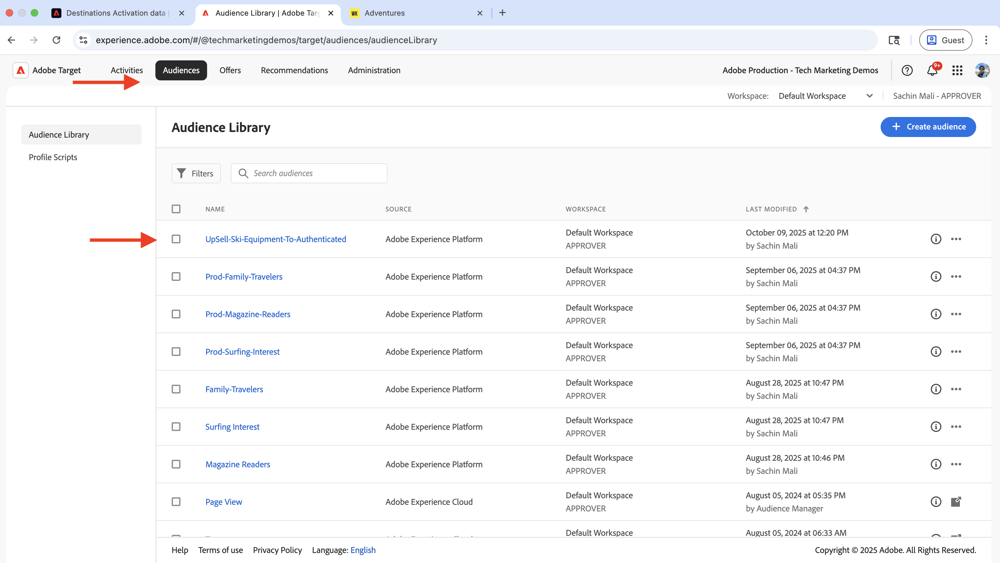

- By clicking on the audience, you can see the audience details and verify it's properly configured.

  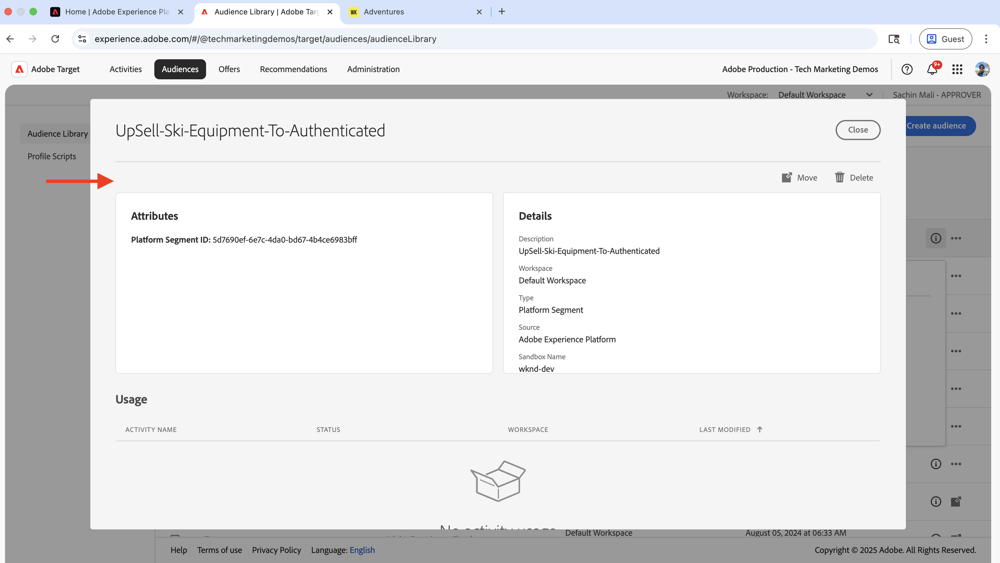

- Click **Offers** and verify that the AEM exported offer exists. In my case, the offer (or Experience Fragment) is called **Must Have Items for Ski**.

  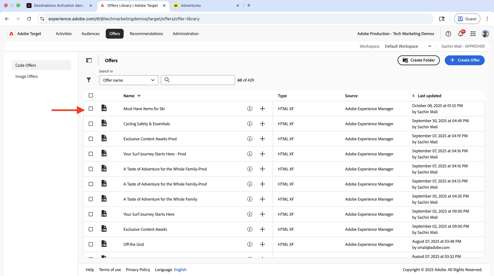

  This validates the integration actions across Adobe Experience Platform, AEM, and Adobe Target.

### Create and configure an Activity

An activity in Adobe Target is a personalization campaign that defines when and how personalized content is delivered to specific audiences. For known-user personalization, an activity is created that shows the ski gear upsell offer to the users who are logged in and have purchased any ski adventure.

- In Adobe Target, click **Activities** and click the **Create Activity** button and select **Experience Targeting** activity type.
  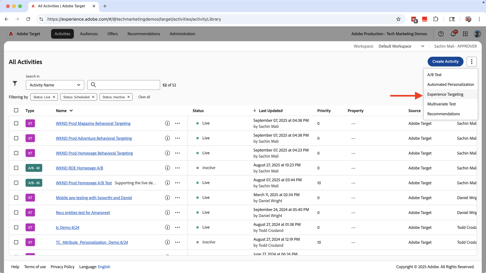

- In the **Create Experience Targeting Activity** dialog, select the **Web** type and **Visual** composer option (a WYSIWYG editor that lets you create and test personalized experiences directly on your website), and enter the WKND site home page URL. Click the **Create** button to create the activity.

  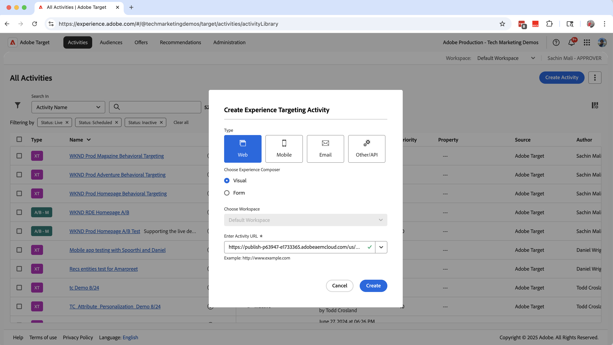

- In the editor, select the **UpSell-Ski-Equipment-To-Authenticated** audience and add the **Must Have Items for Ski** offer in place of the top hero content. Please see the below screenshot for reference.

  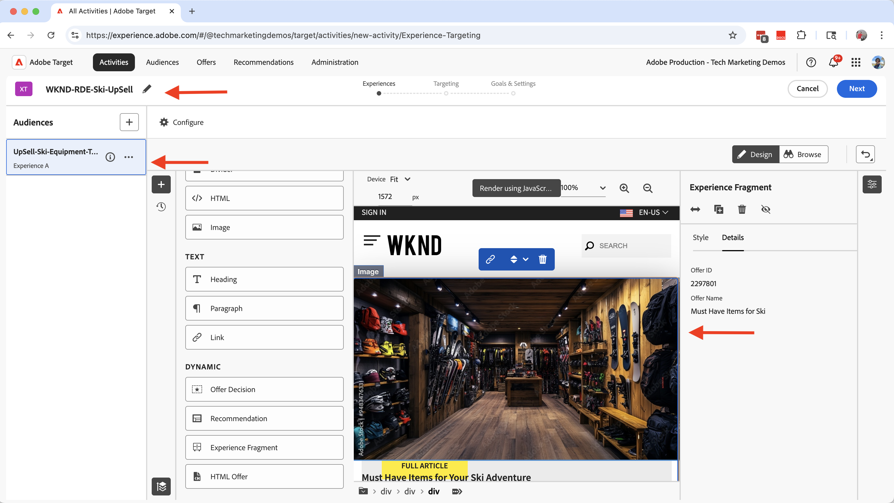

- Click **Next** and configure the **Goals and Settings** section with appropriate goals and metrics, then activate it to push the changes live.

  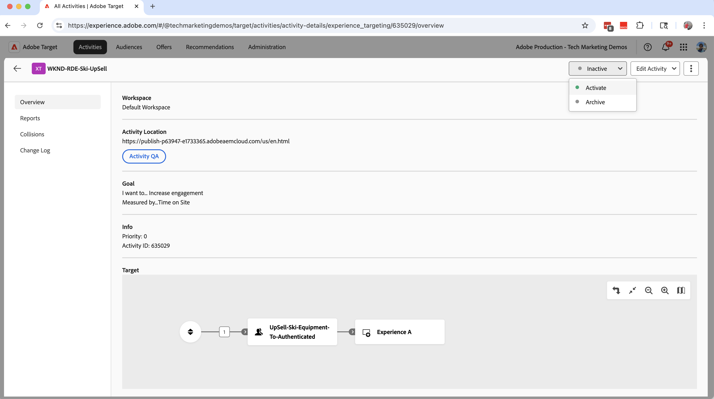

Congratulations! You are all set to deliver the known-user personalization experience to the users who are logged in and have purchased any ski adventure.

## Verify the known-user personalization implementation

It's time to verify the known-user personalization implementation on your WKND site.

- Visit the WKND site home page, if you are not logged in, you should see the default hero content.

  

- Login using `teddy/teddy` (or `asmith/asmith`) credentials, you should see the personalized hero content.

  

- Open your browser's developer tools and check the **Network** tab. Filter by `interact` to find the Web SDK request. The request/response should show the Web SDK event and Adobe Target decision details.

  Request output should look like this:
  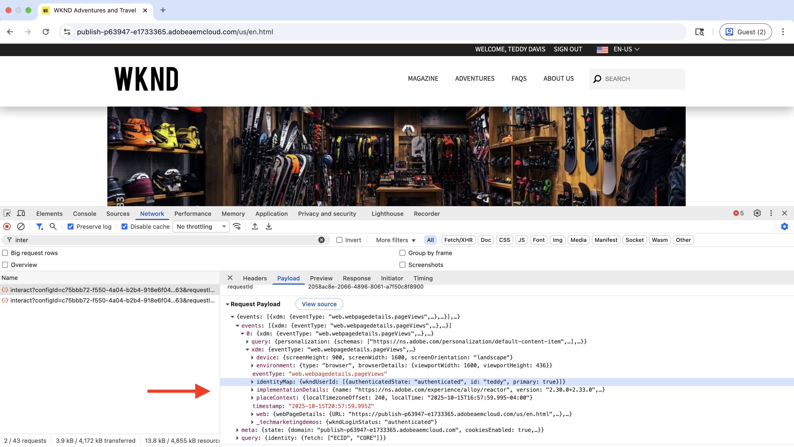

  Response output should look like this:
  
  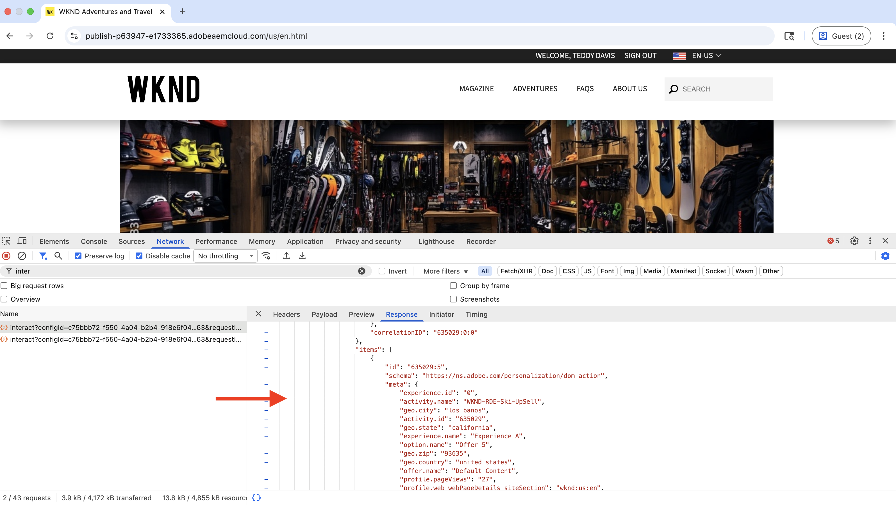

Congratulations! You are an expert in delivering the known-user personalization experience by building a complete customer profile using the stitched data across systems.

## Additional resources

- [Adobe Experience Platform Web SDK](https://experienceleague.adobe.com/en/docs/experience-platform/web-sdk/home)
- [Datastreams overview](https://experienceleague.adobe.com/en/docs/experience-platform/datastreams/overview)
- [Visual Experience Composer (VEC)](https://experienceleague.adobe.com/en/docs/target/using/experiences/vec/visual-experience-composer)
- [Edge segmentation](https://experienceleague.adobe.com/en/docs/experience-platform/segmentation/methods/edge-segmentation)
- [Audience types](https://experienceleague.adobe.com/en/docs/experience-platform/segmentation/types/overview)
- [Adobe Target connection](https://experienceleague.adobe.com/en/docs/experience-platform/destinations/catalog/personalization/adobe-target-connection)
