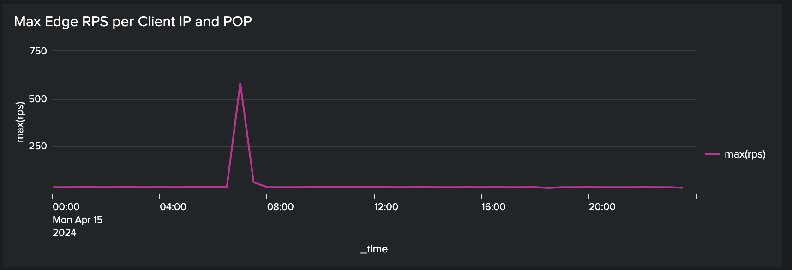

# Blocking DoS and DDoS attacks using traffic filter rules

Learn how to block Denial of Service (DoS) and Distributed Denial of Service (DDoS) attacks using **rate limit traffic filter** rules and other strategies at the AEM as a Cloud Service (AEMCS) managed CDN. These attacks cause traffic spikes at the CDN and potentially at the AEM Publish service (aka origin) and can impact site responsiveness and availability.

This tutorial serves as a guide on _how to analyze your traffic patterns and configure rate limit [traffic filter rules](https://experienceleague.adobe.com/en/docs/experience-manager-cloud-service/content/security/traffic-filter-rules-including-waf)_ to mitigate those attacks. The tutorial also describes how to [configure alerts](https://experienceleague.adobe.com/en/docs/experience-manager-cloud-service/content/security/traffic-filter-rules-including-waf#traffic-filter-rules-alerts) so that you are notified when there is a suspected attack. 

## Understanding protection

Let's understand the default DDoS protections for your AEM website:

- **Caching:** With good caching policies, the impact of a DDoS attack is more limited because the CDN prevents most requests from going to the origin and causing performance degradation.
- **Autoscaling:** The AEM author and publish services autoscale to handle traffic spikes, although they can still be impacted by sudden, massive increases in traffic.
- **Blocking:** The Adobe CDN blocks traffic to the origin if it exceeds an Adobe-defined rate from a particular IP address, per CDN PoP (Point of Presence).
- **Alerting:** The Actions Center sends a traffic spike at origin alert notification when traffic exceeds a certain rate. This alert fires off when traffic to any given CDN PoP exceeds an _Adobe-defined_ request rate per IP address. See [Traffic Filter Rules Alerts](https://experienceleague.adobe.com/en/docs/experience-manager-cloud-service/content/security/traffic-filter-rules-including-waf#traffic-filter-rules-alerts) for more details.

These built-in protections should be considered a baseline for an organization's ability to minimize the performance impact of a DDoS attack. Since each website has different performance characteristics and may see performance degradation before the Adobe-defined rate limit is met, it is recommended to extend the default protections through _customer configuration_.

Let's look at some additional, recommended measures that customers can take to protect their websites from DDoS attacks:

- Declare **rate limit traffic filter rules** to block traffic that exceeds a certain rate from a single IP address, per PoP. These are typically a lower threshold than the Adobe-defined rate limit.
- Configure **alerts** on rate limit traffic filter rules through an "alert action" so when the rule is triggered, an Actions Center notification is sent.
- Increase cache coverage by declaring **request transformations** to ignore query parameters.

>[!NOTE]
>
>The [traffic filter rule alerts](https://experienceleague.adobe.com/en/docs/experience-manager-cloud-service/content/security/traffic-filter-rules-including-waf#traffic-filter-rules-alerts) feature has not yet been released. To gain access through the early adopter program, email **<aemcs-waf-adopter@adobe.com>**.

### Rate Limit Traffic Rules Variations {#rate-limit-variations}

There are two variations of rate limit traffic rules:

1. Edge - block requests based on the rate of all traffic (including that can be served from CDN cache), for a given IP, per PoP.
1. Origin - block requests based on the rate of traffic destined for the origin, for a given IP, per PoP.

## Customer journey

The steps below reflect the likely process through which customers should go about protecting their websites. 

1. Recognize the need for a rate limit traffic filter rule. This might be the result of receiving Adobe's out-of-the-box traffic spike at origin alert, or it may be a proactive decision to take precautions to reduce the risk of a successful DDoS.
1. Analyze traffic patterns using a dashboard, if your site is already live, to determine the optimal thresholds for your rate limit traffic filter rules. If your site is not yet live, pick values based on your traffic expectations. 
1. Using the values from the previous step, configure rate limit traffic filter rules. Make sure to enable the corresponding alerts so you are notified whenever the threshold is met. 
1. Receive traffic filter rules alerts whenever traffic spikes occur, providing you with valuable insight about whether your organization is potentially being targeted by malicious actors. 
1. Act on the alert, as necessary. Analyze the traffic to determine if the spike reflects legitimate requests rather than an attack. Increase the thresholds if the traffic is legitimate, or lower them if not.

The rest of this tutorial guides you through this process.

## Recognizing the need to configure rules {#recognize-the-need}

As mentioned previously, Adobe by default blocks traffic at the CDN that exceeds a certain rate, however, some websites may experience degraded performance below that threshold. Thus, rate limit traffic filter rules should be configured.

Ideally, you would configure the rules before going live to production. In practice, many organizations reactively declare rules only once alerted to a traffic spike indicating a likely attack.

Adobe sends a traffic spike at origin alert as an [Actions Center Notification](https://experienceleague.adobe.com/en/docs/experience-manager-cloud-service/content/operations/actions-center) when a default threshold of traffic from a single IP address is exceeded, for a given PoP. If you received such an alert, it is recommended to configure a rate limit traffic filter rule. This default alert is different from the alerts that must be explicitly enabled by customers when defining traffic filter rules, which you will learn about in a future section.


## Analyzing traffic patterns {#analyze-traffic}

If your site is already live, you can analyze the traffic patterns using CDN logs and one of the following methods:

### ELK - configuring dashboard tooling

The **Elasticsearch, Logstash, and Kibana (ELK)** dashboard tooling provided by Adobe can be used to analyze the CDN logs. This tooling includes a dashboard that visualizes the traffic patterns, making it easier to determine the optimal thresholds for your rate limit traffic filter rules.

- Clone the [AEMCS-CDN-Log-Analysis-ELK-Tool](https://github.com/adobe/AEMCS-CDN-Log-Analysis-ELK-Tool) GitHub repository. 
- Set up the tooling by following the [How to set up the ELK Docker container](https://github.com/adobe/AEMCS-CDN-Log-Analysis-ELK-Tool?tab=readme-ov-file#how-to-set-up-the-elk-docker-container) steps.
- As part of the setup, import the `traffic-filter-rules-analysis-dashboard.ndjson` file to visualize the data. The _CDN Traffic_ dashboard includes visualizations that show the maximum number of requests per IP/POP at the CDN Edge and Origin.
- From the [Cloud Manager](https://my.cloudmanager.adobe.com/)'s _Environments_ card, download the AEMCS Publish service's CDN logs.

    

    >[!TIP]
    >
    > It may take up to 5 minutes for the new requests to appear in the CDN logs.
  
### Splunk - configuring dashboard tooling

Customers who have [Splunk Log forwarding enabled](https://experienceleague.adobe.com/en/docs/experience-manager-cloud-service/content/implementing/developing/logging#splunk-logs) can create a new dashboard to analyze the traffic patterns. The following XML file helps you create a dashboard at Splunk:

- [CDN - Traffic dashboard](./assets/traffic-dashboard.xml): This dashboard provides insights into the traffic patterns at the CDN Edge and Origin. It includes visualizations that show the maximum number of requests per IP/POP at the CDN Edge and Origin.

### Looking at data

The following visualizations are available in the ELK and Splunk dashboards:

- **Edge RPS per Client IP and POP**: This visualization shows the maximum number of requests per IP/POP **at the CDN Edge**. The peak in the visualization indicates the maximum request number.
  
    **ELK Dashboard**:
    

    **Splunk Dashboard**:  
    
  
- **Origin RPS per Client IP and POP**: This visualization shows the maximum number of requests per IP/POP **at the origin**. The peak in the visualization indicates the maximum request number.
  
    **ELK Dashboard**:
    

    **Splunk Dashboard**:
    

## Choosing threshold values

The threshold values for rate limit traffic filter rules should be based on the above analysis and making sure that legitimate traffic is not blocked. See the following table for guidance on how to choose the threshold values:

| Variation  | Value     |
| :--------- | :------- |
| Origin    | Take the highest value of the Max Origin Requests per IP/POP under **normal** traffic conditions (that is, not the rate at the time of a DDoS) and increase it by a multiple |
| Edge    | Take the highest value of the Max Edge Requests per IP/POP under **normal** traffic conditions (that is, not the rate at the time of a DDoS) and increase it by a multiple |
    
The multiple to use depends on your expectations of normal spikes in traffic due to organic traffic, campaigns, and other events. A multiple between 5-10 may be reasonable.

If your site is not yet live, there is no data to analyze, and you should make an educated guess on the appropriate values to set for your rate limit traffic filter rules. For example:

| Variation                          | Value | 
|------------------------------ |:-----------:|
| Edge    | 500 |
| Origin    | 100 |
    
## Configuring rules {#configure-rules}

Configure the **rate limit traffic filter** rules in your AEM project's `/config/cdn.yaml` file, with values based on the discussion above. If needed, consult with your Web Security team to make sure the rate limit values are appropriate and do not block legitimate traffic.

Refer to [Create rules in your AEM project](https://experienceleague.adobe.com/en/docs/experience-manager-learn/cloud-service/security/traffic-filter-and-waf-rules/how-to-setup#create-rules-in-your-aem-project) for more details. 

  ```yaml
  kind: CDN
  version: '1'
  metadata:
    envTypes:
      - dev
      - stage
      - prod
  data:
    trafficFilters:
      rules:
      ...
      #  Prevent attack at edge by blocking client for 5 minutes if they make more than 500 requests per second on average
        - name: prevent-dos-attacks-edge
          when:
            reqProperty: tier
            in: ["author","publish"]
          rateLimit:
            limit: 500 # replace with the appropriate value
            window: 10 # compute the average over 10s
            penalty: 300 # block IP for 5 minutes
            count: all # count all requests
            groupBy:
              - reqProperty: clientIp
          action: 
            type: log
            experimental_alert: true
      #  Prevent attack at origin by blocking client for 5 minutes if they make more than 100 requests per second on average            
        - name: prevent-dos-attacks-origin
          when:
            reqProperty: tier
            in: ["author","publish"]
          rateLimit:
            limit: 100 # replace with the appropriate value
            window: 10 # compute the average over 10s
            penalty: 300 # block IP for 5 minutes
            count: fetches # count only fetches
            groupBy:
              - reqProperty: clientIp
          action: 
            type: log
            experimental_alert: true   
            
  ```

Note that both origin and edge rules are declared, and that the alert property is set to `true` so you can receive alerts whenever the threshold is met, likely indicating an attack.

>[!NOTE]
>
>The _experimental_ prefix_ in front of experimental_alert will be removed when the alert feature is released. To join the early adopter program, email **<aemcs-waf-adopter@adobe.com>**.

It is recommended that the action type is set to log initially so you can monitor traffic for a few hours or days, ensuring that legitimate traffic does not exceed these rates. After a few days, change to block mode.

Follow the below steps to deploy the changes to your AEMCS environment:

- Commit and push the above changes to your Cloud Manager Git repository.
- Deploy the changes to the AEMCS environment using the Cloud Manager's Config pipeline. Refer [Deploy rules through Cloud Manager](https://experienceleague.adobe.com/en/docs/experience-manager-learn/cloud-service/security/traffic-filter-and-waf-rules/how-to-setup#deploy-rules-through-cloud-manager) for more details.
- To verify the **rate limit traffic filter rule** is working as expected, you can simulate an attack as described in the [Attack simulation](#attack-simulation) section. Limit the number of requests to a value higher than the rate limit value set in the rule.

### Configuring request transformation rules {#configure-request-transform-rules}

In addition to rate limit traffic filter rules, it is recommended to use [request transformations](https://experienceleague.adobe.com/en/docs/experience-manager-cloud-service/content/implementing/content-delivery/cdn-configuring-traffic#request-transformations) to unset query parameters not needed by the application to minimize ways to bypass the cache through cache busting techniques. For example, if you only want to allow `search` and `campaignId` query parameters, the following rule can be declared: 

```yaml
kind: "CDN"
version: "1"
metadata:
  envTypes: 
    - dev
    - stage
    - prod  
data:  
  experimental_requestTransformations:
    rules:            
      - name: unset-all-query-params-except-those-needed
        when:
          reqProperty: tier
          in: ["publish"]
        actions:
          - type: unset
            queryParamMatch: ^(?!search$|campaignId$).*$
```            

## Receiving traffic filter rules alerts {#receiving-alerts}

As mentioned above, if the traffic filter rule includes *experimental_alert: true*, an alert is received when the rule is matched. 

## Acting on alerts {#acting-on-alerts}

Sometimes, the alert is informational, giving you a sense of the frequency of attacks. It is worthwhile to analyze your CDN data using the dashboard described above, to validate that the traffic spike is due to an attack, and not just an increase in legitimate traffic volume. If the latter, consider increasing your threshold.

## Attack simulation{#attack-simulation}

This section describes methods to simulate a DoS attack, which can be used to generate data for the dashboards used in this tutorial and to validate that any configured rules successfully block attacks.

>[!CAUTION]
>
> Do not perform these steps in a production environment. The following steps are for simulation purposes only.
> 
>If you received an alert indicating a spike in traffic, proceed to the [Analyzing traffic patterns](#analyzing-traffic-patterns) section.

To simulate an attack, tools like [Apache Benchmark](https://httpd.apache.org/docs/2.4/programs/ab.html), [Apache JMeter](https://jmeter.apache.org/), [Vegeta](https://github.com/tsenart/vegeta), and others can be used.

### Edge requests

Using the following [Vegeta](https://github.com/tsenart/vegeta) command you can make many requests to your website:

```shell
$ echo "GET https://<YOUR-WEBSITE-DOMAIN>" | vegeta attack -rate=120 -duration=5s | vegeta report
```

The above command makes 120 requests for 5 seconds and outputs a report. Assuming the website is not rate limited, this can cause a spike in traffic.

### Origin requests

To bypass the CDN cache and make requests to the origin (AEM Publish service), you can add a unique query parameter to the URL. Refer to the sample Apache JMeter script from the [Simulate DoS attack using JMeter script](https://experienceleague.adobe.com/en/docs/experience-manager-learn/foundation/security/modsecurity-crs-dos-attack-protection#simulate-dos-attack-using-jmeter-script)

