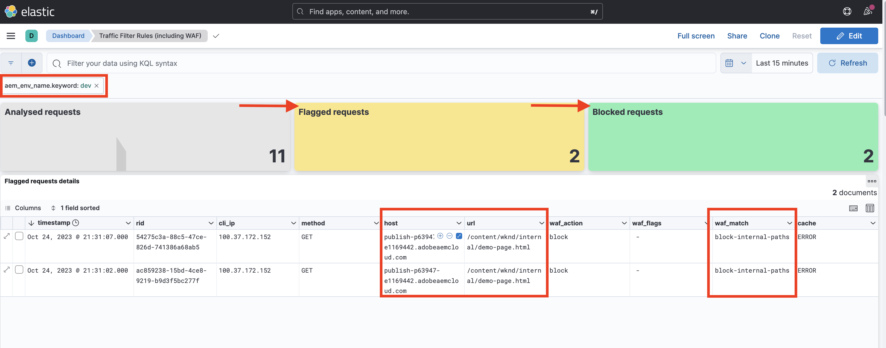

# Restricting access

Learn how to restrict access by blocking specific requests using traffic filter rules in AEM as a Cloud Service.

This tutorial demonstrates how to **block requests to internal paths from public IPs** in the AEM Publish service.

## Why and when to block requests

Blocking traffic helps enforce organizational security policies by preventing access to sensitive resources or URLs under certain conditions. Compared to logging, blocking is a stricter action and should be used when you are confident that traffic from specific sources is unauthorized or unwanted.

Common scenarios where blocking is appropriate include:

- Restricting access to `internal` or `confidential` pages to only internal IP ranges (for example, behind a corporate VPN).
- Blocking bot traffic, automated scanners, or threat actors identified by IP or geolocation.
- Preventing access to deprecated or unsecured endpoints during staged migrations.
- Limiting access to authoring tools or admin routes in Publish tiers.

## Prerequisites

Before proceeding, ensure you've completed the required setup as described in the [How to set up traffic filter and WAF rules](../setup.md) tutorial. Also, you have cloned and deployed the [AEM WKND Sites Project](https://github.com/adobe/aem-guides-wknd) to your AEM environment.

## Example: Block internal paths from public IPs

In this example, you configure a rule to block external access to an internal WKND page, such as `https://publish-pXXXX-eYYYY.adobeaemcloud.com/content/wknd/internal/demo-page.html`, from public IP addresses. Only users within a trusted IP range (such as a corporate VPN) can access this page.

You can either create your own internal page (for example, `demo-page.html`) or use the [attached package](../assets/how-to/demo-internal-pages-package.zip).

- Add the following rule to the WKND project's `/config/cdn.yaml` file.

```yaml
kind: "CDN"
version: "1"
metadata:
  envTypes: ["dev", "stage", "prod"]
data:
  trafficFilters:
    rules:
    # Block requests to (demo) internal only page/s from public IP address but allow from internal IP address.
    # Make sure to replace the IP address with your own IP address.
    - name: block-internal-paths
      when:
        allOf:
          - reqProperty: path
            matches: /content/wknd/internal
          - reqProperty: clientIp
            notIn: [192.150.10.0/24]
      action: block    
```

- Commit and push the changes to the Cloud Manager Git repository.

- Deploy the changes to the AEM environment using the Cloud Manager config pipeline [created earlier](../setup.md#deploy-rules-using-adobe-cloud-manager).

- Test the rule by accessing the WKND site's internal page, for example `https://publish-pXXXX-eYYYY.adobeaemcloud.com/content/wknd/internal/demo-page.html` or using the CURL command below:

    ```bash
    $ curl -I https://publish-pXXXX-eYYYY.adobeaemcloud.com/content/wknd/internal/demo-page.html
    ```

- Repeat the above step from both the IP address that you used in the rule and then a different IP address (for example, using your mobile phone).

## Analyzing

To analyze the results of the `block-internal-paths` rule, follow the same steps as described in the [set-up tutorial](../setup.md#cdn-logs-ingestion)

You should see the **Blocked requests** and corresponding values in the client IP (cli_ip), host, URL, action (waf_action), and rule-name (waf_match) columns.


