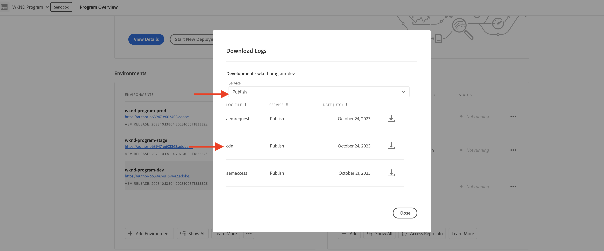
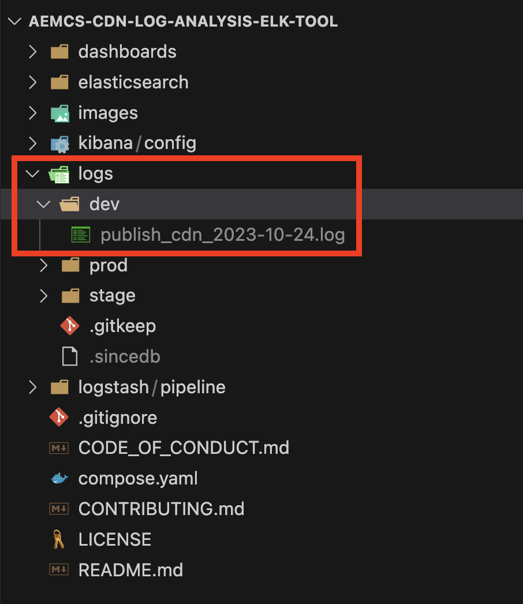
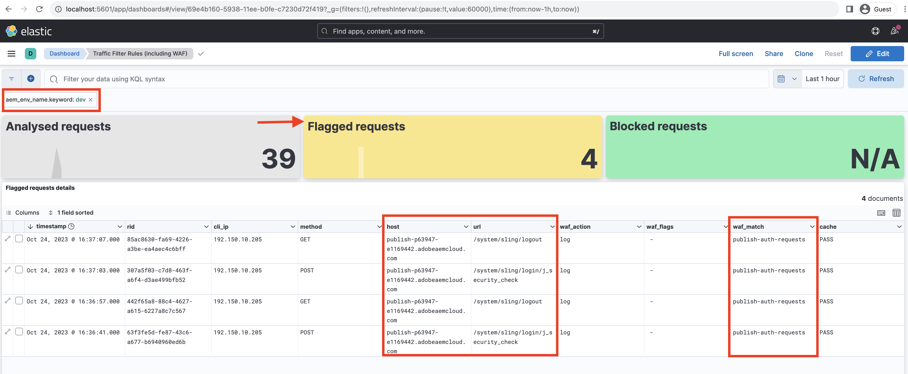

# Monitoring sensitive requests 

Learn how to monitor sensitive requests by logging them using traffic filter rules in AEM as a Cloud Service.

Logging enables you to observe traffic patterns without impacting end users or services and is a crucial first step before implementing blocking rules.

This tutorial demonstrates how to **log requests of WKND login and logout paths** against the AEM Publish service.

## Why and when to log requests

Logging specific requests is a low-risk, high-value practice to understand how users—and potentially malicious actors—are interacting with your AEM application. It is especially useful before enforcing blocking rules, giving you the confidence to refine your security posture without disrupting legitimate traffic.

Common scenarios for logging include:

- Validating the impact and reach of a rule before promoting it to `block` mode.
- Monitoring login/logout paths and authentication endpoints for unusual patterns or brute-force attempts.
- Tracking high-frequency access to API endpoints for potential abuse or DoS activity.
- Establishing baselines for bot behavior before applying stricter controls.
- In case of security incidents, provide forensic data to understand the nature of the attack and the affected resources.

## Prerequisites

Before proceeding, ensure that you have completed the required setup as described in the [How to set up traffic filter and WAF rules](../setup.md) tutorial. Also, that you have cloned and deployed the [AEM WKND Sites Project](https://github.com/adobe/aem-guides-wknd) to your AEM environment.

## Example: Log WKND login and logout requests

In this example, you create a traffic filter rule to log requests made to the WKND login and logout paths on the AEM Publish service. It helps you monitor authentication attempts and identify potential security issues.

- Add the following rule to the WKND project's `/config/cdn.yaml` file.

```yaml
kind: "CDN"
version: "1"
metadata:
  envTypes: ["dev", "stage", "prod"]
data:
  trafficFilters:
    rules:
    # On AEM Publish service log WKND Login and Logout requests
    - name: publish-auth-requests
      when:
        allOf:
          - reqProperty: tier
            matches: publish
          - reqProperty: path
            in:
              - /system/sling/login/j_security_check
              - /system/sling/logout
      action: log   
```

- Commit and push the changes to the Cloud Manager Git repository.

- Deploy the changes to the AEM environment using the Cloud Manager config pipeline [created earlier](../setup.md#deploy-rules-using-adobe-cloud-manager).

- Test the rule by signing in and signing out of your program's WKND site (for example, `https://publish-pXXXX-eYYYY.adobeaemcloud.com/us/en.html`). You can use `asmith/asmith` as the username and password.

  

## Analyzing

Let's analyze the results of the `publish-auth-requests` rule by downloading the AEMCS CDN logs from Cloud Manager and using the [AEMCS CDN Log Analysis Tooling](../setup.md#setup-the-elastic-dashboard-tool).

- From [Cloud Manager](https://my.cloudmanager.adobe.com/)'s **Environments** card, download the AEMCS **Publish** service's CDN logs.

    

    >[!TIP]
    >
    > It may take up to 5 minutes for the new requests to appear in the CDN logs.

- Copy the downloaded log file (for example, `publish_cdn_2023-10-24.log` in the screenshot below) into the `logs/dev` folder of the Elastic dashboard tool project.

    

- Refresh the Elastic dashboard tool page.
  - In the top **Global filter** section, edit the `aem_env_name.keyword` filter and select the `dev` environment value.

      

  - To change the time interval, click the calendar icon in the top-right corner and select the desired time interval.

      

- Review the updated dashboard's  **Analyzed requests**, **Flagged requests**, and **Flagged requests details** panels. For matching CDN log entries, it should show the values of each entry's client IP (cli_ip), host, url, action (waf_action), and rule-name (waf_match).

    
