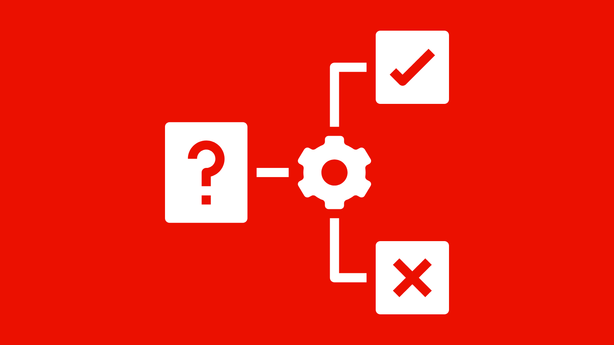
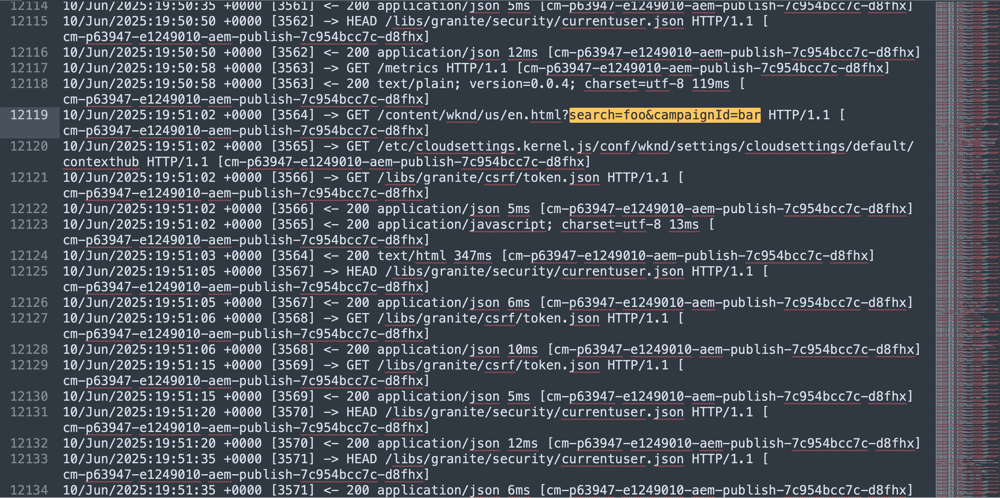

# Overview - Protecting AEM websites

Learn how to protect your AEM websites from Denial of Service (DoS), Distributed Denial of Service (DDoS), malicious traffic and sophisticated attacks using **traffic filter rules**, including its subcategory of **Web Application Firewall (WAF)** rules in AEM as a Cloud Service.

You also learn about the differences between standard traffic filter and WAF traffic filter rules, when to use them, and how to get started with Adobe-recommended rules.

>[!IMPORTANT]
>
> WAF traffic filter rules require an additional Extended Security (formerly named WAF-DDoS Protection) or Extended Security for Healthcare (formerly named Enhanced Security) license. Standard traffic filter rules are available to Sites and Forms customers by default.

>[!VIDEO](https://video.tv.adobe.com/v/3469394/?quality=12&learn=on)

## Introduction to traffic security in AEM as a Cloud Service

AEM as a Cloud Service leverages an integrated CDN layer to protect and optimize the delivery of your website. One of the most critical components of the CDN layer is the ability to define and enforce traffic rules. These rules act as a protective shield to help secure your site from abuse, misuse, and attacks—without sacrificing performance.

Traffic security is essential to maintain uptime, protect sensitive data, and ensure a seamless experience for legitimate users. AEM provides two categories of security rules:

- **Standard traffic filter rules**
- **Web Application Firewall (WAF) traffic filter rules**

The rule sets help customers prevent common and sophisticated web threats, reduce noise from malicious or misbehaving clients, and improve observability through request logging, blocking and pattern detection.

## Difference between standard and WAF traffic filter rules

| Feature                  | Standard Traffic Filter Rules                             | WAF Traffic Filter Rules                                               |
|--------------------------|--------------------------------------------------|---------------------------------------------------------|
| Purpose                  | Prevent abuse such as DoS, DDoS, scraping, or bot activity | Detect and react to sophisticated attack patterns (for example, OWASP Top 10), which also protects from bots |
| Examples                 | Rate limiting, geo-blocking, user-agent filtering | SQL injection, XSS, known attack IPs                    |
| Flexibility              | Highly configurable via YAML                     | Highly configurable via YAML, with predefined WAF flags |
| Recommended Mode         | Start with `log` mode, then move to `block` mode           | Start with `block` mode for `ATTACK-FROM-BAD-IP` WAF Flag and `log` mode for `ATTACK` WAF Flag, then move to `block` mode for both |
| Deployment               | Defined in YAML and deployed via Cloud Manager Config Pipeline | Defined in YAML with `wafFlags` and deployed via Cloud Manager Config Pipeline |
| Licensing                | Included with Sites and Forms licenses                 | **Requires WAF-DDoS Protection or Enhanced Security license** |

The standard traffic filter rules are useful for enforcing business-specific policies, such as rate limits or blocking specific regions, as well as blocking traffic based on request properties and headers such as IP address, path or user agent. 
The WAF traffic filter rules, on the other hand, provide comprehensive proactive protection for known web exploits and attack vectors, and have advanced intelligence to limit false positives (i.e., blocking legitimate traffic). 
To define both types of rules, you use the YAML syntax, see [Traffic Filter Rules Syntax](https://experienceleague.adobe.com/en/docs/experience-manager-cloud-service/content/security/traffic-filter-rules-including-waf#rules-syntax) for more details.

## When and why to use them

**Use standard traffic filter rules** when:

- You want to apply organization-specific limits, like IP rate throttling.
- You are aware of specific patterns (for example, malicious IP addresses, regions, headers) that needs filtering.

**Use WAF traffic filter rules** when:

- You want comprehensive, **proactive protection** from widespread known attack patterns (for example, injection, protocol abuse), as well as known malicious IPs, collected from expert datasources.
- You want to deny malicious requests while limiting the chance of blocking legitimate traffic.
- You want to limit the amount of effort to defend against common and sophisticated threats, by applying simple configuration rules.

Together, these rules provide a defense-in-depth strategy that allows AEM as a Cloud Service customers to take both proactive and reactive measures in securing their digital properties.

## Adobe-recommended rules

Adobe provides recommended rules for standard traffic filter and WAF traffic filter rules to help you quickly secure your AEM sites.

- **Standard traffic filter rules** (available by default): Address common abuse scenarios such as DoS, DDoS and bot attacks against **CDN edge**, **origin**, or traffic from sanctioned countries.   
Examples include:
    - Rate limiting IPs that make more than 500 requests/second _at the CDN edge_
    - Rate limiting IPs that make more than 100 requests/second _at the origin_
    - Blocking traffic from countries listed by the Office of Foreign Assets Control (OFAC)

- **WAF traffic filter rules** (requires add-on license): Provides additional protection against sophisticated threats, including [OWASP Top Ten](https://owasp.org/www-project-top-ten/) threats like SQL injection, cross-site scripting (XSS), and other web application attacks.
Examples include:
    - Blocking requests from known bad IP addresses
    - Logging or blocking suspicious requests that are flagged as attacks

>[!TIP]
>
> Start by applying the **Adobe-recommended rules** to benefit from Adobe's security expertise and ongoing updates. If your business has specific risks or edge cases, or notices any false positives (blocking of legitimate traffic), you can define **custom rules** or extend the default set to meet your needs.

## Get started

Learn how to define, deploy, test and analyze traffic filter rules, including WAF rules, in AEM as a Cloud Service by following the setup guide and use cases below. This gives you the background knowledge so you can later confidently apply the Adobe-recommended rules. 

<!-- CARDS
{target = _self}

* ./setup.md
  {title = How to set up traffic filter rules including WAF rules}
  {description = Learn how to set up to create, deploy, test, and analyze the results of traffic filter rules including WAF rules.}
  {image = ./assets/setup/rules-setup.png}
  {cta = Start Now}
-->
<!-- START CARDS HTML - DO NOT MODIFY BY HAND -->

    

        

            

                <figure class="image x-is-16by9">
                    
                </figure>
            

            

                

                    

                        <a href="./setup.md" target="_self" rel="referrer" title="How to set up traffic filter rules including WAF rules">How to set up traffic filter rules including WAF rules</a>
                    

                    
Learn how to set up to create, deploy, test, and analyze the results of traffic filter rules including WAF rules.

                

                <a href="./setup.md" target="_self" rel="referrer" class="spectrum-Button spectrum-Button--outline spectrum-Button--primary spectrum-Button--sizeM" style="align-self: flex-start; margin-top: 1rem;">
                    Start Now
                </a>
            

        

    

<!-- END CARDS HTML - DO NOT MODIFY BY HAND -->

## Adobe-recommended rules setup guide

This guide provides step-by-step instructions to set up and deploy Adobe-recommended  standard traffic filter and WAF traffic filter rules in your AEM as a Cloud Service environment.

<!-- CARDS
{target = _self}

* ./use-cases/using-traffic-filter-rules.md
  {title = Protecting AEM websites using standard traffic filter rules}
  {description = Learn how to protect AEM websites from DoS, DDoS and bot abuse using Adobe-recommended standard traffic filter rules in AEM as a Cloud Service.}
  {image = ./assets/use-cases/using-traffic-filter-rules.png}
  {cta = Apply Rules}

* ./use-cases/using-waf-rules.md
  {title = Protecting AEM websites using WAF rules}
  {description = Learn how to protect AEM websites from sophisticated threats including DoS, DDoS, and bot abuse using Adobe-recommended Web Application Firewall (WAF) traffic filter rules in AEM as a Cloud Service.}
  {image = ./assets/use-cases/using-waf-rules.png}
  {cta = Activate WAF}
-->
<!-- START CARDS HTML - DO NOT MODIFY BY HAND -->

    

        

            

                <figure class="image x-is-16by9">
                    
                </figure>
            

            

                

                    

                        <a href="./use-cases/using-traffic-filter-rules.md" target="_self" rel="referrer" title="Protecting AEM websites using standard traffic filter rules">Protecting AEM websites using standard traffic filter rules</a>
                    

                    
Learn how to protect AEM websites from DoS, DDoS and bot abuse using Adobe-recommended standard traffic filter rules in AEM as a Cloud Service.

                

                <a href="./use-cases/using-traffic-filter-rules.md" target="_self" rel="referrer" class="spectrum-Button spectrum-Button--outline spectrum-Button--primary spectrum-Button--sizeM" style="align-self: flex-start; margin-top: 1rem;">
                    Apply Rules
                </a>
            

        

    

    

        

            

                <figure class="image x-is-16by9">
                    
                </figure>
            

            

                

                    

                        <a href="./use-cases/using-waf-rules.md" target="_self" rel="referrer" title="Protecting AEM websites using WAF rules">Protecting AEM websites using WAF rules</a>
                    

                    
Learn how to protect AEM websites from sophisticated threats including DoS, DDoS, and bot abuse using Adobe-recommended Web Application Firewall (WAF) traffic filter rules in AEM as a Cloud Service.

                

                <a href="./use-cases/using-waf-rules.md" target="_self" rel="referrer" class="spectrum-Button spectrum-Button--outline spectrum-Button--primary spectrum-Button--sizeM" style="align-self: flex-start; margin-top: 1rem;">
                    Activate WAF
                </a>
            

        

    

<!-- END CARDS HTML - DO NOT MODIFY BY HAND -->

## Advanced use cases

For more advanced scenarios, you can explore the following use cases that demonstrate how to implement custom traffic filter rules based on specific business requirements:

<!-- CARDS
{target = _self}

* ./how-to/request-logging.md

* ./how-to/request-blocking.md

* ./how-to/request-transformation.md
-->
<!-- START CARDS HTML - DO NOT MODIFY BY HAND -->

    

        

            

                <figure class="image x-is-16by9">
                    
                </figure>
            

            

                

                    

                        <a href="./how-to/request-logging.md" target="_self" rel="referrer" title="Monitoring sensitive requests">Monitoring sensitive requests</a>
                    

                    
Learn how to monitor sensitive requests by logging them using traffic filter rules in AEM as a Cloud Service.

                

                <a href="./how-to/request-logging.md" target="_self" rel="referrer" class="spectrum-Button spectrum-Button--outline spectrum-Button--primary spectrum-Button--sizeM" style="align-self: flex-start; margin-top: 1rem;">
                    Learn more
                </a>
            

        

    

    

        

            

                <figure class="image x-is-16by9">
                    
                </figure>
            

            

                

                    

                        <a href="./how-to/request-blocking.md" target="_self" rel="referrer" title="Restricting access">Restricting access</a>
                    

                    
Learn how to restrict access by blocking specific requests using traffic filter rules in AEM as a Cloud Service.

                

                <a href="./how-to/request-blocking.md" target="_self" rel="referrer" class="spectrum-Button spectrum-Button--outline spectrum-Button--primary spectrum-Button--sizeM" style="align-self: flex-start; margin-top: 1rem;">
                    Learn more
                </a>
            

        

    

    

        

            

                <figure class="image x-is-16by9">
                    
                </figure>
            

            

                

                    

                        <a href="./how-to/request-transformation.md" target="_self" rel="referrer" title="Normalizing requests">Normalizing requests</a>
                    

                    
Learn how to normalize requests by transforming them using traffic filter rules in AEM as a Cloud Service.

                

                <a href="./how-to/request-transformation.md" target="_self" rel="referrer" class="spectrum-Button spectrum-Button--outline spectrum-Button--primary spectrum-Button--sizeM" style="align-self: flex-start; margin-top: 1rem;">
                    Learn more
                </a>
            

        

    

<!-- END CARDS HTML - DO NOT MODIFY BY HAND -->

## Additional resources

- [Traffic Filter Rules Including WAF Rules](https://experienceleague.adobe.com/en/docs/experience-manager-cloud-service/content/security/traffic-filter-rules-including-waf)
