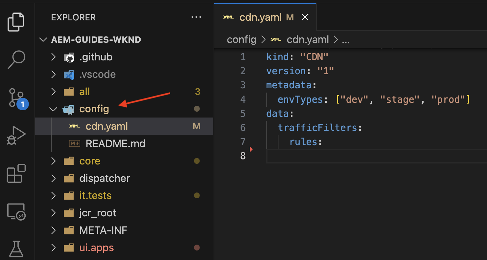
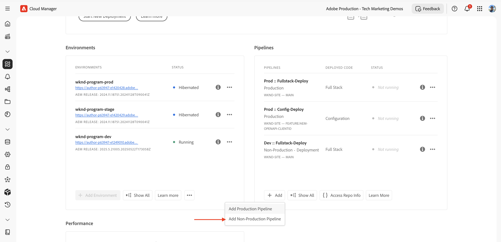
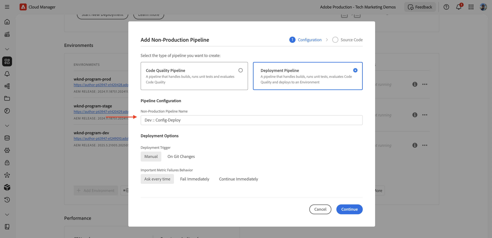
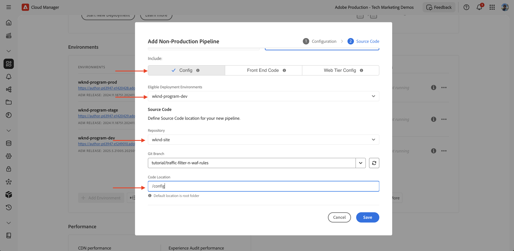
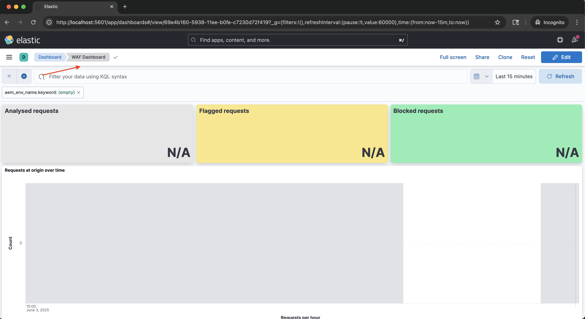
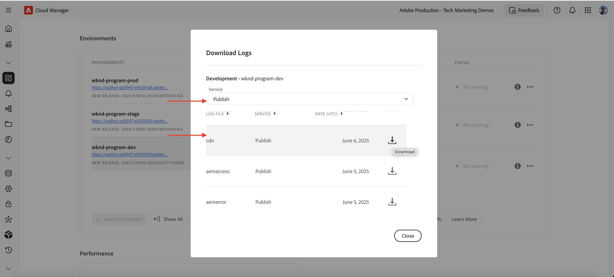
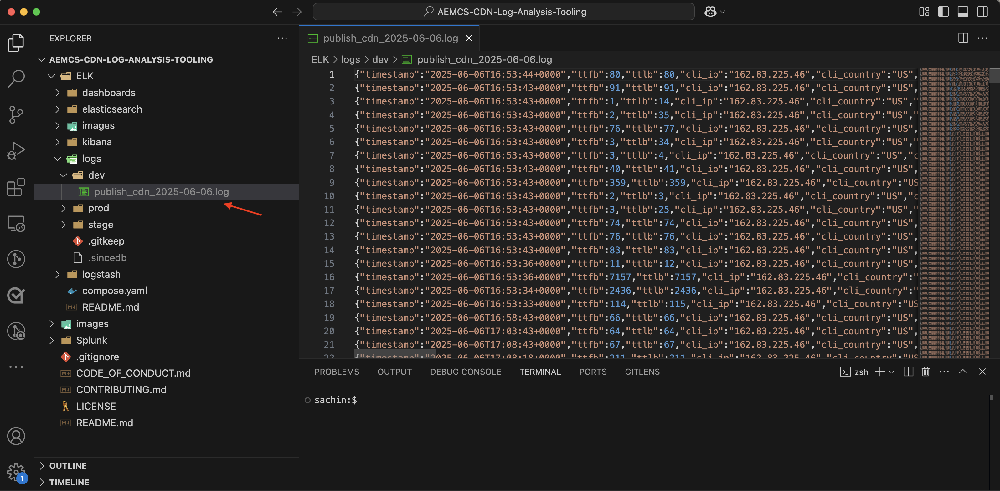
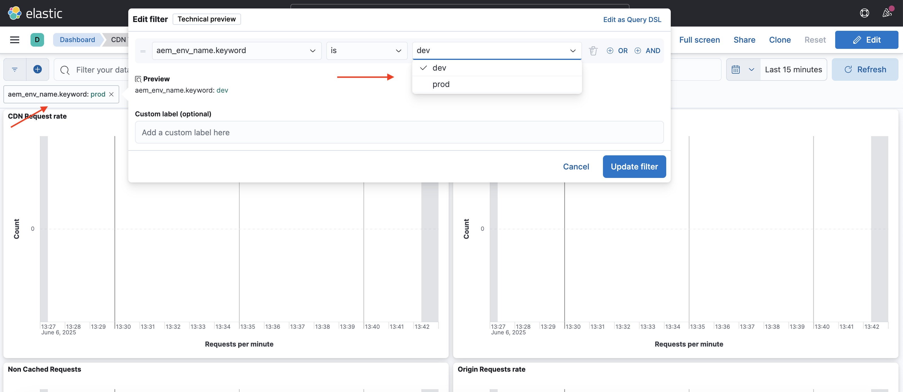
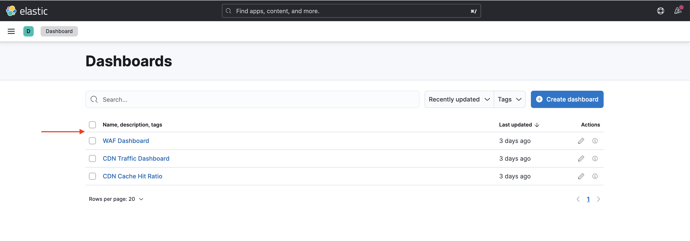

# How to set up traffic filter rules including WAF rules

Learn **how to set up** traffic filter rules including Web Application Firewall (WAF) rules. In this tutorial, we set up the groundwork for subsequent tutorials, where you will configure and deploy rules, followed by testing and analyzing of the results. 

To demonstrate the setup process, the tutorial uses the [AEM WKND Sites Project](https://github.com/adobe/aem-guides-wknd).

## Setup overview

The groundwork for subsequent tutorials involves the following steps:

- _Creating rules_ within your AEM project in the `config` folder
- _Deploying rules_ using the Adobe Cloud Manager config pipeline.
- _Testing rules_ with tools like Curl, Vegeta, and Nikto
- _Analyzing results_ using the AEMCS CDN Log Analysis Tooling

## Create rules in your AEM project

To define the **standard** and **WAF** traffic filter rules within your AEM project, follow these steps:

1. At the top level of your AEM project, create a folder named `config`.

2. Inside the `config` folder, create a file named `cdn.yaml`.

3. Use the following metadata structure in `cdn.yaml`:

```yaml
kind: "CDN"
version: "1"
metadata:
  envTypes: ["dev", "stage", "prod"]
data:
  trafficFilters:
    rules:
```



In the [next tutorial](#next-steps), you learn how to add Adobe's **recommended standard traffic filter and WAF rules** to the above file as a solid foundation for your implementation.

## Deploy rules using Adobe Cloud Manager

In preparation of deploying the rules, follow these steps:

1. Log in to [my.cloudmanager.adobe.com](https://my.cloudmanager.adobe.com/) and select your program.

2. From the **Program Overview** page, go to the **Pipelines** card and click **+Add** to create a new pipeline.

    

3. In the pipeline wizard:

    - **Type**: Deployment Pipeline  
    - **Pipeline Name**: Dev-Config

    

4. Source Code configuration:

    - **Code to deploy**: Targeted deployment  
    - **Include**: Config  
    - **Deployment Environment**: for example, `wknd-program-dev`  
    - **Repository**: Git repo (for example, `wknd-site`)  
    - **Git Branch**: Your working branch  
    - **Code Location**: `/config`

    

5. Review the pipeline configuration and click **Save**.

In the [next tutorial](#next-steps), you learn how to deploy the pipeline to your AEM environment.

## Test rules using tools

To test the effectiveness of your standard traffic filter and WAF rules, you can use various tools to simulate requests and analyze how your rules respond.

Verify that you have the following tools installed on your local machine or follow the instructions to install them:

- [Curl](https://curl.se/): Test request/response flow.
- [Vegeta](https://github.com/tsenart/vegeta): Simulate high request load (DoS testing).
- [Nikto](https://github.com/sullo/nikto/wiki): Scan for vulnerabilities.

You can verify the installation using the following commands:

```shell
# Curl version check
$ curl --version

# Vegeta version check
$ vegeta -version

# Nikto version check
$ cd <PATH-OF-CLONED-REPO>/program
$ ./nikto.pl -Version
```

In the [next tutorial](#next-steps), you learn how to use these tools to simulate high request loads and malicious requests to test the effectiveness of your traffic filter and WAF rules.

## Analyze results 

To prepare for analyzing the results, follow these steps:

1. Install the **AEMCS CDN Log Analysis Tooling** to visualize and analyze the patterns using pre-built dashboards.

2. Perform **CDN logs ingestion** by downloading logs from the Cloud Manager UI. Alternatively, you can forward logs directly to a supported hosted logging destination such as Splunk or Elasticsearch.

### AEMCS CDN Log Analysis Tooling

To analyze the results of your traffic filter and WAF rules, you can use the **AEMCS CDN Log Analysis Tooling**. This tooling provides pre-built dashboards for visualizing CDN traffic and WAF activity by leveraging logs collected from the AEMCS CDN.

AEMCS CDN Log Analysis Tooling supports two observability platforms, **ELK** (Elasticsearch, Logstash, Kibana) and **Splunk**.

It is possible to use the Log Forwarding feature to stream your logs to a hosted ELK or Splunk logging service, where you can install a dashboard  to visualize and analyze the standard traffic filter and WAF traffic filter rules. However, for this tutorial, you will set up the dashboard on a local ELK instance installed on your computer. 

1. Clone the [AEMCS-CDN-Log-Analysis-Tooling](https://github.com/adobe/AEMCS-CDN-Log-Analysis-Tooling) repository.

2. Follow the [ELK Docker container setup guide](https://github.com/adobe/AEMCS-CDN-Log-Analysis-Tooling/blob/main/ELK/README.md) to install and configure the ELK stack locally.

3. Using ELK dashboards, you can explore metrics like IP requests, blocked traffic, URI patterns, and security alerts.

    

>[!NOTE]
> 
> If logs are not yet ingested from AEMCS CDN, the dashboards appear empty.

### CDN logs ingestion

To ingest CDN logs into the ELK stack, follow these steps:

- From [Cloud Manager](https://my.cloudmanager.adobe.com/)'s **Environments** card, download the AEMCS **Publish** service's CDN logs.

    

    >[!TIP]
    >
    > It may take up to 5 minutes for the new requests to appear in the CDN logs.

- Copy the downloaded log file (for example, `publish_cdn_2025-06-06.log` in the screenshot below) into the `logs/dev` folder of the Elastic dashboard tool project.

    {width="800" zoomable="yes"}

- Refresh the Elastic dashboard tool page.
  - In the top **Global filter** section, edit the `aem_env_name.keyword` filter and select the `dev` environment value.

      

  - To change the time interval, click the calendar icon in the top-right corner and select the desired time interval.

- In the [next tutorial](#next-steps), you learn how to analyze the results of the standard traffic filter and WAF traffic filter rules using the pre-built dashboards in the ELK stack.

    

## Summary

You have successfully set up the groundwork for implementing traffic filter rules including WAF rules in AEM as a Cloud Service. You created a configuration file structure, pipeline for deployment, and prepared tools for testing and analyzing the results.

## Next steps

Learn how to implement the Adobe recommended rules using the following tutorials:

<!-- CARDS
{target = _self}

* ./use-cases/using-traffic-filter-rules.md
  {title = Protecting AEM websites using standard traffic filter rules}
  {description = Learn how to protect AEM websites from DoS, DDoS and bot abuse using Adobe-recommended standard traffic filter rules in AEM as a Cloud Service.}
  {image = ./assets/use-cases/using-traffic-filter-rules.png}
  {cta = Apply Rules}

* ./use-cases/using-waf-rules.md
  {title = Protecting AEM websites using WAF traffic filter rules}
  {description = Learn how to protect AEM websites from sophisticated threats including DoS, DDoS, and bot abuse using Adobe-recommended Web Application Firewall (WAF) traffic filter rules in AEM as a Cloud Service.}
  {image = ./assets/use-cases/using-waf-rules.png}
  {cta = Activate WAF}
-->
<!-- START CARDS HTML - DO NOT MODIFY BY HAND -->
<div class="columns">
    <div class="column is-half-tablet is-half-desktop is-one-third-widescreen" aria-label="Protecting AEM websites using standard traffic filter rules">
        <div class="card" style="height: 100%; display: flex; flex-direction: column; height: 100%;">
            <div class="card-image">
                <figure class="image x-is-16by9">
                    <a href="./use-cases/using-traffic-filter-rules.md" title="Protecting AEM websites using standard traffic filter rules" target="_self" rel="referrer">
                        
                    </a>
                </figure>
            </div>
            <div class="card-content is-padded-small" style="display: flex; flex-direction: column; flex-grow: 1; justify-content: space-between;">
                <div class="top-card-content">
                    <p class="headline is-size-6 has-text-weight-bold">
                        <a href="./use-cases/using-traffic-filter-rules.md" target="_self" rel="referrer" title="Protecting AEM websites using standard traffic filter rules">Protecting AEM websites using standard traffic filter rules</a>
                    </p>
                    <p class="is-size-6">Learn how to protect AEM websites from DoS, DDoS and bot abuse using Adobe-recommended standard traffic filter rules in AEM as a Cloud Service.</p>
                </div>
                <a href="./use-cases/using-traffic-filter-rules.md" target="_self" rel="referrer" class="spectrum-Button spectrum-Button--outline spectrum-Button--primary spectrum-Button--sizeM" style="align-self: flex-start; margin-top: 1rem;">
                    <span class="spectrum-Button-label has-no-wrap has-text-weight-bold">Apply Rules</span>
                </a>
            </div>
        </div>
    </div>
    <div class="column is-half-tablet is-half-desktop is-one-third-widescreen" aria-label="Protecting AEM websites using WAF traffic filter rules">
        <div class="card" style="height: 100%; display: flex; flex-direction: column; height: 100%;">
            <div class="card-image">
                <figure class="image x-is-16by9">
                    <a href="./use-cases/using-waf-rules.md" title="Protecting AEM websites using WAF traffic filter rules" target="_self" rel="referrer">
                        
                    </a>
                </figure>
            </div>
            <div class="card-content is-padded-small" style="display: flex; flex-direction: column; flex-grow: 1; justify-content: space-between;">
                <div class="top-card-content">
                    <p class="headline is-size-6 has-text-weight-bold">
                        <a href="./use-cases/using-waf-rules.md" target="_self" rel="referrer" title="Protecting AEM websites using WAF traffic filter rules">Protecting AEM websites using WAF traffic filter rules</a>
                    </p>
                    <p class="is-size-6">Learn how to protect AEM websites from sophisticated threats including DoS, DDoS, and bot abuse using Adobe-recommended Web Application Firewall (WAF) traffic filter rules in AEM as a Cloud Service.</p>
                </div>
                <a href="./use-cases/using-waf-rules.md" target="_self" rel="referrer" class="spectrum-Button spectrum-Button--outline spectrum-Button--primary spectrum-Button--sizeM" style="align-self: flex-start; margin-top: 1rem;">
                    <span class="spectrum-Button-label has-no-wrap has-text-weight-bold">Activate WAF</span>
                </a>
            </div>
        </div>
    </div>
</div>
<!-- END CARDS HTML - DO NOT MODIFY BY HAND -->

## Advanced use cases

Beyond the Adobe-recommended standard traffic filter and WAF rules, you can implement advanced scenarios to achieve specific business requirements. These scenarios include:

<!-- CARDS
{target = _self}

* ./how-to/request-logging.md

* ./how-to/request-blocking.md

* ./how-to/request-transformation.md
-->
<!-- START CARDS HTML - DO NOT MODIFY BY HAND -->
<div class="columns">
    <div class="column is-half-tablet is-half-desktop is-one-third-widescreen" aria-label="Monitoring sensitive requests">
        <div class="card" style="height: 100%; display: flex; flex-direction: column; height: 100%;">
            <div class="card-image">
                <figure class="image x-is-16by9">
                    <a href="./how-to/request-logging.md" title="Monitoring sensitive requests" target="_self" rel="referrer">
                        
                    </a>
                </figure>
            </div>
            <div class="card-content is-padded-small" style="display: flex; flex-direction: column; flex-grow: 1; justify-content: space-between;">
                <div class="top-card-content">
                    <p class="headline is-size-6 has-text-weight-bold">
                        <a href="./how-to/request-logging.md" target="_self" rel="referrer" title="Monitoring sensitive requests">Monitoring sensitive requests</a>
                    </p>
                    <p class="is-size-6">Learn how to monitor sensitive requests by logging them using traffic filter rules in AEM as a Cloud Service.</p>
                </div>
                <a href="./how-to/request-logging.md" target="_self" rel="referrer" class="spectrum-Button spectrum-Button--outline spectrum-Button--primary spectrum-Button--sizeM" style="align-self: flex-start; margin-top: 1rem;">
                    <span class="spectrum-Button-label has-no-wrap has-text-weight-bold">Learn more</span>
                </a>
            </div>
        </div>
    </div>
    <div class="column is-half-tablet is-half-desktop is-one-third-widescreen" aria-label="Restricting access">
        <div class="card" style="height: 100%; display: flex; flex-direction: column; height: 100%;">
            <div class="card-image">
                <figure class="image x-is-16by9">
                    <a href="./how-to/request-blocking.md" title="Restricting access" target="_self" rel="referrer">
                        
                    </a>
                </figure>
            </div>
            <div class="card-content is-padded-small" style="display: flex; flex-direction: column; flex-grow: 1; justify-content: space-between;">
                <div class="top-card-content">
                    <p class="headline is-size-6 has-text-weight-bold">
                        <a href="./how-to/request-blocking.md" target="_self" rel="referrer" title="Restricting access">Restricting access</a>
                    </p>
                    <p class="is-size-6">Learn how to restrict access by blocking specific requests using traffic filter rules in AEM as a Cloud Service.</p>
                </div>
                <a href="./how-to/request-blocking.md" target="_self" rel="referrer" class="spectrum-Button spectrum-Button--outline spectrum-Button--primary spectrum-Button--sizeM" style="align-self: flex-start; margin-top: 1rem;">
                    <span class="spectrum-Button-label has-no-wrap has-text-weight-bold">Learn more</span>
                </a>
            </div>
        </div>
    </div>
    <div class="column is-half-tablet is-half-desktop is-one-third-widescreen" aria-label="Normalizing requests">
        <div class="card" style="height: 100%; display: flex; flex-direction: column; height: 100%;">
            <div class="card-image">
                <figure class="image x-is-16by9">
                    <a href="./how-to/request-transformation.md" title="Normalizing requests" target="_self" rel="referrer">
                        
                    </a>
                </figure>
            </div>
            <div class="card-content is-padded-small" style="display: flex; flex-direction: column; flex-grow: 1; justify-content: space-between;">
                <div class="top-card-content">
                    <p class="headline is-size-6 has-text-weight-bold">
                        <a href="./how-to/request-transformation.md" target="_self" rel="referrer" title="Normalizing requests">Normalizing requests</a>
                    </p>
                    <p class="is-size-6">Learn how to normalize requests by transforming them using traffic filter rules in AEM as a Cloud Service.</p>
                </div>
                <a href="./how-to/request-transformation.md" target="_self" rel="referrer" class="spectrum-Button spectrum-Button--outline spectrum-Button--primary spectrum-Button--sizeM" style="align-self: flex-start; margin-top: 1rem;">
                    <span class="spectrum-Button-label has-no-wrap has-text-weight-bold">Learn more</span>
                </a>
            </div>
        </div>
    </div>
</div>
<!-- END CARDS HTML - DO NOT MODIFY BY HAND -->

## Additional resources

- [Traffic Filter Rules Including WAF Rules](https://experienceleague.adobe.com/en/docs/experience-manager-cloud-service/content/security/traffic-filter-rules-including-waf)