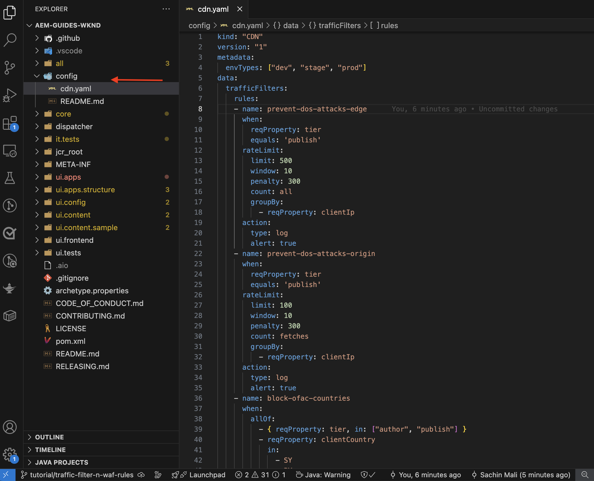
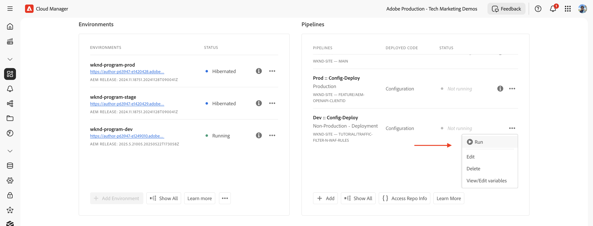
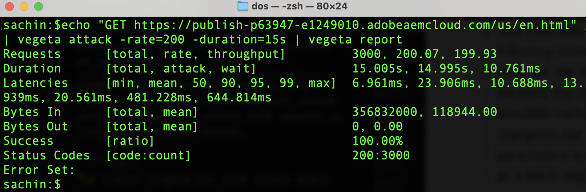
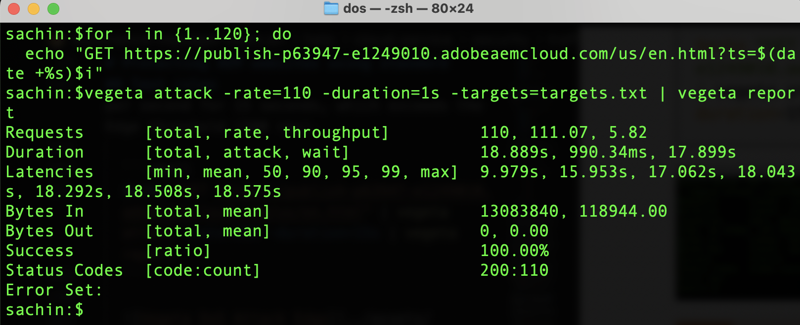
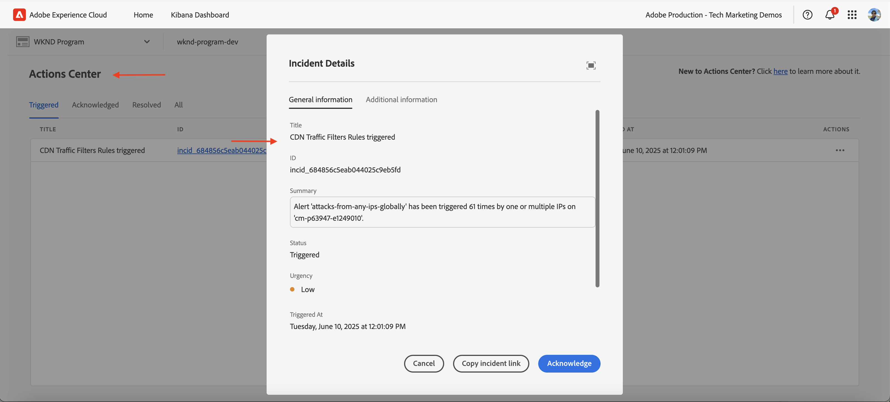
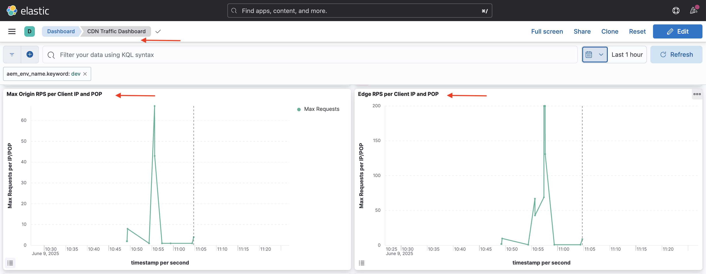
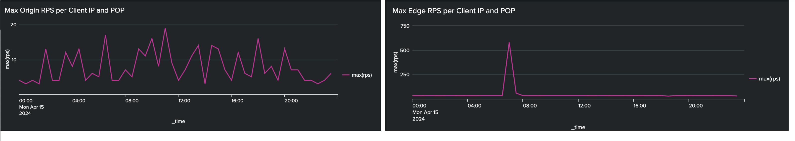

# Protecting AEM websites using standard traffic filter rules

Learn how to protect AEM websites from Denial of Service (DoS), Distributed Denial of Service (DDoS), and bot abuse using _Adobe-recommended_ **standard traffic filter rules** in AEM as a Cloud Service.


>[!VIDEO](https://video.tv.adobe.com/v/3469395/?quality=12&learn=on)

## Learning objectives

- Review the Adobe-recommended standard traffic filter rules.
- Define, deploy, test, and analyze the results of the rules.
- Understand when and how to refine the rules based on traffic patterns.
- Learn how to use the AEM Actions Center to review alerts generated by the rules.

### Implementation overview

The implementation steps include:

- Adding the standard traffic filter rules to the AEM WKND project's `/config/cdn.yaml` file.
- Committing and pushing the changes to the Cloud Manager Git repository.
- Deploying the changes to the AEM environment using the Cloud Manager config pipeline.
- Testing the rules by simulating DoS attack using [Vegeta](https://github.com/tsenart/vegeta)
- Analyzing the results using the AEMCS CDN logs and the ELK dashboard tool.

## Prerequisites

Before proceeding, ensure you've completed the required groundwork as described in the [How to set up traffic filter and WAF rules](../setup.md) tutorial. Also, you have cloned and deployed the [AEM WKND Sites Project](https://github.com/adobe/aem-guides-wknd) to your AEM environment.

## Key actions of the rules

Before we dive into the details of the standard traffic filter rules, let's understand the key actions that these rules perform. The `action` attribute in each rule defines how the traffic filter should respond when the conditions are met. The actions include:

- **Log**: The rules log the events for monitoring and analysis, allowing you to review traffic patterns and adjust thresholds as needed. It is specified by the `type: log` attribute.

- **Alert**: The rules trigger alerts when the conditions are met, helping you to identify potential issues. It is specified by the `alert: true` attribute.

- **Block**: The rules block the traffic when the conditions are met, preventing access to your AEM site. It is specified by the `action: block` attribute.

## Review and define rules

Adobe-recommended standard traffic filter rules serve as a foundational layer for identifying potentially malicious traffic patterns by logging events like IP-based rate limits being exceeded, and block traffic from specific countries. These logs help teams validate thresholds and make informed decisions for ultimately **transitioning to block-mode** rules without disrupting legitimate traffic.

Let's review the three standard traffic filter rules that you should add to the AEM WKND project's `/config/cdn.yaml` file:

- **Prevent DoS at the Edge**: This rule detects potential Denial of Service (DoS) attacks at the CDN edge by monitoring requests per second (RPS) from client IPs.
- **Prevent DoS at the Origin**: This rule detects potential Denial of Service (DoS) attacks at the origin by monitoring fetch requests from client IPs.
- **Block OFAC Countries**: This rule blocks access from specific countries that fall under OFAC (Office of Foreign Assets Control) restrictions.

### 1. Prevent DoS at the Edge

This rule **sends an alert** when it detects a potential Denial of Service (DoS) attack at the CDN. The criteria for triggering this rule is when a client exceeds **500 requests per second** (averaged over 10 seconds) per CDN POP (Point of Presence) at the edge.

It counts **all** requests and groups them by client IP.

```yaml
kind: "CDN"
version: "1"
metadata:
  envTypes: ["dev", "stage", "prod"]
data:
  trafficFilters:
    rules:
    - name: prevent-dos-attacks-edge
      when:
        reqProperty: tier
        equals: 'publish'
      rateLimit:
        limit: 500
        window: 10
        penalty: 300
        count: all
        groupBy:
          - reqProperty: clientIp
      action:
        type: log
        alert: true
```

The `action` attribute specifies that the rule should log the events and trigger an alert when the conditions are met. Thus, it helps you monitor potential DoS attacks without blocking legitimate traffic. However, your goal is to eventually transition this rule to block-mode once you have validated the traffic patterns and adjusted the thresholds.

### 2. Prevent DoS at the Origin

This rule **sends an alert** when it detects a potential Denial of Service (DoS) attack at the origin. The criteria for triggering this rule is when a client exceeds **100 requests per second** (averaged over 10 seconds) per client IP at the origin.

It counts **fetches** (cache-bypassing requests) and groups them by client IP.

```yaml
...
    - name: prevent-dos-attacks-origin
      when:
        reqProperty: tier
        equals: 'publish'
      rateLimit:
        limit: 100
        window: 10
        penalty: 300
        count: fetches
        groupBy:
          - reqProperty: clientIp
      action:
        type: log
        alert: true
```

The `action` attribute specifies that the rule should log the events and trigger an alert when the conditions are met. Thus, it helps you monitor potential DoS attacks without blocking legitimate traffic. However, your goal is to eventually transition this rule to block-mode once you have validated the traffic patterns and adjusted the thresholds.

### 3. Block OFAC Countries

This rule blocks access from specific countries that fall under [OFAC](https://ofac.treasury.gov/sanctions-programs-and-country-information) restrictions.
You can review and modify the country list as needed.

```yaml
...
    - name: block-ofac-countries
      when:
        allOf:
          - { reqProperty: tier, in: ["author", "publish"] }
          - reqProperty: clientCountry
            in:
              - SY
              - BY
              - MM
              - KP
              - IQ
              - CD
              - SD
              - IR
              - LR
              - ZW
              - CU
              - CI
      action: block
```

The `action` attribute specifies that the rule should block access from the specified countries. This helps you prevent access to your AEM site from regions that may pose security risks.

The complete `cdn.yaml` file with the above rules looks like this:



## Deploy rules

To deploy the above rules, follow these steps:

- Commit and push the changes to the Cloud Manager Git repository.

- Deploy the changes to the AEM environment using the Cloud Manager config pipeline [created earlier](../setup.md#deploy-rules-using-adobe-cloud-manager).

    

## Test rules

To verify the effectiveness of the standard traffic filter rules, at both the **CDN Edge** and the **Origin**, simulate high request traffic using [Vegeta](https://github.com/tsenart/vegeta), a versatile HTTP load testing tool.

- Test DoS Rule at the Edge (500 rps limit). The following command simulates 200 requests per second for 15 seconds, which exceeds the Edge threshold (500 rps).

  ```shell
  $echo "GET https://publish-p63947-e1249010.adobeaemcloud.com/us/en.html" | vegeta attack -rate=200 -duration=15s | vegeta report
  ```

  

  >[!IMPORTANT]
  >
  >  Notice the *100%* Success and _200_ Status codes in the above report. As rules are set to `log` and `alert`, the requests are _not blocked_ but they are logged for monitoring and analysis and alerting purposes.

- Test DoS Rule at the Origin (100 rps limit). The following command simulates 110 fetch requests per second for 1 second, which exceeds the Origin threshold (100 rps). To simulate cache-bypassing requests, the `targets.txt` file is created with unique query parameters to ensure that each request is treated as a fetch request.

  ```shell
  # Create targets.txt with unique query parameters
  $for i in {1..110}; do
    echo "GET https://publish-p63947-e1249010.adobeaemcloud.com/us/en.html?ts=$(date +%s)$i"
  done > targets.txt

  # Use the targets.txt file to simulate fetch requests
  $vegeta attack -rate=110 -duration=1s -targets=targets.txt | vegeta report
  ```
  
  

  >[!IMPORTANT]
  >
  >  Notice the *100%* Success and _200_ Status codes in the above report. As rules are set to `log` and `alert`, the requests are _not blocked_ but they are logged for monitoring and analysis and alerting purposes.

- For simplicity purposes, the OFAC rule is not tested here.

## Review alerts

Alerts are generated when the traffic filter rules are triggered. You can review these alerts in the [AEM Actions Center](https://experience.adobe.com/aem/actions-center).

  

## Analyze results

To analyze the results of the traffic filter rules, you can use the AEMCS CDN logs and the ELK dashboard tool. Follow the instructions from the [CDN logs ingestion](../setup.md#ingest-cdn-logs) set-up section to ingest the CDN logs into the ELK stack.

In the following screenshot, you can see the AEM Dev environment's CDN logs ingested into the ELK stack. 


Inside the ELK application, the **CDN Traffic Dashboard** should show the spike at the **Edge** and **Origin** during the simulated DoS attacks.

The two panels, _Edge RPS per Client IP and POP_ and _Origin RPS per Client IP and POP_, display the requests per second (RPS) at the edge and origin respectively, grouped by client IP and Point of Presence (POP).

  

You can also use other panels in the CDN Traffic Dashboard to analyze the traffic patterns, such as _Top Client IPs_, _Top Countries_, and _Top User Agents_. These panels help you identify potential threats and adjust your traffic filter rules accordingly.

### Splunk integration

Customers who have [Splunk Log forwarding enabled](https://experienceleague.adobe.com/en/docs/experience-manager-cloud-service/content/implementing/developing/logging#splunk-logs) can create new dashboards to analyze the traffic patterns.

To create dashboards in Splunk, follow [Splunk dashboards for AEMCS CDN Log Analysis](https://github.com/adobe/AEMCS-CDN-Log-Analysis-Tooling/blob/main/Splunk/README.md#splunk-dashboards-for-aemcs-cdn-log-analysis) steps.

The following screenshot shows an example of a Splunk dashboard that displays the maximum origin and edge requests per IP, which can help you identify potential DoS attacks.



## When and how to refine rules

Your goal is to avoid blocking legitimate traffic while still protecting your AEM site from potential threats. The standard traffic filter rules are designed to alert and log (and eventually block when the mode is switched) threats without blocking legitimate traffic.

To refine the rules, consider the following steps:

- **Monitor traffic patterns**: Use the CDN logs and ELK dashboard to monitor traffic patterns and identify any anomalies or spikes in traffic.
- **Adjust thresholds**: Based on the traffic patterns, adjust the thresholds (increase or decrease the rate limits) in the rules to better suit your specific requirements. For example, if you notice that legitimate traffic triggered the alerts, you can increase the rate limits or adjust the groupings. 
The following table provides guidance on how to choose the threshold values:

    | Variation  | Value     |
    | :--------- | :------- |
    | Origin    | Take the highest value of the Max Origin Requests per IP/POP under **normal** traffic conditions (that is, not the rate at the time of a DDoS) and increase it by a multiple |
    | Edge    | Take the highest value of the Max Edge Requests per IP/POP under **normal** traffic conditions (that is, not the rate at the time of a DDoS) and increase it by a multiple |
    
    Also see the [Choosing threshold values](../../blocking-dos-attack-using-traffic-filter-rules.md#choosing-threshold-values) section for more details.

- **Move to blocking rules**: Once you have validated the traffic patterns and adjusted the thresholds, you should transition the rules to block-mode.

## Summary

In this tutorial, you learned how to protect AEM websites from Denial of Service (DoS), Distributed Denial of Service (DDoS), and bot abuse using Adobe-recommended standard traffic filter rules in AEM as a Cloud Service.

## Recommended WAF rules

Learn how to implement Adobe recommended WAF rules to protect your AEM websites from sophisticated threats that use advanced techniques to bypass traditional security measures.

<!-- CARDS
{target = _self}

* ./using-waf-rules.md
  {title = Protecting AEM websites using WAF traffic filter rules}
  {description = Learn how to protect AEM websites from sophisticated threats including DoS, DDoS, and bot abuse using Adobe-recommended Web Application Firewall (WAF) traffic filter rules in AEM as a Cloud Service.}
  {image = ../assets/use-cases/using-waf-rules.png}
  {cta = Activate WAF}
-->
<!-- START CARDS HTML - DO NOT MODIFY BY HAND -->
<div class="columns">
    <div class="column is-half-tablet is-half-desktop is-one-third-widescreen" aria-label="Protecting AEM websites using WAF traffic filter rules">
        <div class="card" style="height: 100%; display: flex; flex-direction: column; height: 100%;">
            <div class="card-image">
                <figure class="image x-is-16by9">
                    <a href="./using-waf-rules.md" title="Protecting AEM websites using WAF traffic filter rules" target="_self" rel="referrer">
                        
                    </a>
                </figure>
            </div>
            <div class="card-content is-padded-small" style="display: flex; flex-direction: column; flex-grow: 1; justify-content: space-between;">
                <div class="top-card-content">
                    <p class="headline is-size-6 has-text-weight-bold">
                        <a href="./using-waf-rules.md" target="_self" rel="referrer" title="Protecting AEM websites using WAF traffic filter rules">Protecting AEM websites using WAF traffic filter rules</a>
                    </p>
                    <p class="is-size-6">Learn how to protect AEM websites from sophisticated threats including DoS, DDoS, and bot abuse using Adobe-recommended Web Application Firewall (WAF) traffic filter rules in AEM as a Cloud Service.</p>
                </div>
                <a href="./using-waf-rules.md" target="_self" rel="referrer" class="spectrum-Button spectrum-Button--outline spectrum-Button--primary spectrum-Button--sizeM" style="align-self: flex-start; margin-top: 1rem;">
                    <span class="spectrum-Button-label has-no-wrap has-text-weight-bold">Activate WAF</span>
                </a>
            </div>
        </div>
    </div>
</div>
<!-- END CARDS HTML - DO NOT MODIFY BY HAND -->


## Use cases - beyond standard rules

For more advanced scenarios, you can explore the following use cases that demonstrate how to implement custom traffic filter rules based on specific business requirements:

<!-- CARDS
{target = _self}

* ../how-to/request-logging.md

* ../how-to/request-blocking.md

* ../how-to/request-transformation.md
-->
<!-- START CARDS HTML - DO NOT MODIFY BY HAND -->
<div class="columns">
    <div class="column is-half-tablet is-half-desktop is-one-third-widescreen" aria-label="Monitoring sensitive requests">
        <div class="card" style="height: 100%; display: flex; flex-direction: column; height: 100%;">
            <div class="card-image">
                <figure class="image x-is-16by9">
                    <a href="../how-to/request-logging.md" title="Monitoring sensitive requests" target="_self" rel="referrer">
                        
                    </a>
                </figure>
            </div>
            <div class="card-content is-padded-small" style="display: flex; flex-direction: column; flex-grow: 1; justify-content: space-between;">
                <div class="top-card-content">
                    <p class="headline is-size-6 has-text-weight-bold">
                        <a href="../how-to/request-logging.md" target="_self" rel="referrer" title="Monitoring sensitive requests">Monitoring sensitive requests</a>
                    </p>
                    <p class="is-size-6">Learn how to monitoring sensitive requests by logging them using traffic filter rules in AEM as a Cloud Service.</p>
                </div>
                <a href="../how-to/request-logging.md" target="_self" rel="referrer" class="spectrum-Button spectrum-Button--outline spectrum-Button--primary spectrum-Button--sizeM" style="align-self: flex-start; margin-top: 1rem;">
                    <span class="spectrum-Button-label has-no-wrap has-text-weight-bold">Learn more</span>
                </a>
            </div>
        </div>
    </div>
    <div class="column is-half-tablet is-half-desktop is-one-third-widescreen" aria-label="Restricting access">
        <div class="card" style="height: 100%; display: flex; flex-direction: column; height: 100%;">
            <div class="card-image">
                <figure class="image x-is-16by9">
                    <a href="../how-to/request-blocking.md" title="Restricting access" target="_self" rel="referrer">
                        
                    </a>
                </figure>
            </div>
            <div class="card-content is-padded-small" style="display: flex; flex-direction: column; flex-grow: 1; justify-content: space-between;">
                <div class="top-card-content">
                    <p class="headline is-size-6 has-text-weight-bold">
                        <a href="../how-to/request-blocking.md" target="_self" rel="referrer" title="Restricting access">Restricting access</a>
                    </p>
                    <p class="is-size-6">Learn how to restrict access by blocking specific requests using traffic filter rules in AEM as a Cloud Service.</p>
                </div>
                <a href="../how-to/request-blocking.md" target="_self" rel="referrer" class="spectrum-Button spectrum-Button--outline spectrum-Button--primary spectrum-Button--sizeM" style="align-self: flex-start; margin-top: 1rem;">
                    <span class="spectrum-Button-label has-no-wrap has-text-weight-bold">Learn more</span>
                </a>
            </div>
        </div>
    </div>
    <div class="column is-half-tablet is-half-desktop is-one-third-widescreen" aria-label="Normalizing requests">
        <div class="card" style="height: 100%; display: flex; flex-direction: column; height: 100%;">
            <div class="card-image">
                <figure class="image x-is-16by9">
                    <a href="../how-to/request-transformation.md" title="Normalizing requests" target="_self" rel="referrer">
                        
                    </a>
                </figure>
            </div>
            <div class="card-content is-padded-small" style="display: flex; flex-direction: column; flex-grow: 1; justify-content: space-between;">
                <div class="top-card-content">
                    <p class="headline is-size-6 has-text-weight-bold">
                        <a href="../how-to/request-transformation.md" target="_self" rel="referrer" title="Normalizing requests">Normalizing requests</a>
                    </p>
                    <p class="is-size-6">Learn how to normalize requests by transforming them using traffic filter rules in AEM as a Cloud Service.</p>
                </div>
                <a href="../how-to/request-transformation.md" target="_self" rel="referrer" class="spectrum-Button spectrum-Button--outline spectrum-Button--primary spectrum-Button--sizeM" style="align-self: flex-start; margin-top: 1rem;">
                    <span class="spectrum-Button-label has-no-wrap has-text-weight-bold">Learn more</span>
                </a>
            </div>
        </div>
    </div>
</div>
<!-- END CARDS HTML - DO NOT MODIFY BY HAND -->


## Additional resources

- [Recommended starter rules](https://experienceleague.adobe.com/en/docs/experience-manager-cloud-service/content/security/traffic-filter-rules-including-waf#recommended-starter-rules)
