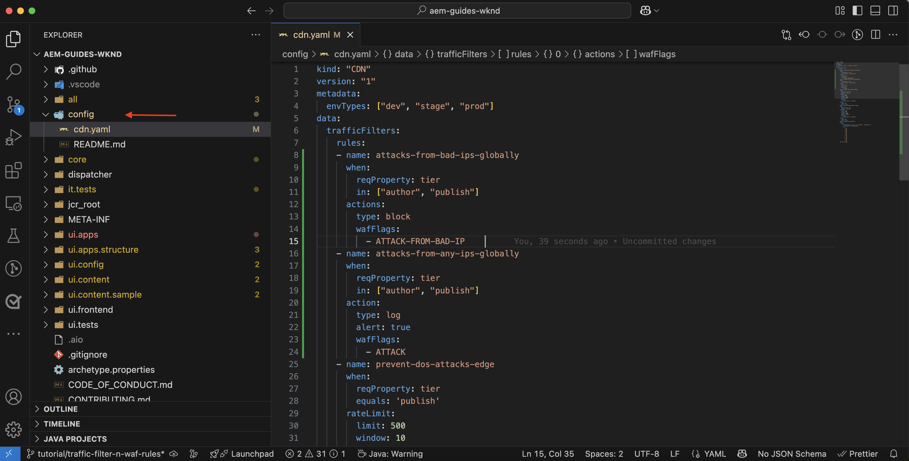
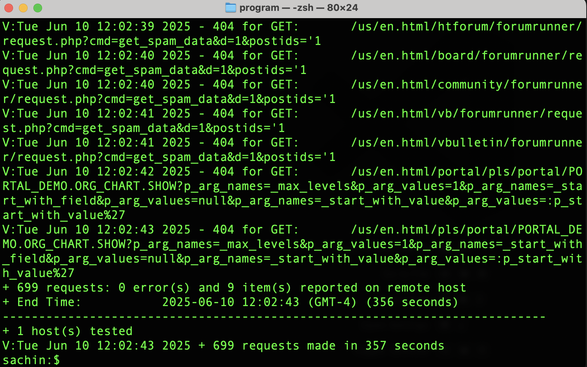
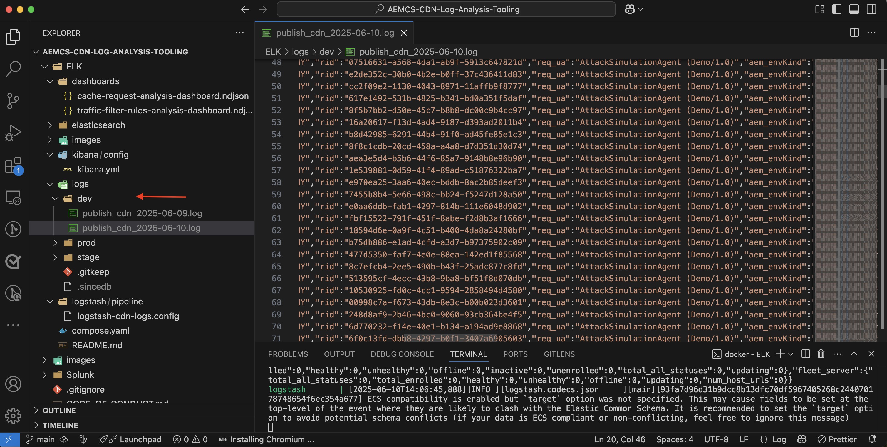
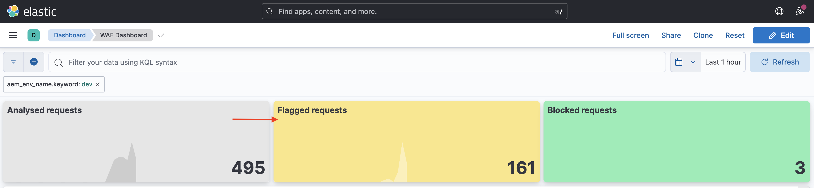
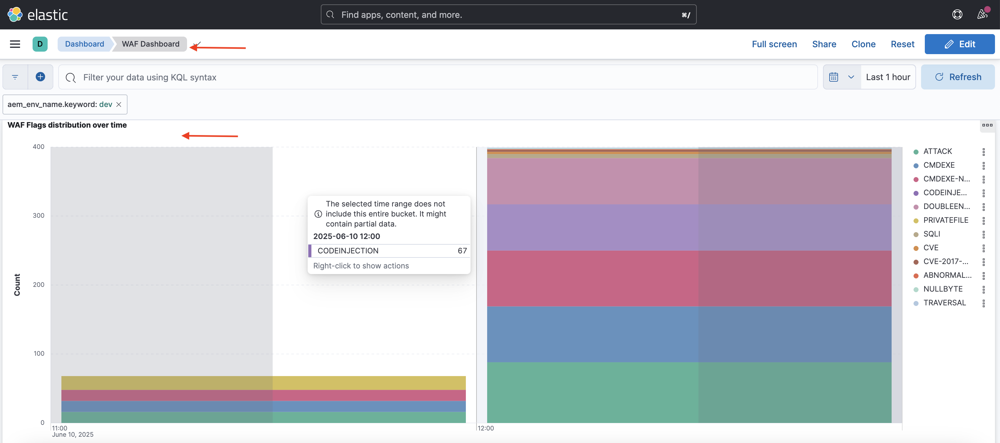
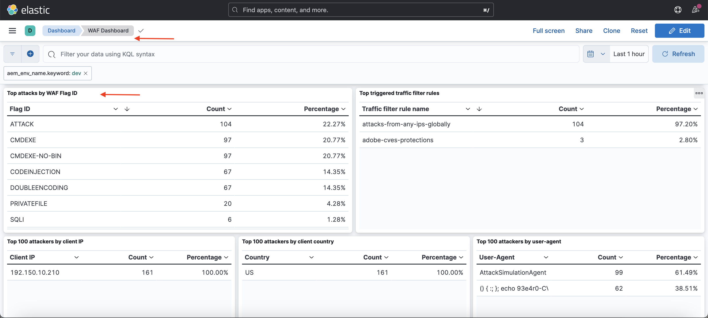
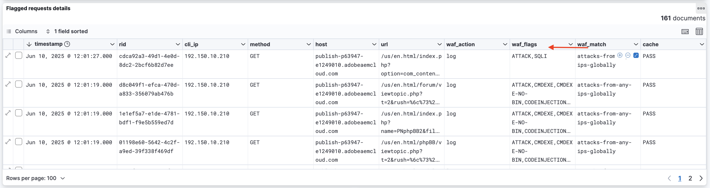

# Protecting AEM websites using WAF rules

Learn how to protect AEM websites from sophisticated threats including DoS, DDoS, and bot abuse using _Adobe-recommended_ **Web Application Firewall (WAF) rules** in AEM as a Cloud Service.

The sophisticated attacks are characterized by high request rates, complex patterns, and the use of advanced techniques to bypass traditional security measures.

>[!IMPORTANT]
>
> WAF traffic filter rules require an additional Extended Security (formerly named WAF-DDoS Protection) or Extended Security for Healthcare (formerly named Enhanced Security) license. Standard traffic filter rules are available to Sites and Forms customers by default.


>[!VIDEO](https://video.tv.adobe.com/v/3469397/?quality=12&learn=on)

## Learning objectives

- Review the Adobe-recommended WAF rules.
- Define, deploy, test, and analyze the results of the rules.
- Understand when and how to refine the rules based on the results.
- Learn how to use the AEM Actions Center to review alerts generated by the rules.

### Implementation overview

The implementation steps include:

- Adding the WAF rules to the AEM WKND project's `/config/cdn.yaml` file.
- Committing and pushing the changes to the Cloud Manager Git repository.
- Deploying the changes to the AEM environment using the Cloud Manager config pipeline.
- Testing the rules by simulating a DDoS attack using [Nikto](https://github.com/sullo/nikto/wiki).
- Analyzing the results using the AEMCS CDN logs and the ELK dashboard tool.

## Prerequisites

Before proceeding, ensure you've completed the required setup as described in the [How to set up traffic filter and WAF rules](../setup.md) tutorial. Also, you have cloned and deployed the [AEM WKND Sites Project](https://github.com/adobe/aem-guides-wknd) to your AEM environment.

## Review and define rules

Adobe-recommended Web Application Firewall (WAF) rules are essential for protecting AEM websites from sophisticated threats, including DoS, DDoS, and bot abuse. The sophisticated attacks are often characterized by high request rates, complex patterns, and the use of advanced techniques (protocol-based or payload-based attacks) to bypass traditional security measures.

Let's review three recommended WAF rules that should be added to the `cdn.yaml` file in the AEM WKND project:

### 1. Block attacks from known malicious IPs

This rule **blocks** requests that both look suspicious *and* originate from IP addresses that are flagged as malicious. Because both of these criteria are met, we can be confident that the risk of false positives (blocking legitimate traffic) is very low. The known bad IPs are identified based on threat intelligence feeds and other sources. 

The `ATTACK-FROM-BAD-IP` WAF flag is used to identify these requests. It aggregates several of the WAF flags [listed here](https://experienceleague.adobe.com/en/docs/experience-manager-cloud-service/content/security/traffic-filter-rules-including-waf#waf-flags-list).

```yaml
kind: "CDN"
version: "1"
metadata:
  envTypes: ["dev", "stage", "prod"]
data:
  trafficFilters:
    rules:
    - name: attacks-from-bad-ips-globally
      when:
        reqProperty: tier
        in: ["author", "publish"]
      action:
        type: block
        wafFlags:
          - ATTACK-FROM-BAD-IP
```

### 2. Log (and later block) attacks from any IP globally

This rule **logs** requests identified as potential attacks, even if the IP addresses aren't found in threat intelligence feeds.

The `ATTACK` WAF flag is used to identify these requests. Similar to the `ATTACK-FROM-BAD-IP`, it   aggregates several WAF flags.

These requests are likely malicious, but since the IP addresses are not identified in threat intelligence feeds, it can be prudent to start in `log` mode rather than block mode. Analyze the logs for false positives, and once validated, **make sure to switch the rule to `block` mode**.

```yaml
...
    - name: attacks-from-any-ips-globally
      when:
        reqProperty: tier
        in: ["author", "publish"]
      action:
        type: log
        alert: true
        wafFlags:
          - ATTACK
```            

Alternatively, you may choose to use `block` mode immediately, if your business requirements are such that you do not want to take any chance of allowing malicous traffic.

These recommended WAF rules provide an additional layer of security against known and emerging threats.



## Migrating to most recent Adobe-recommended WAF rules

Prior to the introduction of the `ATTACK-FROM-BAD-IP` and `ATTACK` WAF flags (in July 2025), the recommended WAF rules were as follows. They contained a list of specific WAF flags to block requests that matched certain criteria, such as `SANS`, `TORNODE`, `NOUA`, etc.

```yaml
...
data:
  trafficFilters:
    rules:
    ...
    # Enable WAF protections (only works if WAF is enabled for your environment)
      - name: block-waf-flags
        when:
          reqProperty: tier
          matches: "author|publish"
        action:
          type: block
          wafFlags:
            - SANS
            - TORNODE
            - NOUA
            - SCANNER
            - USERAGENT
            - PRIVATEFILE
            - ABNORMALPATH
            - TRAVERSAL
            - NULLBYTE
            - BACKDOOR
            - LOG4J-JNDI
            - SQLI
            - XSS
            - CODEINJECTION
            - CMDEXE
            - NO-CONTENT-TYPE
            - UTF8
...
```

The above rule is still valid, but it is recommended to migrate to the new rules that use the `ATTACK-FROM-BAD-IP` and `ATTACK` WAF flags _provided you have not already customized the `wafFlags` to suit your business requirements_.

You may migrate to the new rules to be consistent with the best practices by following these steps:

- Review the existing WAF rules in your `cdn.yaml` file, which may look similar to the example above. Confirm there is no customization of the `wafFlags` that is specific to your business requirements.

- Replace your existing WAF rules with the new Adobe-recommended WAF rules that use the `ATTACK-FROM-BAD-IP` and `ATTACK` flags. Make sure that all rules are in block mode.

If you had previously customized the `wafFlags`, you may still migrate to these new rules, but do so carefully, ensuring that any customizations are brought forward into the revised rules.

The migration should help you simplify your WAF rules while still providing robust protection against sophisticated threats. The new rules are designed to be more effective and easier to manage.


## Deploy rules

To deploy the above rules, follow these steps:

- Commit and push the changes to the Cloud Manager Git repository.

- Deploy the changes to the AEM environment using the Cloud Manager config pipeline [created earlier](../setup.md#deploy-rules-using-adobe-cloud-manager).

    

## Test rules

To verify the effectiveness of the WAF rules, simulate an attack using [Nikto](https://github.com/sullo/nikto), a web server scanner that detects vulnerabilities and misconfigurations. The following command triggers SQL injection attacks against the AEM WKND website, which is protected by the WAF rules.

  ```shell
  $./nikto.pl -useragent "AttackSimulationAgent (Demo/1.0)" -D V -Tuning 9 -ssl -h https://publish-pXXXX-eYYYY.adobeaemcloud.com/us/en.html
  ```

  

To learn about attack simulation, review the [Nikto - Scan Tuning](https://github.com/sullo/nikto/wiki/Scan-Tuning) documentation, which tells you how to specify the type of test attacks to include or exclude.

## Review alerts

Alerts are generated when the traffic filter rules are triggered. You can review these alerts in the [AEM Actions Center](https://experience.adobe.com/aem/actions-center).

  

## Analyze results

To analyze the results of the traffic filter rules, you can use the AEMCS CDN logs and the ELK dashboard tool. Follow the instructions from the [CDN logs ingestion](../setup.md#ingest-cdn-logs) set-up section to ingest the CDN logs into the ELK stack.

In the following screenshot, you can see the AEM Dev environment's CDN logs ingested into the ELK stack. 



Inside the ELK application the **WAF Dashboard** should show the
Flagged requests and corresponding values in client IP (cli_ip), host, url, action (waf_action), and rule-name (waf_match) columns.



Also, the **WAF Flags distribution** and **Top attacks** panels show additional details.







### Splunk integration

Customers who have [Splunk Log forwarding enabled](https://experienceleague.adobe.com/en/docs/experience-manager-cloud-service/content/implementing/developing/logging#splunk-logs) can create new dashboards to analyze the traffic patterns.

To create dashboards in Splunk, follow [Splunk dashboards for AEMCS CDN Log Analysis](https://github.com/adobe/AEMCS-CDN-Log-Analysis-Tooling/blob/main/Splunk/README.md#splunk-dashboards-for-aemcs-cdn-log-analysis) steps.

## When and how to refine rules

Your goal is to avoid blocking legitimate traffic while still protecting your AEM websites from sophisticated threats. The recommended WAF rules are designed to be a starting point for your security strategy. 

To refine the rules, consider the following steps:

- **Monitor traffic patterns**: Use the CDN logs and ELK dashboard to monitor traffic patterns and identify any anomalies or spikes in traffic. Pay attention to the _WAF flags distribution_ and _Top attacks_ panels in the ELK dashboard to understand the types of attacks being detected.
- **Adjust wafFlags**: If `ATTACK` flags are being triggered too frequently or
you need to fine tune the attack vector, you can create custom rules with specific WAF flags. See a complete list of [WAF flags](https://experienceleague.adobe.com/en/docs/experience-manager-cloud-service/content/security/traffic-filter-rules-including-waf#waf-flags-list) in the documentation. Consider first trying out new custom rules in `log` mode.
- **Move to blocking rules**: Once you have validated the traffic patterns and adjusted the WAF flags, you can consider moving to blocking rules.

## Summary

In this tutorial, you learned how to protect AEM websites from sophisticated threats including DoS, DDoS, and bot abuse using Adobe-recommended Web Application Firewall (WAF) rules. 

## Use cases - beyond standard rules

For more advanced scenarios, you can explore the following use cases that demonstrate how to implement custom traffic filter rules based on specific business requirements:

<!-- CARDS
{target = _self}

* ../how-to/request-logging.md

* ../how-to/request-blocking.md

* ../how-to/request-transformation.md
-->
<!-- START CARDS HTML - DO NOT MODIFY BY HAND -->
<div class="columns">
    <div class="column is-half-tablet is-half-desktop is-one-third-widescreen" aria-label="Monitoring sensitive requests">
        <div class="card" style="height: 100%; display: flex; flex-direction: column; height: 100%;">
            <div class="card-image">
                <figure class="image x-is-16by9">
                    <a href="../how-to/request-logging.md" title="Monitoring sensitive requests" target="_self" rel="referrer">
                        
                    </a>
                </figure>
            </div>
            <div class="card-content is-padded-small" style="display: flex; flex-direction: column; flex-grow: 1; justify-content: space-between;">
                <div class="top-card-content">
                    <p class="headline is-size-6 has-text-weight-bold">
                        <a href="../how-to/request-logging.md" target="_self" rel="referrer" title="Monitoring sensitive requests">Monitoring sensitive requests</a>
                    </p>
                    <p class="is-size-6">Learn how to monitoring sensitive requests by logging them using traffic filter rules in AEM as a Cloud Service.</p>
                </div>
                <a href="../how-to/request-logging.md" target="_self" rel="referrer" class="spectrum-Button spectrum-Button--outline spectrum-Button--primary spectrum-Button--sizeM" style="align-self: flex-start; margin-top: 1rem;">
                    <span class="spectrum-Button-label has-no-wrap has-text-weight-bold">Learn more</span>
                </a>
            </div>
        </div>
    </div>
    <div class="column is-half-tablet is-half-desktop is-one-third-widescreen" aria-label="Restricting access">
        <div class="card" style="height: 100%; display: flex; flex-direction: column; height: 100%;">
            <div class="card-image">
                <figure class="image x-is-16by9">
                    <a href="../how-to/request-blocking.md" title="Restricting access" target="_self" rel="referrer">
                        
                    </a>
                </figure>
            </div>
            <div class="card-content is-padded-small" style="display: flex; flex-direction: column; flex-grow: 1; justify-content: space-between;">
                <div class="top-card-content">
                    <p class="headline is-size-6 has-text-weight-bold">
                        <a href="../how-to/request-blocking.md" target="_self" rel="referrer" title="Restricting access">Restricting access</a>
                    </p>
                    <p class="is-size-6">Learn how to restrict access by blocking specific requests using traffic filter rules in AEM as a Cloud Service.</p>
                </div>
                <a href="../how-to/request-blocking.md" target="_self" rel="referrer" class="spectrum-Button spectrum-Button--outline spectrum-Button--primary spectrum-Button--sizeM" style="align-self: flex-start; margin-top: 1rem;">
                    <span class="spectrum-Button-label has-no-wrap has-text-weight-bold">Learn more</span>
                </a>
            </div>
        </div>
    </div>
    <div class="column is-half-tablet is-half-desktop is-one-third-widescreen" aria-label="Normalizing requests">
        <div class="card" style="height: 100%; display: flex; flex-direction: column; height: 100%;">
            <div class="card-image">
                <figure class="image x-is-16by9">
                    <a href="../how-to/request-transformation.md" title="Normalizing requests" target="_self" rel="referrer">
                        
                    </a>
                </figure>
            </div>
            <div class="card-content is-padded-small" style="display: flex; flex-direction: column; flex-grow: 1; justify-content: space-between;">
                <div class="top-card-content">
                    <p class="headline is-size-6 has-text-weight-bold">
                        <a href="../how-to/request-transformation.md" target="_self" rel="referrer" title="Normalizing requests">Normalizing requests</a>
                    </p>
                    <p class="is-size-6">Learn how to normalize requests by transforming them using traffic filter rules in AEM as a Cloud Service.</p>
                </div>
                <a href="../how-to/request-transformation.md" target="_self" rel="referrer" class="spectrum-Button spectrum-Button--outline spectrum-Button--primary spectrum-Button--sizeM" style="align-self: flex-start; margin-top: 1rem;">
                    <span class="spectrum-Button-label has-no-wrap has-text-weight-bold">Learn more</span>
                </a>
            </div>
        </div>
    </div>
</div>
<!-- END CARDS HTML - DO NOT MODIFY BY HAND -->

## Additional resources

- [Recommended starter rules](https://experienceleague.adobe.com/en/docs/experience-manager-cloud-service/content/security/traffic-filter-rules-including-waf#recommended-nonwaf-starter-rules)
- [WAF flags list](https://experienceleague.adobe.com/en/docs/experience-manager-cloud-service/content/security/traffic-filter-rules-including-waf#waf-flags-list)
