# Examples and result analysis of traffic filter rules including WAF rules

Learn how to declare various types of traffic filter rules and analyze the results using Adobe Experience Manager as a Cloud Service (AEMCS) CDN logs and dashboard tooling.

In this section, you will explore practical examples of traffic filter rules, including WAF rules. You will learn how to log, allow, and block requests based on URI (or path), IP address, the number of requests, and different attack types using the [AEM WKND Sites Project](https://github.com/adobe/aem-guides-wknd#aem-wknd-sites-project).

Furthermore, you will discover how to use dashboard tooling that ingests AEMCS CDN logs to visualize essential metrics through Adobe provided sample dashboards. 

To align with your specific requirements, you can enhance and create custom dashboards, thus gaining deeper insights and optimizing the rule configurations for your AEM sites.

## Examples

Let's explore various examples of traffic filter rules, including WAF rules. Make sure you have completed the required setup process as described in the earlier [how to set up](./how-to-setup.md) chapter and that you have cloned the [AEM WKND Sites Project](https://github.com/adobe/aem-guides-wknd#aem-wknd-sites-project).

### Logging requests

Begin by **logging requests of WKND login and logout paths** against the AEM Publish service.

- Add the following rule to the WKND project's `/config/cdn.yaml` file. 

```yaml
kind: CDN
version: '1'
metadata:
  envTypes:
    - dev
    - stage
    - prod
data:
  trafficFilters:
    rules:
    # On AEM Publish service log WKND Login and Logout requests 
      - name: publish-auth-requests
        when:
          allOf:
            - reqProperty: tier
              matches: publish
            - reqProperty: path
              in:
                - /system/sling/login/j_security_check
                - /system/sling/logout
        action: log
```

- Commit and push the changes to the Cloud Manager Git repository.

- Deploy the changes to AEM Dev environment using the Cloud Manager `Dev-Config` configuration pipeline [created earlier](how-to-setup.md#deploy-rules-through-cloud-manager).

    

- Test the rule by signing in and signing out of your program's WKND site on the Publish service (for example, `https://publish-pXXXX-eYYYY.adobeaemcloud.com/us/en.html`). You can use `asmith/asmith` as the username and password.

  

#### Analyzing{#analyzing}

Let's analyze the results of the `publish-auth-requests` rule by downloading the AEMCS CDN logs from Cloud Manager and using the [dashboard tooling](how-to-setup.md#analyze-results-using-elk-dashboard-tool), which you set up in the earlier chapter. 

- From [Cloud Manager](https://my.cloudmanager.adobe.com/)'s **Environments** card, download the AEMCS **Publish** service's CDN logs.

    

    >[!TIP]
    >
    >    It may take up to 5 minutes for the new requests to appear in the CDN logs.  

- Copy the downloaded log file (for example, `publish_cdn_2023-10-24.log` in the screenshot below) into the `logs/dev` folder of the Elastic dashboard tool project.

    {width="800" zoomable="yes"}

- Refresh the Elastic dashboard tool page. 
  - In the top **Global filter** section, edit the `aem_env_name.keyword` filter and select the `dev` environment value.

      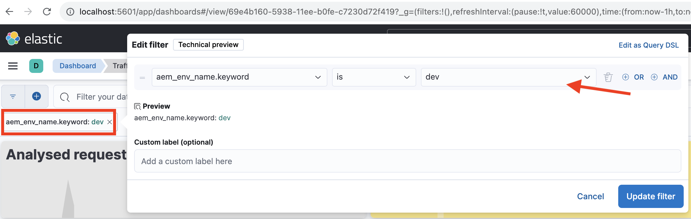

  - To change the time interval, click the calendar icon in the top-right corner and select the desired time interval.

      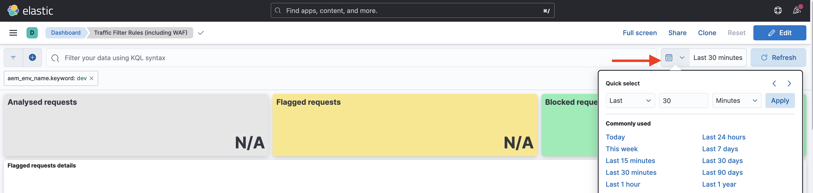

- Review the updated dashboard's  **Analyzed requests**, **Flagged requests**, and **Flagged requests details** panels. For matching CDN log entries, it should show the values of each entry's client IP (cli_ip), host, url, action (waf_action), and rule-name (waf_match).

    


### Blocking requests 

In this example, let's add a page in an _internal_ folder at the path `/content/wknd/internal` in the deployed WKND project. Then declare a traffic filter rule that **blocks traffic** to subpages from anywhere other than a specified IP address that matches your organization (for example, a corporate VPN). 

You can either create your own internal page (for example, `demo-page.html`) or use the [attached package](./assets/demo-internal-pages-package.zip).

- Add the following rule in the WKND project's `/config/cdn.yaml` file:

```yaml
kind: CDN
version: '1'
metadata:
  envTypes:
    - dev
    - stage
    - prod
data:
  trafficFilters:
    rules:
    ...

    # Block requests to (demo) internal only page/s from public IP address but allow from internal IP address.
    # Make sure to replace the IP address with your own IP address.
      - name: block-internal-paths
        when:
          allOf:
            - reqProperty: path
              matches: /content/wknd/internal
            - reqProperty: clientIp
              notIn: [192.150.10.0/24]
        action: block
```

- Commit and push the changes to the Cloud Manager Git repository.

- Deploy the changes to the AEM Dev environment using the [earlier created](how-to-setup.md#deploy-rules-through-cloud-manager) `Dev-Config` configuration pipeline in Cloud Manager.

- Test the rule by accessing the WKND site's internal page, for example `https://publish-pXXXX-eYYYY.adobeaemcloud.com/content/wknd/internal/demo-page.html` or using the CURL command below:

    ```bash
    $ curl -I https://publish-pXXXX-eYYYY.adobeaemcloud.com/content/wknd/internal/demo-page.html
    ```

- Repeat the above step from both the IP address that you used in the rule and then a different IP address (for example, using your mobile phone).

#### Analyzing

To analyze the results of the `block-internal-paths` rule, follow the same steps as described in the [earlier example](#analyzing). 

However, this time you should see the **Blocked requests** and corresponding values in the client IP (cli_ip), host, URL, action (waf_action), and rule-name (waf_match) columns.

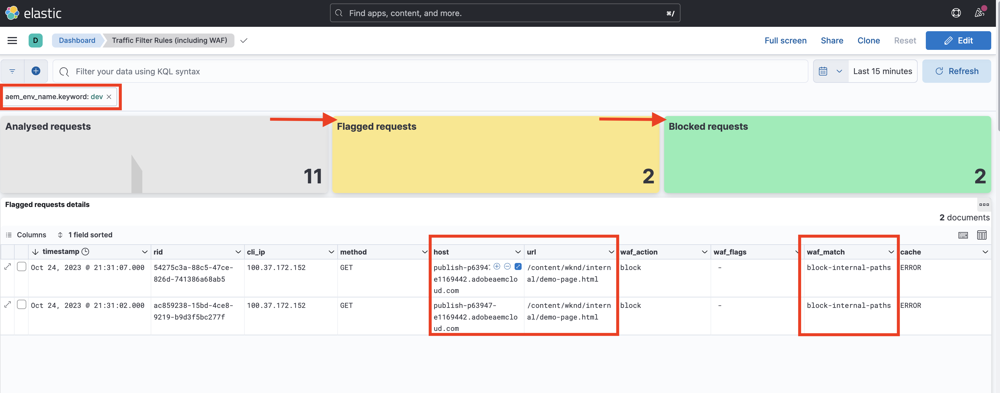


### Prevent DoS attacks

Let's **prevent DoS attacks** by blocking requests from an IP address making 100 requests per second, causing it to be blocked for 5 minutes. 

- Add the following [rate limit traffic filter rule](https://experienceleague.adobe.com/docs/experience-manager-cloud-service/content/security/traffic-filter-rules-including-waf.html#ratelimit-structure) in the WKND project's `/config/cdn.yaml` file. 

```yaml
kind: CDN
version: '1'
metadata:
  envTypes:
    - dev
    - stage
    - prod
data:
  trafficFilters:
    rules:
    ...
    #  Prevent DoS attacks by blocking client for 5 minutes if they make more than 100 requests in 1 second.
      - name: prevent-dos-attacks
        when:
          reqProperty: path
          like: '*'
        rateLimit:
          limit: 100
          window: 1
          penalty: 300
          groupBy:
            - reqProperty: clientIp
        action: block     
```

>[!WARNING]
>
>For your production environment, collaborate with your Web Security team to determine the appropriate values for `rateLimit`, 

- Commit, push, and deploy changes as mentioned in the [earlier examples](#logging-requests).

- To simulate the DoS attack, use the following [Vegeta](https://github.com/tsenart/vegeta) command. 

    ```shell
    $ echo "GET https://publish-pXXXX-eYYYY.adobeaemcloud.com/us/en.html" | vegeta attack -rate=120 -duration=5s | vegeta report
    ```

    This command makes 120 requests for 5 seconds and outputs a report. As you can see, the success rate is 32.5%; a 406 HTTP response code is received for the rest, demonstrating that traffic was blocked.

    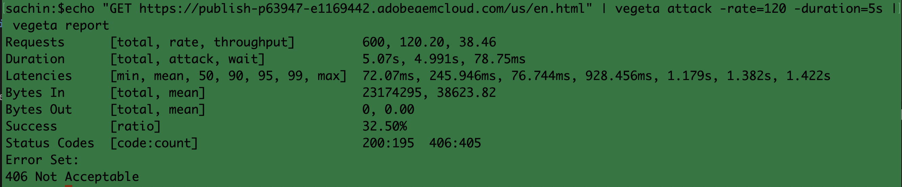

#### Analyzing

To analyze the results of the `prevent-dos-attacks` rule, follow the same steps as described in the [earlier example](#analyzing). 

This time you should see many **Blocked requests** and corresponding values in the client IP (cli_ip), host, url, action (waf_action), and rule-name (waf_match) columns.

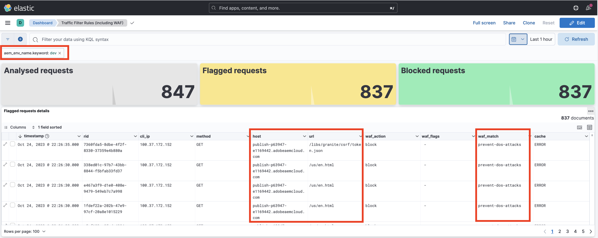

Also, the **Top 100 attacks by client IP, country, and user-agent** panels show additional details, which can be used to further optimize the rules configuration.

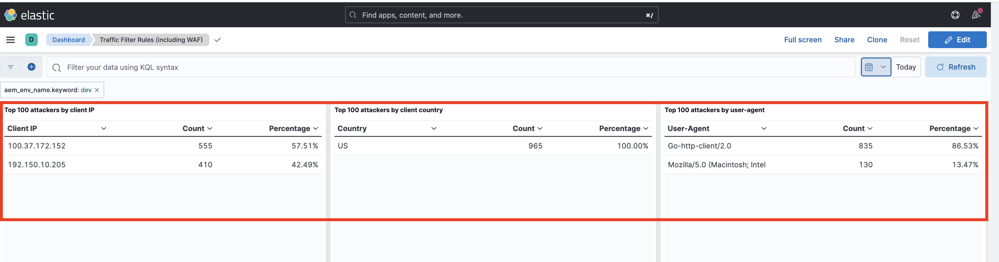

### WAF rules

The traffic filter rule examples so far can be configured by all Sites and Forms customers.

Next, let's explore the experience for a customer who has procured an Enhanced Security or WAF-DDoS Protection license, which lets them configure advanced rules to protect websites from more sophisticated attacks. 

Before continuing on, enable the WAF-DDoS Protection for your program, as described in the traffic filter rules documentation [setup steps](https://experienceleague.adobe.com/docs/experience-manager-cloud-service/content/security/traffic-filter-rules-including-waf.html?lang=en#setup).

#### Without WAFFlags

Let's first see the experience even before WAF Rules are declared. When the WAF-DDoS is enabled on your program, your CDN logs by default log any matches of malicious traffic, so you have the right information to come up with appropriate rules.

Let's begin by attacking the WKND site without adding a WAF rule (or using the `wafFlags` property) and analyze the results.

- To simulate an attack, use the [Nikto](https://github.com/sullo/nikto) command below, which it sends around 700 malicious requests in 6 minutes.

    ```shell
    $ ./nikto.pl -useragent "AttackSimulationAgent (Demo/1.0)" -D V -Tuning 9 -ssl -h https://publish-pXXXX-eYYYY.adobeaemcloud.com/us/en.html
    ```

    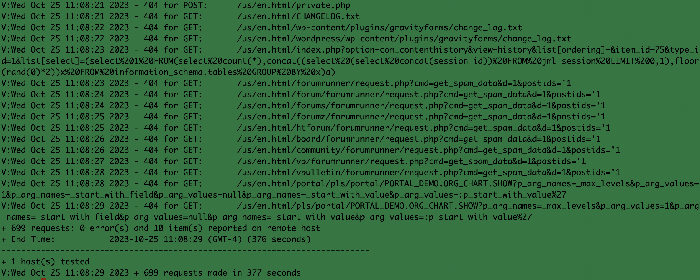

    To learn about attack simulation, review the [Nikto - Scan Tuning](https://github.com/sullo/nikto/wiki/Scan-Tuning) documentation, which tells you how to specify the type of test attacks to include or exclude.

##### Analyzing

To analyze the results of attack simulation, follow the same steps as described in the [earlier example](#analyzing).

However, this time you should see the **Flagged requests** and corresponding values in client IP (cli_ip), host, url, action (waf_action), and rule-name (waf_match) columns. This information allows you to analyze the results and optimize the rule configuration.

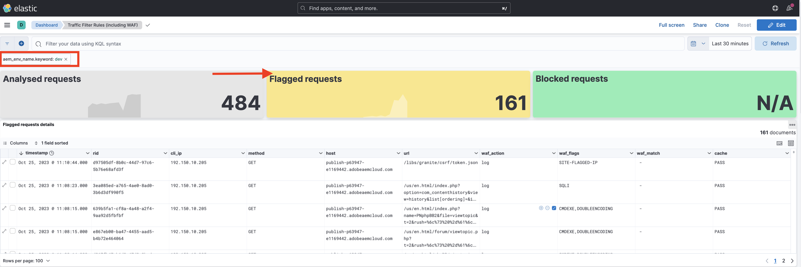

Note how the **WAF Flags distribution** and **Top attacks** panels show additional details, which can be used to further optimize the rule configuration.


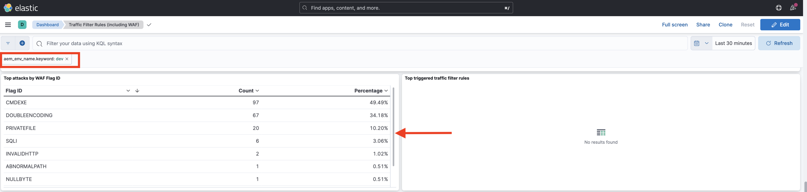


#### With WAFFlags

Let's now add a WAF rule that contains `wafFlags` property as part of the `action` property and **block the simulated attack requests**.

From a syntax perspective, the WAF rules are similar to those seen earlier, however, the `action` property references one or more `wafFlags` values. To learn more about the `wafFlags`, review the [WAF Flags List](https://experienceleague.adobe.com/docs/experience-manager-cloud-service/content/security/traffic-filter-rules-including-waf.html#waf-flags-list) section.

- Add the following rule in the WKND project's `/config/cdn.yaml` file. Note how the `block-waf-flags` rule includes some of the wafFlags that had appeared in the dashboard tooling when attacked with simulated malicious traffic. Indeed, it is good practice over time to analyze logs to determine what new rules to declare, as the threat landscape evolves. 

```yaml
kind: CDN
version: '1'
metadata:
  envTypes:
    - dev
    - stage
    - prod
data:
  trafficFilters:
    rules:
    ...     
    # Enable WAF protections (only works if WAF is enabled for your environment)
      - name: block-waf-flags
        when:
          reqProperty: tier
          matches: "author|publish"
        action:
          type: block
          wafFlags:
            - SANS
            - SIGSCI-IP
            - TORNODE
            - NOUA
            - SCANNER
            - USERAGENT
            - PRIVATEFILE
            - ABNORMALPATH
            - TRAVERSAL
            - NULLBYTE
            - BACKDOOR
            - LOG4J-JNDI
            - SQLI
            - XSS
            - CODEINJECTION
            - CMDEXE
            - NO-CONTENT-TYPE
            - UTF8        
```

- Commit, push, and deploy changes as mentioned in the [earlier examples](#logging-requests).

- To simulate an attack, use the same [Nikto](https://github.com/sullo/nikto) command as before.

    ```shell
    $ ./nikto.pl -useragent "AttackSimulationAgent (Demo/1.0)" -D V -Tuning 9 -ssl -h https://publish-pXXXX-eYYYY.adobeaemcloud.com/us/en.html
    ```

##### Analyzing

Repeat the same steps as described in the [earlier example](#analyzing).

This time you should see entries under **Blocked requests** and the corresponding values in client IP (cli_ip), host, url, action (waf_action), and rule-name (waf_match) columns.

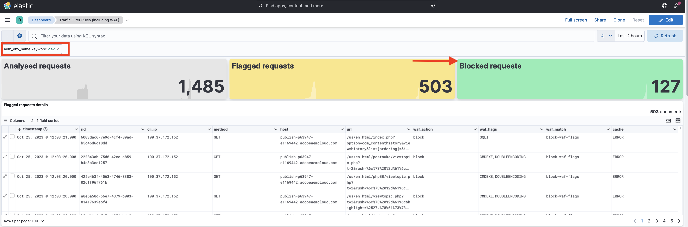

Also, the **WAF Flags distribution** and **Top attacks** panels show additional details.

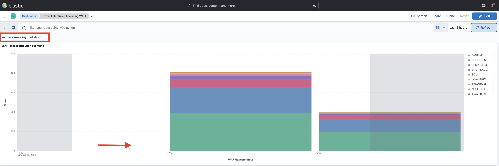

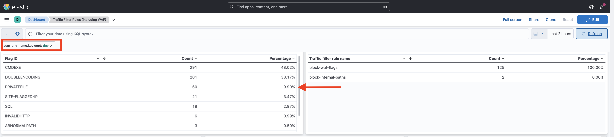

### Comprehensive analysis

In the above _analysis_ sections, you learned how to analyze the results of specific rules using the dashboard tool. You can further explore analyzing results using other dashboard panels, including:


- Analyzed, Flagged, and Blocked requests
- WAF Flags distribution over time
- Triggered traffic filter rules over time
- Top attacks by WAF Flag ID
- Top triggered traffic filter 
- Top 100 attackers by client IP, country, and user-agent

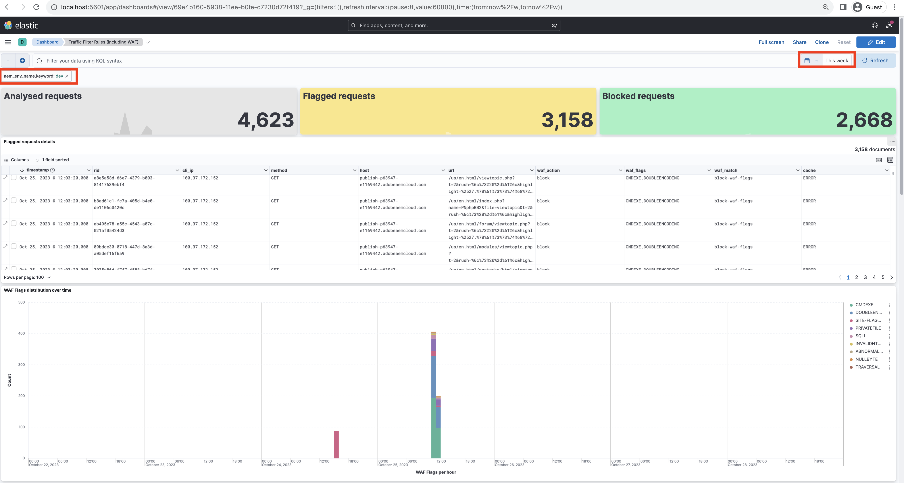

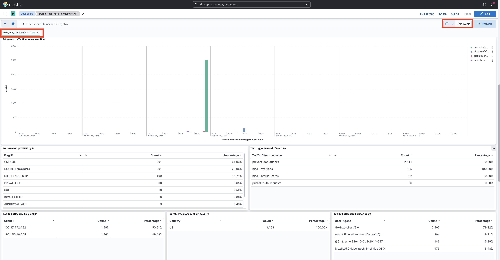


## Next step

Get familiar with recommended [best practices](./best-practices.md) to reduce the risk of security breaches.

## Additional resources

[Traffic Filter Rules Syntax](https://experienceleague.adobe.com/docs/experience-manager-cloud-service/content/security/traffic-filter-rules-including-waf.html#rules-syntax)

[CDN Log Format](https://experienceleague.adobe.com/docs/experience-manager-cloud-service/content/security/traffic-filter-rules-including-waf.html#cdn-log-format)

