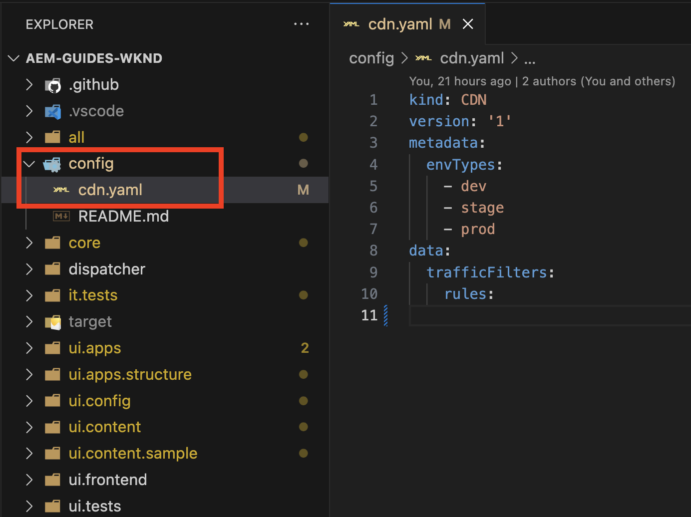
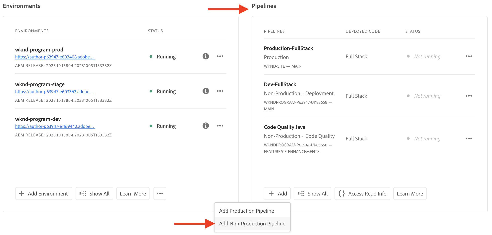
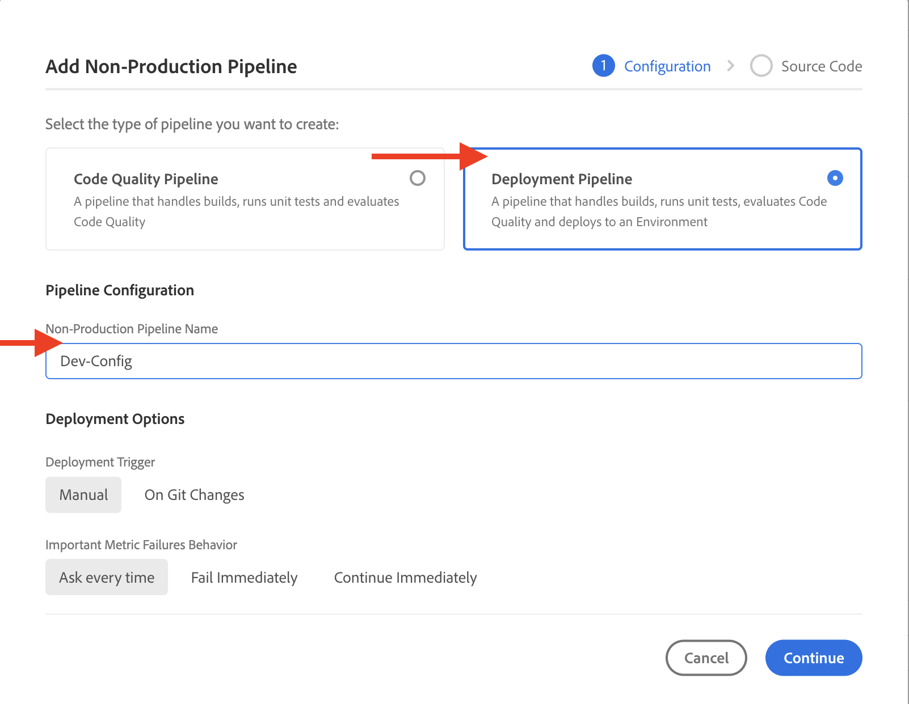
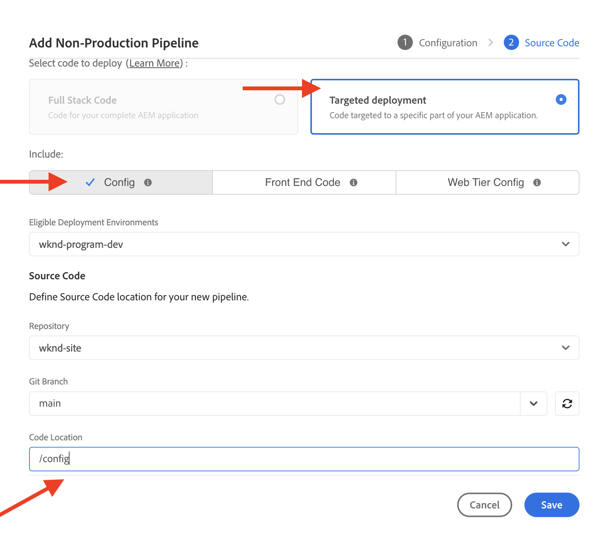
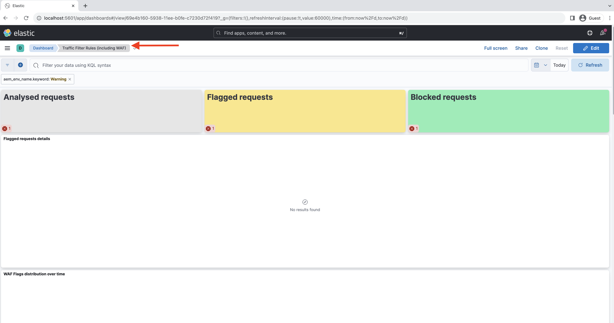

# How to set up Traffic Filter rules including WAF rules

Learn **how to set up** traffic filter rules, including WAF rules. Read about creating, deploying, testing, and analyzing results.

## Setup

The setup process involves the following:

- _creating rules_ with an appropriate AEM project structure and configuration file.
- _deploying rules_ using Adobe Cloud Manager's configuration pipeline.
- _testing rules_ using various tools to generate traffic.
- _analyzing the results_ using AEMCS CDN logs and dashboard tooling.

### Create rules in your AEM project

To create rules, follow these steps:

1. At the top level of your AEM project, create a folder `config`.

1. Within the `config` folder, create a new file called `cdn.yaml`.

1. Add the following metadata to the `cdn.yaml` file:

```yaml
kind: CDN
version: '1'
metadata:
  envTypes:
    - dev
    - stage
    - prod
data:
  trafficFilters:
    rules:
```

See an example of the `cdn.yaml` file within the AEM Guides WKND Sites Project:

{width="800" zoomable="yes"}

### Deploy rules through Cloud Manager {#deploy-rules-through-cloud-manager}

To deploy rules, follow these steps:

1. Log into Cloud Manager at [my.cloudmanager.adobe.com](https://my.cloudmanager.adobe.com/) and select the appropriate organization and program.

1. Navigate to the _Pipelines_ card from the _Program Overview_ page and click the **+Add** button and select the desired pipeline type.

    

    In the example above, for demo purposes _Add Non-Production Pipeline_ is selected since a dev environment is used.

1. In the _Add Non-Production Pipeline_ dialog, choose and enter the following details:

    1. Configuration step:

        - **Type**: Deployment Pipeline
        - **Pipeline Name**: Dev-Config

        

    2. Source Code step:

        - **Code to deploy**: Targeted deployment
        - **Include**: Config
        - **Deployment Environment**: Name of your environment, for example, wknd-program-dev.
        - **Repository**: The Git repository from where the pipeline should retrieve the code; for example, `wknd-site`
        - **Git Branch**: The name of the Git repository branch.
        - **Code Location**: `/config`, corresponding to the top-level configuration folder created in the previous step.

        

### Test rules by generating traffic

To test rules, there are various third-party tools available and your organization may have a preferred tool. For demo purpose, let's use the following tools:

- [Curl](https://curl.se/) for basic testing like invoking a URL and checking the response code.

- [Vegeta](https://github.com/tsenart/vegeta) to perform denial of service (DOS). Follow installation instructions from the [Vegeta GitHub](https://github.com/tsenart/vegeta#install).

- [Nikto](https://github.com/sullo/nikto/wiki) to find potential problems and security vulnerabilities like XSS, SQL injection, and more. Follow installation instructions from the [Nikto GitHub](https://github.com/sullo/nikto).

- Verify that the tools are installed and available in your terminal by running the commands below:

    ```shell
    # Curl version check
    $ curl --version

    # Vegeta version check
    $ vegeta -version

    # Nikto version check
    $ cd <PATH-OF-CLONED-REPO>/program
    ./nikto.pl -Version
    ```

### Analyze results using the dashboard tooling

After creating, deploying, and testing the rules, you can analyze the results using **Elasticsearch, Logstash, and Kibana (ELK)** dashboard tooling. It can parse the AEMCS CDN logs, allowing you to visualize the results in the form of various charts and graphs.

Dashboard tooling can be cloned directly from the [AEMCS-CDN-Log-Analysis-ELK-Tool GitHub repository](https://github.com/adobe/AEMCS-CDN-Log-Analysis-ELK-Tool) and follow the steps to install and load the **Traffic Filter Rules (including WAF)** dashboard.

- After loading the sample dashboard, your Elastic dashboard tool page should look like the following:

    

>[!NOTE]
>
>    As there are no AEMCS CDN logs ingested yet, the dashboard is empty.


## Next step

Learn how to declare traffic filter rules including WAF rules in the [Examples and result analysis](./examples-and-analysis.md) chapter, using the AEM WKND Sites Project.
