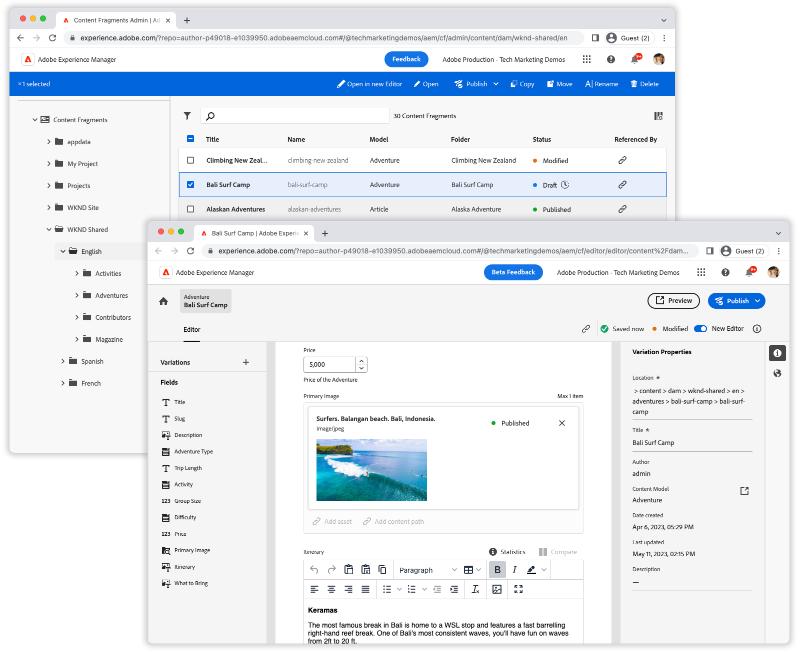

# Content Fragments Console videos

Adobe Experience Manager's Content Fragments Console makes managing and authoring Content Fragments easy! Learn how to make the most of the Content Fragments Console with these videos.

Review the [documentation](https://experienceleague.adobe.com/docs/experience-manager-cloud-service/content/sites/administering/content-fragments/content-fragments-console.html)  for complete details of the Content Fragments Console and its capabilities.

## Videos

    <!-- Overview -->
    

      

        

          <figure class="image is-16by9">
            
          </figure>
        

        

          

            
5 minutes

            

              <a href="./basics/content-fragments-console.md" title="Overview">Overview</a>
            

            
A brief overview of the Content Fragments
              console.

            <a href="./basics/content-fragments-console.md" class="spectrum-Button
              spectrum-Button--outline spectrum-Button--primary
              spectrum-Button--sizeM">
              Watch the video
            </a>
          

        

      

    

    <!-- Fast filtering -->
    

      

        

          <figure class="image is-16by9">
            
          </figure>
        

        

          

            
1 minute

            

              <a href="./search/fast-filtering.md" title="Fast filtering">Fast
                filtering</a>
            

            
Quickly locate Content Fragments with inline
              filtering.

            <a href="./search/fast-filtering.md" class="spectrum-Button
              spectrum-Button--outline spectrum-Button--primary
              spectrum-Button--sizeM">
              Watch the video
            </a>
          

        

      

    

    <!-- New Editor toggle -->
    

      

        

          <figure class="image is-16by9">
            
          </figure>
        

        

          

            
1 minute

            

              <a href="./editor/new-editor-toggle.md" title="New Editor toggle">New
                Editor toggle</a>
            

            
Seamlessly transition from the classic to the new
              editor.

            <a href="./editor/new-editor-toggle.md" class="spectrum-Button
              spectrum-Button--outline spectrum-Button--primary
              spectrum-Button--sizeM">
              Watch the video
            </a>
          

        

      

    

    <!-- Non-asset content references --->
    

      

        

          <figure class="image is-16by9">
            
          </figure>
        

        

          

            
1 minute

            

              <a href="./editor/non-asset-content-references.md" title="Non-asset
                content references">Non-asset content references</a>
            

            
Incorporate Experience Fragments and Pages into
              your Content Fragments.

            <a href="./editor/non-asset-content-references.md"
              class="spectrum-Button spectrum-Button--outline
              spectrum-Button--primary spectrum-Button--sizeM">
              Watch the video
            </a>
          

        

      

    

    <!-- RTE variant compare -->
    

      

        

          <figure class="image is-16by9">
            
          </figure>
        

        

          

            
1 minute

            

              <a href="./editor/rte-variant-compare.md" title="RTE variant
                compare">RTE variant compare</a>
            

            
Easily align your rich text content across
              channels.

            <a href="./editor/rte-variant-compare.md" class="spectrum-Button
              spectrum-Button--outline spectrum-Button--primary
              spectrum-Button--sizeM">
              Watch the video
            </a>
          

        

      

    

    <!-- Language copies -->
    

      

        

          <figure class="image is-16by9">
            
          </figure>
        

        

          

            
1 minute

            

              <a href="./editor/language-copies.md" title="Language copies">Language
                copies</a>
            

            
Easily manage your Content Fragment language
              copies

            <a href="./editor/language-copies.md" class="spectrum-Button
              spectrum-Button--outline spectrum-Button--primary
              spectrum-Button--sizeM">
              Watch the video
            </a>
          

        

      

    

  

