# Chapter 1 - Dispatcher Concepts, Patterns and Antipatterns

## Overview

This chapter provides a brief introduction over the Dispatcher's history and mechanics and discusses how this influences how an AEM developer would design his components.

## Why Developers Should Care About Infrastructure

The Dispatcher is an essential part of most – if not all AEM installations. You can find many online articles that discuss how to configure the Dispatcher as well as tips and tricks.

These bits and pieces of information however always start on a very technical level – assuming you already know what you want to do and thus providing only details on how to achieve what you want. We have never found any conceptual papers describing the _what's and why's_ when it comes to what you can and cannot do with the dispatcher.

### Antipattern: Dispatcher as an Afterthought

This lack of basic information leads to a number of anti-patterns We have seen in a number of AEM projects:

1. As the Dispatcher is installed in the Apache Web server, it is the job of the "Unix gods" in the project to configure it. A "mortal java developer" does not need to concern themselves with it.

2. The Java developer needs to ensure that his code works… the dispatcher later will magically make it fast. The dispatcher always is an afterthought. However, this is not working. A developer must design his code with the dispatcher in mind. And he needs to know its basic concepts to do that.

### "First make it work – then make it fast" Is Not Always Right

You might have heard the programming advice _"First make it work – then make it fast."_. It is not entirely wrong. However, without the right context it is tended to be misinterpreted and not applied correctly.

The advice should keep the developer from prematurely optimizing code, that may never be run – or is run so rarely, that an optimization would not have a sufficient impact to justify the effort being put into the optimization. Moreover, optimization could lead to more complex code and thus introduce bugs. So, if you are developer, do not spent too much time on micro-optimizing each single line of code. Just make sure you chose the right data structures, algorithms and libraries and wait for a profiler's hotspot analysis to see where a more thorough optimization could increase the overall performance.

### Architectural Decisions and Artifacts

However, the advice "First make it work – then make it fast" is entirely wrong when it comes to "architectural" decisions. What are architectural decisions? Simply put, they are the decisions that are expensive, hard and/or impossible to change afterwards. Keep in mind, that "expensive" sometimes is the same as "impossible".  For instance, when your project is running out of budget, expensive changes are impossible to implement. Infrastructural changes to are the very first kind of changes in that category which come to most people's minds. But there is also another kind of "architectural" artifacts which can become very nasty to change:

1. Pieces of code in the "center" of an application, which many other pieces rely on. Changing these, requires all of the dependencies to be changed and re-tested at once.

2. Artifacts, which are involved in some asynchronous, timing dependent scenario where the input – and thus the behavior of the system can vary very randomly. Changes can have unpredictable effects and can be hard to test.

3. Software patterns which are used and re-used over and over again, in all pieces and parts of the system. If the software pattern turns out to be sub-optimal, all artifacts that use the pattern needs to be re-coded.

Remember? On top of this page we said, that the Dispatcher is an essential part of an AEM application. Access to a web application is very random – users are coming and going at unpredictable times. In the end - all content will (or should) be cached in the Dispatcher. So, if you paid close attention, you might have realized, that caching could be seen as an "architectural" artifact and thus should be understood by all members of the team, developers and administrators alike.

We are not saying a developer should actually configure the Dispatcher. They need to know the concepts - especially the boundaries – to make sure their code can be leveraged by the Dispatcher as well.

The Dispatcher does not magically improve the speed of the code. A developer needs to create his components with the Dispatcher in mind. Therefore, he needs to know how it works.

## Dispatcher Caching – Basic Principles

### Dispatcher as Caching Http - Load Balancer

What is the Dispatcher and why is it called "Dispatcher" in the first place?

The Dispatcher is

* First and foremost a cache

* A reverse proxy

* A module for the Apache httpd webserver, adding AEM related features to the Apache's versatility and working smoothly together with all the other Apache modules (such as SSL or even SSI includes as we will see later)

In the early days of the web, you would expect a few hundred visitors to a site. A setup of one Dispatcher, "dispatched" or balanced the load of requests to a number of AEM publish servers and that usually was sufficient - thus, the name "Dispatcher". Nowadays however, this setup is not used very frequently anylonger.

We will see different ways of setting up Dispatchers and Publish systems later in this article. First let's start with some http caching basics.

 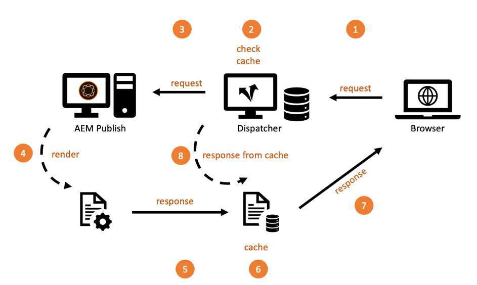

*Basic functionality of a Dispatcher Cache*

<br>&nbsp;

The very basics of the dispatcher is explained here. The dispatcher is a simple caching reverse proxy with the ability to receive and create HTTP requests. A normal request/response cycle goes like this:

1. A user requests a page
2. The Dispatcher checks, if it already has a rendered version of that page. Let's assume it is the very first request for this page and the Dispatcher can't find a local cached copy.
3. The Dispatcher requests the page from the Publish system
4. On the Publish system, the page is rendered by a JSP or an HTL template
5. The page is returned to the Dispatcher
6. The Dispatcher caches the page
7. The Dispatcher returns the page to the browser
8. If the same page is requested a second time, it can be served directly from the Dispatcher cache without the need of re-rendering it on the Publish instance. This saves waiting time for the user and CPU cycles on the Publish instance.

We were talking about "pages" in the last section. But the same scheme also applies to other resources such as images, CSS files, PDFs downloads and so on.

#### How Data Is Cached

The Dispatcher module leverages the facilities which the hosting Apache server provides. Resources such as HTML-pages, downloads and picture are stored as simple files in the Apache filesystem. It's that simple.

The filename is derived by the URL of the requested resource. If you request a file `/foo/bar.html` it is stored for example under /`var/cache/docroot/foo/bar.html`.

In principle, if all files are cached and thus stored statically in the Dispatcher, you could pull the Publish system's plug and the Dispatcher would serve as a simple web server. But this is just to illustrate the principle. Real life is more complicated. You cannot cache everything, and the cache is never completely "full" as the number of resources can be infinite due to the dynamic nature of the rendering process. The model of a static filesystem helps to generate a rough picture of the capabilities of the dispatcher. AND it helps to explain the limitations of the dispatcher.

#### The AEM URL Structure and File System Mapping

To understand the Dispatcher in more detail, let us revisit the structure of a simple sample URL.  Let's look at the below example,

`http://domain.com/path/to/resource/pagename.selectors.html/path/suffix.ext?parameter=value&amp;otherparameter=value#fragment`

* `http` denotes the protocol

* `domain.com` is the domain name

* `path/to/resource` is the path under which the resource is stored in CRX and subsequently in the Apache server's filesystem

From here, things differ a little bit between the AEM filesystem and the Apache filesystem.

In AEM,

* `pagename` is the resources label

* `selectors` stands for a number of selectors used in Sling to determine how the resource is rendered. A URL can have an arbitrary number of selectors. They are separated by a period. A selectors section could for example be something like "french.mobile.fancy". Selectors should contain only letters, digits and dashes.

* `html` as being the last of the "selectors" is called an extension. In AEM/Sling it also partly determines the rendering script.

* `path/suffix.ext` is a path-like expression that can be a suffix to the URL.  It can be used in AEM scripts to further control how a resource is rendered. We will have an entire section about this part later on. For now, it should suffice to know you can use it as an additional parameter. Suffixes must have an extension.

* `?parameter=value&otherparameter=value` is the query section of the URL. It is used to pass arbitrary parameters to AEM. URLs with parameters cannot be cached and thus parameters should be limited to cases where they are absolutely necessary.

* `#fragment`, the fragment part of a URL is not passed to AEM it is used only in the browser; either in JavaScript frameworks as "routing parameters" or to jump to a certain part on the page.

In Apache (*reference the below diagram*),

* `pagename.selectors.html` is used as the filename in the cache's filesystem. 

If the URL has a suffix `path/suffix.ext` then,

* `pagename.selectors.html` is created as a folder

* `path` a folder in the `pagename.selectors.html` folder

* `suffix.ext` is a file in the `path` folder. Note: If the suffix does not have an extension, the file is not cached.

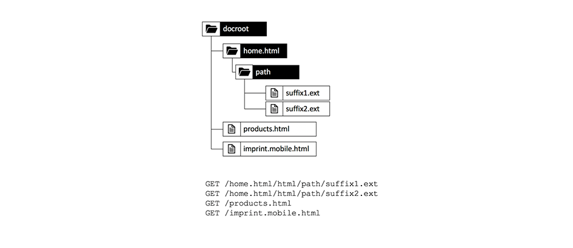

*Filesystem layout after getting URLs from the Dispatcher*

<br>&nbsp;

#### Basic Limitations

The mapping between a URL, the resource and the filename is pretty straightforward.

You might have noticed a few traps however,

1. URLs can become very long. Adding the "path" portion of a `/docroot` on the local filesystem could easily exceed limits of some filesystems. Running the Dispatcher in NTFS on Windows can be a challenge. You are safe with Linux, however.

2. URLs can contain special characters and umlauts. This is usually is not a problem for the dispatcher. Bear in mind though, that the URL is interpreted in many places of your application. More often than not, we have seen strange behaviors of an application – just to find out that one piece of rarely used (custom) code was not tested thoroughly for special characters. You should avoid them if you can. And if you can't, plan for thorough testing.

3. In CRX, resources have sub-resources. For example, a page will have a number of sub-pages. This cannot be matched in a filesystem as filesystems have either files or folders.

#### URLs Without Extension Are Not Cached

URLs always must have an extension. Although you can serve URLs without extensions in AEM. These URLs will not be cached in the Dispatcher.

**Examples**

`http://domain.com/home.html` is **cacheable**

`http://domain.com/home` is **not cacheable**

The same rule applies when the URL contains a suffix. The suffix needs to have an extension to be cacheable.

**Examples**

`http://domain.com/home.html/path/suffix.html` is **cacheable**

`http://domain.com/home.html/path/suffix` is **not cacheable**

You might wonder, what happens if the resource-part has a no extension, but the suffix has one? Well, in this case the URL has no suffix at all. Look at the next example:

**Example**

`http://domain.com/home/path/suffix.ext`

The `/home/path/suffix` is the path to the resource… so there is no suffix in the URL.

**Conclusion**

Always add extensions to both the path and the suffix. SEO-aware people sometimes argue, that this is ranking you down in search results. But an uncached page would be super slow and rank down even further.

#### Conflicting Suffix URLs

Consider you have two valid URLs

`http://domain.com/home.html`

and

`http://domain.com/home.html/suffix.html`

They are absolutely valid in AEM. You wouldn't see any problem on your local development machine (without a Dispatcher). Most likely you also will not encounter any problem in UAT- or load testing. The problem we are facing is so subtle that it slips through most tests.  It will hit you hard when you are at peak time and you will be limited on time to address it, likely have no server access,  nor resources to fix it. We have been there...

So... what's the issue?

`home.html` in a filesystem can be either a file or a folder. Not both at the same time as in AEM.

If you request `home.html` first, it will be created as a file.

Subsequent requests to `home.html/suffix.html` return valid results, but as the file `home.html` "blocks" the position in the filesystem,  `home.html` cannot be created a second time as a folder and thus `home.html/suffix.html` is not cached.

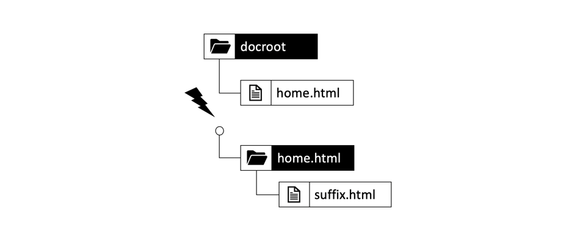

*File blocking position in the filesystem preventing sub-resources to be cached*

<br>&nbsp;

If you do it the other way round, first requesting `home.html/suffix.html` then `suffix.html` is cached under a folder `/home.html` at first. However, this folder is deleted and replaced by a file `home.html` when you subsequently request `home.html` as a resource.

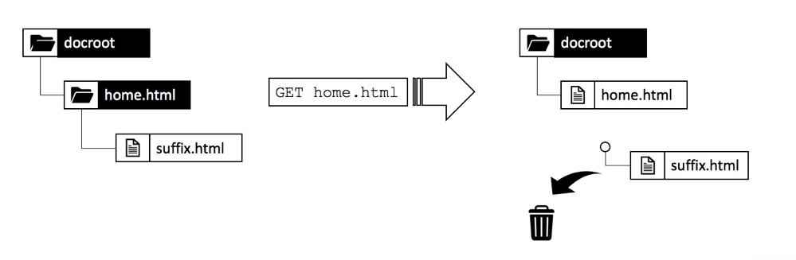

*Deleting a path structure when a parent is fetched as a resource*

<br>&nbsp;

So, the result of what is cached is entirely random and depending on the order of the incoming requests. What makes matters even more tricky, is the fact that you usually have more than one dispatcher. And the performance, cache hit-rate and behavior might vary differently from one Dispatcher to the other. If you want to find out why your website is unresponsive you need to be sure you are looking at the correct Dispatcher with the unfortunate caching order. If you are looking on the Dispatcher which - by lucky chance - had a more favorable request pattern, you'll be lost in trying to find the issue.

#### Avoiding Conflicting URLs

You can avoid "conflicting URLs", where a folder name and a filename "compete" for the same path in the filesystem, when you are using a different extension for the resource when you have a suffix.

**Example**

* `http://domain.com/home.html`

* `http://domain.com/home.dir/suffix.html`

Both are perfectly cacheable,

 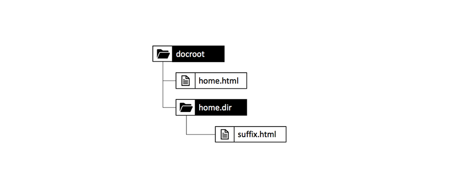

Choosing a dedicated extension "dir" for a resource when you request a suffix or you avoid using the suffix altogether. There are rare cases where they are useful. And it's easy to implement these cases correctly.  As we will see in the next chapter when we are talking about cache invalidation and flushing.

#### Uncacheable Requests

Let's review a quick summary of the last chapter plus some more exceptions. The Dispatcher can cache a URL if it is configured as being cacheable and if it is a GET request. It cannot be cached under one of the following exceptions.

**Cacheable Requests** 

* Request is configured to be cacheable in the Dispatcher configuration
* Request is a plain GET request

**Non-Cacheable Requests or Responses**

* Request that is denied caching by configuration (Path, Pattern, MIME Type)
* Responses that returns a "Dispatcher: no-cache" header
* Response that returns a "Cache-Control: no-cache|private" header
* Response that returns a "Pragma: no-cache" header
* Request with query parameters
* URL without extension
* URL with a suffix that does not have an extension
* Response that returns a status code other than 200
* POST Request

## Invalidating and Flushing the Cache

### Overview

The last chapter listed a large number of exceptions, when the Dispatcher cannot cache a request. But there are more things to consider: Just because the Dispatcher _can_ cache a request, it does not necessarily mean that it _should_.

The point is: Caching usually is easy. The Dispatcher just needs to store the result of a response and return it the next time when the very same request is incoming. Right? Wrong!

The difficult part is the _invalidation_ or _flushing_ of the cache. The Dispatcher needs to find out, when a resource has changed - and needs to be rendered again.

This seem to be a trivial task at first glance… but it is not. Read further and you'll find out some tricky differences between single and simple resources and pages that are relying on a highly meshed structure of multiple resources.

### Simple Resources and Flushing

We have set up our AEM system to dynamically create a thumbnail-rendition for each image when requested with a special "thumb" selector:

`/content/dam/path/to/image.thumb.png`

And - of course - we provide a URL to serve the original image with a selector-less URL:

`/content/dam/path/to/image.png`

If we download both, the thumbnail and the original image, we'll end up with something like,

```
/var/cache/dispatcher/docroot/content/dam/path/to/image.thumb.png

/var/cache/dispatcher/docroot/content/dam/path/to/image.png
```

in our Dispatcher's filesystem.

Now, the user uploads and activates a new version of that file. Ultimately an invalidation request is sent from AEM to the Dispatcher,

```
GET /invalidate
invalidate-path:  /content/dam/path/to/image

<no body>
```

Invalidation is that easy: A simple GET request to a special "/invalidate" URL on the Dispatcher. An HTTP-body is not required, the "payload" is just the "invalidate-path" header. Note also, that the invalidate-path in the header is the resource that AEM knows - and not the file or files the Dispatcher has cached. AEM only knows about resources. Extensions, selectors and suffixes are used at runtime when a resource is requested. AEM does not perform any bookkeeping about what selectors have been used on a resource, so the resource path is all it knows for sure when activating a resource.

This is sufficient in our case. If a resource has changed, we can safely assume, that all renditions of that resource have changed as well. In our example, if the image has changed, a new thumbnail will be rendered as well.

The Dispatcher can safely delete the resource with all renditions that it has cached. It will do something like,

`$ rm /content/dam/path/to/image.*`

removing `image.png` and `image.thumb.png` and all other renditions matching that pattern.

Super simple indeed… as long as you use one resource only to respond to a request.

### References and Meshed Content

#### The Meshed Content Problem

In contrast to images or other binary files uploaded to AEM, HTML pages are not solitary animals. They live in flocks and they are highly interconnected with each other by hyperlinks and references. The simple link is harmless, but it becomes tricky when we are talking about content references. The ubiquitous top-navigation or teasers on pages are content references.

#### Content References and Why They Are an Issue

Let's look at a simple example. A travel agency has a web page promoting a trip to Canada. This promotion is featured in the teaser section on two other pages, on the "Home" page and on a "Winter Specials" page.

Since both pages display the same teaser, it would be unnecessary work to ask the author to create the teaser multiple time for each page it should be displayed on. Instead, the target page "Canada" reserves a section in the page properties to provide the information for the teaser – or better to provide a URL that render's that teaser altogether:

`<sling:include resource="/content/home/destinations/canada" addSelectors="teaser" />`

or

`<sling:include resource="/content/home/destinations/canada/jcr:content/teaser" />`

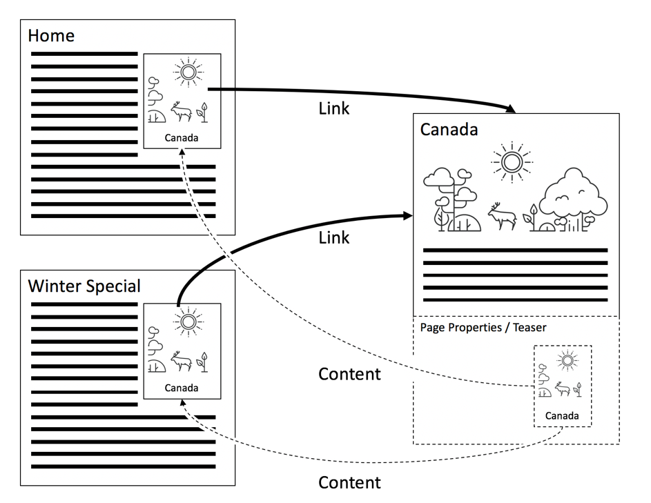

On AEM only that works like charm, but if you use a Dispatcher on the Publish instance something strange happens.

Imagine, you have published your website. The title on your Canada page is "Canada". When a visitor requests your home page – which has a teaser reference to that page - the component on the "Canada" page renders something like

```
<div class="teaser">
  <h3>Canada</h3>
  
</div>
```

*into* the home page. The home page is stored by the Dispatcher as a static .html file, including the teaser and it's headline in the file.

Now the marketer has learned that teaser headlines should be actionable. So, he decides to change the title from "Canada" to "Visit Canada", and updates the image too.

He publishes the edited "Canada" page and revisits the previously published home page to see his changes. But – nothing changed there. It still displays the old teaser. He double checks on the "Winter Special". That page has never been requested before, and thus is not statically cached in the Dispatcher. So, this page is freshly rendered by Publish and this page now contains the new "Visit Canada" teaser.

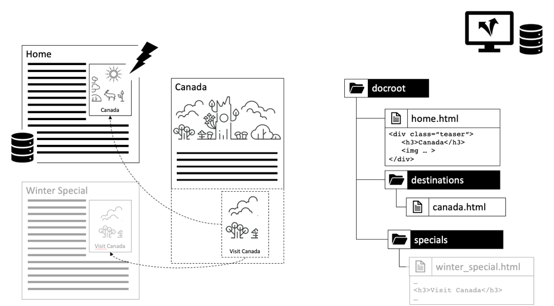

*Dispatcher storing stale included content in the home page*

<br>&nbsp;

What happened? The Dispatcher stores a static version of a page containing all content and markup that has been drawn from other resources while rendering.

The Dispatcher, being a mere filesystem-based webserver, is fast but also relatively simple. If an included resource changes it doesn't realize that. It still clings to the content that was there when the including page was rendered.

The "Winter Special" page has not been rendered yet, so there is no static version on the Dispatcher and thus will be displayed with the new teaser as it will be freshly rendered upon request.

You might think, that the Dispatcher would keep track of every resource it touches while rendering and flushing all pages which have used this resource, when that resource changes. But the Dispatcher does not render the pages. The rendering is performed by the Publish system. The Dispatcher does not know what resources go into a rendered .html file.

Still not convinced? You might think *"there must be a way to implement some kind of dependency tracking"*. Well there is, or more accurately there *was*. Communiqué 3 the great-great-great-grandfather of AEM had a dependency tracker implemented in the _session_ that was used to render a page.

During a request, each resource that was acquired via this session was tracked as a dependency of the URL that currently was  being rendered.

But it turned out, that keeping track of the dependencies was very expensive. People soon discovered that the website is faster if they turned the dependency tracking feature off altogether and relied on re-rendering all html pages after one html page changed. Moreover, that scheme was not perfect either – there were a number of pitfalls and exceptions on the way. In some cases, you were not using the requests default session to get a resource, but an admin session to get some helper-resources to render a request. Those dependencies usually were not tracked and led to headaches and phone calls to the ops-team asking to manually flush the cache. You were lucky if they had a standard procedure to do that. There were more gotchas along the way but… let's stop reminiscing. This leads way back to 2005. Ultimately that feature was de-activated in Communiqué 4 by default and it didn't make it back into the successor CQ5 which then became AEM.

### Auto Invalidation

#### When Full-Flushing Is Cheaper Than Dependency-Tracking

Since CQ5 we rely entirely on invalidating, more or less, the whole site if only one of the pages changes. This feature is called "Auto Invalidation".

But again - how can it be, that throwing away and re-rendering hundreds of pages is cheaper than doing a proper dependency-tracking and partial re-rendering?

There are two major reasons:

1. On an average website, only a small subset of the pages is frequently requested. So even, if you throw away all rendered content, only a few dozen will actually be requested immediately afterwards. The rendering of the long tail of pages can be distributed over time, when they are actually requested. So actually, the load on rendering pages is not as high as you might expect. Of course, there are always exceptions… we will discuss some tricks how to handle equally distributed loady on larger websites with empty Dispatcher caches, later.

2. All pages are connected by the main navigation anyway. So almost all pages ultimately are dependent of each other. This means that even the smartest dependency tracker will find out what we already know: If one of the pages changes, you have to invalidate all others.

You don't believe? Let us illustrate the last point.

We are using the same argument as in the last example with teasers referencing to a remote page's content. Only now, we are using a more extreme example: An automatically rendered Main-Navigation. As was with the teaser, the navigation title is drawn from the linked or "remote" page as a content reference. The remote navigation titles are not stored in the currently rendered page. You should remember that the navigation is rendered on each and every page in your website. So, the title of one page is used over and over again on all pages that have a main navigation. And if you want to change a navigation title, you want to do that only once on the remote page - not on each and every page referencing the page.

So, in our example, the navigation meshes all pages together by using the target page's "NavTitle" to render a name in the navigation. The navigation title for "Iceland" is drawn from the "Iceland" page and rendered into each and every page that has a main navigation.

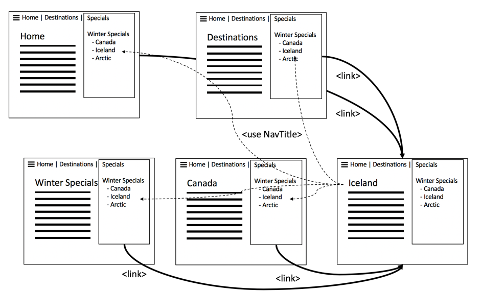

*Main navigation inevitably meshing content of all pages together by pulling their "NavTitles"*

<br>&nbsp;

If you change the NavTitle on the Iceland page from "Iceland" to "Beautiful Iceland" that title immediately changes on all other pages main menu. Thus the pages rendered and cached before that change, all become stale and need to be invalidated.

#### How Auto-Invalidation is implemented: The .stat File

Now if you have a large site with thousands of pages, it would take quite some time to loop through all pages and physically delete them. During that period the Dispatcher could unintentionally serve stale content. Even worse, there might occur some conflicts while accessing the cache files, maybe a page is requested while it is just being deleted or a page is deleted again due to a second invalidation that happened after an immediate subsequent activation. Consider what a mess that would be. Luckily this is not what happens. The Dispatcher uses a clever trick to avoid that: Instead of deleting hundreds and thousands of files, it places a simple, empty file into the root of your filesystem when a file is published and thus all dependend files are considered invalid. This file is called the "statfile". The statfile is an empty file - what matters about the statfile is its creation date, only.

All files in the dispatcher, that have a creation date older than the statfile, have been rendered before the last activation (and invalidation) and thus are considered "invalid". They still are physically present in the filesystem, but the Dispatcher ignores them. They are "stale". Whenever a request to a stale resource is made, the Dispatcher asks the AEM system to re-render page. That newly rendered page then is stored in the filesystem – now with a new creation date and it is fresh again.

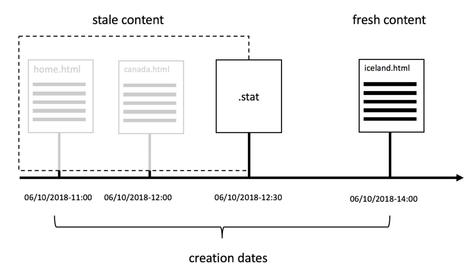

*Creation date of the .stat file defines which content is stale and which is fresh*

<br>&nbsp;

You may ask why it is called ".stat"? And not maybe ".invalidated"? Well, you can imagine, having that file in your filesystem helps the Dispatcher determine which resources could *statically* be served – just like from a static web server. These files don't need to be rendered dynamically any longer.

The true nature of the name, however, is less metaphorical. It is derived from the Unix system call `stat()`, which returns the modification time of a file (among other properties).

#### Mixing Simple and Auto Validation

But wait… earlier we said, that single resources are deleted physically. Now we say, that a more recent statfile would virtually render them invalid in the eyes of the Dispatcher. Why then the physical deletion, first?

The answer is simple. You usually use both strategies in parallel – but for different kinds of resources. Binary assets, like images are self-contained. They are not connected to other resources in a sense that they need their information to be rendered.

HTML pages on the other hand, are highly interdependent. So, you would apply auto-invalidation on those. This is the default setting in the Dispatcher. All files belonging to an invalidated resource are deleted physically. In addition, files that end with ".html" are auto-invalidated. 

The Dispatcher decides upon the file-extension, whether to apply auto-invalidation scheme or not. 

The file endings for auto-invalidation are configurable. In theory you could include all extensions to auto-invalidation. But keep in mind, that this comes at a very high a price. You won't see stale resources delivered unintendedly, but the delivery performance vastly degrades due to over-invalidation.

Imagine for example, you implement a scheme where PNGs and JPGs are rendered dynamically and depend on other resources to do so. You might want to re-scale hi-res images to a smaller web-compatible resolution. While you're at it also change the compression rate. Resolution and compression rate in this example are no fixed constants but configurable parameters in the component that uses the image. Now if this parameter is changed, you need to invalidate the images.

No problem - we just learned, that we could add images to auto-invalidation and always have freshly rendered images whenever anything changes.

#### Throwing out the Baby with the Bathwater

That's right – and that's a huge problem. Read the last paragraph again. "…freshly rendered images whenever anything changes.". As you know, a good website is changed constantly; adding new content here, correcting a typo there, tweaking a teaser somewhere else. That means all your images are invalidated constantly and need to be re-rendered. Don't underestimate that. Dynamically rendering and transferring image data works in milliseconds on your local development machine. Your production environment needs to do that a hundred times more often - per second.

And let's be clear here, your jpgs need to be re-rendered, when an html page changes and vice versa. There is only one "bucket" of files to be auto-invalidated. It is flushed as a whole. Without any means of breaking down into further detailed structures.

There is a good reason why the auto-invalidation is kept to ".html" by default. The goal is to keep that bucket as small as possible. Do not throw out the baby with the bathwater by just invalidating everything – just to be on the safe side.

Self-contained resources should be served on that resource's path. That helps invalidation a lot. Keep it simple, don't create mapping schemes like "resource /a/b/c" is served from "/x/y/z". Make your components work with the default Dispatcher's auto-invalidation settings. Don't try to repair a badly designed component with over-invalidation in the Dispatcher.

##### Exceptions to Auto-Invalidation: ResourceOnly Invalidation

The invalidation request for the Dispatcher usually is fired from the Publish system(s) by a replication agent.

If you feel super confident about your dependencies, you can try to build your own invalidating replication agent.

It would be a bit beyond this guide to go into the details, but we want to give you at least a few hints.

1. Really know what you are doing. Getting invalidation right is really hard. That's one reason why the auto-invalidation is so rigorous; to avoid delivering stale content.

2. If your agent sends a HTTP-header `CQ-Action-Scope: ResourceOnly`, that means that this single invalidation request does not trigger an auto-invalidation. This ( [https://github.com/cqsupport/webinar-dispatchercache/tree/master/src/refetching-flush-agent/refetch-bundle](https://github.com/cqsupport/webinar-dispatchercache/tree/master/src/refetching-flush-agent/refetch-bundle)) piece of code might be a good starting point for your own replication agent.

3. `ResourceOnly`, only prevents auto-invalidation. To actually do the necessary dependency resolving and invalidations, you must trigger the invalidation requests yourself. You may want to check the package Dispatcher flush rules ([https://adobe-consulting-services.github.io/acs-aem-commons/features/dispatcher-flush-rules/index.html](https://adobe-consulting-services.github.io/acs-aem-commons/features/dispatcher-flush-rules/index.html)) for inspiration on how that could actually happen.

We don't recommend that you build a dependency resolving scheme. There is just too much effort and little gain – and as said before, there is too much that you will get wrong.

Rather, what you should do is find out which resources don't have any dependencies on other resources and can be invalidated without auto invalidation. You don't have to use a custom Replication Agent for that matter, though. Just create a custom rule in your Dispatcher config that excludes these resources from auto invalidation.

We said that the main navigation or teasers are a source for dependencies. Well – if you load the navigation and teasers asynchronously or include them with an SSI script in Apache, you won't have that dependency to track. We will elaborate on asynchronously loading components later in this document when we talk about "Sling Dynamic Includes".

The same applies for Pop-Up windows or content that is loaded into a lightbox. These pieces also rarely have navigations (aka., "dependencies") and can be invalidated as a single resource.

## Building Components with the Dispatcher in Mind

### Applying the Dispatcher Mechanics in a Real-World Example

In the last chapter we explained how the Dispatcher's basic mechanics, how it works in general and what the limitations are.

We now want to apply these mechanics to a type of components that you very probably will find in the requirements of your project. We pick the component deliberately to demonstrate issues that you also will face sooner or later. Fear not – not all components need that amount of consideration that we will present. But if you see the need to build a such a component, you are you well aware of the consequences and know how to handle them.

### The Spooling Component (Anti) Pattern

#### The Responsive Image Component

Let us illustrate a common pattern (or anti-pattern) of a component with interconnected binaries. We will create a component "respi" – for "responsive-image". This component should be able to adapt the displayed image to the device it is displayed on. On desktops and tablets it shows the full resolution of the image, on phones a smaller version with a narrow cropping – or maybe even a completely different motif (this is called "art direction" in the responsive world).

The assets are uploaded into the DAM area of AEM and only _referenced_ in the responsive-image component.

The respi-component takes care of both rendering of the markup and delivering the binary image data.

The way we implement it here is a common pattern we have seen in many projects and even one of the AEM core components is based on that pattern. Therefore, it's very likely that you as a developer might adapt that pattern. It has its sweet spots in terms of encapsulation, but it requires a lot effort to get it Dispatcher-ready. We will discuss several options how to mitigate the problem later.

We call the pattern used here the "Spooler Pattern", because the problem dates back into the early days of Communiqué 3 where there was a method "spool" that could be called on a resource to stream it's binary raw-data into the response. 

The original term "spooling" actually refers to shared slow offline peripherals, such as printers, so it is not applied here correctly. But we like the term anyway because it's rarely in the online world thus distinguishable. And each pattern should have a distinguishable name anyway, right? It's up to you to decide if this is a pattern or an anti-pattern.

#### Implementation

Here is how our responsive-image component is implemented:

The component has two parts; the first part renders the image's HTML markup, the second part "spools" the referenced image's binary data. As this is a modern website with a responsive design, we are not rendering a simple `` tag, but a set of images in `<picture/>` tag. For each device, we upload two different images into the DAM and reference them from our image component.

The component has three rendering scripts (implemented in JSP, HTL or as a servlet) each one addressed with a dedicated selector:

1. `/respi.jsp` - with no selector to render the HTML markup
2. `/respi.img.java` to render the desktop version
3. `/respi.img.mobile.java` to render the mobile version.


The component is placed in the parsys of the homepage. The resulting structure in the CRX is illustrated below.

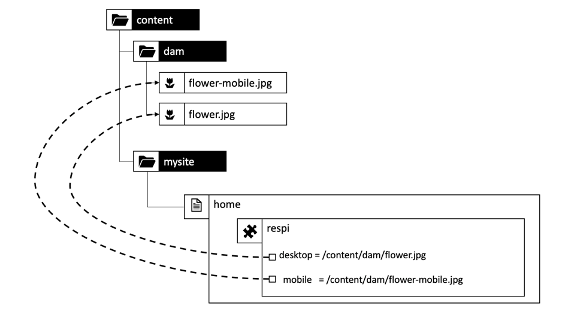

*Resource-structure of the responsive image in the CRX*

<br>&nbsp;

The components markup is rendered like this,

```plain

  #GET /content/home.html

  <html>

  …

  <div class="responsive-image>

  <picture>
    <source src="/content/home/jcr:content/par/respi.img.mobile.jpg" …/>
    <source src="/content/home/jcr:content/par/respi.img.jpg …/>

    …

  </picture>
  </div>
  …

```

and... we have finished with our nicely encapsulated component.

#### Responsive Image Component in Action

Now a user requests the page – and the assets via the Dispatcher. This results in files in the Dispatcher filesystem as illustrated below,

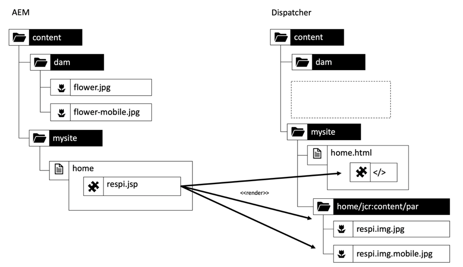

*Cached structure of the encapsulated responsive image component*

<br>&nbsp;

Consider a user uploads and activates a new version of the two flower images to the DAM. AEM will send according invalidation request for

`/content/dam/flower.jpg`

and

`/content/dam/flower-mobile.jpg`

to the Dispatcher. These requests are in vain, though. The contents have been cached as files below the component's substructure. These files are now stale but still served upon requests.

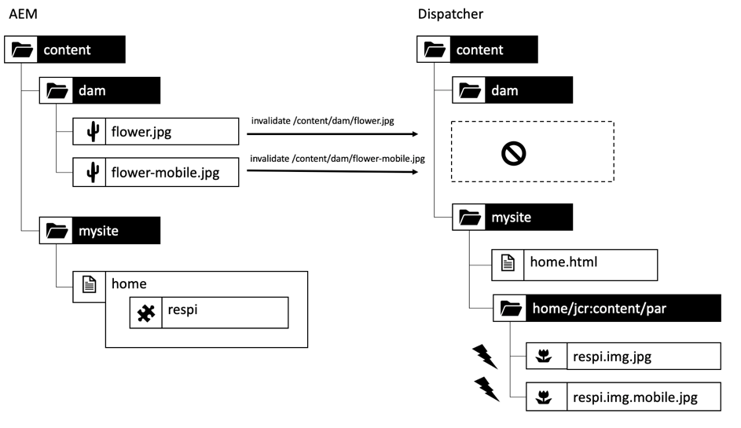

*Structure mismatch leading to stale content*

<br>&nbsp;

There is another caveat to this approach. Consider you use the same flower.jpg on multiple pages. Then you will have the same asset cached under multiple URLs or files,

```
/content/home/products/jcr:content/par/respi.img.jpg

/content/home/offers/jcr:content/par/respi.img.jpg

/content/home/specials/jcr:content/par/respi.img.jpg

…
```

Each time, a new and un-cached page is requested, the assets are fetched from AEM at different URLs. No Dispatcher caching and no browser caching can speed up the delivery.

#### Where the Spooler Pattern Shines

There is one natural exception, where this pattern even in its simple form is useful: If the binary is stored in the component itself – and not in the DAM. This however is useful only for images used once on the website, and not storing assets in the DAM means that you have a hard time managing your assets. Just imagine your usage license for a particular asset run out. How can you find out on which components you have used the asset?

You see? The "M" in DAM stands for "Management" – as in Digital Asset Management. You don't want to give that feature away.

#### Conclusion

From an AEM developer's perspective the pattern looked super elegant. But with the Dispatcher taken into the equation, you might agree, that the naïve approach might not be sufficient.

We leave it up to you to decide whether this is a pattern or an anti-pattern for now. And maybe you already have some good ideas in mind how to mitigate the issues explained above? Good. Then you will be eager to see how other projects have solved these issues.

### Solving Common Dispatcher Issues

#### Overview

Let's talk about how that could have been implemented a bit more cache-friendly. There are several options. Sometimes you cannot pick the best solution. Maybe you come into an already running project and you have limited budget to just fix the "cache problem" at hand and not enough to do a fully-fledged refactoring. Or you face a problem, that is a more complex than the example image component.

We will outline the principles and the caveats in the following sections.

Again, this is based on real-life experience. We have seen all those patterns in the wild already so it's not an academic exercise. This is why we are showing you some anti-patterns, so you have the chance to learn from mistakes others already have made.

#### Cache killer

>[!WARNING]
>
>This is an anti-pattern. Do not use it. Ever.

Have you ever seen query parameters like `?ck=398547283745`? They are called  cache-killer ("ck"). The idea is, that if you add any query parameter the resource will not be acched. Moreover, if you add a random number as the parameter's value (like "398547283745") the URL becomes unique and you make sure, that no other cache between the AEM system and your screen is able to cache either. Usual in-between suspects would be a "Varnish" cache in front of the Dispatcher, a CDN or even the browser cache. Again: Don't do that. You do want your resources to be cached as much and as long as possible. The cache is your friend. Don't kill friends.

#### Auto Invalidation

>[!WARNING]
>
>This is an anti-pattern. Avoid using it for digital assets. Try to keep the Dispatcher's default configuration, which > is auto invalidation for ".html" files, only

On a short term, you can add ".jpg" and ".png" to the auto-invalidation configuration in the Dispatcher. This means, that whenever an invalidation occurs, all ".jpg", ".png" and ".html" need to be re-rendered.

This pattern is super easy implemented if business owners complain about not seeing their changes materialize on the live site fast enough. But this can only buy you some time to come up with a more sophisticated solution.

Make sure that you understand the vast performance impacts. This will slow your website down significantly and could even impact the stability – if your site is a high load website with frequent changes – such as a news portal.

#### URL fingerprinting

A URL fingerprint looks like a cache-killer. But it's not. It's not a random number but a value that characterizes the contents of the resource. This can be a hash of the resource's content or - even more simple - a timestamp when the resource was uploaded, edited or updated.

A Unix-timestamp is good enough for a real-world implementation. For better readability we are using a more readable format in this tutorial: `2018 31.12 23:59 or fp-2018-31-12-23-59`.

The fingerprint must not be used as a query parameter, as URLs with query parameters   cannot be cached. You can use a selector or the suffix for the fingerprint.

Let's assume, the file `/content/dam/flower.jpg` has a `jcr:lastModified` date of December 31st in 2018, 23:59. The URL with the fingerprint is `/content/home/jcr:content/par/respi.fp-2018-31-12-23-59.jpg`.

This URL remains stable, as long as the referenced resource (`flower.jpg`) file is not changed. So it can be cached for an indefinite amount of time and it is not a cache killer.

Note, this URL needs to be created and served by the responsive image component. It's not an out-of-the-box AEM functionality.

That's the basic concept. There are however a few details that might easily be overlooked.

In our example, the component was rendered and cached at 23:59. Now the image has been changed let's say at 00:00.  The component _would_ generate a new fingerprinted URL in its markup.

You might think it _should_…  but it doesn't. As only the binary of the image has been changed and the including page was not touched, re-rendering of the HTML markup is not required. So, the Dispatcher serves the page with the old fingerprint, and thus the old version of the image.

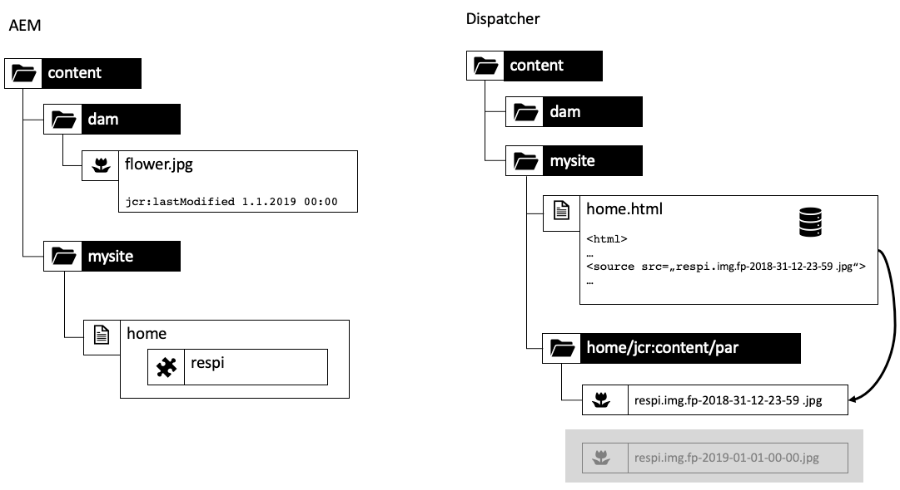

*Image component more recent than referenced image, no fresh fingerprint rendered.*

<br>&nbsp;

Now, if you re-activated the home page (or any other page of that site) the statfile would be updated, the Dispatcher would consider the home.html stale and re-render it with a new fingerprint in the image component.

But we didn't activate the home page, right? And why should we activate a page we didn't touch it anyway? And besides, maybe the we don't have sufficient rights to activate pages or the approval workflow is so long and time consuming, that we simply can't do that on short notice. So - what to do?

#### The Lazy Admin's Tool - Decreasing Statfile Levels

>[!WARNING]
>
>This is an anti-pattern. Use it only on short term to buy some time and come up with a more sophisticated solution.

The lazy admin usually "_sets auto-invalidation to jpgs and the statfile-level to zero - that always helps with caching issues of all kinds_." You'll find that advice in tech forums, and it helps with your invalidation issue.

Until now we haven't discussed the statfile-level. Basically, auto-invalidation only works for files in the same subtree. The issue however is that pages and assets usually do not live in the same sub-tree. Pages are somewhere below `/content/mysite` whereas assets live below `/content/dam`.

The "statfile level" defines where at what depth root nodes of the sub-trees are. In the example above the level would be "2" (1=/content, 2=/mysite,dam)   

The idea of "decreasing" the statfile level to 0 basically is to define the whole /content tree as the one and only subtree to make pages and assets live in the same auto invalidation domain. So we would have only on big tree at level (at the docroot "/"). But doing so auto-invalidates all sites on the server whenever something is published – even on completely unrelated sites. Trust us: This is a bad idea in the long run, because you will degrade your overall cache hit rate severely. All you can do is hope that your AEM servers have enough firepower to run without cache.

You will understand the full benefits of deeper statfile levels a bit later.

#### Implementing a Custom Invalidation Agent

Anyway – we need to tell the Dispatcher somehow, to invalidate the HTML-Pages if a ".jpg" or ".png" changed to allow re-rendering with a fresh URL.

What we have seen in projects is - for instance - special replication agents on the publish system that send invalidation requests for a site whenever an image of that site is published.

Here it helps a lot if you can derive the site's path from the asset's path by naming convention.

Generally speaking, it is a good idea to match the sites and the asset paths like this:

**Example**

```
/content/dam/site-a
/content/dam/site-b

/content/site-a
/content/site-b
```

This way your custom Dispatcher Flushing agent could easily send and invalidation request to /content/site-a when it encounters a change on `/content/dam/site-a`.

Actually, it doesn't matter which path you tell the Dispatcher to invalidate – as long as it is in the same site, in the same "subtree". You don't even have to use a real resource path. It can be "virtual" as well:

`GET /dispatcher-invalidate
Invalidate-path /content/mysite/dummy`


1. A listener on the publish system is triggered when a file in the DAM changes

2. The listener sends an invalidation request to the Dispatcher. Due to auto-invalidation it doesn't matter which path we send in the auto-invalidation, unless it is under the site's homepage – or more precise in the sites statfile level.

3. The statfile is updated.

4. The next time, the homepage is requested, it is re-rendered. The new fingerprint/ date is taken from the image's lastModified property as an additional selector

5. This implicitly creates a reference to a new image

6. If the image actually is requested a new rendition is created and stored in the Dispatcher


#### The Necessity of Cleaning Up

Phew. Finished. Hurray! 

Well… not quite yet.

The path,

`/content/mysite/home/jcr:content/par/respi.img.fp-2018-31-12-23-59.jpg`

does not relate to any of the invalidated resources. Remember? We only invalidated a "dummy" resource and relied on auto-invalidation to consider "home" to be invalid. The image itself might never be _physically_ deleted. So, the cache will grow and grow and grow. When images are changed and activated, they get new filenames in the Dispatcher's filesystem.

There are three issues with not physically deleting the cached files and keeping them indefinitely:

1. You are wasting storage capacity – quite obviously. Granted – storage has become cheaper and cheaper in the past years. But image resolutions and file sizes have also grown in the past years – with the advent of retina-like displays which are hungry for crystal-sharp images.

2. Even though hard drives have become cheaper, "storage" might not have become cheaper. We have seen a trend to not have (cheap) bare metal HDD storage but rental virtual storage on a NAS by your data center provider. This kind of storage is a bit more reliable and scalable but also a bit more expensive. You may not want to waste it by storing outdated garbage. This not only relates to the primary storage – think of backups too. If you have an out-of-the-box backup solution you might not be able to exclude the cache-directories. In the end you are also backing up garbage data.

3. Even worse: You might have bought usage licenses for certain images only for a limited time – as long as you needed them. Now, if you still store the image after a license has expired, that might be seen as a copyright infringement. You might not use the image in you web pages any longer – but Google still will find them.

So finally, you will come up with some housekeeping cronjob to clean all files older than... let's say a week to keep this kind of littering under control.

#### Abusing URL Fingerprints for Denial of Service Attacks

But wait, there is another flaw in this solution:

We are kind of abusing a selector as a parameter: fp-2018-31-12-23-59 is generated dynamically as some kind of "cache-killer". But maybe some bored kid (or a search engine crawler that has gone wild) starts requesting the pages:

```
/content/mysite/home/jcr:content/par/img.fp-0000-00-00-00-00.jpg
/content/mysite/home/jcr:content/par/img.fp-0000-00-00-00-01.jpg
/content/mysite/home/jcr:content/par/img.fp-0000-00-00-00-02.jpg

…
```

Each request will bypass the Dispatcher, causing load on a Publish instance. And – even worse – create an according file on the Dispatcher.

So… instead of just using the fingerprint as a simple cache-killer, you would have to check the jcr:lastModified date of image and return a 404 if it is not the expected date. That takes some time and CPU cycles on the Publish system… which is what you wanted to prevent in the first place.

#### Caveats of URL Fingerprints in High Frequency Releases

You can use the fingerprinting schema not only for assets that come from the DAM but also for JS- and CSS-files and related resources. 

[Versioned Clientlibs](https://adobe-consulting-services.github.io/acs-aem-commons/features/versioned-clientlibs/index.html) is a module that uses this approach.

But here you could face another caveat having URL fingerprints: It ties the URL to the content. You cannot change the content without also changing the URL (aka., update the modification date). That is what the fingerprints are designed for in the first place. But consider, you are rolling out a new release, with new CSS and JS files and thus new URLs with new fingerprints. All of your HTML pages still have references to the old fingerprinted URLs. So, to make the new release consistently work, you need to invalidate all HTML pages at once to force a re-rendering with references to the the newly fingerprinted files. If you have multiple sites relying on the same libraries, that can be a considerable amount of re-rendering – and here you cannot leverage the `statfiles`. So be prepared to see load peaks on your Publish systems after a rollout. You might consider a blue-green deployment with cache warming or maybe a TTL-based cache in front of your Dispatcher ... the possibilities are endless.

#### A Short Break 

Wow - That's quite a lot of details to be considered, right? And it refuses to be understood, tested and debugged easily. And all for a seemingly elegant solution. Admittedly, it is elegant – but only from an AEM-only perspective. Together with the Dispatcher it becomes nasty.

And still – it does not solve one basic caveat, if an image is used multiple times on different pages, they will be cached under those pages. There is not much caching synergy there.

In general, URL fingerprinting is a good tool to have in your toolkit, but you need to apply it with care, because it can cause new problems while solving only a few existing ones.

So... that was a long chapter. But we have seen this pattern so often, that we felt it's necessary to give you the whole picture with all pros and cons. The URL Fingerprints solve a few of the inherent problem in the Spooler Pattern, but the effort to implement is quite high and you need to consider other - easier - solutions as well. Our advice is to always check if you can base your URLs on the served resources paths and not have an intermediate component. We will get to this in the next chapter.

##### Runtime Dependency Resolution

Runtime Dependency Resolution is a concept that we have been considering in one project. But thinking it through it became quite complex and we decided not to implement it.

Here is the basic idea:

The Dispatcher does not know about the dependencies of resources. It's just a bunch of single files with little semantics.

AEM also knows little about dependencies. It lacks a proper semantics or a "dependency tracker".

AEM is aware of some of the references. It uses this knowledge to warn you when you try to delete or move a referenced page or asset. It does so by querying the internal search when deleting an asset. Content references do have a very particular form. They are path-expressions starting with "/content". So, they can easily be full-text indexed – and queried for when necessary.

In our case, we would need a customized replication agent on the Publish system, that triggers a search for a specific path when that path has changed.

Let's say

`/content/dam/flower.jpg`

Has changed on Publish. The agent would fire up a search for "/content/dam/flower.jpg" and find all pages referencing those images.

It could then issue a number of invalidation requests to the Dispatcher. One for each page containing the asset.

In theory, that should work. But only for first level dependencies. You wouldn't want to apply that scheme for multi-level dependencies, for instance when you use the image on an experience fragment that is used on a page. Actually, we believe that approach is too complex – and there might be run-time issues. And generally the best advice is to not do expensive computing in event handlers. And especially searching can become quite expensive.

##### Conclusion

We hope we have discussed the Spooler Pattern thoroughly enough to help you to decide when to use and not use it in your implementation.

## Avoiding Dispatcher Issues

### Resource based URLs

A much more elegant way to solve the dependency problem is to not have dependencies at all. Avoid artificial dependencies that occur when using one resource to simply proxy another one – as we did in the last example. Try to see resources as "solitary" entities as often as possible.

Our example is easily solved:

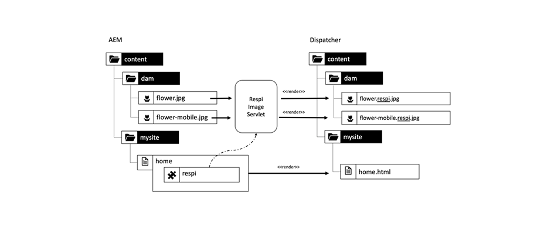

*Spooling the image with a servlet that is bound to the image, not the component.*

<br>&nbsp;

We use the assets original resource paths to render the data. If we need to render the original image as is, we can just use AEMs default renderer for assets.

If we need to do some special processing for a specific component, we would register a dedicated servlet on that path and selector to do the transformation on behalf of the component. We did that here exemplary with the ".respi." selector. It is wise to keep track of the selector names that are used on the global URL space (such as `/content/dam`) and have a good naming convention to avoid naming conflicts.

By the way - we don't see any issues with code coherence. The servlet can be defined in the same Java package as the components sling model.

We can even use additional selectors in the global space such as,

`/content/dam/flower.respi.thumbnail.jpg`

Easy, right? Then why do people come up with complicated patterns like the Spooler?

Well, we could solve the problem avoiding the internal content-reference because the outer component added little value or information to the rendering of the inner resource, that it could easily be encoded in set of static selectors that control the representation of a solitary resource.

But there is one class of cases that you cannot easily solve with a resource-based URL. We call this type of case, "Parameter Injecting Components", and discuss them in the next chapter.

### Parameter Injecting Components

#### Overview

The Spooler in the last chapter was just a thin wrapper around a resource. It caused more trouble than help solving the problem.

We could easily substitute that wrapping by using a simple selector and add an according servlet to serve such requests.

But what if the "respi" component is more than just a proxy. What if the component genuinely contributes to the rendering of the component?

Let us introduce a small extension of our "respi" component, that is a bit of a game changer. Again, we will first introduce some naïve solutions to tackle the new challenges and show where they fall short.

#### The Respi2 Component

The respi2 component is a component that displays a responsive image - as is the respi component. But it has a slight add-on,

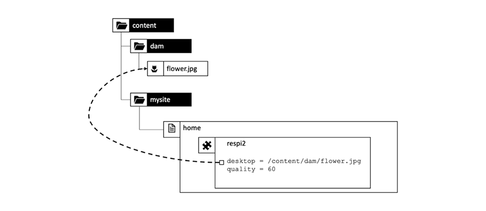

*CRX structure: respi2 component adding a quality property to the delivery*

<br>&nbsp;

The images are jpegs, and jpegs can be compressed. When you compress a jpeg image you trade quality for file size. Compression is defined as a numeric "quality" parameter ranging from "1" to "100". "1" means "small but poor quality", "100" stands for "excellent quality but large files". So which is the perfect value then?

As in all IT things, the answer is: "It depends."

Here it depends on the motif. Motifs with high contrast edges like motifs including written text, photos of buildings, illustrations, sketches or photos of product boxes (with sharp contours and text written on it) usually fall into that category. Motifs with softer color- and contrast transitions like landscapes or portraits can be compressed a bit more without visible quality loss. Nature photographs usually fall into that category.

Also – depending on where the image is used - you might want to use a different parameter. A small thumbnail in a teaser might endure a better compression than the same image used in a screen-wide hero banner. That means, that the quality parameter is not innate to the image, but to the image and the context. And to the author's taste.

In short: There is no perfect setting for all pictures. There is no one-size-fits-all. It's best the author decides. He will tweak the "quality" parameter as a property in the component until he is satisfied with the quality and will not go any further to not sacrifice bandwidth.

We now have a binary file in the DAM and a component, that provides a quality property. What should the URL look like? Which component is responsible for spooling?

#### Naïve Approach 1: Pass Properties as Query Parameters

>[!WARNING]
>
>This is an anti-pattern. Do not use it.

In the last chapter our image URL rendered by the component looked like this:

`/content/dam/flower.respi.jpg`

All that is missing is the value for the quality. The component knows what property is entered by the author… It could easily be passed to the image rendering servlet as a query parameter when the markup is rendered, like `flower.respi2.jpg?quality=60`:

```plain
  <div class="respi2">
  <picture>
    <source src="/content/dam/flower.respi2.jpg?quality=60" …/>
    …
  </picture>
  </div>
  …
```

This is a bad idea. Remember? Requests with query parameters are not cacheable.

#### Naïve Approach 2: Pass Additional Information as Selector

>[!WARNING]
>
>This might become an anti-pattern. Use it carefully.

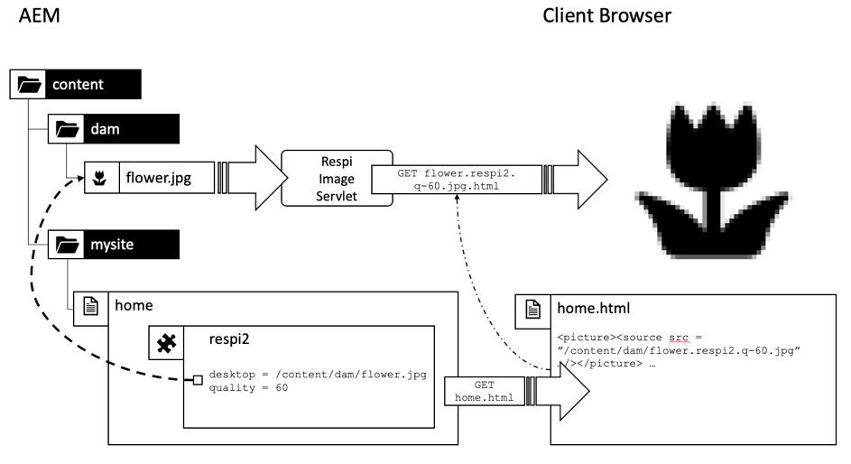

*Passing Component Properties as Selectors*

<br>&nbsp;

This is a slight variation of the last URL. Only this time we use a selector to pass the property to the servlet, so that the result is cacheable:

`/content/dam/flower.respi.q-60.jpg`

This is much better, but remember that nasty script-kid from the last chapter who looks out for such patterns? He would see how far he can get with looping over values:

```plain
  /content/dam/flower.respi.q-60.jpg
  /content/dam/flower.respi.q-61.jpg
  /content/dam/flower.respi.q-62.jpg
  /content/dam/flower.respi.q-63.jpg
  …
```

This again is bypassing the cache and creating load on the publish system. So, it might be a bad idea. You can mitigate this by filtering only a small subset of parameters. You want to allow only `q-20, q-40, q-60, q-80, q-100`.

#### Filtering of Invalid Requests When Using Selectors

Reducing the number of selectors was a good start. As a rule of thumb, you should always limit the number of valid parameters to an absolute minimum. If you do that cleverly you can even leverage a Web Application Firewall outside AEM using a static set of filters without deep knowledge of the underlying AEM system to protect your systems:

`Allow: /content/dam/(-\_/a-z0-9)+/(-\_a-z0-9)+
       \.respi\.q-(20|40|60|80|100)\.jpg`

If you don't have a Web Application Firewall you have to filter in the Dispatcher or in AEM itself. If you do it in AEM, please make sure that

1. The filter is implemented super efficiently, without accessing the CRX too much and wasting memory and time.

2. The filter responds a "404 – Not found"  error message

Let's stress the last point again. The HTTP conversation would look like this:

```plain
  GET /content/dam/flower.respi.q-41.jpg

  Response: 404 – Not found
  << empty response body >>
```

We have also seen implementations, that did filter invalid parameters but returned a valid fallback rendering when an invalid parameter is used. Let's assume, we only allow parameters from 20-100. The values in between are mapped to the valid ones. So,

`q-41, q-42, q-43, …`

would always respond the same image as q-40 would have:

```plain
  GET /content/dam/flower.respi.q-41.jpg

  Response: 200 – OK
  << flower.jpg with quality = 40 >>
```

That approach is not helping at all. These requests actually are valid requests.  They consume processing power and take up space in the cache directory on the Dispatcher.

Better is to return a `301 – Moved permanently`:

```plain
  GET /content/dam/flower.respi.q-41.jpg

  Response: 301 – Moved permanently
  Location: /content/dam/flower.respi.q-40.jpg
```

Here AEM is telling the browser. "I don't have `q-41`. But hey – you can ask me about `q-40` ".

That adds an additional request-response loop to the conversation, which is a bit of overhead, but it is cheaper than doing the full processing on `q-41`. And you can leverage the file that is already cached under `q-40`. You have to understand though, that 302 responses are not cached in the Dispatcher, we are talking about logic that is executed in the AEM. Over and over again. So you better make it slim and fast.

We personally like the 404 respond the most. It makes it super obvious what is happening. And helps detecting errors on your website when you are analyzing logfiles. 301s can be intended, where 404 always should be analyzed and eliminated.

## Security – Excursion

### Filtering Requests

#### Where to Filter Best

At the end of the last chapter we pointed out the necessity of filtering incoming traffic for known selectors. That leaves the question: Where should I actually filter requests?

Well – it depends. The sooner the better.

#### Web Application Firewalls

If you have a Web Application Firewall appliance or "WAF" that is designed for Web Security, you absolutely should leverage these capabilities. But you might find out, that the WAF is operated by people with only limited knowledge of your content application and they either filter valid requests or let pass too many harmful requests. Maybe you will find out that the people operating the WAF are assigned to a different department with different shifts and release schedules, communication might not be as tight as with your direct teammates and you don't always get the changes in time, which means that ultimately your development and content velocity suffer.

You might end up with a few general rules or even a blocklist, which your gut feeling says, could be tightened up.

#### Dispatcher- and Publish Filtering

Next step is adding URL filtering rules in the Apache core and/or in the Dispatcher.

Here you have access to URLs only. You are limited to pattern-based filters. If you need to set up a more content-based filtering (like allowing files only with a correct time-stamp) or you want some of the filtering controlled on your Author – you will end up writing something like a custom servlet filter.

#### Monitoring and Debugging

In practice you will have some security on each level. But please make sure you have means to find out at what level a request is filtered out. Make sure you have direct access to the Publish system, to the Dispatcher and to the log files on the WAF to find out which filter in the chain is blocking requests.

### Selectors and Selector Proliferation

The approach using "selector-parameters" in the last chapter is quick and easy and can speed up the development time of new components, but it has limits.

Setting a "quality" property is only a simple example. But let's say, the servlet also expects parameters for "width" to be more versatile.

You could reduce the number of valid URLs by reducing the number of possible selector values. You can do the same with the width as well:

quality = q-20, q-40, q-60, q-80, q-100

width = w-100, w-200, w-400, w-800, w-1000, w-1200

But all combinations are now valid URLs:

```
/content/dam/flower.respi.q-40.w-200.jpg
/content/dam/flower.respi.q-60.w-400.jpg
…
```

Now we have already 5x6=30 valid URLs for one resource. Each additional property adds to the complexity. And there might be properties, that cannot be reduced to a reasonable amount of values.

So, also this approach has limits.

#### Inadvertently Exposing an API

What is happening here? If we look carefully, we see, that we are gradually moving from a statically rendered to highly dynamic website. And we are inadvertently surfacing an image rendering API to the customer's browser that actually was intended to be used by authors only.

Setting quality and size of an image should be done by the author editing the page. Having the same capabilities exposed by a servlet could be seen as a feature or as vector for a Denial of Service attack. What it actually is, depends on the context. How business critical is the website? How much load is on the servers? How much headroom is left? How much budget do you have for implementation? You have to balance these factors. You should be aware of the pros and cons.

## The Spooler Pattern - Revisited and Rehabilitated

### How the Spooler Avoids Exposing the API

We kind of discredited the Spooler pattern in the last chapter. It's time to rehabilitate it.

 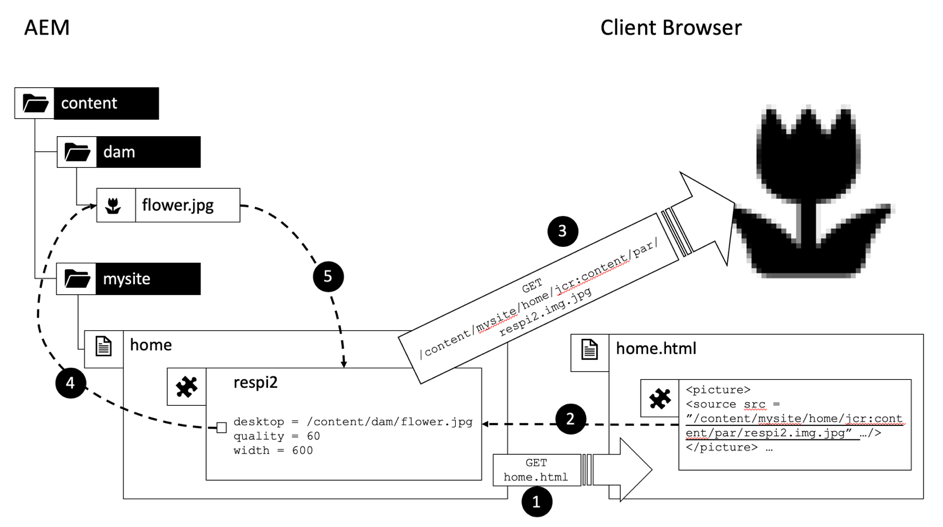

The Spooler Pattern prevents the issue with exposing an API that we discussed in the last chapter. The properties are stored and encapsulated in the component. All we need to access these properties is the path to the component. We don't have to use the URL as a vehicle to transmit the parameters between markup and binary render:

1. The client renders the HTML markup when the component is requested within the primary request loop

2. The component path serves as a backreference from the markup to the component

3. The browser uses this backreference to request the binary

4. As the request hits the component, we have all properties in our hand to resize, compress and spool the binary data

5. The image is transmitted through the component to the client browser

The Spooler Pattern is not so bad after all, that's why it is so popular. If it only where not so cumbersome when it comes to cache invalidation…

### The Inverted Spooler - Best of Both Worlds?

That brings us to the question. Why can't we just get the best of both worlds? The good encapsulation of the Spooler Pattern and the nice caching properties of a Resource Based URL?

We have to admit, that we haven't seen that in a real live project. But let us dare a little thought-experiment here anyway - as a starting point for your own solution.

We will call this pattern the _Inverted Spooler_.. The Inverted Spooler has to be based on the images resource, to have all the nice cache invalidation properties.

But it must not expose any parameters. All properties should be encapsulated in the component. But we can expose the components path – as an opaque reference to the properties.

That leads to a URL in the form:

`/content/dam/flower.respi3.content-mysite-home-jcrcontent-par-respi.jpg`

`/content/dam/flower` is the path to the image's resource

`.respi3` is a selector to select the correct servlet to deliver the image

`.content-mysite-home-jcrcontent-par-respi` is an additional selector. It encodes the path to the component that stores the property necessary for the image transformation. Selectors are limited to a smaller range of characters than paths. The encoding scheme here is just exemplary. It substitutes "/" with "-". It is not taking into account, that the path itself can contain "-" as well. A more sophisticated encoding scheme would be advised in a real-world example. Base64 should be ok. But it makes debugging a bit harder.

`.jpg` is the files suffix

### Conclusion

Wow… the discussion of the spooler got longer and more complicated than expected. We owe you an excuse. But we felt it is necessary to present you a multitude of aspects – good and bad ones – so that you can develop some intuition about what works well in Dispatcher-land and what doesn't.

## Statfile and Statfile-Level

### The Basics

#### Introduction

We already briefly mentioned the _statfile_ before. It is related to auto-invalidation: 

All cache files in the Dispatcher's filesystem that are configured to be auto-invalidated are considered invalid if their last-modified date is older than the `statfile's` last-modified date.

>[!NOTE]
>
>The last-modified date we are talking of is the cached file is the date the file was requested from the client's browser and ultimately created in the filesystem. It is not the `jcr:lastModified` date of the resource.

The last-modified date of the statfile (`.stat`) is the date the invalidation request from AEM was received on the Dispatcher.

If you have more than one Dispatcher, this can lead to strange effects. Your browser can have a more recent version a Dispatchers (if you have more than one Dispatcher). Or a Dispatcher might think that the browser's version that was issued by the other Dispatcher is outdated and unnecessarily sends a new copy. These effects don't have a significant impact on the performance or the functional requirements. And they will level out over time, when the browser has the latest version. However, it can be a bit confusing when you are optimizing and debugging the browser caching behavior. So be warned.

#### Setting up Invalidation Domains with /statfileslevel

When we introduced auto-invalidation and the statfile we said, that *all* files are considered invalid when there is any change and that all files are interdependent anyway.

That's not quite accurate. Usually, all files that share a common main navigation root are interdependent. But one AEM instance can host a number of websites - *independent* websites. Not sharing a common navigation – in fact, not sharing anything.

Wouldn't it be a waste to in invalidate Site B because there is a change in Site A? Yes, it is. And it doesn't have to be like that.

The Dispatcher provides a simple means to separate the sites from each other: The `statfiles-level`.

It is a number that defines from which level in the filesystem on, two subtrees are considered "independent".

Let's look at the default case where the statfileslevel is 0.

 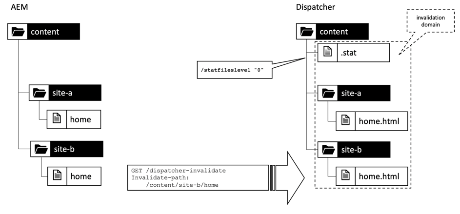

`/statfileslevel "0":` The `.stat` file is created in the docroot. The invalidation domain spans the whole installation including all sites.

Whichever file is invalidated, the `.stat` file at the very top of the dispatchers docroot is always updated. So when you invalidate `/content/site-b/home`, also all files in `/content/site-a` are invalidated too, as they are now older than the `.stat` file in the docroot. Clearly not what you need, when you invalidate `site-b`.

In this example you would rather set the `statfileslevel` to `1`.

Now if you publish - and thus invalidate `/content/site-b/home` or any other resource below `/content/site-b`, the `.stat` file is created at `/content/site-b/`.

Content below `/content/site-a/` is not affected. This content would be compared to a `.stat` file at `/content/site-a/`. We have created two separate invalidation domains.

 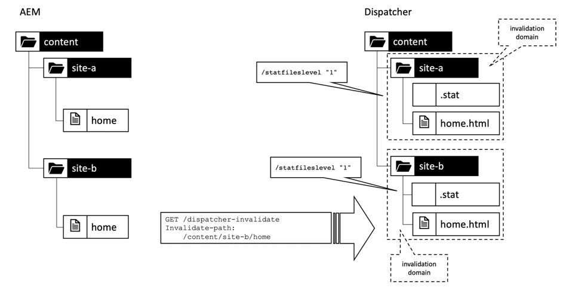

*A statfileslevel "1" creates different invalidation domains*

<br>&nbsp;

Large installations usually are structured a bit more complex and deeper. A common scheme is to structure sites by brand, country and language. In that case you can set the statfileslevel even higher. _1_ would create invalidation domains per brand, _2_ per country and _3_ per language.

### Necessity of a Homogenous Site Structure

The statfileslevel is applied equally to all sites in your setup. Therefore, it is necessary to have all sites following the same structure and start at the same level.

Consider you have some brands in your portfolio that are sold only on a few small markets while others are sold worldwide. The small markets happen to have only one local language while in the global market there are countries where more than one language is spoken:

```plain
  /content/tiny-local-brand/finland/home
  /content/tiny-local-brand/finland/products
  /content/tiny-local-brand/finland/about
                              ^
                          /statfileslevel "2"
  …

  /content/tiny-local-brand/norway
  …

  /content/shiny-global-brand/canada/en
  /content/shiny-global-brand/canada/fr
  /content/shiny-global-brand/switzerland/fr
  /content/shiny-global-brand/switzerland/de
  /content/shiny-global-brand/switzerland/it
                                          ^
                                /statfileslevel "3"
  ..
``` 

The former would require a `statfileslevel` of _2_, while the latter requires _3_.

Not an ideal situation. If you set it to _3_, then auto invalidation would not work within the smaller sites between the sub-branches `/home`, `/products` and `/about`.

 Setting it to _2_ means, that in the larger sites you are declaring `/canada/en` and `/canada/fr` dependent, which they might not be. Thus each invalidation in `/en` would also invalidate `/fr`. This will lead to a slightly decreased cache hit rate, but still is better than delivering stale cached content.

The best solution of course is to make all sites' roots equally deep:

```
/content/tiny-local-brand/finland/fi/home
/content/tiny-local-brand/finland/fi/products
/content/tiny-local-brand/finland/fi/about
…
/content/tiny-local-brand/norway/no/home
                                 ^
                        /statfileslevel "3"
```

### Inter-Site linking

Now which is the right level? That depends on the number of dependencies you have between the sites. Inclusions that you resolve for rendering a page are considered "hard dependencies". We demonstrated such an _inclusion_ when we introduced the _Teaser_ conponent at the beginning of this guide. 

_Hyperlinks_ are a softer form of dependencies. It is very likely, that you will hyperlinks within one website... and not unlikely that you have links between your websites. Simple Hyperlinks usually do not create dependeencies between websites. Just think of an external link you set from your site to facebook... You wouldn't have to render your page if anything changes on facebook and vice versa, right?

A dependency occurs, when you read content from the linked resource (e.g., the navigation title). Such dependencies can be avoided if you just rely on locally entered navigation titles and not draw them from the target page (as you would with external links).

#### An Unexpected Dependency

However, there might be a portion of your setup, where - supposedly independent - sites come together. Let us look at a real-world scenario we came across in one of our projects.

The customer had a site-structure like the one sketched in the last chapter:

```
/content/brand/country/language
```

For example,

```
/content/shiny-brand/switzerland/fr
/content/shiny-brand/switzerland/de

/content/shiny-brand/france/fr

/content/shiny-brand/germany/de
```

Each country had its own domain,

```
www.shiny-brand.ch

www.shiny-brand.fr

www.shiny-brand.de
```

There were no navigable links between the language sites and no apparent inclusions, so we set the statfileslevel to 3. 

All sites basically served the same content. The only major difference was the language.

Search engines like Google consider having the same content on different URLs "deceptive". A user might want try to get ranked higher or listed more often by creating farms serving identical content. Search engines recognize these attempts and actually rank pages lower that simply recycle content.

You can prevent being down-ranked  by making transparent, that you actually have more than one page with the same content, and that you are not attempting to "game" the system (see ["Tell Google about localized versions of your page"](https://support.google.com/webmasters/answer/189077?hl=en)) by setting `<link rel="alternate">` tags to each related page in the header section of each page:

```
# URL: www.shiny-brand.fr/fr/home/produits.html

<head>

  <link rel="alternate" 
        hreflang="fr-ch" 
        href="http://www.shiny-brand.ch/fr/home/produits.html">
  <link rel="alternate" 
        hreflang="de-ch" 
        href="http://www.shiny-brand.ch/de/home/produkte.html">
  <link rel="alternate" 
        hreflang="de-de" 
        href="http://www.shiny-brand.de/de/home/produkte.html">

</head>

----

# URL www.shiny-brand.de/de/home/produkte.html

<head>

  <link rel="alternate" 
        hreflang="fr-fr" 
        href="http://www.shiny-brand.fr/fr/home/produits.html">
  <link rel="alternate" 
        hreflang="fr-ch" 
        href="http://www.shiny-brand.ch/fr/home/produits.html">
  <link rel="alternate" 
        hreflang="de-ch"
         href="http://www.shiny-brand.ch/de/home/produits.html">

</head>
```

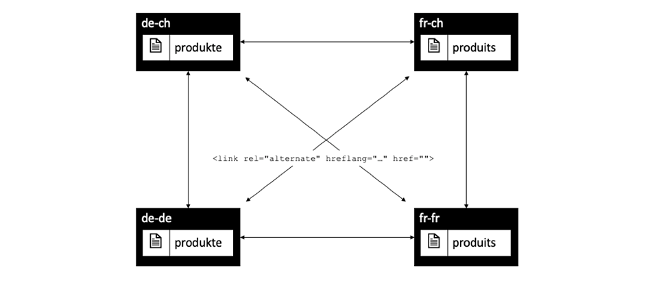

*Inter-linking all*

<br>&nbsp;

Some SEO experts even argue, that this could transfer reputation or "link-juice" from a high-ranked website in one language to the same website in a different language. 

This scheme created not only a number of links but also some problems. The number of links that are required for _p_ in _n_ languages is _p x (n<sup>2</sup>-n)_: Each page links to each other page (_n x n_) except to itself (_-n_). This scheme is applied to each page. If we have a small site in 4 languages with 20 pages, each this amounts to _240_ links.   

First you do not want an editor to have to manually maintain these links – they have to be generated by the system automatically. 

Second, they should be accurate. Whenever the system detects a new "relative", you want to link it from all other pages with the same content (but in different language).

In our project, new relative pages popped up frequently. But they didn't materialize as "alternate" links. For instance, when the `de-de/produkte` page was published on the German website, it wasn't immediately visible on the other sites.

The reason was, in our setup the sites were supposed to be independent. So a change on the German website did not trigger an in invalidation on the French website.

You know one solution already how to solve that issue. Just decrease the statfileslevel to 2 to broaden the invalidation domain. Of course, that also decreases the cache hit ratio - especially when publications - and thus invalidations occur more frequently. 

In our case it was even more complicated:

Even though we had the same content, the actual not brand-names were different in each country.

`shiny-brand` was called `marque-brillant` in France and `blitzmarke` in Germany:

```
/content/marque-brillant/france/fr
/content/shiny-brand/switzerland/fr
/content/shiny-brand/switzerland/de
/content/blitzmarke/germany/de
…
```

That would have meant to set the `statfiles` level to 1 - which would have resulted in too huge an invalidation domain.

Restructuring the site would have fixed that. Merging all brands together under one common root. But we didn't have the capacity back then, and – that would have given us only a level 2.

We decided to stick with level 3 and payed the price of not always having up-to-date "alternate" links. To mitigate, we had a "reaper" cron-job running on the Dispatcher which would clean up files older than 1 week  anyway. So eventually all pages were re-rendered anyway at some point in time. But that is a trade-off that needs to be decided individually in each project.

## Conclusion

We covered some basic principles on how the Dispatcher is working in general and we gave you some examples where you might have to put in a bit more implementation effort to get it right and where you might want to make trade-offs.

We didn't go into details on how that is configured in the Dispatcher. We wanted you to understand the basic concepts and problems first, without losing you to the console too early. And – the actual configuration work is well documented – if you understand the basic concepts, you should know what the various switches are used for.

## Dispatcher Tips and Tricks

We will conclude the first part of this book with a random collection of hints and tricks that might be useful in one situation or another. As we did before, we are not presenting the solution, but the idea so that you get the chance to understand the idea and concept and link to articles describing the actual configuration in more detail.

### Correct Invalidation Timing

If you install an AEM Author and Publish out of the box, the topology is a bit odd. The author sends the content to the Publish systems and the invalidation request to the Dispatchers at the same time. As both, the Publish systems and the Dispatcher, are decoupled from the Author by queues the timing can be a bit unfortunate. The Dispatcher can receive the invalidation request from the Author before the content is updated on the Publish system.

If a client requests that content in the meantime, the Dispatcher will request and store stale content.

A more rliable setup is sendingh the invalidation request from the Publish systems _after_ they have received the content. The article "[Invalidating Dispatcher Cache from a Publishing Instance](https://helpx.adobe.com/experience-manager/dispatcher/using/page-invalidate.html#InvalidatingDispatcherCachefromaPublishingInstance)" describes the details.

**References**

[helpx.adobe.com - Invalidating Dispatcher Cache from a Publishing Instance](https://helpx.adobe.com/experience-manager/dispatcher/using/page-invalidate.html#InvalidatingDispatcherCachefromaPublishingInstance)

### HTTP Header and Header Caching

In the old days, the Dispatcher was just storing plain files in the file system. If you needed HTTP-headers to be delivered to the customer, you did so by configuring Apache based on the little information you had from the file or location. That was especially annoying when you implemented a web application in AEM that heavily relied on HTTP headers. Everything worked fine in the AEM-only instance but not when you used a Dispatcher.

Usually you started re-applying the missing headers to the resources in the Apache server with `mod_headers` by using information you could derive by the resources path and suffix. But that was not always sufficient.

Especially annoying was, that even with the Dispatcher the first _uncached_ response to the browser came from the Publish system with a full range of headers, while the subsequent responses were generated by the Dispatcher with a limited set of headers. 

From Dispatcher 4.1.11 onwards, the Dispatcher can store headers generated by the Publish systems.

This relieves you from duplicating header logic in the Dispatcher and unleashes the full expressive power of HTTP and AEM.

**References**

* [helpx.adobe.com - Caching Response Headers](https://helpx.adobe.com/experience-manager/kb/dispatcher-cache-response-headers.html)

### Individual Caching Exceptions

You might want to cache all pages and images in general – but make exception under some circumstances. For example, you want to cache PNG images, but not PNG images displaying a captcha (which is suppose to change on each request). The Dispatcher might not recognize a captcha as a captcha… but AEM certainly does. It can ask the Dispatcher not to cache that one request by sending an according header along with the response:

```plain
  response.setHeader("Dispatcher", "no-cache");

  response.setHeader("Cache-Control: no-cache");

  response.setHeader("Cache-Control: private");

  response.setHeader("Pragma: no-cache");
```

Cache-Control and Pragma are official HTTP-headers, that are propagated to and interpreted by upper caching layers, such as a CDN. The `Dispatcher` header is only a hint for the Dispatcher not to cache. It can be used to tell the Dispatcher not to cache, while still allowing the upper caching layers to do so. Actually, it's hard to find a case where that might be useful. But we are sure there are some, somewhere.

**References**

* [Dispatcher - No Cache](https://helpx.adobe.com/experience-manager/kb/DispatcherNoCache.html)

### Browser Caching

The fastest http-response is the response given by the browser itself. Where the request and the response don't have to travel over a network to a webserver under high load.

You can help the browser decide when to ask the server for a new version of the file by setting an expiration date on a resource.

Usually, you do that statically by using Apache's `mod_expires` or by storing the Cache-Control and Expires Header that are coming from AEM if you need a more individual control.

A cached document in the browser can have three levels of up-to-dateness. 

1. _Guaranteed fresh_ - The browser can use the cached document.

2. _Potentially stale_ - The browser should ask the server first if the cached document still is up-to-date,

3. _Stale_ - The browser must ask the server for a new version.

 The first is guaranteed by the the expiration date set by the server. If a resource is not expired, there is no need to ask the server again. 
 
 If the document reached it's expiration date it still can be fresh. The expiration date is set when the document is delivered. But oftentimes you don't know in advance when new content is available - so this is just a conservative estimation.

 To determine if the document in the browser cache still is the same that would be delivered on a new request, the browser can use the `Last-Modified` date of the document. The browser asks the server: 
 
   "_I have a version from June 10th… do I need an update?_" And The server could either respond with 
   
   "_304 – Your version is still up to date_"  without re-transmitting the resource, or the server could answer with 
   
   "_200 – here is a more recent version_" in the HTTP header and the actual more recent content in the HTTP body. 
   
   To make that second part work, make sure to transmit the `Last-Modified` date to the browser so it has a reference point to ask for updates.

We explained earlier, that when the `Last-Modified` date is generated by the Dispatcher, it can vary between different requests because the cached file - and it's date - is generated when the file is requested by the browser. An alternative would be to use "e-tags" - these are numbers that identify the actual content (e.g. by generating a hash code) instead of a date.  

"[Etag Support](https://adobe-consulting-services.github.io/acs-aem-commons/features/etag/index.html)" from the _ACS Commons Package_ uses this approach. This however comes with a price: As the E-Tag must be sent as a header, but the caclulation of the hash code requires fully reading the response, the response must be fully buffered in the main memory before it can be delivered. This can have a negative impact on latency when your website is more likely to have uncached resources and of course you need to keep an eye on the memory consumed by your AEM system.

If you are using URL fingerprints, then you can set very long expiration dates. You can cache fingerprinted resources forever in the browser. A new version is marked with a new URL and older versions never have to be updated.

We used URL fingerprints when we introduced the spooler pattern. Static files coming from the `/etc/design` (CSS, JS) are rarely changed, also making them good candidates to use as fingerprints.

For regular files we usually set up a fixed scheme, like re-check HTML every 30 min, images every 4 hours, and so on.

Browser caching is extremely helpful on the Author system. You want to cache as much as you can in the browser to enhance the editing experience. Unfortunately, the most expensive assets, the html pages cannot be cached… they are supposed to change frequently on the author.

The granite libraries, which make up AEM's UI, can be cached for quite an amount of time. You can also cache your sites static files (fonts, CSS and JavaScript) in the browser. Even images in `/content/dam` usually can be cached for some 15 minutes as they are not changed as often as copy text on the pages. Images are not edited interactively in AEM. They are edited and approved first, before they are uploaded to AEM. Thus, you can assume they are not changing as frequently as text.

Caching UI-files, your sites library files  and images can speed up the reloading of pages significantly when you are in edit mode.


**References**

*[developer.mozilla.org - Caching](https://developer.mozilla.org/en-US/docs/Web/HTTP/Caching)

* [apache.org - Mod Expires](https://httpd.apache.org/docs/current/mod/mod_expires.html)

* [ACS Commons - Etag Support](https://adobe-consulting-services.github.io/acs-aem-commons/features/etag/index.html)

### Truncating URLs

Your resources are stored under

`/content/brand/country/language/…`

But of course, this is not the URL you want to surface to the customer. For esthetics, readability and SEO reasons you might want to truncate the part that already is represented in the domain name.

If you have a domain

`www.shiny-brand.fi`

there usually is no need to put the brand and country into the path. Instead of,

`www.shiny-brand.fi/content/shiny-brand/finland/fi/home.html`

you would want to have,

`www.shiny-brand.fi/home.html`

You have to implement that mapping on AEM – because AEM needs to know how to render links according to that truncated format.

But do not rely on AEM, only. If you do, you would have paths like `/home.html` in your cache's root directory. Now, is that the "home" for the Finish or German or the Canadian website? And if there is a file `/home.html` in the Dispatcher, how does the Dispatcher know that this has to be invalidated when an invalidation request for `/content/brand/fi/fi/home` comes in.

We have seen a project that had separate docroots for each domain. It was a nightmare to debug and maintain – and actually we never saw it running flawlessly.

We could solve the problems by re-structuring the cache. We had a single docroot for all domains, and invalidation requests could be handled 1:1 as all files on the server started with `/content`.

The truncating part was also very easy.  AEM generated truncated links due to an according configuration in `/etc/map`.

Now when a request `/home.html` is hitting the Dispatcher, first thing that happens is applying a rewrite rule that internally expands the path.

That rule was setup statically in each vhost configuration. Simply put, the rules looked like this,

```plain
  # vhost www.shiny-brand.fi

  RewriteRule "^(.\*\.html)" "/content/shiny-brand/finland/fi/$1"
```

In the filesystem we now have plain `/content`-based paths, that would be found on the Author and Publish as well – which helped debugging a lot. Not to mention correct invalidation - that was no longer an issue.

Note, we did that only for "visible" URLs, URLs that are displayed in the browser's URL slot. URLs for images for example were still pure "/content" URLs. We believe, that beautifying the "main" URL is sufficient in terms of Search Engine Optimization.

Having one common docroot also had another nice feature. When anything went wrong in the Dispatcher, we could clean up the whole cache by executing,

`rm -rf /cache/dispatcher/*`

(something you might not want to do at high load peaks).

**References**

* [apache.org - Mod Rewrite](https://httpd.apache.org/docs/2.4/mod/mod_rewrite.html)

* [helpx.adobe.com - Resource Mapping](https://helpx.adobe.com/experience-manager/6-4/sites/deploying/using/resource-mapping.html)

### Error Handling

In AEM classes you learn how to program an error handler in Sling. This is not so different from writing a usual template. You simply write a template in JSP or HTL, right?

Yes – but this is the AEM part, only. Remember - the Dispatcher does not cache `404 – not found` or `500 – internal server error` responses.

If you are rendering these pages dynamically on each (failed) request, you will have an unnecessary high load on the Publish systems.

What we found useful is to not render the full error page when an error occurs but only a super simplified and small – even static version of that page, without any ornaments or logic.

This of course is not what the customer saw. In the Dispatcher, we registered `ErrorDocuments` like so:

```
ErrorDocument 404 "/content/shiny-brand/fi/fi/edocs/error-404.html"
ErrorDocument 500 "/content/shiny-brand/fi/fi/edocs/error-500.html"
```

Now the AEM system could just notify the Dispatcher that something was wrong, and the Dispatcher could deliver a shiny and beautiful version of the error document.

Two things should be noted here. 

First, the `error-404.html` always is the same page. So, there is no individual message like "Your search for "_produkten_" did not yield a result". We could easily live with that. 

Second… well, if we see an internal server error – or even worse we encounter an outage of the AEM system, there is no way to ask AEM to render an error page, right? The necessary subsequent request as defined in the `ErrorDocument` directive would fail, too. We worked around that issue by running a cron-job that would periodically pull the error pages from their defined locations via `wget` and store them into  static file locations defined in the `ErrorDocuments` directive.

**References**

* [apache.org - Custom Error Documents](https://httpd.apache.org/docs/2.4/custom-error.html)

### Caching Protected Content

The Dispatcher does not check permissions when it delivers a resource by default. It is implemented like this on purpose – to speed up your public website. If you want to protect some resources by a login you basically have three options,

1. Protect the resource before the request hits the cache – i.e., by an SSO (Single Sign On) gateway in front of the Dispatcher, or as a module in the Apache server

2. Exclude sensitive resources from being cached and thus always serving them live from the Publish system.

3. Use permission-sensitive caching in the Dispatcher

And of course, you can apply your own mix of all three approaches.

**Option 1**. An "SSO" Gateway might be enforced by your organization anyway. If your access scheme is very coarse grained, you may not need information from  AEM to decide whether to grant or deny access to a resource. 

>[!NOTE]
>
>This pattern requires a _Gateway_ that _intercepts_ each request and performs the actual _authorization_ - granting or denying requests to the Dispatcher. If your SSO system is an _authenticator_, that only establishes the identity of a user you have to implement Option 3. If you read terms like "SAML" or "OAauth" in your SSO system's handbook - that is a strong indicator that you have to implement Option 3.   


**Option 2**. "Not caching" generally is a bad idea. If you go that way, make sure the amount of traffic and the number of sensitive resources which are excluded are small. Or make sure to have some in-memory cache in the Publish system installed, that the Publish systems can handle the resulting load - more on that in Part III of this series.

**Option 3**. "Permission sensitive caching" is an interesting approach. The Dispatcher is caching a resource – but before delivering it, it asks the AEM system if it may do so. This creates an extra request from the Dispatcher to the Publish – but it usually spares the Publish system from re-rendering a page if it is cached already. Though, this approach requires some custom implementation. Find details here in the article [Permission sensitive caching](https://helpx.adobe.com/experience-manager/dispatcher/using/permissions-cache.html).

**References**

* [helpx.adobe.com - Permission sensitive caching](https://helpx.adobe.com/experience-manager/dispatcher/using/permissions-cache.html)

### Setting the Grace Period

If you are frequently invalidating in short succession – e.g., by a tree activation or out of simply necessity to keep your content up-to date, it may happen that you are constantly flushing the cache and that your visitors are almost always hitting an empty cache.

The diagram below illustrates a possible timing when accessing a single page.  The problem of course gets worse when the number of different pages requested grows larger.

 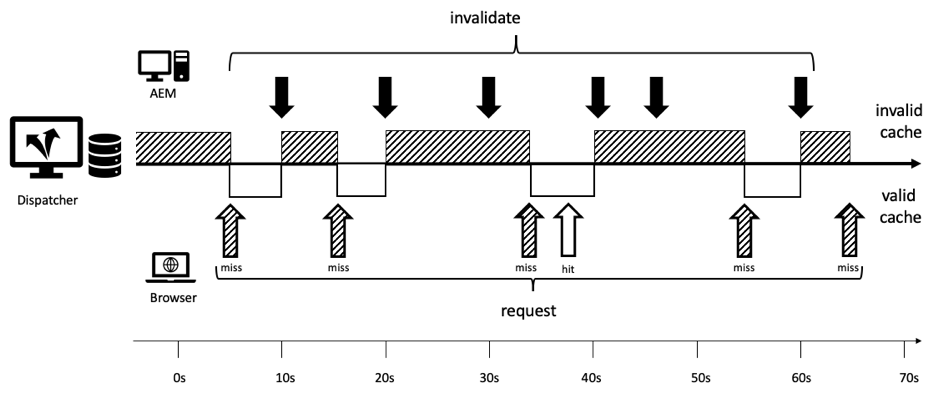

*Frequent activations leading to invalid cache for most of the time*

<br>&nbsp;

To mitigate the problem of this "cache invalidation storm" as it is sometimes called, you can be less rigorous about the `statfile` interpretation.

You can set the Dispatcher to use a `grace period` for auto-invalidation. This would internally add some extra time to the `statfiles` modification date.

Let's say, your `statfile` has a modification time of today 12:00 and your `gracePeriod` is set to 2 minutes. Then all auto-invalidated files will be considered valid at 12:01 and at 12:02. They will be re-rendered after 12:02.

The reference configuration proposes a `gracePeriod` of two minutes for a good reason. You might think "Two minutes? That's almost nothing. I can easily wait 10 minutes for the content to show up…".  So you might be tempted to set a longer period – let's say 10 minutes, assuming that your content shows up at least after these 10 minutes.

>[!WARNING]
>
>This is not how `gracePeriod` is working. The grace period is _not_ the time after which a document is guaranteed to be invalidated, but a time-frame no invalidation happens. Each subsequent invalidation that fall within this frame _prolongs_ the time frame - this can be indefinitely long.  

Let us illustrate how `gracePeriod` actually is working with an example:

Let's say, you are operating a media site and your editing staff provides regular content updates every 5 minutes. Consider you set the gracePeriod to 5 minutes.

We will start with a quick example at 12:00.

12:00 - Statfile is set to 12:00. All cached files are considered valid until 12:05.

12:01 - An invalidation occurs. This prolongs the grate time to 12:06

12:05 - Another editor publishes his article – prolonging the grace time by another gracePeriod to 12:10.

And so on… the content is never invalidated. Each invalidation *within* the gracePeriod effectively prolongs the grace time. The `gracePeriod` is designed to weather the invalidation storm… but you must go out into the rain eventually… so, keep the `gracePeriod` considerably short to prevent hiding in the shelter forever.

#### A Deterministic Grace Period

We would like to introduce another idea how you could weather an invalidation storm. It is only an idea. We haven't tried it in production, but we found the concept interesting enough to share the idea with you.

The `gracePeriod` can become unpredictably long, if your regular replication interval is shorter than your `gracePeriod`.

The alternative idea is as follows: Only invalidate in fixed time intervals. The time in between always means serving stale content. The invalidation will happen eventually, but a number of invalidations are collected to one "bulk" invalidation, so that the Dispatcher has a chance to serve some cached content in the meantime and give the Publish system some air to breathe.

The implementation would look like this:

You use a "Custom Invalidation Script" (see reference), that would run after the invalidation occurred. This script would read the `statfile's` last modification date and round it up to the next interval stop. The Unix shell command `touch --time`, let's you specify a time.

For example, if you set the grace period to 30 sec, the Dispatcher would round the last-modified date of the statfile to the next 30 sec. Invalidation requests that happen in between just set the same next full 30 sec.

 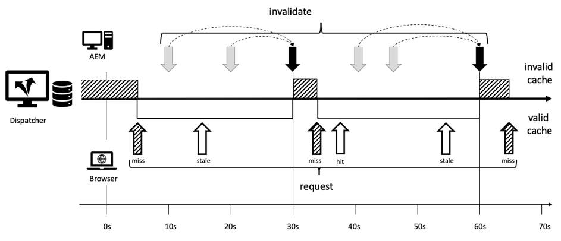

*Postponing the invalidation to the next full 30 second increases the hit-rate.*

<br>&nbsp;

The cache hits that happen between the invalidation request and the next round 30 sec slot are then considered stale; There was an update on Publish – but the Dispatcher still serves old content.

This approach could help defining longer grace-periods without having to fear that subsequent requests prolong the period indeterministically. Though as we stated before – it's just an idea and we didn't have a chance to test it.

**References**

[helpx.adobe.com - Dispatcher Configuration](https://helpx.adobe.com/experience-manager/dispatcher/using/dispatcher-configuration.html)

### Automatic Re-Fetching

Your site has a very particular access pattern. You have a high load of incoming traffic and most of the traffic is concentrated on a small fraction of your pages. The home page, your campaign landing pages and your most featured product detail pages receive 90% of the traffic. Or if you operate a new site the more recent articles have higher traffic numbers compared to older ones.

Now these pages are very likely cached in the Dispatcher as they are requested so frequently.

An arbitrary invalidation request is sent to the Dispatcher, causing all pages - including your most popular once - to be invalidated. 

Subsequently,as these pages are so popular, there are new incoming requests from different browsers. Let's take the home page as an example.

As now the cache is invalid, all requests to the home page that are coming in at the same time are forwarded to the Publish system generating a high load.

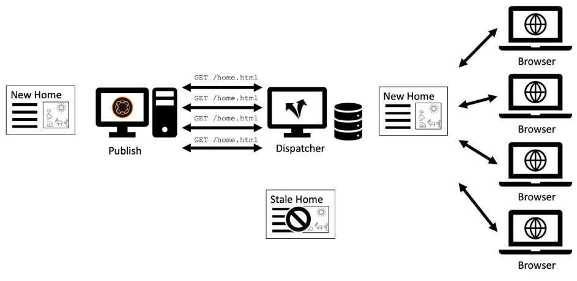

*Parallel requests to same resource on empty cache: Requests are forwarded to Publish*

With automatic re-fetching you can mitigate that to some extent. Most invalidated pages are still physically stored on the Dispatcher after auto-invalidation. They are only _considered_ stale. _Automatic Refetching_ means, that you still serve these stale pages for a few seconds while initiating _one single_ request to the publish system to re-fetch the stale content:

 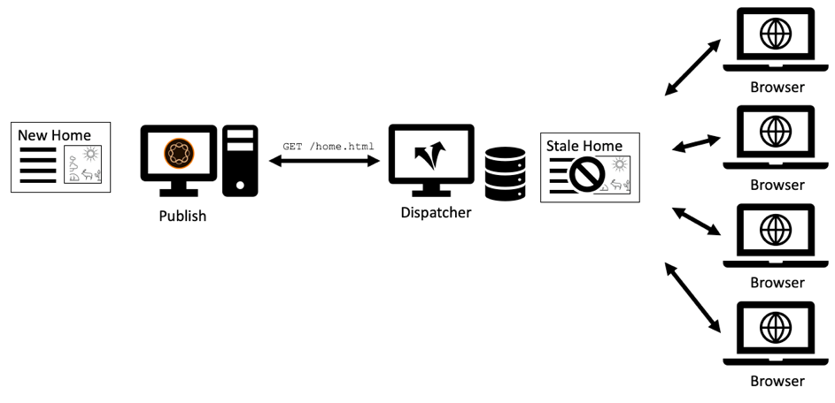
 
*Delivering stale content while re-fetching in the background*

<br>&nbsp;

To enable re-fetching you must tell the Dispatcher which resources to re-fetch after an auto invalidation. Remember, that any page you activate also auto-invalidates all other pages – including your popular ones.

Re-fetching actually means telling the Dispatcher in each (!) invalidation request that you want to re-fetch the most popular ones – and which the most popular ones are.

This is achieved by putting a list of resource URLs (actual URLs – not just paths) in the invalidation requests body:

```
POST /dispatcher/invalidate.cache HTTP/1.1

CQ-Action: Activate
CQ-Handle: /content/my-brand/home/path/to/some/resource
Content-Type: Text/Plain
Content-Length: 207

/content/my-brand/home.html
/content/my-brand/campaigns/landing-page-1.html
/content/my-brand/campaigns/landing-page-2.html
/content/my-brand/products/product-1.html
/content/my-brand/products/product-2.html
```

When the Dispatcher sees such a request, it will trigger auto-invalidation as usual, and it will immediately queue up requests to re-fetch fresh content from the Publish system.

As now we are using a request body, we also need to set content-type and content-length according to the HTTP standard.

The Dispatcher also marks the according URLs internally so that it knows that it can deliver these resources directly even though they are considered invalid by auto-invalidation.

All listed URLs are requested one-by-one. So, you don't need to worry about creating too high a load on the Publish systems. But you wouldn't want to put too many URLs in that list either. In the end, the queue needs to be processed eventually in a bounded time to not serve stale content for too long. Just include your 10 most frequently accessed pages.

If you look into your Dispatcher's cache directory, you will see temporary files marked with time-stamps. These are the files that are currently being loaded in the background.

**References**

[helpx.adobe.com - Invalidating Cached Pages From AEM](https://helpx.adobe.com/experience-manager/dispatcher/using/page-invalidate.html)

### Shielding the Publish System

The Dispatcher gives a bit of extra security by shielding the Publish system from requests that are intended only for maintenance purposes. For example, you don't want to expose you `/crx/de` or `/system/console` URLs to the public.

It does no harm to have a web application firewall (WAF) installed in your system. But that adds a significant number to your budget and not all projects are in a situation where they can afford and - lest not forget – operate and maintain a WAF.

What we frequently see, is a set of Apache rewrite rules in the Dispatcher config that prevent access of the more vulnerable resources.

But you might also consider a different approach:

According to the Dispatcher configuration, the Dispatcher module is bound to a certain directory:

```
<Directory />
  SetHandler dispatcher-handler
  …
</Directory>
```

But why bind the handler to the whole docroot, when you need to filter down afterwards?

You can narrow down the binding of the handler in the first place. `SetHandler` just binds a handler to a directory, you could bind the handler to a URL or to a URL-pattern:

```
<LocationMatch "^(/content|/etc/design|/dispatcher/invalidate.cache)/.\*">
  SetHandler dispatcher-handler
</LocationMatch>

<LocationMatch "^/dispatcher/invalidate.cache">
  SetHandler dispatcher-handler
</LocationMatch>

…
```

If you do this, don't forget to always bind the dispatcher-handler to the Dispatcher's invalidation URL – otherwise you won't be able to send invalidation requests from AEM to the Dispatcher.

Another alternative to use the Dispatcher as a filter is to set up filter directives in the `dispatcher.any`

```
/filter {
  /0001  { /glob "\*" /type "deny" }
  /0002  { /type "allow"  /url "/content\*"  }
```

We are not mandating the use of one directive over the other, rather we recommend an appropriate mix of all directives.

But we do propose that you consider narrowing down the URL space as early in the chain as possible, as much as you need to, and do so in the simplest manner possible. Still keep in mind that these techniques are not a replacement for a WAF on highly sensitive websites. Some people call these techniques "Poor man's firewall" - for a reason.

**References**

[apache.org- sethandler directive](https://httpd.apache.org/docs/2.4/mod/core.html#sethandler)

[helpx.adobe.com  - Configuring Access to Content Filter](https://helpx.adobe.com/experience-manager/dispatcher/using/dispatcher-configuration.html#ConfiguringAccesstoContentfilter)

### Filtering using Regular Expressions and Globs

Back in the early days you could only use "globs" – simple placeholders to define filters in the Dispatcher configuration.

Luckily that has changed in the later versions of the Dispatcher. Now you can use POSIX regular expressions as well and you can access various parts of a request to define a filter. For somebody who has just starting with the Dispatcher that might be taken for granted. But if you are used to have globs only, it kind of is a surprise and easily can be overlooked. Besides the syntax of globs and regexes is just too similar. Let's compare two versions that do the same:

```
# Version A

/filter {
  /0001  { /glob "\*" /type "deny" }
  /0002  { /type "allow"  /url "/content\*"  }

# Version B

/filter {
  /0001  { /glob "\*" /type "deny" }
  /0002  { /type "allow"  /url '/content.\*'  }
```

You see the difference?

Version B uses single quotes `'` to mark a _regular expression pattern_. "Any character" is expressed by using `.*`.

_Globbing patterns_, in contrast use double quotes `"` and you can only use simple placeholders like `*`.

If you know that difference, it's trivial – but if not, you can easily mix up the quotes and spend a sunny afternoon debugging your configuration. Now you are warned.

"I  recognize `'/url'` in the config ... But What is that `'/glob'` in the filter you may ask?

That directive represents the whole request string, including the method and path. It could stand for

`"GET /content/foo/bar.html HTTP/1.1"`

this is the string your pattern would be compared against. Beginners tend to forget the first part, the `method` (GET, POST, ...). So, a pattern

`/0002  { /glob "/content/\*" /type "allow" }`

Would always fail as "/content" does not match the "GET .." of the request.

So when you want to use Globs,

`/0002  { /glob "GET /content/\*" /type "allow" }`

would be correct.

For an initial deny rule, like

`/0001  { /glob "\*" /type "deny" }`

this is fine. But for the subsequent allows, it is better and clearer more expressive and way more secure to use the individual parts of a request:

```
/method
/url
/path
/selector
/extension
/suffix
```

Like so:

```
/005  {

  /type "allow"
  /method "GET"
  /extension '(css|gif|ico|js|png|swf|jpe?g)' }
```

Note, that you can mix regex and glob expressions in on rule.

One last word about the "line numbers" like `/005` in front of each definition,

They have no meaning at all! You can choose arbitrary denominators for rules. Using numbers doesn't require much effort to think about a scheme, but keep in mind, that the order matters.

If you have hundreds of rules like so:

```
/001
/002
/003
…
/100
…
```

and you want to insert one between /001 and /002 what happens with the subsequent numbers? Are you increasing their numbers? Are you inserting in-between numbers?

```
/001
/001a
/002
/003
…
/100
…
```

Or what happens if you to change to re-order /003 and /001 are you going to change the names and their identities or are you

```
/003
/002
/001
…
/100
…
```

Numbering, while seeming a simple choice in the first place reaches its limits in the long run. Let's be honest, choosing numbers as identifiers is a bad programming style anyway.

We would like to propose a different approach: Most likely, you will not come up with meaningful identifiers for each individual filter rule. But they probably serve a bigger purpose, so they can be grouped in some ways according to that purpose. For example, "basic setup", "application specific exceptions", "global exceptions" and "security".

You can then name and group the rules accordingly and provide the reader of the configuration (your dear colleague), some orientation in the file:

```plain
  # basic setup:

  /filter {

    # basic setup

    /basic_01  { /glob "\*"             /type "deny"  }
    /basic_02  { /glob "/content/\*"    /type "allow" }
    /basic_03  { /glob "/etc/design/\*" /type "allow" }

    /basic_04  { /extension '(json|xml)'  /type "deny"  }
    …


    # login

    /login_01 { /glob "/api/myapp/login/\*" /type "allow" }
    /login_02 { … }

    # global exceptions

    /global_01 { /method "POST" /url '.\*contact-form.html' }
```


Most likely you will add a new rule to one of the groups – or maybe even create a new group. In that case, the number of items to renaming/renumbering is limited to that group.

>[!WARNING]
>
>More sophisticated setups split filtering rules into a number of files, that are inlcuded by the main `dispatcher.any` configuration file. A new file however does not introduce a new namespace. So if you have a rule "001" in one file and "001" in another you will get an error. Even more reason to come up with semantically strong names.

**References**

[helpx.adobe.com - Designing Patterns for glob Properties](https://helpx.adobe.com/experience-manager/dispatcher/using/dispatcher-configuration.html#DesigningPatternsforglobProperties)

### Protocol Specification

The last tip is not a real tip, but we felt it was worth sharing this with you anyway. 

AEM and the Dispatcher in most cases work out-of-the-box. So you will not find a comprehensive Dispatcher protocol specification about the invalidation protocol to build your own application on top. The information is public, but a bit scattered over a number of resources.

We try to fill the gap to some extent here. This is how an invalidation request looks like:

```
POST /dispatcher/invalidate.cache HTTP/1.1
CQ-Action: <action>
CQ-Handle: <path-pattern>
[CQ-Action-Scope]
[Content-Type: Text/Plain]
[Content-Length: <bytes in request body>]

<newline>

<refetch-url-1>
<refetch-url-2>

…

<refetch-url-n>
```

`POST /dispatcher/invalidate.cache HTTP/1.1` - The first line is the URL of the Dispatcher control endpoint and you will likely not change it.

`CQ-Action: <action>` - What should happen. `<action>` is either:

* `Activate:` deletes `/path-pattern.*`
* `Deactive:` delete `/path-pattern.*` 
AND delete `/path-pattern/*`
* `Delete:`   delete `/path-pattern.*` 
AND delete `/path-pattern/*`
* `Test:`   Return "ok" but do nothing

`CQ-Handle: <path-pattern>` - The content-resource path to be invalidated. Note, `<path-pattern>` is actually a "path" and not a "pattern".

`CQ-Action-Scope: ResourceOnly` - Optional: If this header is set, the `.stat` file is not touched.

```
[Content-Type: Text/Plain]
[Content-Length: <bytes in request body>]
```

Set these headers, if you define a list of auto-refetch URLs. `<bytes in request body>` is the number of characters in the HTTP body

`<newline>` - If you have a request body, it must be separated from the header by an empty row.

```
<refetch-url-1>
<refetch-url-2>
…
<refetch-url-n>
```

List the URLs, that you want to immediately re-fetch after invalidation.

## Additional Resources

A good overview and introduction to Dispatcher caching: [https://helpx.adobe.com/experience-manager/dispatcher/using/dispatcher.html](https://helpx.adobe.com/experience-manager/dispatcher/using/dispatcher.html)

More Optimizing tips and tricks: [https://helpx.adobe.com/experience-manager/kb/optimizing-the-dispatcher-cache.html#use-ttls](https://helpx.adobe.com/experience-manager/kb/optimizing-the-dispatcher-cache.html#use-ttls)

Dispatcher documentation with all directives explained: [https://helpx.adobe.com/experience-manager/dispatcher/using/dispatcher-configuration.html](https://helpx.adobe.com/experience-manager/dispatcher/using/dispatcher-configuration.html)

Some frequently asked questions: [https://helpx.adobe.com/experience-manager/using/dispatcher-faq.html](https://helpx.adobe.com/experience-manager/using/dispatcher-faq.html)

Recording of a webinar about Dispatcher optimization – highly recommended: [https://my.adobeconnect.com/p7th2gf8k43?proto=true](https://my.adobeconnect.com/p7th2gf8k43?proto=true)

Presentation "The underappreciated power of content invalidation", "adaptTo()" conference in Potsdam 2018 [https://adapt.to/2018/en/schedule/the-underappreciated-power-of-content-invalidation.html](https://adapt.to/2018/en/schedule/the-underappreciated-power-of-content-invalidation.html)

Invalidating Cached Pages From AEM: [https://helpx.adobe.com/experience-manager/dispatcher/using/page-invalidate.html](https://helpx.adobe.com/experience-manager/dispatcher/using/page-invalidate.html)

## Next step

* [2 - Infrastructure Pattern](chapter-2.md)
