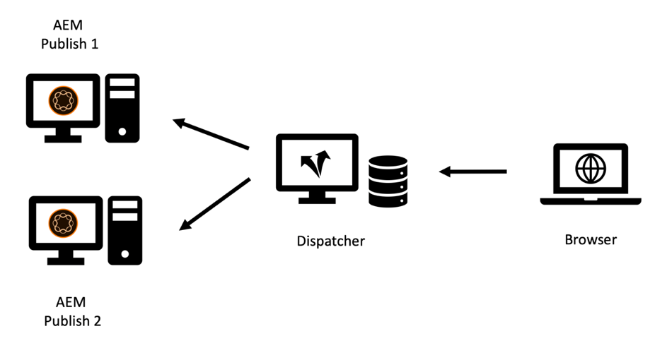
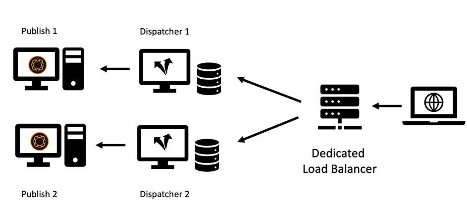
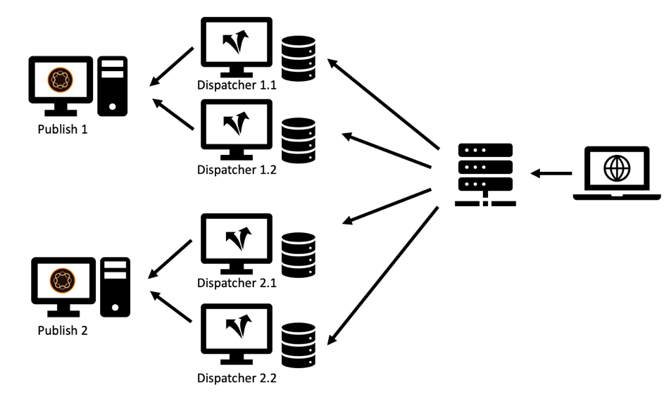
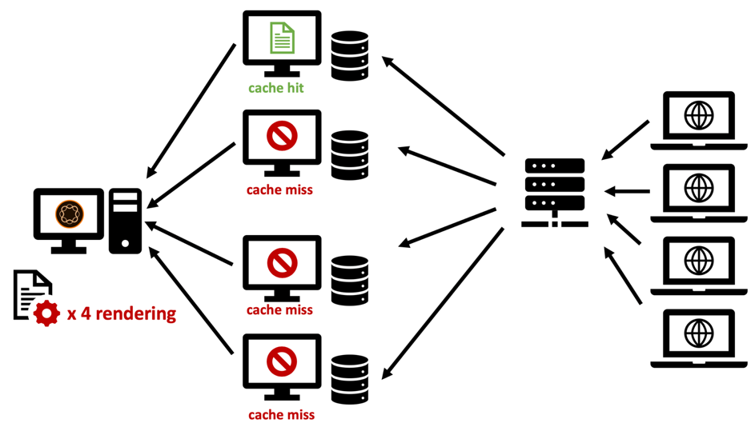
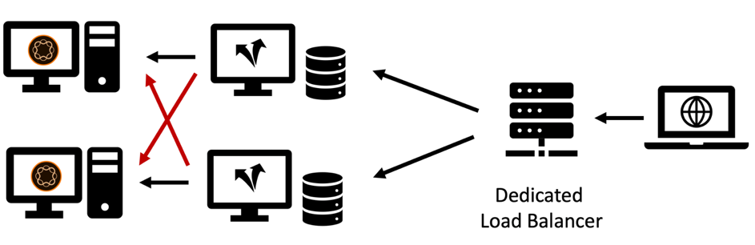

# Chapter 2 - Infrastructure

## Setting up a Caching Infrastructure

We introduced the basic topology of a Publish system and a dispatcher in Chapter 1 of this series. A set of Publish and Dispatcher servers can be configured in a lot of variations – depending on the expected load, the topology of your data center(s) and the desired failover properties.

We will sketch the most common topologies and describe the advantages and where they fall short. The list - of course – never can be comprehensive. The only limit is your imagination.

### The "Legacy" Setup

In the early days, the number of potential visitors was small, hardware was expensive and web servers were not seen quite as business critical as they are today. A common setup was to have one Dispatcher serving as a load balancer and cache in front of two or more Publish systems. The Apache server at the core of the Dispatcher was very stable and - in most settings - capable enough to serve a decent amount of request.

 

*"Legacy" Dispatcher Setup – Not very common by today's standards*

 &nbsp;

This is where the dispatcher received its name from: It was basically dispatching requests. This setup is not very common any longer as it cannot meet the higher demands in performance and stability required today.

### Multi-Legged Setup

Nowadays a slightly different topology is more common. A multi-legged topology would have one Dispatcher per Publish server. A dedicated (hardware) load balancer sits in front of the AEM infrastructure dispatching the requests to these two (or more) legs:

 

*Modern "Standard" Dispatcher Setup – Easy to handle and maintain*

 &nbsp;

Here are the reasons for this kind of setup,

1. Websites on average serve much more traffic than they have in the past. Thus, there is a need to scale up the "Apache infrastructure."

2. The "Legacy" setup did not provide redundancy on the Dispatcher level. If the Apache Server went down, the entire website was unreachable.

3. Apache Servers are cheap. They are based on open source and, given you have a virtual datacenter, they can be provisioned very fast.

4. This setup provides an easy way for a "rolling" or "staggered" update scenario. You simply shut down Dispatcher 1 while installing a new software package on Publish 1. When the installation is finished, and you have sufficiently smoke-tested Publish 1 from the internal network, you clean the cache on Dispatcher 1 and start it anew while taking down Dispatcher 2 for maintenance of Publish 2.

5. Cache invalidation becomes very easy and deterministic in this setup. As only one Publish system is connected to one Dispatcher, there is only one Dispatcher to invalidate. Order and timing of the invalidation is trivial.

### The "Scale Out" setup

Apache Servers are cheap and easy to provision, why not push scaling out that level a bit more. Why not have two or more Dispatchers in front of each Publish server?

*"Scale Out" Setup – Has some application areas but also limitations and caveats*

 &nbsp;

You can absolutely do that! And there is a lot of valid application scenarios for that setup. But there are also some limitations and complexities you should consider.

#### Invalidation

Each Publish system is connected to a multitude of Dispatchers, each one has to be invalidated when content has been changed.

#### Maintenance

It goes without saying, that the initial configuration of the Dispatcher and Publish systems is a bit more complex. But keep also in mind, that the effort of a "rolling" release also is a bit higher. AEM systems can and must be updated while running. But it is wise not to do that while they are actively serving requests. Usually you want to update only a part of the Publish systems – while the others still actively serve traffic and then – after testing - switch to the other part. If you are lucky and you can access the load-balancer in your deployment process, you can disable the routing to the servers under maintenance here. If you are on a shared load balancer without direct access, you would rather shut down the dispatchers of the Publish you want to update. The more there are, the more you will have to shut down. If there is a large number and you are planning frequent updates, some automation is advised. If you don't have automation tools, scaling out is a bad idea anyway.

In a past project we used a different trick to remove a Publish system from load balancing without having direct access to the load-balancer itself.

The load-balancer usually "pings", a particular page to see if the server is up and running. A trivial choice usually is to ping the homepage. But if you want to use the ping to signal the load-balancer not to balance traffic you would choose something else. You create a dedicated template or servlet that can be configured to respond with `"up"` or `"down"` (in the body or as http response code). The response of that page of course must not be cached in the dispatcher – thus it is always fetched freshly from the Publish system. Now if you configure the load balancer to check this template or servlet you can easily let the Publish "pretend" it is down. It would not be part of the load balancing and can be updated.

#### Worldwide Distribution

"Worldwide Distribution" is a "Scale out"  setup where you have multiple Dispatchers in front of each Publish system - now distributed all over the world to be closer to the customer and provide a better performance. Of course, in that scenario you don't have a central load balancer but a DNS and geo-IP based load balancing scheme.

>[!NOTE]
>
>Actually, you are building kind of a Content Distribution Network (CDN) with that approach – so you should consider buying an off-the-shelf CDN solution instead of building one yourself. Building and maintaining a custom CDN is no trivial task.

#### Horizontal Scaling

Even in a local datacenter a "Scale Out" topology whith multiple Dispatchers in front of each Publish system has some advantages. If your see performance bottlenecks on the Apache Servers due to high traffic (and a good cache hit-rate) and you cannot scale up the hardware anymore (by adding CPUs, RAM, and faster Disks) you can boost performance by adding Dispatchers. This is called "horizontal scaling". However, this has limits – especially when you are frequently invalidating traffic. We will describe the effect in the next section.

#### Limits of the Scale Out Topology

Adding proxy servers should normally increase the performance. There are, however, scenarios where adding servers actually can decrease the performance. How? Consider you have a news portal, where you introduce new articles and pages every minute. A Dispatcher invalidates by "auto-invalidation": Whenever a page is published, all pages in the cache on the same site are invalidated. This is a useful feature – we covered this in [Chapter 1](chapter-1.md) of this series – but it also means, that when you have frequent changes on your website you are invalidating the cache quite often. If you  only have one Dispatcher per Publish instance, the first visitor requesting a page, triggers a re-caching of that page. The second visitor already gets the cached version.

If you have two Dispatchers, the second visitor has a 50% chance that the page is not cached, and he would then experience a larger latency when that page is rendered again. Having even more Dispatchers per Publish makes things even worse. What happens is, that the Publish server receives more load because it has to re-render the page for each Dispatcher separately.

*Decreased performance in a scale-out scenario with frequent cache flushes.*

 &nbsp;

#### Mitigating Over-Scaling Issues

You might consider using a central shared storage for all Dispatchers or syncing the file systems of the Apache servers to mitigate the issues. We can provide only limited first-hand experience but be prepared that this adds up to the complexity of the system and can introduce a whole new class of errors.

We have had some experiments with NFS – but NFS introduces huge performance issues due to content locking. This actually decreased the overall performance.

**Conclusion** - Sharing a common file system among several dispatchers is NOT a recommended approach.

If you are facing performance issues, scale up Publish and Dispatchers equally to avoid peak load on the Publisher instances. There is no golden rule about the Publish / Dispatcher ratio – it highly depends on the distribution of the requests and the frequency of publications and cache invalidations.

If you are also concerned about the latency a visitor experiences, consider using a content delivery network, cache re-fetching, preemptive cache warming, setting a grace time as described in [Chapter 1](chapter-1.md) of this series or refer to some advanced ideas of [Part 3](chapter-3.md).

### The "Cross Connected" Setup

Another setup we have seen every now and then is the "cross connected" setup: The Publish instances do not have dedicated Dispatchers but all Dispatchers are connected to all Publish systems.

 

 &nbsp;

*Cross-connected topology: Increased redundancy and more complexity.*

At first glance, this provides some more redundancy for a relatively small budget. When one of the Apache servers is down, you can still have two Publish systems doing the rendering work. Also, if one of the Publish systems crashes, you still have two Dispatchers serving the cached load.

This however comes with a price.  

First, taking out one leg for maintenance is quite cumbersome. Actually, this is what this scheme was designed for; to be more resilient and stay up and running by all means possible. We have seen complicated maintenance plans on how deal with this. Reconfigure the Dispatcher 2 first, removing the cross connection. Restarting Dispatcher 2. Shutting down Dispatcher 1, update Publish 1, … and so on. You should consider carefully if that scales up to more than two legs. You will come to the  conclusion, that it actually increases complexity, costs and is a formidable source for human error. It would be best to automate this. So better check, if you actually have the human resources to include this automation task in your project schedule. While you might save some hardware costs with this, you might spend double on IT staff.

Second, you might have some user application running on the AEM that requires a login. You use sticky sessions, to ensure that one user always is served from the same AEM instance so that you could maintain session state on that instance. Having this cross connected setup, you have to make sure, that sticky sessions is working properly on the load balancer and on the Dispatchers. Not impossible - but you need to be aware of that and add some extra configuration and testing hours, which – again - might level the savings you had planned by saving hardware.

### Conclusion

We do not advise that you use this cross-connect scheme as a default option. However, if you decide to use it, you will want to carefully assess risks and hidden costs and plan to include configuration automation as part of your project.

## Next Step

* [3 - Advanced Caching Topics](chapter-3.md)
