# Chapter 3 - Advanced Caching Topics

*"There are only two hard things in Computer Science: cache invalidation and naming things."*

— PHIL KARLTON

## Overview

This is Part 3 of a three part – series to caching in AEM. Where the first two parts focused on plain http caching in the Dispatcher and what limitations there are. This part discusses some ideas on how to overcome these limitations.

## Caching in General

[Chapter 1](chapter-1.md) and [Chapter 2](chapter-2.md) of this series focused mainly on the Dispatcher. We have explained the basics, the limitations and where you need to make certain trade-offs.

The caching complexity and intricacies are not issues unique to the Dispatcher. Caching is difficult in general.

Having the Dispatcher as your only tool in your toolbox would actually be a real limitation.

In this chapter we want to broaden our view on caching further and develop some ideas how you can overcome some of the Dispatcher's shortcomings. There is no silver bullet - you will have to make tradeoffs in your project. Remember, that with caching and invalidation accuracy always comes complexity, and with complexity there comes the possibility of errors.

You will need to make trade-offs in these areas,

* Performance and latency
* Resource consumption / CPU Load / Disk Usage
* Accuracy / Currency / Staleness / Security
* Simplicity / Complexity / Cost / Maintainability / Error-proneness

These dimensions are interlinked in a rather complex system. There is no simple if-this-then-that. Making a system simpler can make it faster or slower. It can lower your development costs, but increase costs at the helpdesk, e.g., if customers see stale content or complain about a slow website. All these factors need to be considered and balanced against each other. But by now you already should have a good idea, that there is no silver bullet or a single "best-practice" - only a lot of bad practices and a few good ones.

## Chained Caching

### Overview

#### Data Flow

Delivering a page from a server to a client's browser crosses a multitude of systems and subsystems. If you look carefully, there is a number of hops data needs to take from the source to the drain, each of which is a potential candidate for caching.

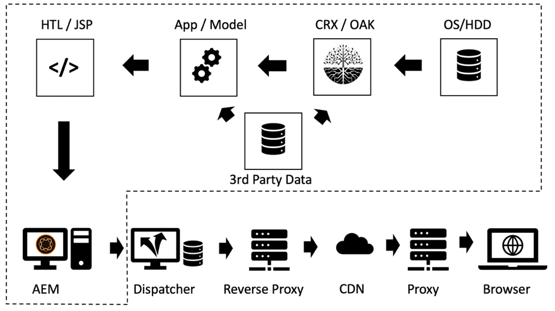

*Data flow of a typical CMS application*

<br>&nbsp;

Let's start our journey with a piece of data that sits on a hard disk and that needs to be displayed in a browser.

#### Hardware and Operating System

First, the hard disk drive (HDD) itself has some built in cache in the hardware. Second, the operating system that mounts the hard disk, uses free memory to cache frequently accessed blocks to speed up access.

#### Content Repository

Next level is the CRX or Oak – the document database used by AEM. CRX and Oak divide the data into segments that can be cached in memory as well to avoid slower access to the HDD.

#### Third Party Data

Most larger Web installations have 3rd party data as well; data coming from a product information system, a customer relation management system, a legacy database or any other arbitrary web service. This data does not need to be pulled from the source any time it is needed – especially not, when it is known to change not too frequently. So, it can be cached, if it is not synchronized in the CRX database.

#### Business Layer – App / Model

Usually your template scripts do not render the raw content coming from CRX via the JCR API. Most likely you have a business layer in between that merges, calculates and/or transforms data in a business domain object. Guess what – if these operations are expensive, you should consider caching them.

#### Markup Fragments

The model now is the base for the rendering of the markup for a component. Why not cache the rendered model as well?

#### Dispatcher, CDN and other Proxies

Off goes the rendered HTML-Page to the Dispatcher. We already discussed, that the main purpose of the Dispatcher is to cache HTML pages and other web resources (despite its name). Before the resources reaches the browser, it may pass a reverse proxy – that can cache and a CDN – that also is used for caching. The client may sit in an office, that grants web access only via a proxy – and that proxy might decide to cache as well to save traffic.

#### Browser Cache

Last but not least – the browser caches too. This is an easy overlooked asset. But it is the closest and fastest cache you have in the caching chain. Unfortunately – it is not shared between users – but still between different requests of one user.

### Where to Cache and Why

That is a long chain of potential caches. And we all have faced issues where we have seen outdated content. But taking into account how many stages there are, it's a miracle that most of the time it's working at all.

But where in that chain does it make sense to cache at all? At the beginning? At the end? Everywhere? It depends… and it depends on a huge number of factors. Even two resources in the same website might desire a different answer to that question.

To give you a rough idea of what factors you might take into consideration,

**Time to live** – If objects have a short inherent live time (traffic data might have a shorter live than weather data) it might not be worth caching.

**Production Cost –** How expensive (in terms of CPU cycles and I/O) is the re-production and delivery of an object. If it's cheap caching might not be necessary.

**Size** – Large objects require more resources to be cached. That could be a limiting factor and must be balanced against the benefit.

**Access frequency** – If objects are accessed rarely, caching might not be effective. They would just go stale or be invalidated before they are access the second time from cache. Such items would just block memory resources.

**Shared access** – Data that is used by more than one entity should be cached further up the chain. Actually, the caching chain is not a chain, but a tree. One piece of data in the repository might be used by more than one model. These models in turn can be used by more than one render script to generate HTML fragments. These fragments are included in multiple pages which are distributed to multiple users with their private caches in the browser. So "sharing" does not mean sharing between people only, rather between pieces of software. If you want to find a potential "shared" cache, just track back the tree to the root and find a common ancestor – that's where you should cache.

**Geospatial distribution** – If your users are distributed over the world, using a  distributed network of caches might help reduce latency.

**Network bandwidth and latency** – Speaking of latency, who are your customers and what kind of network are they using? Maybe your customers are mobile customers in an under-developed country using 3G connection of older-generation smartphones? Consider creating smaller objects and cache them in the browser caches.

This list by far is not comprehensive, but we think you get the idea by now.

### Basic Rules for Chained Caching

Again – caching is hard. Let us share some ground rules, that we have extracted from previous projects that can help you avoid issues in your project.

#### Avoid Double Caching

Each of the layers introduced in the last chapter provides some value in the caching chain. Either by saving computing cycles or by bringing data closer to the consumer. It is not wrong to cache a piece of data in multiple stages of the chain – but you should always consider what the benefits and the costs of the next stage is. Caching a full page in the Publish system usually does not provide any benefit - as this is done in the Dispatcher already.

#### Mixing Invalidation Strategies

There are three basic invalidation strategies:

* **TTL, Time to Live:** An object expires after a fixed amount of time (e.g., "2 hours from now")
* **Expiration Date:** The object expires at defined time in the future (e.g., "5:00 PM on June 10, 2019")
* **Event based:** The object is invalidated explicitly by an event that happened in the platform (e.g., when a page is changed and activated)

Now you can use different strategies on different cache layers, but there are a few "toxic" ones.

#### Event Based Invalidation

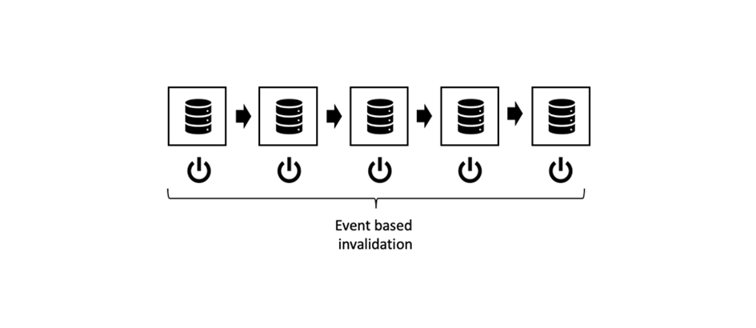

*Pure Event based invalidation: Invalidate from the inner cache to the outer layer*

<br>&nbsp;

Pure event-based invalidation is the easiest one to comprehend, easiest to get theoretically right and the most accurate one.

Simply put, the caches are invalidated one by one after the object has changed.

You just need to keep one rule in mind:

Always invalidate from the inside to the outside cache. If you invalidated an outer cache first, it might re-cache stale content from an inner one. Don't make any assumptions at what time a cache is fresh again – make it sure. Best, by triggering the invalidation of the outer cache _after_ invalidating the inner one.

Now, that's the theory. But in practice there are a number of gotchas. The events must be distributed – potentially over a network. In practice, this makes it the most difficult invalidation scheme to implement. 

#### Auto - Healing

With event-based invalidation, you should have a contingency plan. What if an invalidation event is missed? A simple strategy could be to invalidate or purge after a certain amount of time. So - you might have missed that event and now serve stale content. But your objects also have an implicit TTL of several hours (days) only. So eventually the system auto-heals itself.

#### Pure TTL-based invalidation

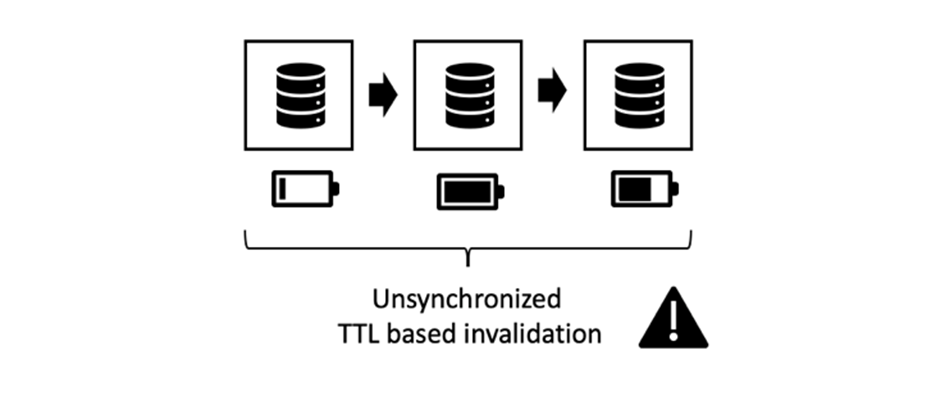

*Unsynchronized TTL based invalidation*

<br>&nbsp;

That one also is a quite common scheme. You stack several layers of caches, each one entitled to serve an object for a certain amount of time.

It's easy to implement. Unfortunately, it's hard to predict the effective life span of a piece of data.

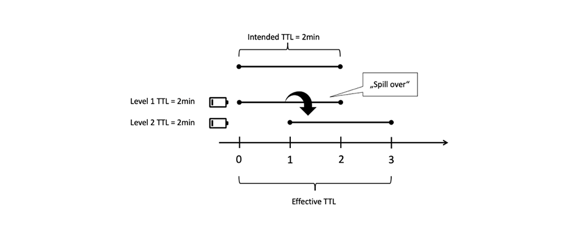

*Outer cache prolonging the life span of an inner object*

<br>&nbsp;

Consider the illustration above. Each caching layer introduce a TTL of 2 min. Now – the overall TTL must 2 min too, right? Not quite. If the outer layer fetches the object just before it would get stale, the outer layer actually prolongs the effective live time of the object. The effective live time can be between 2 and 4 minutes in that case. Consider you agreed with your business department, one day is tolerable – and you have four layers of caches. The actual TTL on each layer must not be longer than six hours… increasing the cache miss-rate…

We are not saying it is a bad scheme. You just should know its limits. And it's a nice and easy strategy to start with. Only if your site's traffic increases you might consider a more accurate strategy.

*Synchronizing Invalidation time by setting a specific date*

#### Expiration Date Based Invalidation

You get a more predictable effective life time, if you are setting a specific date on the inner object and propagating that to the outside caches.

 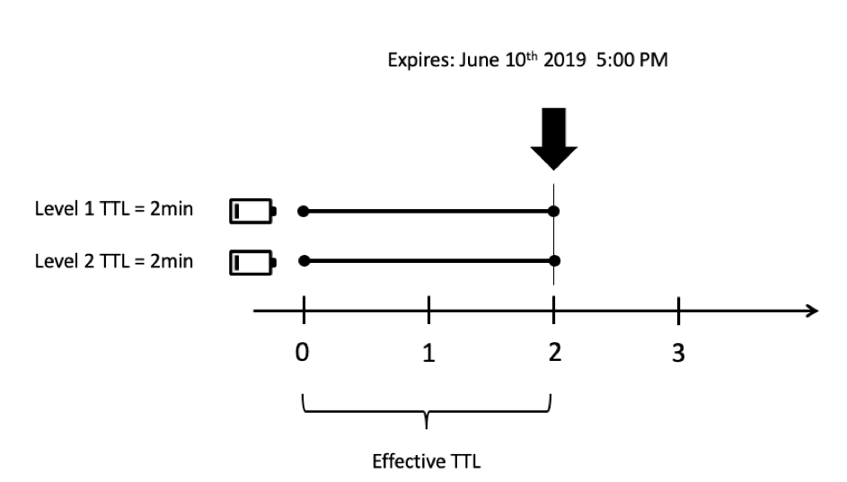

*Synchronizing expiration dates*

<br>&nbsp;

However, not all caches are able to propagate the dates. And it can become nasty, when the outer cache aggregates two inner objects with different expiration dates.

#### Mixing Event-based and TTL-based invalidation

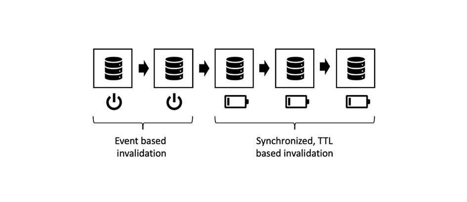

*Mixing event-based and TTL-based strategies*

<br>&nbsp;

Also a common scheme in the AEM world is to use event based invalidation at the inner caches (e.g., in-memory caches where events can be processed in near real time) and TTL-based caches on the outside – where maybe you don't have access to explicit invalidation.

In the AEM world you would have an in-memory cache for business objects and HTML fragments in the Publish systems, that is invalidated, when the underlying resources change and you propagate this change event to the dispatcher which also works event-based. In front of that you would have for example a TTL-based CDN.

Having a layer of (short) TTL-based caching in front of a Dispatcher could effectively soften a spike that usually would occur after an auto-invalidation.

#### Mixing TTL – and Event-Based Invalidation

 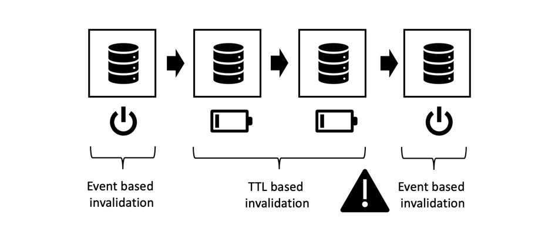

*Toxic: Mixing TTL – and event-based Invalidation*

<br>&nbsp;

This combination is toxic. Never place and event-based cache after a TTL or Expiry-based cached. Remember that spill-over effect that we had in the "pure-TTL" strategy? The same effect can be observed here. Only that the invalidation event of the outer cache already has happened might not happen again - ever, This can expand the life span of you cached object to infinity.

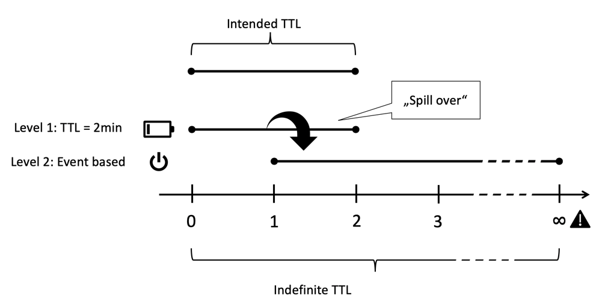

*TTL-based and event-based combined: Spill-over to infinity*

<br>&nbsp;

## Partial Caching and In-Memory Caching

You can hook into stage of the rendering process to add caching layers. From getting remote data transfer objects or creating local business objects to caching the rendered markup of a single component. We will leave concrete implementations to a later tutorial. But maybe you plan to already have implemented a few of these caching layers yourself already. So the least we can do here is to introduce the basic priniciples - and gotchas. 

### Words of Warning

#### Respect Access Control

The techniques described here are quite powerful and a _must-have_ in each AEM developer's toolbox. But don't get too excited, use them wisely. By storing an object in a cache and sharing it to other users in follow-up requests actually means circumventing access control. That usually is not an issue on public-facing websites but can be, when a user needs to login before getting access.

Consider you store a sites main menu's HTML markup in an in-memory cache to share it between various pages. Actually that is a perfect example for storing partially rendered HTML as creating a navigation is usually expensive as it requires traversing a lot of pages.

You are not sharing that same menu-structure between all pages but also with all users which makes it even more efficient. But wait ... but maybe there are some items in the menu that are reserved for a certain group of users only. In that case caching can get a bit more complex.

#### Only Cache Custom Business Objects

If any – that's the most important piece of advice, we can give you:

> [!WARNING]  
>  Only cache objects that are yours, that are immutable, that you built yourself, that are shallow and have no outgoing reference.

What does that mean?

1. You don't know about the intended live cycle of other people's objects. Consider you get behold of a reference to a request object and decide to cache it. Now, the request is over, and the servlet container wants to recycle that object for the next incoming request. In that case someone else is changing the content that you thought you had exclusive control over. Don't dismiss that – We have seen something like that happening in a project. Customer were seeing other customers data instead of their own.

2. As long as an object is referenced by a chain of other references it cannot be removed from the heap. If you retain a supposedly small object in your cache that references, let's say a 4MB representation of an image you will have a good chance to get trouble with leaking memory. Caches are supposed to be based on weak references. But – weak references do not work as you might expect. That is the absolute best way to produce a memory leak and end in an out-of-memory-error. And – you don't know what the size of retained memory of the foreign objects are, right?

3. Especially in Sling, you can adapt (almost) each object to each other. Consider you put a resource into the cache. The next request (with different access rights), fetches that resource and adapts it into a resourceResolver or a session to access other resources that he would not have access to.

4. Even if you create a thin "wrapper" around a resource from AEM,  you must not cache that - even if it is your own and immutable. The wrapped object would be a reference (which we forbid before) and if we look sharp, that basically creates the same problems as described in the last item.

5. If you want to cache, create your own objects by copying primitive data into your own shallo objects. You might want to link between your own objects by references - for example you might want to cache a tree of objects. That is fine – but only cache objects that you just created in the very same request – and no objects that were requested from somewhere else (even if it's 'your' object's name-space). _Copying objects_ is the key. And make sure to purge the whole structure of linked objects at once and avoid incoming and outgoing references to your structure.

6. Yes – and keep your objects immutable. Private properties, only and no setters.

That's a lot of rules, but it's worth following them. Even if you are experienced and super smart and have everything under control. The young colleague in your project just graduated from university. He doesn't know of all these pitfalls. If there are no pitfalls, there is nothing to avoid. Keep it simple and comprehensible.

### Tools and libraries

This series is about understanding concepts and empowering you to build an architecture that best fits your use case.

We are not promoting any tool in particular. But give you hints how to evaluate them. For example, AEM has a simple built in cache with a fixed TTL since version 6.0. Shall you use it? Probably not on publish where an event-based cache follows in the chain (hint: The Dispatcher). But it might by a decent choice for an Author. There is also an HTTP cache by Adobe ACS commons that might be worth considering.

Or you build your own, based on a mature caching framework like [Ehcache](https://www.ehcache.org). This can be used to cache Java objects and rendered markup (`String` objects).

In some simple cases you might also get along with using concurrent hash maps –you will quickly see limits here – either in the tool or in your skills. Concurrency is as hard to master as naming and caching.

#### References

* [ACS Commons http Cache ](https://adobe-consulting-services.github.io/acs-aem-commons/features/http-cache/index.html)
* [Ehcache caching framework](https://www.ehcache.org)

### Basic terms

We will not go into caching theory too deep here, but we feel obliged to provide a few buzz-words, so that you have a good jump start.

#### Cache Eviction

We talked about invalidation and purging a lot. _Cache eviction_ is related to these terms: After an entry it is evicted, it is not available anymore. But eviction happens not when an entry is outdated, but when the cache is full. Newer or "more important" items push older or less important ones out of the cache. Which entries you will have to sacrifice is a case-to-case decision. You might want to evict the oldest ones or those which have been used very rarely or last accessed a long time.

#### Preemptive Caching

Preemptive Caching means re-creating the entry with fresh content in the moment it is invalidated or considered outdated. Of course - you would do that only with a few resources, that you are sure are accessed frequently and immediately. Otherwise you would waste resources on creating cache-entries that might never be requested. By creating cache-entries preemptively you could reduce the latency of the first request to a resource after cache invalidation.

#### Cache Warming

Cache warming is closely related to preemptive caching. Though you wouldn't use that term for a live system. And it is less time constrained than the former. You don't re-cache immediately after invalidation, but you gradually fill the cache when time permits. 

For example, you take out a Publish / Dispatcher leg from the load balancer to update it. Before re-integrating it, you automatically crawl the most frequently accessed pages to get them into the cache again. When the cache is "warm" – filled adequately you re-integrate the leg into the load balancer. 

Or maybe you re-integrate the leg at once, but you throttle the traffic to that leg so that it has a chance to warm it's caches by regular usage.

Or maybe you want to also cache some less frequently accessed pages in times where your system is idle to decrease latency when they actually are accessed by real requests. 

#### Cache Object Identity, Payload, Invalidation Dependency and TTL

Generally speaking, a cached object or "entry" has five major properties,

#### Key

This is the identity is the property by which you identify and object. Either to retrieve its payload or to purge it from the cache. The dispatcher for example uses the URL of a page as the key. Note, that the dispatcher does not use the pages paths. This is not sufficient to tell different renderings apart. Other caches might use different keys. We will see some examples later.

#### Value / Payload

That is the object's treasure chest, the data that you want to retrieve. In case of the dispatcher it's the files contents. But it can also be a Java object tree.

#### TTL

We covered the TTL already. The time after which an entry is considered stale and should not be delivered any longer.

#### Dependency

This relates to event-based invalidation. What original data is that object depending on? In Part I, we already said, that a true and accurate dependency tracking is too complex. But with our knowledge of the system you can approximate the dependencies with a more simple model. We invalidate enough objects to purge stale content… and maybe inadvertently more than would be required. But yet we try to keep below "purge everything".

Which objects are depending on what others is genuine in each single application. We will give you some examples on how to implement a dependency strategy later.

### HTML Fragment Caching

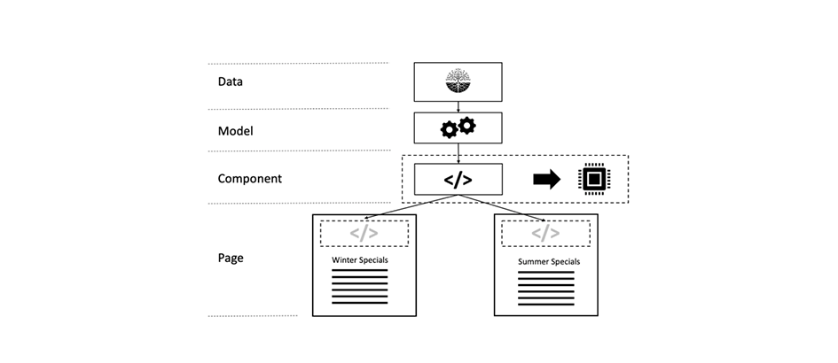

*Re-using a rendered fragment on different pages*

<br>&nbsp;

HTML Fragment Caching is a mighty tool. The idea is to cache the HTML markup that was generated by a component in an in-memory-cache. You may ask, why should I do that? I am caching the whole page's markup in the dispatcher anyway – including that component's markup. We agree. You do - but once per page. You are not sharing that markup between the pages.

Imagine, you are rendering a navigation on top of each page. The markup looks the same on each page. But you are rendering it over and over again for each page, that is not in the Dispatcher. And remember: After auto-invalidation all pages need to be re-rendered. So basically, you are running the same code with the same results hundreds of times.

From our experience, rendering a nested top navigation is a very expensive task. Usually you traverse a good portion of the document tree to generate the navigation items. Even if you only need the navigation title and the URL – the pages have to be loaded into memory. And here they are clogging precious resources. Over and over again.

But the component is shared between many pages. And sharing something is an indicates using a cache. So – what you would want to do is check if the navigation component already has been rendered and cached and instead of re-rendering just emit the caches value.

There are two wonderful niceties of that scheme easily missed:

1. You are caching a Java String. A String does not have any outgoing references and it is immutable. So, considering the warnings above - this is super-safe.

2. Invalidation also is super easy. Whenever anything changes your website, you want to invalidate this cache entry. Re-building is relatively cheap, as it needs to be performed only once and then is reused by all the hundreds of pages.

This is a big relief to your Publish servers.

### Implementation of Fragment Caches

#### Custom Tags

In the old days, where you used JSP as a templating engine it was quite common to use a custom JSP tag wrapping around the components rendering code.

```
<!-- Pseudo Code -->

<myapp:cache
  key=' ${info.homePagePath} + ${component.path}'
  cache='main-navigation'
  dependency='${info.homePagePath}'>

… original components code ..

</myapp:cache>

```

The custom tag than would capture its body and write it into the cache or prevent execution of its body and output the cache-entry's payload instead.

The "Key" is the components path that it would have on the homepage. We don't use the component's path on the current page, as this would create one cache entry per page – that would contradict our intention to share that component. We are also not using just the components relative path (`jcr:conten/mainnavigation`) as this would prevent us from using different navigation components in different sites.

"Cache" is an indicator where to store the entry. You usually have more than one cache where you store items into. Each one of which might behave a bit different. So, it's good to differentiate what is stored – even if in the end it's just strings.

"Dependency" this is what the cache entry depends on. The "main-navigation" cache might have a rule, that if there is any change below the node "dependency", the according entry must be purged. So – your cache implementation would need to register itself as an event listener in the repository to be aware of changes and then apply the cache-specific rules to find out what needs to be invalidated.

The above was just an example. You can also choose to have a tree of caches. Where the first level is used to separate sites (or tenants) and the second level then branches out into types of contents (for instance "main-navigation") – that could spare you adding the home pages path as in the example above.

By the way – you can also use this approach with more modern HTL based components. You would then have a JSP wrapper around your HTL script.

#### Component Filters

But in a pure HTL approach, you would rather  build the fragment cache with a Sling component filter. We haven't seen this in the wild yet, but that is the approach we would take on that issue.

#### Sling Dynamic Include

The fragment cache is used if you have something constant (the navigation) in the context of a changing environment (different pages).

But you may have the opposite as well, a relatively constant context (a page that rarely changes) and some ever-changing fragments on that page (e.g., a live ticker).

In this case, you might give [Sling Dynamic Includes](https://sling.apache.org/documentation/bundles/dynamic-includes.html) a chance. In essence, this is a component filter, which wraps around the dynamic component and instead of rendering the component into the page it creates a reference. This reference can be an Ajax call – so that the component is included by the browser and thus the surrounding page can statically be cached. Or - alternatively - Sling Dynamic Include can generate an SSI directive (Server Side Include). This directive would be executed in the Apache server. You can even use ESI – Edge Side Include directives if you leverage Varnish or a CDN that supports ESI scripts.

 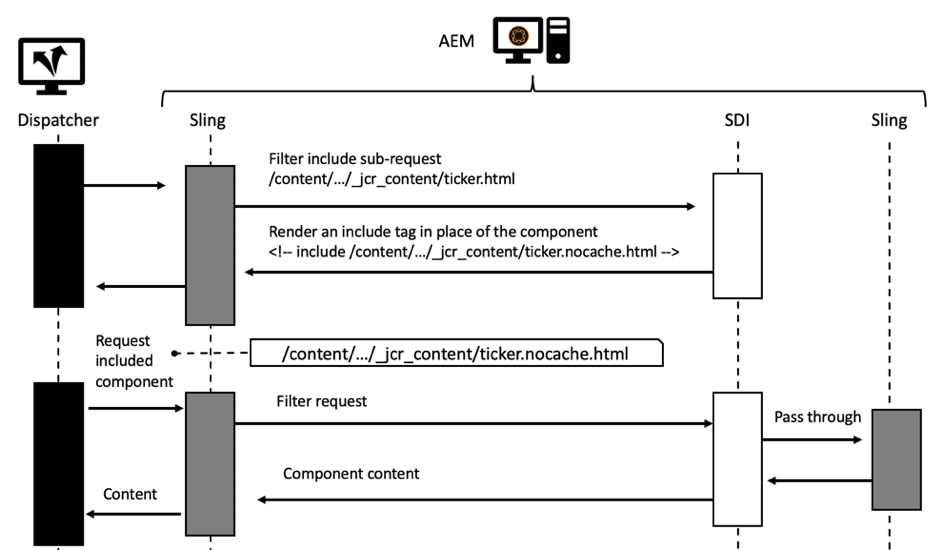

*Sequence Diagram of a Request using Sling Dynamic Include*

<br>&nbsp;

The SDI documentation says you should disable caching for URLs ending in "*.nocache.html", which makes sense – as you are dealing with dynamic components.

You might see another option how to use SDI: If you _do not_ disable the dispatcher cache for the includes, the Dispatcher acts like a fragment-cache similar to the one we described in the last chapter: Pages and component fragments equally and independently are cached in the dispatcher and stitched together by the SSI script in the Apache server when the page is requested. Doing so, you could implement shared components like the main navigation (given you always use the same component URL).

That should work – in theory. But...

We advise not to do that: You would lose the ability to bypass the cache for the real dynamic components. SDI is configured globally and the changes you would make for your "poor-mans-fragment-cache" would also apply to the dynamic components.

We advise you to carefully study the SDI documentation. There are a few other limitations, but SDI is a valuable tool in some cases.

#### References

* [docs.oracle.com - How to write custom JSP tags](https://docs.oracle.com/cd/E11035_01/wls100/taglib/quickstart.html)
* [Dominik Süß - Creating and using component filters](https://www.slideshare.net/connectwebex/prsentation-dominik-suess)
* [sling.apache.org - Sling Dynamic Includes](https://sling.apache.org/documentation/bundles/dynamic-includes.html)
* [helpx.adobe.com - Setting up Sling Dynamic Includes in AEM](https://helpx.adobe.com/experience-manager/kt/platform-repository/using/sling-dynamic-include-technical-video-setup.html)


#### Model Caching

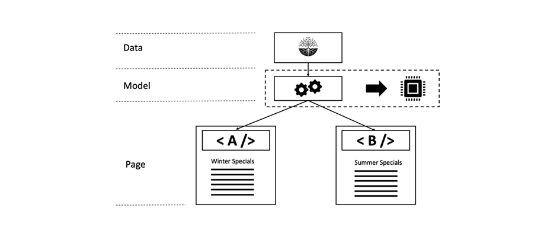

*Model based caching: One business object with two different renderings*

<br>&nbsp;

Let us revisit the case with the navigation again. We were assuming, that each page would require that same markup of the navigation.

But maybe, that is not the case. You might want to render different markup for the item in the navigation that represents the _current page_. 

```
Travel Destinations

<ul class="maninnav">
  <li class="currentPage">Travel Destinations
    <ul>
      <li>Finland
      <li>Canada
      <li>Norway
    </ul>
  <li>News
  <li>About us
<ul>
```

```
News

<ul class="maninnav">
  <li>Travel Destinations
  <li class="currentPage">News
    <ul>
      <li>Winter is coming>
      <li>Calm down in the wild
    </ul>
  <li>About us
<is
```

These are two completely different renderings. Yet still, the _business object_ - the complete navigation tree - is the same.  The _business object_  here would be an object graph representing the nodes in the tree. This graph can easily be stored in an in-memory cache. Remember though, that this graph must not contain any object or reference any object that you did not create yourself - especially now JCR nodes.

#### Caching in the Browser

We touched the importance of caching in the browser already, and there are many good tutorials out there. In the end - for the browser - the Dispatcher is just a webserver that follows the HTTP protocol.

However – despite the theory - we have gathered some  bits of knowledge that we found nowhere else and that we want to share.

In essence, browser caching can be leveraged in two different ways,

1. The browser has a resource cached of which it knows the exact expiry date. In that case it does not request the resource again.

2. The browser has a resource, but it is not sure if it is still valid. In that case it would ask the webserver (the Dispatcher in our case). Please give me the resource if it was modified since you last delivered it. If it hasn't changed, the server answers with "304 – not changed" and only the meta data was transmitted.

#### Debugging

If you are optimizing your Dispatcher settings for browser caching it is extremely useful to use a desktop proxy server between your browser and the webserver. We prefer "Charles Web Debugging Proxy" by Karl von Randow.

Using Charles, you can read the requests and responses, which are transmitted to and from the server. And – you can learn a lot about the HTTP protocol. Modern browsers also offer some debugging capabilities, but the features of a desktop proxy are unprecedented. You can manipulate the data transferred, throttle the transmission, replay single requests and much more. And the user interface is clearly arranged and quite comprehensive.

The most basic test is to use the website as a normal user - with the proxy in between - and check in the proxy if the number of the static requests (to /etc/…) is getting smaller over time – as these should be in the cache and not be requested any longer.

We found, a proxy might give a clearer overview, as cached request don't appear in the log whereas some browswer-built-in debuggers still show these requests with "0 ms" or "from disk". Which is ok and accurate but could cloud your view a bit.

You can then drill-down and check the headers of the transferred files to see, for example, if the "Expires" http headers are correct. You can replay requests with if-modified-since headers set to see if the server correctly responds with a 304 or 200 response code. You can observe the timing of asynchronous calls and you can also test your security assumptions to a certain degree. Remember we told you to not accept all selectors that are not are not explicitly expected? Here you can play around with the URL and the parameters and see if your application behaves well.

There is only one thing we ask you not to do, when you are debugging your cache:

Do not reload pages in the browser!

A "browser reload", a _simple-reload_ as well as a _forced-reload_ ("_shift-reload_") is not the same as a normal page request. A simple reload request sets a header

```
Cache-Control: max-age=0
```

And a Shift-Reload (holding down the "Shift" key while clicking the reload button) usually sets a request header

```
Cache-Control: no-cache
```

Both headers have similar yet slightly different effects – but most importantly, they differ completely from a normal request when you open a URL from the URL slot or by using links on the site. Normal browsing does not set Cache-Control headers but probably an if-modified-since header.

So, if you want to debug the normal browsing behavior, you should do exactly that: _Browse normally_. Using the reload button of your browser is the best way to not see cache configuration errors in your configuration.

Use your Charles Proxy to see what we are talking about. Yes – and while you have it open – you can replay the requests right there. No need to reload from the browser.

## Performance Testing

By using a proxy, you get a sense of the timing behavior of your pages. Of course, that is by far not a performance test.  A performance test would require a number of clients requesting your pages in parallel.

A common mistake, we have seen too often, is that the performance test only includes a super small number of pages and these pages are delivered from the Dispatcher cache only.

If you are promoting your application to the live system, the load is completely different, from what you have tested.

On the live system, the access pattern is not that small number of equally distributed pages that you have in tests (home page and few content pages). The number of pages is much larger number and the requests are very unevenly distributed. And - of course – live pages  cannot be served 100% from cache: There are invalidation requests coming from the Publish system that are auto-invalidating a huge portion of your precious resources.

Ah yes – and when you are rebuilding your Dispatcher cache, you will find out, that the Publish system also behaves quite differently, depending on whether you request only a handful of pages – or a bigger number. Even if all pages are similarly complex – their number plays a role. Remember what we said about chained caching? If you always request the same small number of pages, chances are good, that the according blocks with the raw data is in the hard drives cache or the blocks are cached by the operating system. Also, there is a good chance, that the Repository has cached the according segment in its main memory. So re-rendering is significantly faster than when you had other pages evicting each other now and then from various caches.

Caching is hard, and so is testing of a system that relies on caching. So, what can you do to have a more accurate real-life scenario?

We think you would have to conduct more than one test, and you would have to provide more than one performance index as a measure of the quality of your solution.

If you already have an existing website, measure the number of requests and how they are distributed. Try to model a test that uses a similar distribution of requests. Adding some randomness couldn't hurt. You don't have to simulate a browser which would load static resources like JS and CSS – those don't really matter. They are cached in the browser or in the Dispatcher eventually and they don't add up to the load significantly. But referenced images do matter. Find their distribution in old log files as well and model a similar request pattern.

Now conduct a test with your Dispatcher not caching at all. That is your worst-case scenario. Find out at what peak load your system is getting unstable under this worst of conditions. You might also make it worse by taking out a few Dispatcher/Publish legs if you want.

Next, conduct the same test with all required cache settings to "on". Ramp up your parallel requests slowly to warm the cache and see how much your system can take under these best case conditions.

An average case scenario would be to run the test with the Dispatcher enabled but also with some invalidations happening. You can simulate that by touching the statfiles by a cronjob or sending the invalidation requests in irregular intervals to the Dispatcher. Don't forget to also purge some of the non-auto invalidated resources every now and then.

You can vary the last scenario by increasing the invalidation requests and by increasing the load.

That is a bit more complex than just a linear load test – but gives a lot more confidence into your solution.

You might shy away from the effort. But at lease conduct a worst–case test on the Publish system with a larger number of pages (equally distributed) to see the limits of the system. Make sure, you interpret the number of the best-case scenario correctly and provision your systems with enough headroom.