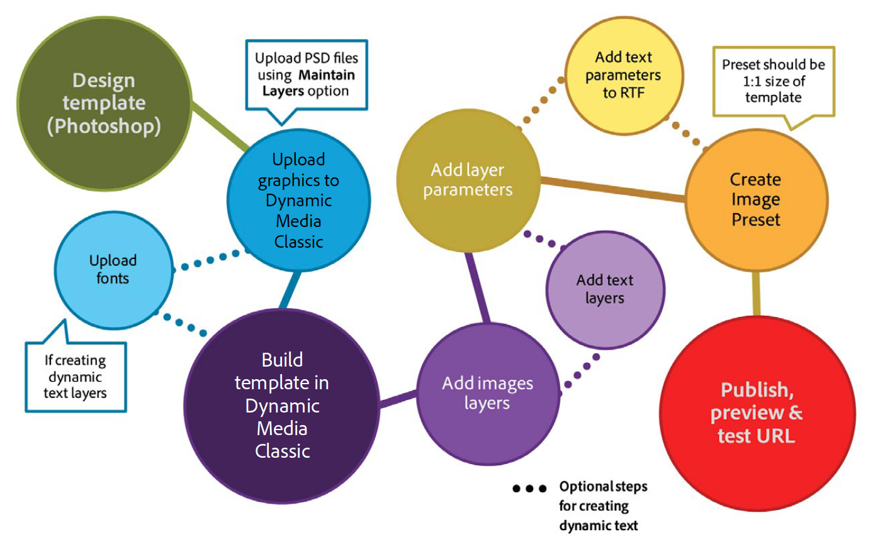
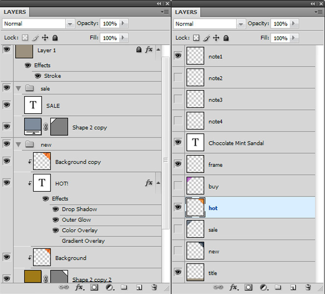
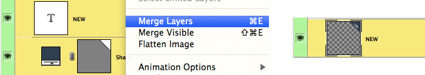
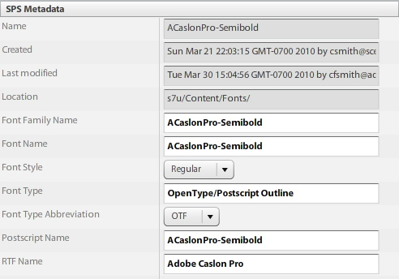
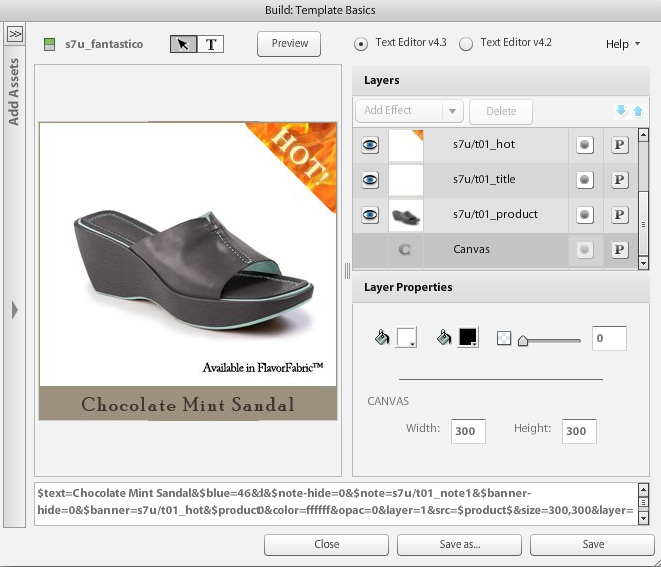
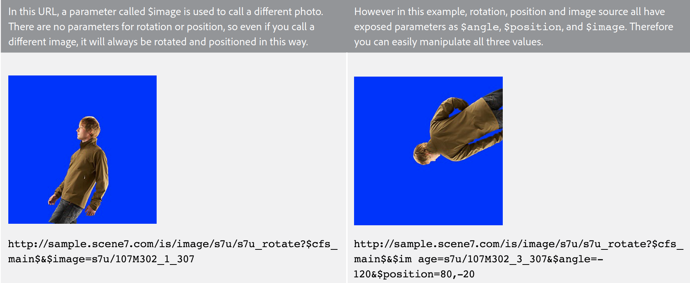
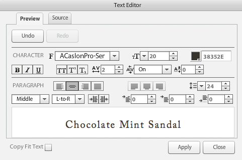
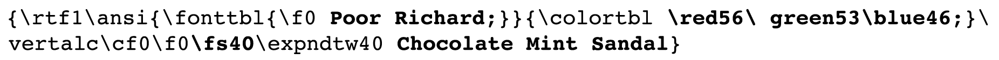
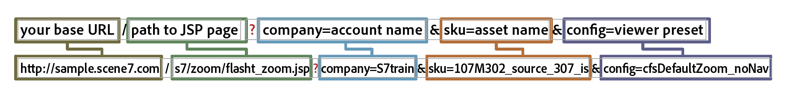
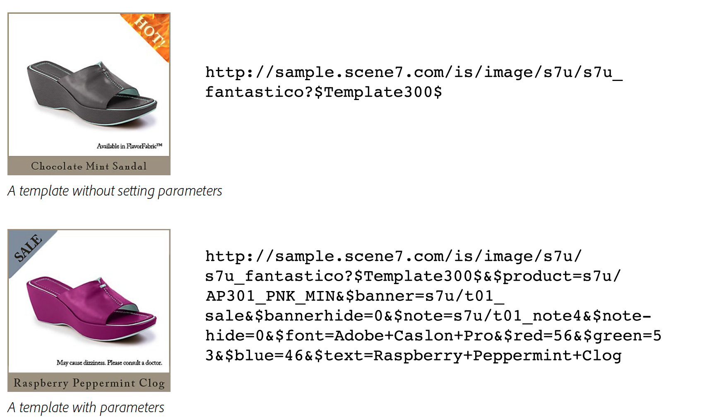

# Introduction to Basic Templates {#basic-templates}

In Dynamic Media Classic terms, a template is a document that can be changed dynamically via the URL after the template has been published. Dynamic Media Classic offers Basic Templates, image-based templates called from the Image Server and consisting of images and rendered text.

One of the most powerful aspect of templates is that they have direct integration points that let you tie them to your database. So not only can you serve up an image and resize it, you can query your database to find new or sale items and make that appear as an overlay on the image. You can ask for a description of the item and make that appear as a label in a font you choose and layout. The possibilities are limitless.

Basic Templates can be implemented in many different ways, from simple to complex. For example:

- Basic merchandising. Uses labels like "free shipping" if that product has free shipping. These labels are setup by the merchandise team in Photoshop, and the web uses logic to know when to apply them to the image.
- Advanced merchandising. Each template has multiple variables and may show more than one option at the same time. Uses a database, inventory and business rules to determine when to show a product as "Just In", on "Clearance," or "Sold Out." Also may use transparency behind the product to show it on different backgrounds, such as in different rooms. The same templates and/or assets may be repurposed on the product detail page to show a larger or zoomable version of the same product on different backgrounds.

It's important to understand that Dynamic Media Classic only provides the visual portion of these templates-based applications. Dynamic Media Classic companies or their integration partners must supply the business rules, the database, and development skills to create the applications. There is no "built-in" template application; designers set up the template in Dynamic Media Classic, and developers use URL calls to change the variables in the template.

By the end of this section of the tutorial you will know how to:

- Upload a Photoshop PSD to Dynamic Media Classic to use it as the basis of a template.
- Create a simple merchandising Basic Template consisting of image layers.
- Add text layers and make them variable through the use of parameters.
- Construct a template URL and manipulate the image dynamically through the web browser.

> [!NOTE]
>
> All URLs in this chapter are for illustrative purposes only; they are not live links.

## Overview of Basic Templates

The definition of a Basic Template (or just "template," for short) is a URL-addressable layered image. The end result is an image, but one that can be altered by the URL. It can consist of photos, text, or graphics — any combination of P-TIFF assets in Dynamic Media Classic.

Templates are most similar to Photoshop PSD files, as they have a similar workflow and similar capabilities.

- Both consist of layers that are like sheets of stacked acetate. You can composite partially transparent images and see through the transparent areas of a layer to the layers below.
- The layers can be moved and rotated to reposition the content and the opacity and blending modes can be altered to make the content partially transparent.
- You can create text-based layers. The quality can be very high because the Image Server uses the same text engine as Photoshop and Illustrator.
- Simple layer styles can be applied to each layer to create special effects such as drop shadows or glows.

However, unlike Photoshop PSDs, layers can be entirely dynamic and controlled via a URL on the Image Server.

- You can add variables to all template properties, making it easy to change its composition on the fly.
- Variables called parameters allow you to only expose the part of the template that you want to change.

You only need to add a placeholder for each layer that will vary instead of putting all layers in a single file as you do in Photoshop, and showing and hiding them (although you can also do that too, if you prefer).

Using a placeholder, you can dynamically swap out a layer's content with another published asset, and it will automatically take the same properties (such as size and rotation) of the layer it replaced.

Because Basic Templates are typically designed in Photoshop but deployed via a URL, a template project requires a mixture of both design and technical skills. We generally assume that the person doing the creative template work is a Photoshop designer, and the person implementing the template is a web developer. The creative and development teams must work closely together for the template to be successful.

Template projects can be relatively simple or extremely complex depending on the business rules and needs of the application. Basic Templates are called from the Image Server, however due to the flexibility of the Dynamic Media Classic environment, you can even nest templates inside other templates, allowing you to create fairly complex images that can be linked by commonly named variables.

- Learn more about [Template Basics](https://docs.adobe.com/content/help/en/dynamic-media-classic/using/template-basics/quick-start-template-basics.html).
- Learn how to create a [Basic Template](https://docs.adobe.com/content/help/en/dynamic-media-classic/using/template-basics/creating-template.html#creating_a_template).

## Creating a Basic Template

When working with a Basic Template, you usually follow the workflow steps in the diagram below. Steps marked with dotted lines are optional if you are using dynamic text layers, and are indicated in the instructions below as "Text Workflow." If not using text, follow the main path only.

_The Basic Template workflow._

1. Design and create your assets. Most users do this in Adobe Photoshop. Design assets at the exact size you need — if it is a 200-pixel image for a thumbnail page, design it at 200 pixels. If you need to zoom on it, design it at a size of about 2000 pixels. Use Photoshop (and/or Illustrator saved as bitmap) to create the assets, and use Dynamic Media Classic to assemble the parts together, manage the layers, and add variables.
2. After designing graphic assets, upload them to Dynamic Media Classic. Rather than upload individual assets from the PSD, we recommend you upload your entire layered PSD file and have Dynamic Media Classic create a file per layer, by using the **Maintain Layers** option on upload (see below for more details.) _Text Workflow: If creating dynamic text, upload your fonts as well. Dynamic text is variable and controlled via the URL. If your text is static or has only a few short phrases that don’t change — for example, tags that say “New” or “Sale,” rather than “X% Off,” with the X being a variable number — we recommend pre-rendering the text in Photoshop and uploading as rasterized layers as images. It will be easier and you can style the text exactly as you want._
3. Build the Template in Dynamic Media Classic using the Template Basics editor of the Build menu and add image layers. Text Workflow: Create text layers in the same editor. This step is required when building a template manually in Dynamic Media Classic. Choose a canvas size that matches your design, drag and drop images onto the canvas, and set layer properties (size, rotation, opacity, etc.). You’re not putting every possible layer on your template, just one placeholder per image layer. _Text Workflow: You create text layers with the Text tool, similar to creating text layers in Photoshop. You can choose a font and style it using the same options available with the Photoshop Type tool._ Another workflow is to upload a PSD and have Dynamic Media Classic generate a “free” template, and can even recreate text layers. This will be discussed in more detail later.
4. Once the layers are created, add parameters (variables) to any property of any layer that you'd like to control through the URL, including the layer's source (the image itself ). _Text Workflow: You also can add parameters to text layers, both to control the content of the text and size and position of the layer itself, as well as all of the formatting options such as font color, font size, horizontal tracking, etc._
5. Create an Image Preset that matches the size of your template. We recommend doing this so the template is always called at a 1:1 size, and also to add sharpening to any large image layers that get resized to fit the template. If you are building a template to be zoomed on, this step is unnecessary.
6. Publish, copy the URL from the Dynamic Media Classic preview, and test it in a browser.

## Preparing and Uploading Your Template Assets to Dynamic Media Classic

Before uploading your template assets to Dynamic Media Classic, you will need to complete a few preparatory steps.

### Preparing the PSD for Upload

Before uploading your Photoshop file to Dynamic Media Classic, simplify the layers in Photoshop to make it easier to work with and to have greatest compatibility with the Image Server. Your PSD file will often consist of many elements that Dynamic Media Classic does not recognize, and you may also end up with many little pieces that are difficult to manage. Be sure to save a backup of your master PSD in case you need to later edit the original. You will upload the simplified copy, and not the master.

1. Simplify the layer structure by merging/flattening related layers that need to be turned on/off together into a single layer. For example, the label "NEW" and the blue banner are merged into a single layer so you can show or hide them with a single click.
   
2. Some layers types and layer effects are not supported by Dynamic Media Classic or the Image Server and need to be rasterized prior to upload. Otherwise the effects might be ignored, or the layers discarded. Rasterizing a layer means converting if from being editable to being non-editable. To rasterize layer effects or text layers, create an empty layer, select both and merge using **Layers > Merge Layers** or CTRL + E/CMD + E.

   - Dynamic Media Classic cannot group or link layers. All layers in a group or linked set will be converted to separate layers that are no longer grouped/linked.
   - Layer masks will be converted to transparency on upload.
   - Adjustment layers are not supported and will be discarded.
   - Fill layers, such as Solid Color layers, will be rasterized.
   - Smart Object layers and vector layers will be rasterized into normal images on upload and Smart Filters will be applied and rasterized.
   - Text layers will also be rasterized unless you use the Extract Text option—see below for more information.
   - Most layer effects will be ignored and only a few blend modes are supported. If in doubt, add simple effects in Dynamic Media Classic (such as inner or drop shadows, inner or outer glows), or use a blank layer to merge and rasterize the effect in Photoshop.

### Working with Fonts

You will also upload and publish your fonts if you need to generate dynamic text. The only font included with Dynamic Media Classic is Arial.

It is each company's responsibility to obtain a license to use a font on the web — simply having a font installed on your computer does not give you the right to use it commercially on the web, and your company could face legal action from the font publisher if used without permission. Also, license terms vary — you might need separate licenses for print versus screen display, for example.

Dynamic Media Classic supports standard OpenType (OTF), TrueType (TTF) and Type 1 Postscript fonts. Mac- only suitcase fonts, type collection files, Windows system fonts and proprietary machine fonts (like fonts used by engraving or embroidery machines) are all not supported — you will have to convert them to one of the standard font formats or substitute a similar font to use in Dynamic Media Classic and on the Image Server.

After fonts are uploaded to Dynamic Media Classic, like any other asset, they must also be published to the Image Server. A very common template error is to forget to publish your fonts, which will result in an image error — the Image Server will not substitute another font in its place. In addition, if you want to use the **Extract Text** option when uploading, you must upload your font files before uploading the PSD that uses those fonts. The **Extract Text** feature will attempt to recreate your text as an editable text layer and place it inside a Dynamic Media Classic template. This is discussed in the next topic, PSD Options.

Be aware that fonts have multiple internal names that are often different from their external filename. You can see all their different names on the Details page for that asset in Dynamic Media Classic. Here are the names for the font Adobe Caslon Pro Semibold, listed under the Metadata tab in Dynamic Media Classic:

_Metadata tab on the Details page for a font in Dynamic Media Classic._

Dynamic Media Classic uses the filename of this font (ACaslonPro-Semibold) as its Asset ID, however that is not the name used by the template. The template uses the Rich Text Format (RTF) Name, listed at the bottom. RTF is the native "language" of the Image Server text engine.

If you need to change fonts via the URL, you must call to the RTF name of the font (not the Asset ID), or you will get an error. In this case, the proper name for this font would be "Adobe Caslon Pro." We will discuss more about fonts and RTF in the topic RTF and Text Parameters, below.

The most common font file formats found on Windows and Mac systems are OpenType and TrueType. OpenType has a .OTF extension, while TrueType is .TTF. Both formats work equally well in Dynamic Media Classic.

### Selecting Options When Uploading Your PSD

You do not need to upload a Photoshop file (PSD) to create a template; a template can be built out of any image assets in Dynamic Media Classic. However uploading a PSD can make authoring easier because you'll typically have these assets already in a layered PSD. In addition, Dynamic Media Classic will automatically generate a template when you upload a layered PSD.

- **Maintain Layers.** This is the most important option. This tells Dynamic Media Classic to create one image asset per Photoshop layer. If unchecked, all other options are disabled and the PSD will be flattened into a single image.
- **Create** **Template.** This option takes the various generated layers and automatically creates a template by combining them back together. A drawback to using the auto-generated template is that Dynamic Media Classic places all the layers in one file, whereas we only need a single placeholder per layer. It's easy enough to delete the extra layers, but if you have many layers, it is faster to recreate them. Be sure to rename the new template; if you don't, it will be overwritten the next time you re-upload the same PSD.
- **Extract Text.** This recreates text layers in the PSD as text layers in the template using the font you uploaded. This step is required if your text is on a path in Photoshop and you want to maintain that path in the template. This feature requires you to use the **Create Template** option, as the extracted text can only be created by a template generated on upload.
- **Extend Layers to Background Size.** This setting makes each layer the same size as the overall PSD canvas. This is very useful for layers that will always stay fixed in position: otherwise when swapping images into the same layer, you may have to reposition them.
- **Layer Naming.** This tells Dynamic Media Classic how to name each asset generated per layer. We recommend either **Photoshop** **and Layer** **Name** or Photoshop and **Layer** **Number**. Both options use the PSD name as the first part of the name, and adds either the layer name or number at the end. For example, if you have a PSD named "shirt.psd," and it has layers named "front," "sleeves," and "collar," if you upload using the **Photoshop and** Layer **Name** option, Dynamic Media Classic would generate the Asset IDs "shirt_front,""shirt_sleeves,"and "shirt_collar." Using one of these options helps ensure the name is unique in Dynamic Media Classic.

## Creating a Template with Image Layers

Even though Dynamic Media Classic can automatically create a template from a layered PSD, you should know how to build the template manually. As explained above, there are certain times when you don't want to use the template created by Dynamic Media Classic.

### The Template Basics UI

Let's first get familiar with the editing interface.

In the left center is your work area showing a preview of your final template. On the right side are the Layers and Layer Properties panels. These areas are where you will be doing the most work.

_Build Template Basics page._

- **Preview/Work Area.** This is the main window. Here you can move, resize, and rotate layers with your mouse. Layer outlines are shown as dashed lines.
- **Layers.** This is similar to the Photoshop layers panel. As you add layers to your template, they will appear here. Layers are stacked from top to bottom — the top layer in the Layers panel will be seen above the others below it in the list.
- **Layer Properties.** Here you can adjust all the properties of a layer using numeric controls. First select a layer, and then adjust its properties.
- **Composite** **URL.** At the bottom of the UI is the Composite URL area. This will not be discussed in this section of the tutorial, however here you will see your template deconstructed as a series of Image Serving URL modifiers. This area is editable — if you are very familiar with Image Server commands you can manually edit the template here. However you can break it as well. Like Photoshop, layer numbering starts at 0. The Canvas is layer 0, and the first layer you add yourself is layer 1. Blend modes determine how a layer's pixels blend with pixels below it. You can create a variety of special effects using blending modes.

#### Using the Template Basics Editor

Here are the workflow steps to start your Basic Template:

1. In Dynamic Media Classic, go to **Build > Template Basics**. You can either have nothing selected, or start by selecting an image, which will become the first layer of your template.
2. Choose a Size and press **OK**. This size should match the size you designed in Photoshop. The template editor will load.
3. If you didn't have an image selected in step 1, search for or browse to an image in the asset panel on the left and drag it onto the work area.

   - The image will automatically be resized to fit the size of the canvas. If you plan to swap out your high- resolution images, then you would typically bring in one of your large (2000 px) P-TIFF images and use it as a placeholder.
   - This should be the bottom-most layer of your template, however you can reorder the layers later.

4. Resize or reposition the layer directly in the work area, or by adjusting the settings in the Layer Properties panel.
5. Drag in additional image layers as needed. Add layers effects if you want as well. See the topic _Adding Layer Effects_, below.
6. Click **Save**, choose a location, and give the template a name. You can preview, however at this point your template will look exactly like a flattened Photoshop image — it is not changeable yet.

### Adding Layer Effects

The Image Server supports a few programmatic layer effects — special effects that change the appearance of a layer's contents. They work similarly to layer effects in Photoshop. They are attached to a layer but controlled independently of the layer. You can adjust or remove them without making a permanent change to the layer itself.

- **Drop Shadow**. Applies a shadow outside the layer's boundaries, positioned by an x and y pixel offset.
- **Inner Shadow**. Applies a shadow inside the layer's boundaries, positioned by an x and y pixel offset.
- **Outer Glow**. Applies a glow effect evenly around all edges of the layer.
- **Inner Glow**. Applies a glow effect evenly inside all edges of the layer.

_A layer with and without a drop shadow_

To add an effect, click **Add Effect**, and choose an effect from the menu. Like normal layers, you can select an effect in the Layers panel and use the Layer Properties panel to adjust its settings.

Shadow effects are offset horizontally or vertically away from the layer, whereas Glow effects are applied evenly in all directions. Inner effects act on top of the opaque portions of the layer, whereas Outer effects only affect the transparent areas.

Learn more about[Adding Layer Effects](https://docs.adobe.com/content/help/en/dynamic-media-classic/using/template-basics/creating-template.html#using-shadow-and-glow-effects-on-layers).

### Adding Parameters

If all you do is combine layers and save them, then the net result is no different from a flattened Photoshop image. What makes templates special is the ability to add parameters to the properties of each layer, so they can be changed dynamically through the URL.

In Dynamic Media Classic terms, a parameter is a variable that can be linked to a template property so it can be manipulated via a URL. When you add a parameter to a layer, Dynamic Media Classic exposes that property in the URL by prefixing the name of your parameter with a dollar sign ($) — for example, if you create a parameter called "size" to change the size of a layer, Dynamic Media Classic will rename your parameter $size.

If you don't add a parameter for a property, that property remains hidden in the Dynamic Media Classic database and doesn't show up in the URL.

Without parameters, your URLs would typically be much longer, especially if you are also using dynamic text. Text adds many dozens of extra characters onto each URL.

Finally, your initial set of parameters will become the default values of properties in the template. If you build your template, add parameters, and then call the URL without its parameters, the Image Server will create the image with all the defaults you saved in the template. Parameters are only needed if you want to change a property. If a property does not need to change, you don't need to set a parameter.

#### Creating Parameters

This is the workflow for creating parameters:

1. Click the **Parameters** button next to the name of the layer for which you want to create parameters. The Parameters screen opens. It lists each property on the layer and its value.
2. Select the **On** option beside the name of each property you want to make into a parameter. A default parameter name will appear. You can only add parameters to properties that have changed from their default state.

   - For example, if you add a layer and keep it at its default xy position of 0,0, Dynamic Media Classic will not expose a **Position** property. To fix, move the layer at least one pixel. Now Dynamic Media Classic will expose **Position** as a property you can parameterize.
   - To add a parameter to the show/hide property (which turns the layer on and off ), click the **Show** or **Hide Layer** icon to toggle the layer off (you can turn it back on afterwards if you want). Dynamic Media Classic will now expose a **Hide** property that can be parameterized.

3. Rename the default parameter names to something that will be easier to identify in the URL. For example, if you want to add a parameter to change the banner layer on top of an image, change the default name of "layer_2_src" to"banner."
4. Press **Close** to exit the Parameters screen.
5. Repeat this process for other layers by clicking the **Parameters** button and adding and renaming parameters.
6. Save your changes when done.

> [!TIP]
>
> Rename your parameters to something meaningful, and develop a naming convention to standardize those names. Be sure the naming convention is agreed upon in advance by both the design and development teams.
>
> Can't add a parameter because you don't see the property? Just change the property of the layer from its default (by moving, resizing, hiding, etc.). You should now see that property exposed.

Learn more about [Template Parameters](https://docs.adobe.com/content/help/en/dynamic-media-classic/using/template-basics/creating-template-parameters.html).

## Creating a Template with Text Layers

Now you'll learn how to create a Basic Template that includes text layers.

### Understanding Dynamic Text

You now know how to build a Basic Template using image layers. For many applications this is all you need. As you saw in the previous exercise, layers that have simple text (such as "Sale" and "New") can be rasterized and treated as images because their text does not need to change.

However, what if you needed to:

- Add a label to say "25% Off," with the value of 25% being variable
- Add a text label with the name of the product on top of the image
- Localize your layers into different languages depending on the country in which your template is seen

In that case, you'd want to add some dynamic text layers with parameters to control the text and/or formatting.

To create text, you need to upload some fonts — otherwise, Dynamic Media Classic will default to Arial. The fonts must also be published to the Image Server, or it will generate an error the moment it tries to render any text that uses that font.

### RTF and Text Parameters

In order to add variables to text using the Template Basics tool, you should understand how text is rendered. The Image Server generates text using the Adobe Text Engine, the same engine used by Photoshop and Illustrator, and composites it as a layer in the final image. To communicate with the engine, the Image Server uses Rich Text Format, or RTF.

RTF is a file format specification developed by Microsoft for specifying formatting of documents. It is a standard markup language used by most word processing and email software. If you wrote into a URL &amp;text=\b1 Hello, the Image Server would generate an image with the word "Hello" in bold type, because \b1 is the RTF command for making the text bold.

The good news is that Dynamic Media Classic generates the RTF for you. Whenever you type text into a template and add formatting, Dynamic Media Classic quietly writes the RTF code into the template automatically. The reason we mention it is because you will be adding parameters directly to the RTF itself, so it is important that you are a little bit familiar with it.

#### Creating Text Layers

You can create text layers in a template in Dynamic Media Classic in the following two ways:

1. Text tool in Dynamic Media Classic. We'll discuss this method below. The Template Basics editor has a tool that lets you create a text box, enter text and format the text. Dynamic Media Classic generates the RTF as needed and places it in a separate layer.
2. Extract Text (on upload). The other method is to create the text layer in Photoshop and save it in the PSD as a normal text layer (instead of rasterizing it as an image layer). You then upload the file to Dynamic Media Classic and use the **Extract Text** option. Dynamic Media Classic will convert each Photoshop text layer to an Image Serving text layer using RTF commands. If you use this method, make sure you first upload your fonts to Dynamic Media Classic, otherwise Dynamic Media Classic will substitute a default font on upload, and there is no easy way to re-substitute the correct font.

### The Text Editor

You enter text using the Text Editor. The Text Editor is a WYSIWYG interface that allows you enter and format your text using formatting controls similar to those in Photoshop or Illustrator.

_Template Basics Text Editor._

You'll do most of your work in the **Preview** tab, which allows you to enter text and see it displayed as it will look in the template. There is also a **Source** tab, which is used to manually edit the RTF, if necessary.

The general workflow is to use the **Preview** tab to type some text.

Then you select the text and choose some formatting like font color, font size, or justification using the controls at the top. After the text is styled the way you want, click **Apply** to see it update in the work area preview. You then close the Text Editor to return to the Template Basics main window.

#### Using the Text Editor

Here are the workflow steps for adding text inside the Template Basics build page:

1. Click the **Text** tool button at the top of the build page.
2. Drag out a text box where you want text to appear. The Text Editor window will open in a modal window. In the background, you will see your template, however it is not editable until you finish editing the text.
3. Type the sample text you want to appear when the template is first loaded. For example, if you are creating a text box for a personalized email image, your text might say "Hi Name. Now is the time to save!" Later you'd add a text parameter to replace Name with a value you send on the URL. Your text will not appear in the template beneath the window until you click **Apply**.
4. To format your text,select it by dragging with your mouse and choose a formatting control in the UI.

   - There are many formatting options. Some of the most common are font (face), font size, and font color, as well as left/center/right justification.
   - Don't forget select the text first. Otherwise you won't be able to apply any formatting.
   - To choose a different font, make sure you select the text and open the Font menu. The editor will show a list of all fonts uploaded to Dynamic Media Classic. If a font is also installed on your computer, it will show up in black. If it is not installed on your computer, it will show in red. However, it will still render in the preview window when you click **Apply**. You only need to upload fonts to Dynamic Media Classic to make them available to anyone using Dynamic Media Classic. Once you publish, the Image Server will use those fonts to generate the text — your users do not need to install any fonts to see the text you create because it is part of an image.
   - Unlike Photoshop and Illustrator, the Image Server can align your text vertically in the text box. The default is top alignment. To change this, select your text and choose **Middle** or **Bottom** from the **Vertical Alignment** menu.
   - If you make the text too large for the box (or your text box is too small), all or part of it will get clipped and disappear. Reduce the font size or make the box larger.

5. Click **Apply** to see your changes take effect in the work area window. You must click **Apply**, or else you will lose your edits.
6. When you are finished, click **Close**. If you want to go back to editing mode, double-click on the text layer to re-open the Text Editor.

The text editor will preview exactly how big the font will be if you have the font installed locally on your system.

### About Adding Parameters to Text Layers

We now follow a similar process for adding text parameters as we did for layer parameters. Text layers can also take layer parameters for size, position, and so on; however, they can take additional parameters that allow you to control any aspect of the RTF.

Unlike layer parameters, you only select the value you want to change and add a parameter to that rather than add a parameter to the entire property.

Sample RTF:

When examining the RTF, you need to figure out where each setting is that you want to change. In the RTF above, some of it might make some sense and you can see where the formatting comes from.

You can see the phrase Chocolate Mint Sandal — that is the text itself.

- There is a reference to the font Poor Richard — this is where fonts are selected.
- You can see an RGB value: \red56\green53\blue4 — this is the text color.
- Although the font size of 20, you don't see the number 20. However, you do see a command \fs40 — for some odd reason, RTF measures fonts as half-points. Thus \fs40 is the font size!

You have enough information to create your parameters, however there is a complete reference of all the RTF commands in the Image Serving documentation. Visit the [Image Serving Documentation](https://docs.adobe.com/content/help/en/dynamic-media-developer-resources/image-serving-api/image-serving-api/http-protocol-reference/text-formatting/c-text-formatting.html#concept-0d3136db7f6f49668274541cd4b6364c).

#### Adding Parameters to Text Layers

Here are the steps to add parameters to text layers.

1. Click the **Parameters** button (a "P") next to the name of the text layer for which you want to create parameters. The Parameters screen opens. The **Common** tab lists each property on the layer and its value. Here you can add regular layer parameters.
2. Click on the **Text** tab. Here you can see the RTF at the top; the parameters you add will be beneath that.
3. To add a parameter, first highlight the value you want to change and click the **Add Parameter** button. Make sure you only select the values for commands and not the entire command itself. For example, to set a parameter for the font name in the sample RTF above, I would only highlight "Poor Richard" and add a parameter to that, but not also the "\f0." When you click **Add Parameter** , it will appear in the list below, and the parameter value will appear in red in the RTF while it is still selected. If you need to remove a parameter, click the checkbox next to **On** to turn off that parameter,and it will disappear.
4. Click to rename your parameter to a more meaningful name.
5. When you are done, your RTF will be highlighted in green where parameters exist, and your parameter names and values will be listed below.
6. Click **Close** to exit the Parameters screen. Then press **Save** , to save the template. If you are finished editing, press **Close** to exit the Template Basics page.
7. Click **Preview** to test your template in Dynamic Media Classic. To test your text parameters, type new text or new values in the preview window. To change the font, you must type the exact RTF name of the font.

> [!TIP]
>
> To add parameters to the text color, separately add parameters for red, green, and blue. For example, if the RTF is `\red56\green53\blue46`, you would add separate red, green, and blue parameters for the values 56, 53, and 46. In the URL, you would change the color by calling all three: `&$red=56&$green=53&$blue=46`.

Learn how to [Create Dynamic Text Parameters](https://docs.adobe.com/content/help/en/dynamic-media-classic/using/template-basics/creating-template-parameters.html#creating-dynamic-text-parameters).

## Publishing and Creating Template URLs

### Create an Image Preset

Creating a preset for your template is not a required step. We recommend it as a best practice so the template is always called at a 1:1 size and also to add sharpening to any large image layers that get resized to fit the template. If you call an image without a preset, the Image Server may arbitrarily resize your image to the default size (about 400 pixels), and will not apply default sharpening.

There is nothing special about an Image Preset for a template. If you already have a preset for a static image at the same size, you can use it instead.

### Publish

You will need to run a publish to see your changes pushed live to the Image Server. Keep in mind what needs to get published: the various image asset layers, the fonts for dynamic text, and the template itself. Similar to other Dynamic Media Classic rich media assets like Image Sets and Spin Sets, a Basic Template is an artificial construction — it is a line item in the database that references the images and fonts using a series of Image Serving commands. So when you publish the template, all you are doing is updating data on the Image Server.

Learn more about [Publishing Your Template](https://docs.adobe.com/content/help/en/dynamic-media-classic/using/template-basics/publishing-templates.html).

### Template URL Construction

A Basic Template has the same essential URL syntax as a normal image call as explained earlier. A template will typically have more modifiers — commands separated by an ampersand (&amp;) — such as parameters with values. However the main difference is that you call to the template as your main image, instead of calling to a static image.

Unlike Image Presets, which have a dollar sign ($) on each side of the preset name, parameters have a single dollar sign at the beginning. The placement of those dollar signs is important.

**Correct:**

`$text=46-inch LCD HDTV`

**Incorrect:**

`$text$=46-inch LCD HDTV`

`$text=46-inch LCD HDTV$`

`text=46-inch LCD HDTV`

As noted earlier, parameters are used to change the template. If you call the template without parameters, it will revert back to its default settings as designed in the Template Basics authoring tool. If a property does not need to change, you don't need to set a parameter.

_Examples of a template without setting parameters (above) and with parameters (below)._
