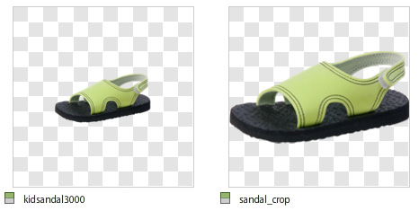
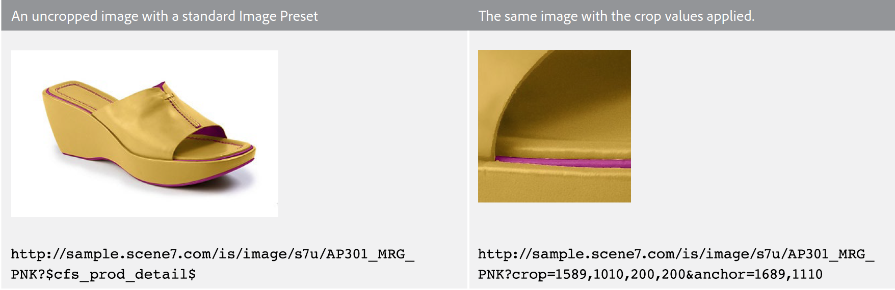
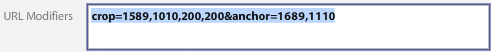
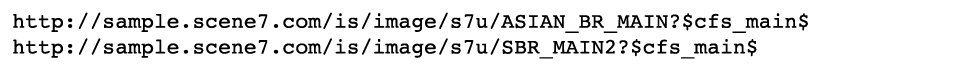
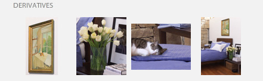
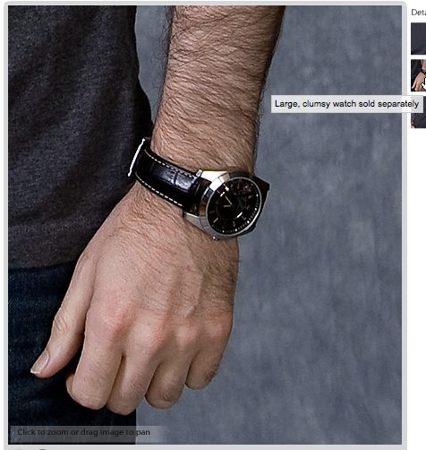
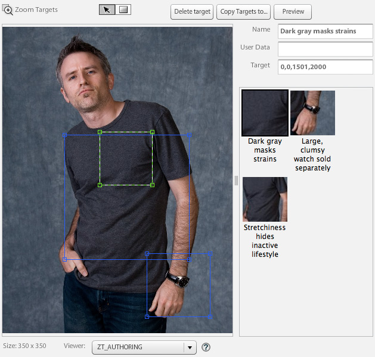
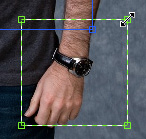
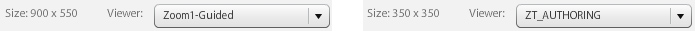

# Cropping, Adjusted Images, and Zoom Targets {#crop-adjusted-zoom-targets}

One of the main strengths of the Dynamic Media Classic master image concept is that you can repurpose the image asset for many uses. Traditionally, you would have to create separate, cropped versions of each image to show off details or for swatches. When using Dynamic Media Classic, you can do the same tasks on your single master, and either save those cropped versions as new physical files or as virtual derivatives that take no storage space.

By the end of this section of the tutorial you will know how to:

- Crop images in Dynamic Media Classic and save as new master files or as virtual images. [Learn more](https://docs.adobe.com/help/en/dynamic-media-classic/using/master-files/cropping-image.html).
- Save virtual Adjusted Images and use them in place of master assets. [Learn more](https://docs.adobe.com/content/help/en/dynamic-media-classic/using/master-files/adjusting-image.html).
- Create Zoom Targets on your images to show off their highlights. [Learn more](https://docs.adobe.com/content/help/en/dynamic-media-classic/using/zoom/creating-zoom-targets-guided-zoom.html).

## Cropping

Dynamic Media Classic has a few image editing tools conveniently available in the UI, including the Crop tool. You might wish to crop your master image inside Dynamic Media Classic for a number of reasons. For example:

- You don't have access to the original file. You want to display the image with a different cropping or aspect ratio, but you don't have the original file on your computer or are working from home. In this case you can go into Dynamic Media Classic, find the image, crop it and save it, or save it as a new version.
- To remove excess white space. The image was photographed with too much white space, which makes the product look small. You want your thumbnail images to fill up the canvas as much as possible.
- To create Adjusted Images, virtual copies of images that take no disk space. Some companies have business rules that require them to keep separate copies of the same image, but with a different name. Or maybe you want a cropped and uncropped version of the same image.
- To make new images from a source image. For example, you may want to create color swatches or a detail of the main image. You could do this in Adobe Photoshop and upload separately or use the Crop tool in Dynamic Media Classic.

>[!NOTE]
>
>All URLs in the following discussions of Cropping are for illustrative purposes only; they are not live links.

### Using the Crop Tool

You can access the Crop tool in Dynamic Media Classic from the Details page for an asset or by clicking the **Edit** button. You can use the tool to crop in two ways:

- The default cropping mode in which you drag the handles of the crop window or type values in the Size box. Learn how to [Manually Crop](https://docs.adobe.com/content/help/en/dynamic-media-classic/using/master-files/cropping-image.html#select-an-area-to-crop).
- Trim. Use this to remove extra whitespace around your image by calculating the number of pixels that do not match your image. Learn how to [Crop by Trimming](https://docs.adobe.com/content/help/en/dynamic-media-classic/using/master-files/cropping-image.html#crop-to-remove-white-space-around-an-image).

### _Manual Cropping_

When you save a manually cropped version it appears that the image is permanently cropped; Dynamic Media Classic is actually hiding the pixels by adding an internal URL modifier to crop the image. When you publish, it will appear to everyone that the image is cropped, however you can return to the Crop Editor and remove the crop at a later point.

You can then choose whether to save as a New Master Image or as an Additional View of the master. A new master is a new physical file (like a TIFF or JPEG) that takes up storage space. An additional view is a virtual image that takes up no server space. We don't recommend that you choose Replace Original, because that will overwrite your master and make the crop permanent. If you save as a new master or as an additional view, you must choose a new Asset ID. Like other Asset IDs, this must be a unique name in Dynamic Media Classic.

### _Trim Cropping_

If you upload an image with too much whitespace (extra canvas) around the main subject of the image, it will look much smaller on the web when resized. This is especially true for thumbnail images that are 150 pixels or smaller — the subject of the photo may get lost in all the extra space around it.

Compare these two versions of the same image.

The image on the right is made much more prominent by removing the extra space around the product. Trimming can be done one image at a time, using the Crop tool, or run as a batch process as you upload. We recommend running as a batch process if you want all your images to be consistently cropped to the boundaries of the main subject. Trim crops to the bounding box — the rectangle surrounding the image.

>[!NOTE]
>
>Trim does not create transparency around the image. For that, you would need to embed a clipping path on the image and use the **Create Mask from Clip Path** upload option.
>
>Also, to restore an image to its original state after you've cropped it when you've used the **Save** option, display the image in the Crop Editor screen and select the **Reset** button.

### _Cropping on Upload_

As mentioned earlier, you can also choose to crop the images as you upload them. To use trim cropping on upload, click the **Job Options** button, and under Crop Options, choose **Trim**.

Dynamic Media Classic will remember this option for the next upload. While you might want it to crop images for this upload, you might not want them cropped for every upload. Another option would be to set a special scheduled FTP upload job, and put the crop options there. That way you would only run the job when you needed to crop your images.

>[!IMPORTANT]
>
>If you set a crop for your upload, Dynamic Media Classic will put a cookie to remember that setting for the next time. As a best practice, click the **Reset to Company Defaults** button before your next upload to clear out any crop options left over from the last upload; otherwise, you might accidentally crop the next batch of images.

### Cropping by URL

Although it is not obvious in Dynamic Media Classic, you can also crop purely through the URL (or even add cropping to an Image Preset).

Whenever you use the Crop tool, you will see URL values in the field at the bottom. You can take those values and apply them directly to an image as URL modifiers.

_Crop command modifiers at the bottom of the Crop Editor_

Because the size has to be calculated on a per image basis when you use cropping by trimming, it cannot be automated via the URL. Trim cropping can only be run on upload or by applying it one image at a time.

### _Cropping in the Image Preset_

Image Presets have a field where you can add extra Image Serving commands. To add the same crop as above to your Image Preset, edit your preset and paste or type the values in the URL Modifiers field, and then save and publish.

_Add crop commands (or any command) to the URL Modifiers of the Image Preset._

The crop will now be part of that Image Preset and be applied automatically every time it is used. Of course, this method depends on all images needing the same crop amount. If your images are not all shot in the same way, this method wouldn't work for you.

## Adjusted Images

When you use the Crop tool, you have the option to **Save as Additional View of Master**. When saved, this creates a new kind of Dynamic Media Classic asset — an Adjusted Image. An Adjusted Image, also called a derivative, is a virtual image. It's not actually an image at all; it's a database reference (like an alias or shortcut) to the physical master image.

### Will the Real Image Please Stand Up`?`

Can you tell which is the master, and which is the Adjusted Image?

You should not be able to tell without looking in Dynamic Media Classic and seeing the asset type of "Adjusted Image" for SBR_MAIN2.

An Adjusted Image uses no disk space, since it only exists as a line item in the database. It is also permanently tied to the original asset; if the original is deleted, the Adjusted Image would also be deleted. It can consist of an entire, uncropped image or just part of an image (a crop).

You typically create Adjusted Images with the Crop tool; however they can also be created with the other image editors — the Adjust and Sharpen tools.

Adjusted Images require a unique Asset ID. When published (you must publish like any other asset), they act as any other image and are called on a URL by their Asset ID. On the Detail page, you can view Adjusted Images associated with a master image under the **Built &amp; Derivatives** tab.

_Adjusted Views for master image ASIAN_BR_MAIN_

## Zoom Targets

Zoom Targets are also found on the **Edit** menu and **Details** page of an image. They allow you to set “hot spots” to highlight specific merchandising features of a zoom image. Instead of creating separate images by cropping a large master, the zoom viewer can serve up the details on top of the image, along with a short label that you create.

Because Zoom Targets are essentially a merchandising feature and require knowledge of the selling points of a product, they would typically be created by a person in the Merchandising or Product team at a company.

The process is very easy — click on the feature, give it a descriptive name, and save. Targets can be copied from one image to another if they are similar, however the process is manual. There is no way in Dynamic Media Classic to automate the creation of Zoom Targets, because each image is different and has different features.

Another factor in deciding whether to use Zoom Targets is your choice of viewer. Not all viewer types can display Zoom Targets (for example, the Fly-out viewer doesn't support them).

Learn how to [Create Zoom Targets](https://docs.adobe.com/content/help/en/dynamic-media-classic/using/zoom/creating-zoom-targets-guided-zoom.html#creating-and-editing-zoom-targets).

### Using the Zoom Target Tool

Here is the workflow for creating targets in Dynamic Media Classic.

1. Browse to your image, click the **Edit** button, and choose **Zoom Targets**.
2. The Zoom Target Editor will load. You'll see your image in the middle, some buttons at the top, and an empty target panel on the right. In the lower left, you'll see a Viewer Preset selected. The default is "Zoom1-Guided."
3. Move the red box with your mouse and click to create a new target.

   - The red box is the target area. When a user clicks on that target, it will zoom in to the area inside the box.
   - The target size is determined by the view size inside the Viewer Preset. This determines the size of the main zoom image. See _Setting the View Size_, below.

4. You'll see the target you just created turn blue, and on the right you'll see a thumbnail version of that target, as well as the default name"target-0."
5. To rename your target, click its thumbnail, type a new **Name**, and click **Enter** or **Tab** — if you just click away, your name won't be saved.
6. While the target is selected, the box will have green dashed lines around it, and you can resize and move it. Drag the corners to resize, or drag the target box to move it.

   - This will load the image inside the default Custom zoom viewer. Make sure the Viewer Preset supports Zoom Targets — in general, all standard presets that have the word "-Guided" were designed for use with Zoom Targets. To use the targets, hover over the target thumbnail (or hotspot icon) to see the label, and click on it to see the viewer zoom into that feature.
   - Just like all other work you do in Dynamic Media Classic, you must publish for your Zoom Targets to be live on the web. If you already are using a viewer that supports targets, they will appear immediately (once the cache has cleared). However if you are not using a Zoom Target-enabled viewer, they will remain hidden.

     

7. Also, if you need to remove a target, select it by clicking on its thumbnail, and press the **Delete Target** button or press the DELETE key on your keyboard.
8. Continue clicking to add new targets, renaming and/or resizing after adding.
9. When you are done, click the **Save** button, and then **Preview**.

### Setting the View Size in the Zoom Viewer Preset

Let's talk a moment about where the size of the Zoom Targets comes from. Inside the Viewer Preset for your zoom viewer there is a setting called view size. View size is the size of your zoom image within the viewer. It's different from stage size, which is the total size of your viewer, including the UI components and artwork.

When you create a new target, it derives its size and aspect ratio from the view size. For example, if your view size is 200 x 200, then you will only be able to make square targets, with a maximum zoom area of 200 pixels. Your targets can be larger than 200 pixels, but always square. But this also means that the image inside your zoom viewer is only 200 pixels — the size of the zoom target has a direct relation to the size of your viewer. So you would first decide on your viewer design before setting targets.

However, by default the view size is blank (set to 0 x 0), because the size of the main view image is dynamic and is automatically derived according to the size of the stage. The problem is if you don't explicitly set a view size in your preset, the Zoom Target tool won't know what size to make the targets.

When you load the Zoom Target tool, the view size is displayed next to the name of the preset. Compare the view size between the built-in Zoom1-Guided preset, and the custom ZT_AUTHORING preset.

You can see the built-in preset has a size of 900 x 550, which means that the target can never get smaller than that rather large size. That’s probably too large — if you have a 2000-pixel image, you can only call out a feature that is a minimum of 900 pixels across. The user can manually zoom further, but you can’t guide them any closer. Setting a view size to 350 x 350 allows targets to zoom in pretty closely or be resized larger. But if you want a larger zoom image in your viewer, you’d need to create a new preset because yours is locked at 350 pixels.

### Creating or Editing a Viewer Preset That Supports Zoom Targets

To set the view size, create or edit a Viewer Preset that supports Zoom Targets.

1. In the Viewer Preset, go to the **Zoom Settings** option.
2. Set a Width and Height.
3. Save the preset, and close out. If you want to use that preset on your live site, you will later have to publish as well.
4. Go into the Zoom Target tool and choose the preset you edited in the bottom left. You will immediately see the new view size reflected in your targets.
