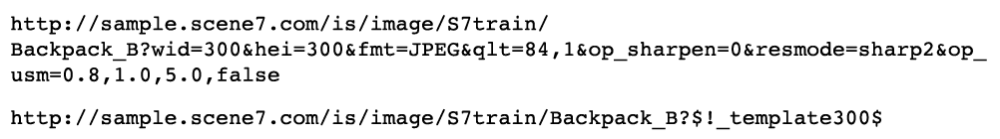
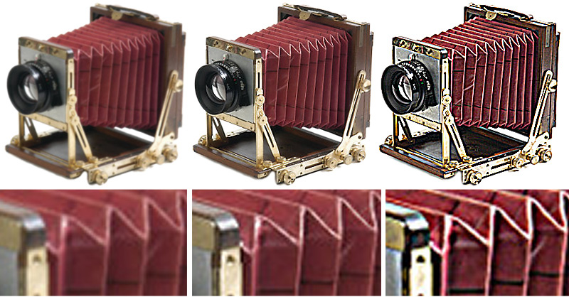

# Image Presets {#image-presets}

An Image Preset is essentially a recipe that contains all the settings needed to create an image at a specific size, format, quality, and sharpening. Image Presets are a key component of dynamic sizing.

If you look at the URLs of just about any Dynamic Media Classic customer, you'll probably see an Image Preset in use. Just look for $name$ at the end of the URL (with any word or words substituted for name).

Image Presets shorten the URL, so instead of writing out several Image Serving instructions per request, you can write a single Image Preset. For example, these two URLs produce the same 300 x 300 JPEG image with sharpening, but the second one uses an Image Preset:

The true value of Image Presets is that any Company Administrator can update the definition of that Image Preset and affect every image using that format — without changing any web code. You will see the results of any change to an Image Preset after the cache for the URL clears.

>[!IMPORTANT]
>
>When resizing an image, the aspect ratio, the ratio of the width of the image to its height, should always be kept proportional so that the image is not distorted.

An Image Preset has a dollar sign ($) on both sides of its name, and follows the question mark (?) separator.

>[!TIP]
>
>Create one Image Preset per unique image size on your site. For example, if you need a 350 X 350 image for the product detail page, a 120 X 120 image for the browse/search pages, and a 90 X 90 image for a cross-sell/featured item, then you need three Image Presets, whether you have 500 images or 500,000.

- Learn more about [Image Presets](https://experienceleague.adobe.com/docs/dynamic-media-classic/using/image-sizing/setting-image-presets.html).
- Learn how to [Create an Image Preset](https://experienceleague.adobe.com/docs/dynamic-media-classic/using/image-sizing/setting-image-presets.html#creating-an-image-preset).

## Image Presets and Sharpening

Image Presets typically resize an image, and any time you resize an image from its original size, you should add sharpening. That's because resizing causes many pixels to merge and blend into a smaller space, making the image look soft and blurry. Sharpening increases the contrast of edges and high contrast areas in an image.

We expect that the high resolution images you upload into Dynamic Media Classic do not need any sharpening when viewed at full size — when zoomed into. However at any smaller size, some sharpening is usually desirable.

>[!TIP]
>
>Always sharpen when resizing images! That means that you'll need to add sharpening to every Image Preset (and Viewer Preset, which we'll discuss later).
>
>If your images do not look good, chances are it is because they need sharpening or perhaps the quality was poor to begin with.

How much sharpening to add is entirely subjective. Some people like softer images, while others like them very sharp. It is easy to enhance an image by running a combination of sharpening filters on an image. However, it is also easy to go overboard and over-sharpen an image.

The following graphic shows three levels of sharpening. From right to left you have no sharpening, just the right amount, and too much.

Dynamic Media Classic allows for three types of sharpening: Simple Sharpening, Resample Mode, and Unsharp Mask.

Learn more about [Dynamic Media Classic Sharpening Options](https://experienceleague.adobe.com/docs/dynamic-media-classic/using/master-files/sharpening-image.html#sharpening_an_image).

## Additional Resources

[Image Preset Guide](https://www.adobe.com/content/dam/www/us/en/experience-manager/pdfs/dynamic-media-image-preset-guide.pdf). Settings to use to optimize for image quality and loading speed.

[Image Is Everything Part 2: It's Never Just a Blur — Quality Versus Speed](https://theblog.adobe.com/image-is-everything-part-2-its-never-just-a-blur-quality-versus-speed/). A blog post discussing using Image Presets for delivering high-quality, fast-loading images.
