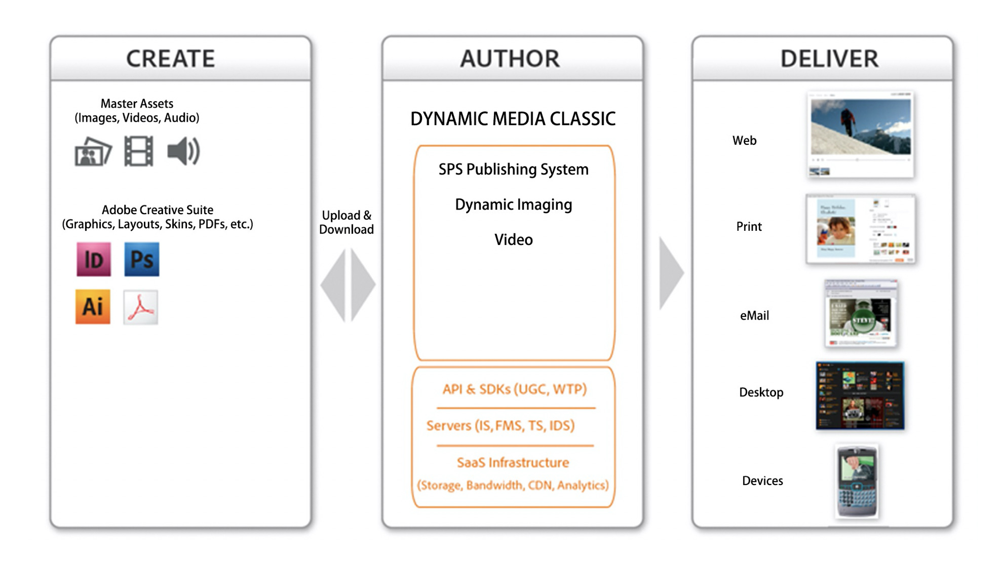
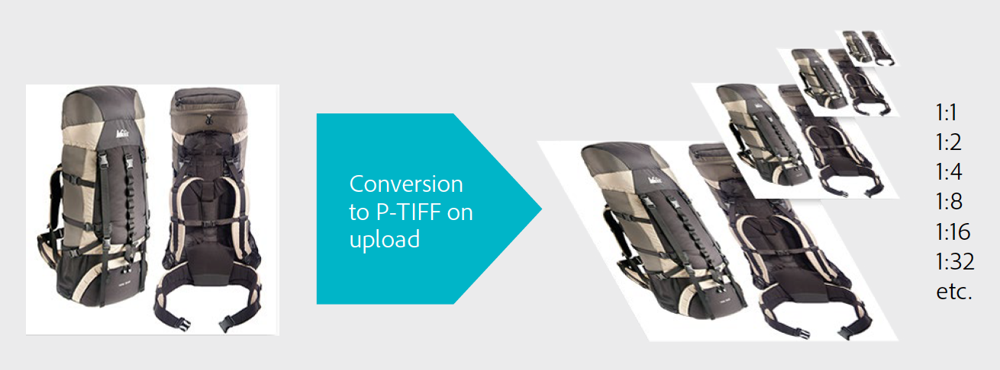
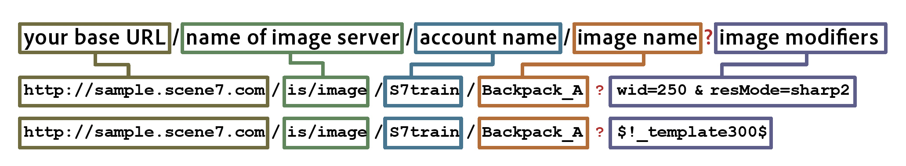

# Dynamic Media Classic Main Workflow and Previewing Assets {#main-workflow}

Dynamic Media supports a Create (and Upload), Author (and Publish), and Deliver workflow process. You start by uploading assets, then doing something with those assets such as building an Image Set, and finally publishing to make them live. The Build step is optional for some workflows. For example, if your goal is to only do dynamic sizing and zoom on images or convert and publish video for streaming, there are no necessary build steps.

The workflow in Dynamic Media Classic solutions consists of three main steps:

1. Create (and Upload) SourceContent
2. Author (and Publish) Assets
3. Deliver Assets

## Step 1: Create (and Upload)

This is the beginning of the workflow. In this step, you gather or create the source content that fits into the workflow you are using and upload it into Dynamic Media Classic. The system supports multiple file types for images, video, and fonts, but also for PDF, Adobe Illustrator, and Adobe InDesign.

See the complete list of [Supported File Types](https://experienceleague.adobe.com/docs/dynamic-media-classic/using/upload-publish/uploading-files.html#supported-asset-file-formats).

You can upload source content in several different ways:

- Directly from your desktop or local network. [Learn how](https://experienceleague.adobe.com/docs/dynamic-media-classic/using/upload-publish/uploading-files.html#upload-files-using-sps-desktop-application).
- From a Dynamic Media Classic FTP server. [Learn how](https://experienceleague.adobe.com/docs/dynamic-media-classic/using/upload-publish/uploading-files.html#upload-files-using-via-ftp).

The default mode is From Desktop, where you browse for files on your local network and start the upload.

>[!TIP]
>
>Do not manually add your folders. Instead, run an upload from FTP and use the **Include Subfolders** option to recreate your folder structure inside Dynamic Media Classic.

The two most important upload options are enabled by default — **Mark for Publish**, which we've discussed earlier, and **Overwrite**. Overwrite means that if the file being uploaded has the same name as a file already in the system, the new file will replace the existing version. If you uncheck this option, the file might not be uploaded.

### Overwrite Options When Uploading Images

There are four variations of the Overwrite Image option that can be set for your entire company, and they are often misunderstood. In short, either you set the rules such that you want assets that have the same name to be overwritten more frequently, or you want overwrites to occur less frequently (in which case the new image will get renamed with a "-1" or "-2" extension).

- **Overwrite in current folder, same base image name/extension**.
  This option is the strictest rule for replacement. It requires that you upload the replacement image to the same folder as the original, and that the replacement image has the same filename extension as the original. If these requirements are not met, a duplicate is created.

- **Overwrite in current folder, same base asset name regardless of extension**.
  Requires that you upload the replacement image to the same folder as the original, however the filename extension can be different from the original. For example, chair.tif replaces chair.jpg.

- **Overwrite in any folder, same base asset name/extension**.
  Requires that the replacement image has the same filename extension as the original image (for example, chair.jpg must replace chair.jpg, not chair.tif ). However, you can upload the replacement image to a different folder than the original. The updated image resides in the new folder; the file can no longer be found in its original location.

- **Overwrite in any folder, same base asset name regardless of extension**.
  This option is the most inclusive replacement rule. You can upload a replacement image to a different folder than the original, upload a file with a different filename extension, and replace the original file. If the original file is in a different folder, the replacement image resides in the new folder to which it was uploaded.

Learn more about the [Overwrite Images Option](https://experienceleague.adobe.com/docs/dynamic-media-classic/using/setup/application-setup.html#using-the-overwrite-images-option).

Although not required, while uploading using either of the two methods above, you can specify Job Options for that particular upload — for example, to schedule a recurring upload, set cropping options upon upload, and many others. These can be valuable for some workflows, so it's worth considering if they can be for yours.

Learn more about [Job Options](https://experienceleague.adobe.com/docs/dynamic-media-classic/using/upload-publish/uploading-files.html#upload-options).

Uploading is the first necessary step in any workflow because Dynamic Media Classic cannot work with any content that is not already in its system. Behind the scenes during upload, the system registers every uploaded asset with the centralized Dynamic Media Classic database, assigns an ID, and copies it to storage. In addition, the system converts image files to a format that allows dynamic resizing and zoom and converts video files to the MP4 web-friendly format.

### Concept: Here's what happens to images when you upload them to Dynamic Media Classic

When you upload an image of any type to Dynamic Media Classic, it is converted to a master image format called a Pyramid TIFF, or P-TIFF. A P-TIFF is similar to the format of a layered TIFF bitmap image, except that instead of different layers, the file contains multiple sizes (resolutions) of the same image.

As the image is converted, Dynamic Media Classic takes a "snapshot" of the full size of the image, scales that by half and saves it, scales it by half again and saves it, and so on until it is filled with even multiples of the original size. For example, a 2000-pixel P-TIFF has 1000-, 500-, 250-, and 125-pixel sizes (and smaller) in the same file. The P-TIFF file is the format of what's called a "master image" in Dynamic Media Classic.

When you request a certain size image, creating the P-TIFF allows the Image Server for Dynamic Media Classic to quickly find the next larger size and scale it down. For example, if you upload a 2000-pixel image and request a 100-pixel image, Dynamic Media Classic finds the 125-pixel version and scale it down to 100 pixels rather than scaling from 2000 to 100 pixels. This makes the operation very fast. In addition, when zooming on an image, this enables the zoom viewer to only request a tile of the image being zoomed, rather than the entire full resolution image. This is how the master image format, the P-TIFF file, supports both dynamic sizing and zoom.

Similarly, you can upload your master source video to Dynamic Media Classic, and on upload Dynamic Media Classic can automatically resize it and convert it to the MP4 web-friendly format.

### Rules of Thumb for Determining Optimal Size for the Images You Upload

**Upload images in the largest size you need.**

- If you need to zoom, upload a high resolution image of a range of 1500-2500 pixels in the longest dimension. Consider how much detail you want to give, the quality of your source images, and the size of the product being shown. For example, upload a 1000-pixel image for a tiny ring, but a 3000-pixel image for an entire room scene.
- If you don't need to zoom, then upload it at the exact size it is displayed. For example if you have logos or splash/banner images to place on your pages, upload them exactly at their 1:1 size, and call them exactly at that size.

**Never upsample, or blow up, your images before uploading to Dynamic Media Classic.** For example, don't upsample a smaller image to make it a 2000-pixel image. It won't look good. Make your images as close to perfect as possible before upload.

**There is no minimum size for zoom, but by default the viewers won't zoom beyond 100%.** If your image is too small, it won't zoom at all or only zooms a tiny amount to prevent it from looking bad.

**While there's no minimum for image size, we don't recommend uploading giant images.** A giant image can be considered 4000+ pixels. Uploading images this size can show potential flaws like grains of dust or hairs in the image. Such images take up more space on the Dynamic Media Classic server, which can cause you to surpass your contracted storage limits.

Learn more about [Uploading Files](https://experienceleague.adobe.com/docs/dynamic-media-classic/using/upload-publish/uploading-files.html#uploading-your-files).

## Step 2: Author (and Publish)

After creating and uploading your content, you'll author new rich media assets from your uploaded assets by performing one or more sub-workflows. This includes all the different types of set collections — Image, Swatch, Spin, and Mixed Media sets, as well as Templates. It also includes video. We'll go into much greater detail about each type of image collection set and video rich media later. However in almost all cases, you start by selecting one or more assets (or have no assets selected) and choosing the type of asset you want to build. For example, you might select a main image and a few views of that image and choose to build an Image Set, a collection of alternate views of the same product.

>[!IMPORTANT]
>
>Make sure that all your assets are marked for publish. While by default all assets are automatically marked for publish on upload, any newly authored assets from your uploaded content will need to be marked for publish as well.

After you've built your new asset, you will run a publish job. You can do that manually or schedule a publish job that runs automatically. Publishing copies all content from the private, Dynamic Media Classic sphere to the public, publish server sphere of the equation. The product of a Dynamic Media Publish job is a unique URL for each published asset.

The server you publish to depends on the type of content and workflow. For example, all images go to the Image Server and streaming video to the FMS Server. For convenience we'll speak of a "publish" as a single event to a single server.

Publishing publishes all content marked for publish — not just your content. A single administrator typically publishes on behalf of everyone rather than individual users running a publish. The administrator can publish as needed or set up a recurring daily, weekly, or even every 10 minutes job that will publish automatically. Publish on a schedule that makes sense for your business.

>[!TIP]
>
>Automate your publish jobs and schedule a Full Publish to run every day at 12:00AM or any time late in the evening.

### Concept: Understanding the Dynamic Media Classic URL

The final product of a Dynamic Media Classic workflow is a URL that points to the asset (whether image set or adaptive video set). These URLs are very predictable, and follow the same pattern. In the case of images, each image is generated from the P-TIFF master image.

Here is the syntax for the URL of an image with a couple of examples:

In the URL, everything to the left of the question mark is the virtual path to a specific image. Everything to the right of the question mark is an Image Server modifier, an instruction for how to process the image. When you have multiple modifiers, they are separated by ampersands.

In the first example, the virtual path to the image "Backpack_A" is `http://sample.scene7.com/is/image/s7train/BackpackA`. The Image Server modifiers resize the image to a width of 250 pixels (from wid=250) and resamples the image using the Lanczos interpolation algorithm, which sharpens as it resizes (from resMode=sharp2).

The second example applies what's known as an "image preset" to the same Backpack_A image, as indicated by $!_template300$. The $ symbols on either side of the expression indicate that an image preset, a packaged set of image modifiers, is being applied to the image.

Once you understand how Dynamic Media Classic URLs are put together, then you understand how to change them programmatically and how to integrate them deeper into your site and backend systems.

### Concept: Understanding the Caching Delay

Newly uploaded and published assets are seen right away, whereas updated assets may be subject to the 10-hour caching delay. By default, all published assets have a minimum of 10 hours before they expire. We say minimum, because every time the image is viewed, it starts a clock that does not expire until 10 hours have elapsed in which no one has viewed that image. This 10–hour period is the "Time to Live" for an asset. Once the cache expires for that asset, the updated version can be delivered.

This typically is not an issue unless a mistake occurred, and the image/asset has the same name as the previously published version, but there is a problem with the image. For example, you accidentally uploaded a low resolution version or your art director didn't approve the image. In this case, you want to recall the original image and replace it with a new version using the same Asset ID.

Learn how to [Manually Clear the Cache for the URLs That Need to Be Updated](https://experienceleague.adobe.com/docs/experience-manager-cloud-service/assets/dynamicmedia/invalidate-cdn-cache-dynamic-media.html?lang=en).

>[!TIP]
>
>To avoid issues with caching delay, always work ahead — an evening, a day, two weeks, etc. Build in time for QA/acceptance for internal parties to proof your work before releasing to the public. Even working an evening before allows you to make changes and re-publish that evening. By morning, the 10 hours has elapsed and the cache updates with the correct image.

- Learn more about [Creating a Publishing Job](https://experienceleague.adobe.com/docs/dynamic-media-classic/using/upload-publish/publishing-files.html#creating-a-publish-job).
- Learn more about [Publishing](https://experienceleague.adobe.com/docs/dynamic-media-classic/using/upload-publish/publishing-files.html).

## Step 3: Deliver

Remember that the final product of a Dynamic Media Classic workflow is a URL that points to the asset. The URL might point to an individual image, an Image Set, a Spin Set, or some other Image Set collection or video. You need to take that URL and do something with it, such as edit your HTML so that the `` tags point to the Dynamic Media Classic image instead of pointing to an image coming from your current site.

In the Deliver step, you must integrate those URLs into your web site, mobile app, email campaign, or any other digital touch point on which you want to display the asset.

Example of integrating the Dynamic Media Classic URL for an image into a website:

The URL in red is the only element specific to Dynamic Media Classic.

Your IT team or integration partner can take the lead on writing and changing code to integrate Dynamic Media Classic URLs into your site. Adobe has a consulting team that can help in this effort, either by providing technical, creative, or general guidance.

For more complex solutions such as zoom viewers, or viewers that combine zoom with alternate views, typically the URL points to a viewer that is hosted by Dynamic Media Classic, and also within that URL is a reference to an Asset ID.

Example of a link (in red) that will open an Image Set in a viewer in a new pop-up window:

>[!IMPORTANT]
>
>You need to integrate the Dynamic Media Classic URLs into your website, mobile app, email, and other digital touchpoints — Dynamic Media Classic can't do that for you!

## Previewing Assets

You'll probably want to preview the assets you've uploaded or are creating or editing to make sure they appear as you want when your customers view them. You can access the Preview window by clicking any **Preview** button, either on the thumbnail of the asset, at the top of the **Browse/Build Panel**, or by going to **File > Preview**. In a browser window, it will preview whichever asset is currently in the panel, whether that is an image, video, or built asset like an Image Set.

### Dynamic Size Preview (Image Presets)

You can preview your images in multiple sizes using the **Sizes** preview. This loads a list of your available Image Presets. We'll discuss Image Presets later, but think of them as "recipes" for loading your image at a named size with specific amounts of sharpening and image quality.

### Zoom Preview

You can also use the **Zoom** option to preview your image in one of many pre-built zoom presets, which are based on different included zoom viewers.

Learn more about [Previewing Assets](https://experienceleague.adobe.com/docs/dynamic-media-classic/using/managing-assets/previewing-asset.html).
