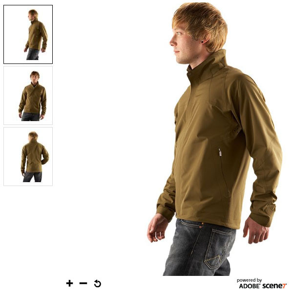
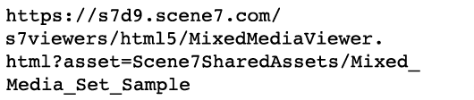
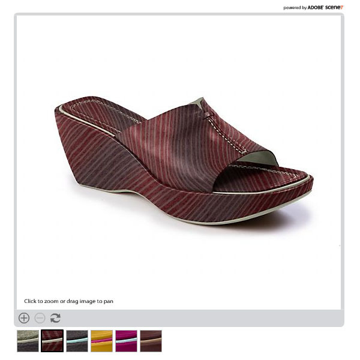
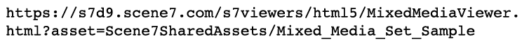
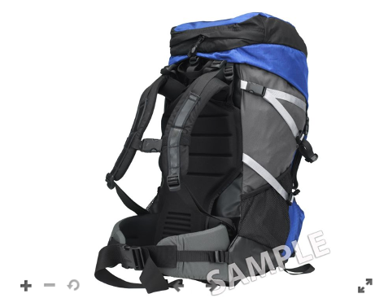
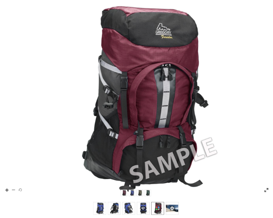

# Image, Swatch, Spin, and Mixed Media Sets {#media-sets}

Moving beyond single images for dynamic sizing and zoom, Dynamic Media Classic set collections allow for a richer online experience. This section of the tutorial will explore how to create the following rich media sets in Dynamic Media Classic:

- Image Set
- Swatch Set
- Spin Set
- Mixed Media Set

It will also explain how to use Batch Set Presets to automate set creation via an upload.

## Everything You Always Wanted To Know About Sets

Next to basic dynamic sizing and zoom, sets are probably the most widely used Dynamic Media Classic sub-product. Sets are essentially "virtual" assets that contain no actual images, but consist of a set of relationships to other images and/or video. The main appeal of sets is that they are mini-applications that are ready "off the shelf." By that we mean that each set viewer contains its own logic and interface so that all you have to do is call to them on the site. In addition, they only require you to track a single Asset ID per set, rather than having to manage all the member assets and relationships yourself.

When you create a set, that set is managed as a separate asset that must be marked for publish and published before it can be served from a URL. All of its member assets must be published as well.

### Types of Sets

Let's learn about the four types of sets you can create in Dynamic Media Classic: Image, Swatch, Spin, and Mixed Media Sets.

## Image Set

This is the most common type of set. You'll typically use it for alternate views of the same item. It consists of multiple images that you load into the viewer by clicking on the associated thumbnail of that image.

_Example of an Image Set_

The URL for the above Image Set could appear as:

- Learn more about Image Sets with the [Quick Start to Image Sets](https://docs.adobe.com/content/help/en/dynamic-media-classic/using/image-sets/quick-start-image-sets.html).
- Learn how to [Create an Image Set](https://docs.adobe.com/content/help/en/dynamic-media-classic/using/image-sets/creating-image-set.html#creating-an-image-set).

### Swatch Set

This type of set is typically used to display colored views of the same item. It consists of pairs of images and color swatches.

The main difference between a Swatch and Image Set is that Swatch Sets use a different image as a clickable swatch, whereas Image Sets use a miniature, clickable thumbnail version of the original image.

Swatch Sets do not colorize images (a common misconception). The images are simply being swapped, exactly as in an Image Set. The mini swatch images could have been authored using Photoshop, each color could have been photographed separately, or the Crop tool in Dynamic Media Classic could have been used to make a swatch out of one of the colored images.

_Example of a Swatch Set_

The URL for the above Swatch Set could appear as:

- Learn more about Swatch Sets with the [Quick Start to Swatch Sets](https://docs.adobe.com/content/help/en/dynamic-media-classic/using/swatch-sets/quick-start-swatch-sets.html).
- Learn how to [Create a Swatch Set](https://docs.adobe.com/content/help/en/dynamic-media-classic/using/swatch-sets/creating-swatch-set.html#creating-a-swatch-set).

### Spin Set

This set is typically used to show a 360-degree view of an item. Like Swatch Sets, Spin Sets use no 3D magic — the real work is to create many photos of an image from all sides. The viewer simply allows you to switch between the images like a stop-motion animation.

Spin Sets can either spin in one direction along a single axis, or if alternately created as a 2D Spin Set — spin on multiple axes. For example, a car can be rotated while all wheels are on the ground, and then can be "flipped" up and rotated on its back wheels as well. For a properly set up 2D Spin Set, the number of images per row for each axis should be the same. In other words, if you are spinning on two axes, you need twice as many images as a single angle spin.

_Example of a Spin Set_

The URL for the above Spin Set could appear as:

- Learn more about Spin Sets with the [Quick Start to Spin Sets](https://docs.adobe.com/content/help/en/dynamic-media-classic/using/spin-sets/quick-start-spin-sets.html).
- Learn how to [Create a Spin Set](https://docs.adobe.com/content/help/en/dynamic-media-classic/using/spin-sets/creating-spin-set.html#creating-a-spin-set).

## Mixed Media Set

This is a combination set. It allows you to combine any of the previous sets, as well as add video, into a single viewer. In this workflow, you create any of the component sets first, and then assemble them together into a Mixed Media Set.

_Example of a Mixed Media Set_

The URL for the above Mixed Media Set could appear as:

- Learn more about Mixed Media Sets with the [Quick Start to Mixed Media Sets](https://docs.adobe.com/content/help/en/dynamic-media-classic/using/mixed-media-sets/quick-start-mixed-media-sets.html).

- Learn how to [Create a Mixed Media Set](https://docs.adobe.com/content/help/en/dynamic-media-classic/using/mixed-media-sets/creating-mixed-media-set.html#creating-a-mixed-media-set).

To display an image for zoom, a set, or a video on your website, you call it in a Dynamic Media Classic "viewer." Dynamic Media Classic includes viewers for rich media assets such as Swatch Sets, Spin Sets, video, and many others.

Learn more about [Viewers for AEM Assets and Dynamic Media Classic](https://docs.adobe.com/content/help/en/dynamic-media-developer-resources/library/viewers-aem-assets-dmc/c-html5-s7-aem-asset-viewers.html).

## Batch Set Presets

Up until now we've been discussing how to build sets manually using the Dynamic Media Classic Build function. However, it is possible to automate the creation of Image Sets and Spin Sets using a Batch Set Preset as long as you have a standardized naming convention.

Each preset is a uniquely named, self-contained set of instructions that defines how to construct the set using images that match the defined naming conventions. In the preset, you first define naming conventions for the assets that you want grouped together in a set. A Batch Set Preset can then be created to reference these images.

While it is possible to create the preset yourself (they are found under **Setup > Application Setup > Batch Set Presets** ), as a best practice you should have your Consulting team or Technical Support set it up for you. Here's why:

- Batch Set Presets can be complex to set up — they are powered by regular expressions, and unless you are a developer this syntax may be unfamiliar or confusing.
- Once created, they are turned on by default. There is no "undo" function. If you start uploading thousands of images and your preset is configured incorrectly, you may end up with hundreds or thousands of broken sets which you must find and delete manually.

A simple naming convention was suggested earlier that would be very easy to build into a Batch Set Preset. However because the presets are very flexible, they can handle complex naming strategies. In short, the images that belong in a set should be tied together by some common name — often it is the SKU number or product ID. In Dynamic Media Classic you either tell it a default naming convention for all of your images to be used for a preset, or you can create multiple presets, each with different naming rules.

Batch Set Presets are applied only at upload; they cannot be run after the images have been uploaded. Thus it is important to plan out your naming convention and get a preset built before you start up loading all of your images.

Once the presets have been created, the Company Administrator can choose whether they are active or inactive. Active means they will appear on the upload page under **Job Options**, whereas inactive presets will remain hidden.

Learn how to [Create a Batch Set Preset](https://docs.adobe.com/content/help/en/dynamic-media-classic/using/setup/application-setup.html#creating-a-batch-set-preset).

### Using Batch Set Presets on Upload

Here is how you use Batch Set Presets on upload after they have been created:

1. Click **Upload** and choose either **From Desktop** or **Via FTP**.
2. Click **Job Options**.
3. Open the **Batch Set Presets** option, and check or uncheck the preset to use it with the upload.
4. After the upload is done, look in your folder for the finished sets.

Learn more about [Batch Set Presets](https://docs.adobe.com/content/help/en/dynamic-media-classic/using/setup/application-setup.html#batch-set-presets).
