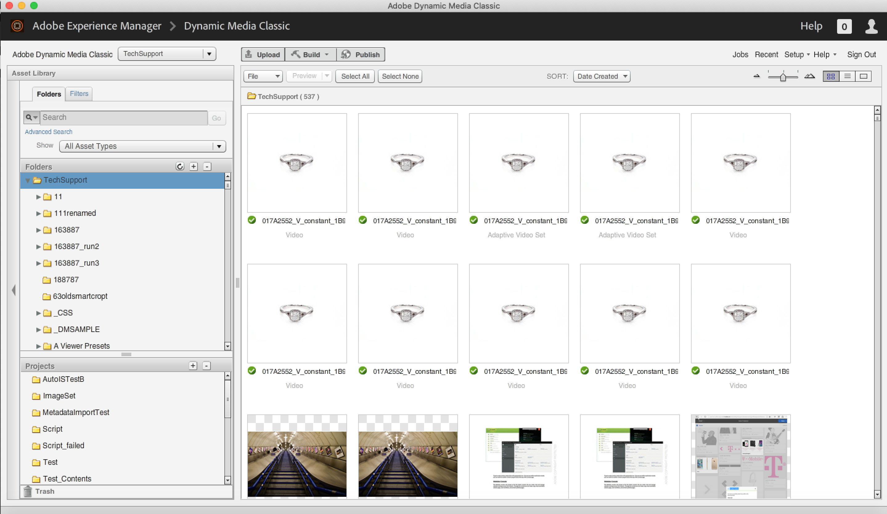

# Welcome to the Dynamic Media Classic Best Practices Tutorial

This guide is intended to help current and new users of Dynamic Media Classic more fully understand what they can do with their powerful rich media solution from Adobe. We'll do that by:

- Introducing you to Dynamic Media Classic, describing what it is, and providing an overview of its core capabilities and user interface (UI).
- Explaining the general Create, Author, and Deliver workflow you'll follow when working with assets in the solution.
- Discussing important items to set up prior to jumping in and using the solution.
- Taking a deep dive into using several of the solution's core capabilities.

Throughout the guide, we'll provide examples, tips, and best practices. We'll also explain important terms and concepts with which you should be familiar when working with Dynamic Media Classic. And when available for a given topic, we'll point you to relevant webinars, blog posts, and online documentation.

We hope this guide provides you the information you need to unlock tremendous value from your Dynamic Media Classic solution. To more easily navigate the chapters of this guide, click the bookmark icon on the left side of the guide to see its contents.

## Overview of Dynamic Media Classic

Dynamic Media Classic is the hub around which customers create, author, and deliver rich media content. Dynamic Media Classic is an integrated, rich media management, publishing, and serving environment. Rich media can be delivered to all marketing and sales channels, including the web, print material, e-mail campaigns, web applications, desktops, and devices.

Image serving is perhaps the most used function of Dynamic Media Classic. In fact, most customers use Dynamic Media Classic to serve up all the images on their websites, including images for zoom or rich media. However, it can also be used for many other purposes, including delivery of video and use of AI to optimize images delivered.

## Core Capabilities of Dynamic Media Classic

In this guide we'll discuss the following core capabilities of Dynamic Media Classic.

- **Dynamic Imaging.** The umbrella term for real-time editing, formatting and sizing, and interactive zoom and pan; color and texture swatching; 360-degree spin; image templates; and multimedia viewers.
- **Video.** Upload final videos, publish them, and progressively download them into configurable video viewers.
- **Smart Imaging.** Technology that leverages Adobe Sensei AI capabilities and works with existing "Image Presets" to enhance image delivery performance by automatically optimizing image format, size, and quality based on client browser capabilities.

To discover additional capabilities of the solution, visit the [Documentation for Dynamic Media Classic](https://docs.adobe.com/content/help/en/dynamic-media-classic/using/intro/introduction.html).

## The Dynamic Media Classic User Interface (UI)

The Dynamic Media Classic main UI consists of three major areas: the Global Navigation bar, Asset Library, and Browse Panel/Build Panel.

_Dynamic Media Classic UI_

**Global Navigation Bar.** Located at the top of your screen, you'll use the buttons on this bar to access key areas and capabilities of the solution. For example, you'll use it to access upload capabilities, open various asset building areas (image set, spin set, etc.), perform important tasks such as setting up Image Presets and Viewer Presets, and publish your assets. From here you can also monitor your jobs, see recent activities, and choose from a variety of help options.

**Asset Library.** Located down the left side of your screen is the Asset Library, a panel that you use to organize your assets in folders and subfolders that you create. At the top of the panel, you'll find search and filters to help you locate assets. Advanced Search allows you to search by specifying multiple options as criteria for your search, including hidden metadata fields attached to that asset. At the bottom of the panel, you can see deleted items by clicking the Trash icon. Initially, you do not start with any folders, except the top-level folder, which has the same name as your account name.

> [!NOTE]
>
> Assets in the Trash will automatically be deleted permanently seven days after they were put there unless you restore them.

**Browse/Build Panel.** This is the center of the UI, where you'll either browse assets in Browse mode or, if in Build mode, you'll use it as a canvas for building assets as part of a workflow. When you first sign in, you'll see the Browse Panel. In the center of the screen are thumbnail versions of your images in a Grid view. You can change to a List view or select an asset and view details about it using the Detail view.

> [!IMPORTANT]
>
> Beside each Asset ID is the **Mark for Publish** switch. When the toggle is on (green), that indicates that the asset is marked for publish.

> [!TIP]
>
> Select the **Publish After Uploading** checkbox in the Upload dialog to automatically publish assets upon upload.

Learn more about [Navigating the UI of Dynamic Media Classic](https://docs.adobe.com/content/help/en/dynamic-media-classic/using/getting-started/navigation-basics.html).
