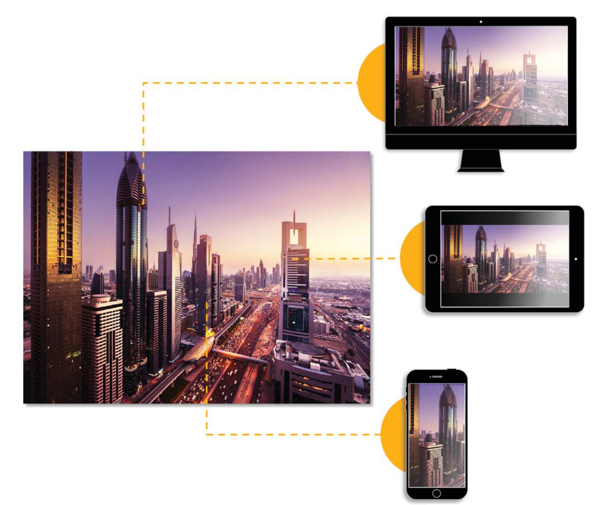

# Smart Imaging {#smart-imaging}

One of the most important aspects of the customer experience on your website or mobile site or app is the page load time. Customers will often abandon a site or app if a page takes too long to load. Images constitute the majority of the page load time. Smart Imaging in Dynamic Media Classic enhances image delivery performance by automatically optimizing image format and quality based on client browser capabilities. It does this by leveraging Adobe Sensei AI capabilities and working with existing Image Presets. Smart Imaging reduces image sizes by 30 percent or more — that translates to faster page loads and better customer experiences.

Smart Imaging also benefits from the added performance boost of being fully integrated with the best-in-class premium service from Adobe. This service finds the optimal internet route between servers, networks, and peering points that has lowest latency, and/or packet loss rate than the default route on the Internet.

Learn more about [Smart Imaging](https://docs.adobe.com/content/help/en/experience-manager-64/assets/dynamic/imaging-faq.html).

## Smart Imaging Benefits

Because images constitute the majority of a page's load time, the performance improvement from Smart Imaging can have a profound impact on business KPIs, such as higher conversion, time spent on site, and lower site bounce rate.

## How Smart Imaging Works

As noted earlier, Smart Imaging leverages Adobe Sensei AI capabilities and works with existing Image Presets to automatically convert images to optimal next-generation image formats such as WebP, while maintaining visual fidelity.

Learn more about [How Smart Imaging Works](https://docs.adobe.com/content/help/en/experience-manager-64/assets/dynamic/imaging-faq.html#how-does-smart-imaging-work), including details such as supported image formats (and what happens if you don't use those formats) and its impact on existing Image Presets that are in use.

## Impacts of Smart Imaging

You likely are concerned that you'll have to make changes to your URLs, Image Presets, and code on your site to take advantage of Smart Imaging. If you meet the prerequisites for using Smart Imaging and you're only working with images in the supported JPEG and PNG image formats, you don't have to make any changes.

Smart imaging works with images delivered over HTTP, HTTPS, and HTTP/2.

>[!NOTE]
>
>Moving over to Smart Imaging clears your cache at the CDN. The cache in the CDN is typically built up again within one or two days.

Smart Imaging is included with your existing license of Dynamic Media Classic. There are no additional costs for this feature. To take advantage of it, you must meet two requirements: have an Adobe-bundled CDN and a dedicated domain. Then you must enable it for your account because it is not automatically enabled.

Enabling Smart Imaging starts with you sending technical support a request by |creating a support case| [https://helpx.adobe.com/enterprise/admin-guide.html/enterprise/using/support-for-experience-cloud.ug.html](https://helpx.adobe.com/enterprise/admin-guide.html/enterprise/using/support-for-experience-cloud.ug.html). Support will work with you to set up a custom domain that you'll associate with Smart Imaging. You'll change one parameter related to caching (Time To Live, or TTL) and support will clear the cache. You can also do an optional staging step if you like before pushing to production. Then when Smart Imaging is turned on, you'll deliver customers smaller sized images, but with the same quality they requested. That means they experience faster page load times — and all of this is done automatically because Adobe Sensei helps choose the most efficient size.

Once you've enabled Smart Imaging, you will want to verify that it's working as expected.

You probably have additional questions about Smart Imaging. We've compiled a list of frequently asked questions (FAQs) with answers. Read the [FAQs](https://docs.adobe.com/content/help/en/experience-manager-64/assets/dynamic/imaging-faq.html).

## Additional Resources

Watch the [Dynamic Media Classic Optimizing Page Performance Skill Builder](https://seminars.adobeconnect.com/pzc1gw0cihpv) on-demand webinar to learn more about Smart Imaging.
