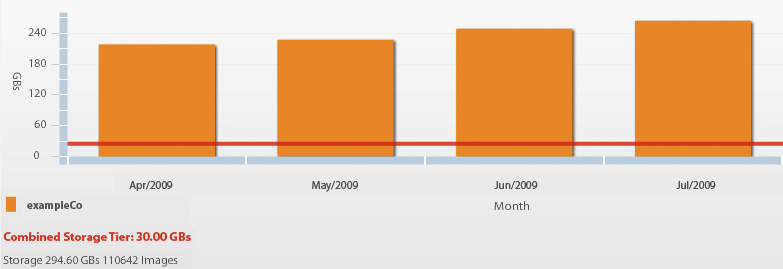
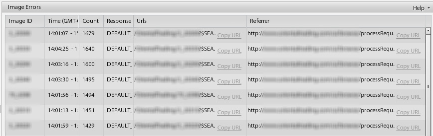

# Valuable Reports for Administrators {#valuable-reports}

In this final chapter, we just want you to know about two valuable reports you might consider setting up if you are an administrator: the Bandwidth &amp; Storage report and the Image Errors report.

## Bandwidth &amp; Storage Report

The Bandwidth &amp; Storage report details how much Image Server bandwidth has been consumed per month and the storage you are taking up on Dynamic Media Classic. Storage is a contracted amount, so it's important to check and ensure you remain under your limit to avoid overage fees.

_The Bandwidth &amp; Storage report shows this account as way over its 30GB storage limit._

## Image Errors Report

Whenever a URL requests an image that is missing, the Image Server generates an error. You can set up a default image to appear in these cases, but you still should be aware of the errors. The Image Errors report gives you a list of the 20 most frequent image errors over the past 24 hours with details such as how many times the error has occurred, the image giving the error, and the page with the problem image. If the Response is "DEFAULT," this means that your default image was served instead.

_Image Error report._

## Conclusion

We hope you've found the content in this best practices guide helpful in getting started with or getting more out of using your powerful rich media solution.

To learn more about Dynamic Media Classic, take a look at the following resources:

- [Dynamic Media Classic on Experience League – Get to Value](https://guided.adobe.com/?launch=AEM-5a#recommended/solutions/experience-manager)
- [Dynamic Media Classic on Experience League – Do More](https://guided.adobe.com/?launch=AEM-6a#recommended/solutions/experience-manager)
- [The Dynamic Media Newsletter Archives](https://experienceleague.adobe.com/docs/dynamic-media-classic/using/dynamic-media-newsletter.html)
- [Dynamic Media Classic Documentation](https://experienceleague.adobe.com/docs/dynamic-media-classic/using/home.html)
