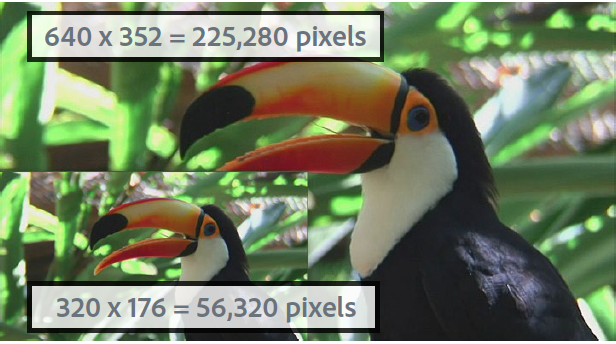
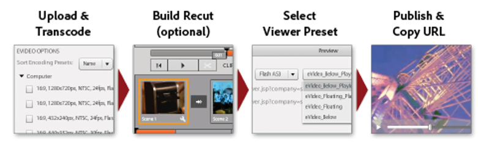
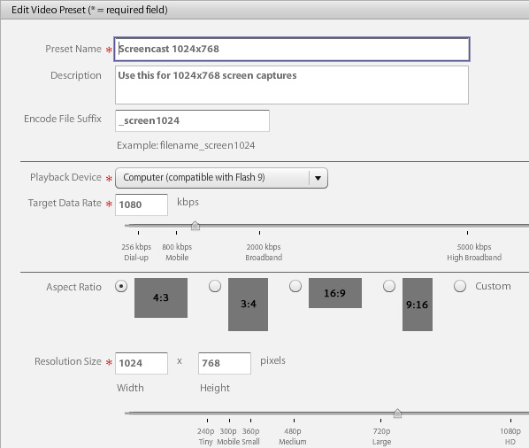
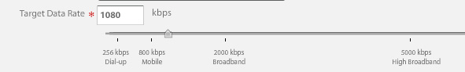
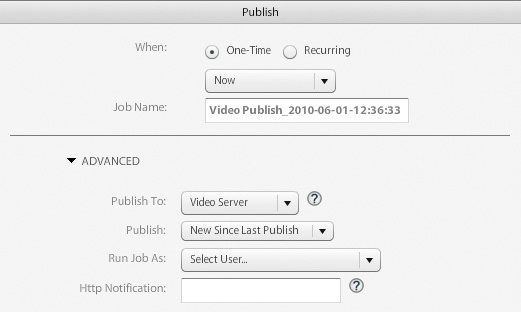
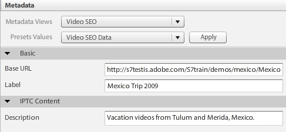
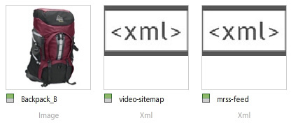
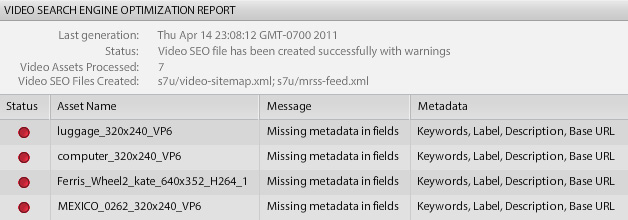
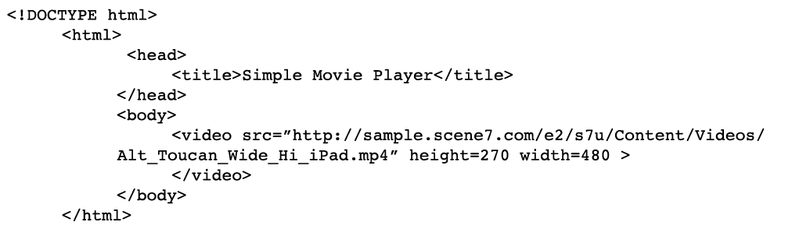

# Video Overview {#video-overview}

Dynamic Media Classic comes with automatic conversion of video on upload, video streaming to desktop and mobile devices, and adaptive video sets optimized for playback based on device and bandwidth. One of the most important things about video is that the workflow is simple — it's designed so that anyone can use it, even if they are not very familiar with video technology.

By the end of this section of the tutorial you will know how to:

- Upload and encode (transcode) video to different sizes and formats
- Choose among available video presets for uploading
- Add or edit a video encoding preset
- Preview videos in a video viewer
- Deploy video to web and mobile sites
- Add captions and chapter markers to video
- Customize and publish video viewers for desktop and mobile users

>[!NOTE]
>
>All URLs in this chapter are for illustrative purposes only; they are not live links.

## Overview of Dynamic Media Classic Video

Let's first get a better sense of the possibilities for video using Dynamic Media Classic.

### Features and Capabilities

The Dynamic Media Classic video platform offers all parts of the video solution — the upload, conversion, and management of videos; the ability to add captions and chapter markers to a video; and the ability to use presets for easy playback.

It makes it easy to publish high-quality Adaptive Video for streaming across multiple screens, including desktop, iOS, Android, Blackberry, and Windows mobile devices. An Adaptive Video Set groups versions of the same video that are encoded at different bit rates and formats such as 400 kbps, 800 kbps, and 1000 kbps. The desktop computer or mobile device detects the available bandwidth.

In addition, video quality is dynamically switched automatically if network conditions change on the desktop or on the mobile device. Also, if a customer enters full-screen mode on a desktop, the Adaptive Video Set responds by using a better resolution, thereby improving the customer's viewing experience. Using Adaptive Video Sets provides you with the best possible playback for customers playing Dynamic Media Classic video on multiple screens and devices.

### Video Management

Working with video can be more complex than working with still digital images. With video, you deal with numerous formats and standards and the uncertainty of whether your audience will be able to play back your clips. Dynamic Media Classic makes it easy to work with video, providing many powerful tools "under the hood," but removing the complexity of working with them.

Dynamic Media Classic recognizes and can work with many different source formats available. However, reading the video is only one part of the effort — you must also convert the video to a web-friendly format. Dynamic Media Classic takes care of this by allowing you to convert video to H.264 video.

Converting the video yourself can get very complicated using the many professional and enthusiast tools available. Dynamic Media Classic keeps it simple by offering easy presets that are optimized for different quality settings. If you want something more custom, however, you can also create your own presets.

If you have a lot of video, you’ll appreciate the ability to manage all your assets along with your images and other media in Dynamic Media Classic. You can organize, catalog, and search your assets, including video assets, with robust XMP metadata support.

### Video Playback

Similar to the problem of converting video to make it web-friendly and accessible, is the problem of implementing and deploying video to your site. Choosing whether to purchase a player or build your own, making it compatible for various devices and screens,and then maintaining your players can be a full-time occupation.

Again, Dynamic Media Classic's approach is to allow you to choose the preset and viewer that fits your needs. You have many different viewer choices and a library of numerous presets available.

You can easily deliver video to the web and mobile devices, as Dynamic Media Classic supports HTML5 video, which means you can target users running various browsers, as well as Android and iOS platform users. Streaming video allows smooth playback of longer or high-definition content, while progressive HTML5 video has presets optimized for the small screen.

Viewer Presets for video are partially configurable depending on the viewer type.

Just like all viewers, integration is via a single Dynamic Media Classic URL per viewer or video.

>[!NOTE]
>
>As a best practice, use Dynamic Media Classic HTML5 Video viewers. The presets used in HTML5 Video viewers are robust video players. By combining into a single player the ability to design the playback components using HTML5 and CSS, have embedded playback, and use adaptive and progressive streaming depending on the broswer's capability, you extend the reach of your rich media content to the desktop, tablet, and mobile users, and ensure a streamlined video experience.

One last note about Dynamic Media Classic video that may apply to some customers: not all companies may have automatic conversion, streaming, or Video Presets enabled for their account. If for some reason you are unable to access the URLs for streaming video, this may be the reason. You will still be able to upload and publish progressively downloaded video and have access to all the video viewers. However, to take advantage of the full Dynamic Media Classic video capabilities, you will want to contact your Account Manager or Sales Manager to get these features enabled.

Learn more about [Video in Dynamic Media Classic](https://experienceleague.adobe.com/docs/dynamic-media-classic/using/video/quick-start-video.html).

## Video 101

### Basic Video Concepts and Terminology

Before we get started, let's discuss some terms with which you should be familiar in order to work with video. These concepts are not specific to Dynamic Media Classic, and if you are going to be managing video for a professional website, you would do well to get some further education on the subject. We'll recommend some resources at the end of this section.

- **Encoding/transcoding.** Encoding is the process of applying video compression to convert raw, uncompressed video data into a format that makes it easier to work with. Transcoding, while similar, refers to converting from one encoding method to another.

  - Master video files created with video editing software are often too large and not in the proper format for delivery to online destinations. They are typically encoded for quick playback on the desktop and for editing, but not for delivery over the web.
  - To convert digital video to the proper format and specifications for playback on different screens, video files are transcoded to a smaller, efficient file size optimal for delivery to the web and to mobile devices.

- **Video compression.** Reducing the quantity of data used to represent digital video images, and is a combination of spatial image compression and temporal motion compensation.

  - Most compression techniques are lossy, which means they throw out data in order to achieve a smaller size.
  - For example, DV video is compressed relatively little and allows you to easily edit the source footage, however it is much too large to use over the web or even put on a DVD.

- **File formats.** The format is a container, similar to a ZIP file, that determines how files are organized in the video file, but typically not how they are encoded.

  - Common files formats for source video include Windows Media (WMV), QuickTime (MOV), Microsoft AVI and MPEG, among others. Formats published by Dynamic Media Classic are MP4.
  - A video file usually contains multiple tracks — a video track (without audio) and one or more audio tracks (without video) — that are interrelated and synchronized.
  - The video file format determines how these different data tracks and metadata are organized.

- **Codec.** A video codec describes the algorithm by which a video is encoded through the use of compression. Audio is also encoded through an audio codec.

  - Codecs minimize the amount of information required to play video. Rather than information about each individual frame, only information about the differences between one frame and the next are stored.
  - Because most videos change little from one frame to the next, codecs allow for high compression rates, which results in smaller file sizes.
  - A video player decodes the video according to its codec and then displays a series of images, or frames, on the screen.
  - Common video codecs include H.264, On2 VP6, and H.263.

- **Resolution.** Height and width of the video in pixels.

  - The size of your source video is determined by your camera and output from your editing software. An HD camera will usually create high resolution 1920 x 1080 video, however to playback smoothly on the web, you would downsample (resize) it to a smaller resolution such as 1280 x 720, 640 x 480, or smaller.
  - The resolution has a direct impact on the file size as well as the bandwidth required to play back that video.

- **Display aspect ratio.** Ratio of width of a video to the height of a video. When the aspect ratio of the video doesn't match the ratio of the player, you may see "black bars," or empty space. Two common aspect ratios used to display video are:

  - 4:3 (1.33:1). Used for almost all standard-definition TV broadcast content.
  - 16:9 (1.78:1). Used for almost all wide-screen, high-definition TV content (HDTV) and movies.

- **Bit rate/data rate.** The amount of data that is encoded to make up a single second of video playback(in kilobits per second).

  - Generally, the lower the bit rate, the more desirable it is for the web because it can be downloaded more quickly. However it can also mean the quality is low because of compression loss.
  - A good codec should balance low bit rate with good quality.

- **Frame rate (frames per second, or FPS).** The number of frames, or still images, for each second of video. Typically, North American TV (NTSC) is broadcast in 29.97 FPS; European and Asian TV (PAL) is broadcast in 25 FPS; and film (analog and digital) are typically in 24 (23.976) FPS.

  - To make things more confusing, there are also progressive and interlaced frames. Each progressive frame contains an entire image frame, whereas interlaced frames contain every other row of pixels in an image frame. The frames are then played back very quickly, and appear to blend together. Film uses a progressive scan method, whereas digital video is typically interlaced.
  - In general, it doesn't matter whether your source footage is interlaced or not — Dynamic Media Classic will preserve the scan method in the converted video.
  - Streaming/Progressive delivery. Video streaming is the sending of media in a continuous stream that can be played as it arrives, while progressively downloaded video is downloaded like any other file from a server and cached locally in your browser.

Hopefully this primer helps you understand the various options involved in using Dynamic Media Classic video.

## Video Workflow

When working with video in Dynamic Media Classic, you follow a basic workflow that is similar to working with images.

1. Start by uploading video files to Dynamic Media Classic. To do this, open the **Tools Menu** at the bottom of the Dynamic Media Classic extension panel, and choose **Upload to Dynamic Media Classic > Files to folder name**, or **Upload to Dynamic Media Classic > Folders to folder name**. "Folder name" will be whatever folder you are currently browsing with the extension. Video files can be big, so we recommend using FTP for uploading large files. As part of the upload, choose one or more Video Presets for encoding your videos. Video can be transcoded to MP4 video on upload. See the Video Presets topic below for more information on using and creating encoding presets. Learn about [Uploading and Encoding Videos](https://experienceleague.adobe.com/docs/dynamic-media-classic/using/video/uploading-encoding-videos.html).
2. Select or select and modify a video Viewer Preset and preview your video. You would either choose a pre-built Viewer Preset or customize your own. If you are targeting mobile users, you don't have to do anything here because mobile platforms do not require a viewer or a preset. Learn more about [Previewing Videos in a Video Viewer](https://experienceleague.adobe.com/docs/dynamic-media-classic/using/video/previewing-videos-video-viewer.html) and [Adding or Editing a Video Viewer Preset](https://experienceleague.adobe.com/docs/dynamic-media-classic/using/video/previewing-videos-video-viewer.html#adding-or-editing-a-video-viewer-preset).
3. Run a Video Publish, get the URL, and integrate. The main difference between this step for the video workflow versus the image workflow is that you will run a special Video Publish instead of (or perhaps as well as) the standard Image Serving publish. Video viewer integration on the desktop works exactly like image viewer integration, however for mobile devices it's even simpler — all you need is the URL to the video itself.

### About Transcoding

Transcoding was defined earlier as the process of converting from one encoding method to another. In the case of Dynamic Media Classic, it is the process of converting your source video from its current format to MP4. This is required before your video will appear in the desktop browser or on a mobile device.

Dynamic Media Classic can handle all the transcoding for you, a huge benefit. You can transcode the video yourself and upload the files already converted to MP4, but that can be a complex process that requires sophisticated software. Unless you know what you are doing, you typically won't get good results on your first attempt.

Not only does Dynamic Media Classic convert the files for you, it also makes it easy by providing easy-to-use presets. You really don't need to know much about the technical side of this process — all you should know is roughly the final size(s) that you want to get out of the system and a sense of the bandwidth your end users have.

While the pre-built presets are handy and cover most needs, sometimes you want something more custom. In that case you can create your own encoding preset. In Dynamic Media Classic, an encoding preset is called a Video Preset. This will be explained later in this chapter.

### About Streaming

Another major feature worth noting is video streaming, a standard feature of the Dynamic Media Classic video platform. Streaming media is constantly received by and presented to an end-user while being delivered. This is significant and desirable for a number of reasons.

Streaming typically requires less bandwidth than progressive download because only the portion of the video that is watched is actually delivered. The Dynamic Media Classic video streaming server and viewers use automatic bandwidth detection to deliver the best stream possible for a user's internet connection.

With streaming, the video starts playing sooner than it does using other methods. It also makes more efficient use of network resources because only the parts of the video that are viewed are sent to the client.

The other delivery method is progressive download. Compared to streaming video, there’s really only one consistent benefit to progressive download — you don’t need a streaming server to deliver the video. And this is of course where Dynamic Media Classic comes in — Dynamic Media Classic has a streaming server built into the platform, so you do not need the hassle or extra cost of maintaining this dedicated piece of hardware.

Progressive download video can be served from any normal web server. While this can be convenient and potentially cost-effective, keep in mind that progressive downloads have limited seek and navigation capabilities and users can access and repurpose your content. In some situations, such as playback behind very strict network firewalls, streaming delivery can be blocked; in these cases, rollback to progressive delivery can be desirable.

Progressive download is a good choice for hobbyists or websites that have low traffic requirements; if they don't mind if their content is cached on a user's computer; if they only need to deliver shorter length videos (under 10 minutes); or if their visitors cannot receive streaming video for some reason.

You will need to stream your video if you need advanced features and control over video delivery, and/or if you need to display video to larger audiences (for example, several hundred simultaneous viewers), track and report usage or viewing statistics, or want to offer your viewers the best interactive playback experience.

Finally, if you are concerned about securing your media for intellectual property or rights-management issues, streaming provides more secure delivery of video, because the media does not get saved to the client's cache when streamed.

## Video Presets

When you upload your video, you choose from one or more presets that contain the settings for converting your master video to a web-friendly format through encoding. Video Presets come in two flavors, Adaptive Video Presets and Single Encoding Presets.

See [Available Video Presets](https://experienceleague.adobe.com/docs/dynamic-media-classic/using/setup/application-setup.html#video-presets-for-encoding-video-files).

Adaptive Video Presets are activated by default, which means they are available for encoding. If you wish to use a Single Encoding Preset, your administrator will need to activate it for it to appear in the list of Video Presets.

Learn how to [Activate or De-activate Video Presets](https://experienceleague.adobe.com/docs/dynamic-media-classic/using/video/uploading-encoding-videos.html#activating-or-deactivating-video-encoding-presets).

You may choose either one of many pre-built presets that come with Dynamic Media Classic or you may create your own; however, no presets are selected for upload by default. In other words, **if you do not select a Video Preset at upload, your video will not be converted and potentially may be unpublishable**. However you can convert the video yourself offline and upload and publish just fine. Video Presets are only required if you want Dynamic Media Classic to do the conversion for you.

On upload, you select a Video Preset by choosing **Video Options** in the Job Options panel. You then choose whether you want to encode for Computer, Mobile, or Tablet.

- Computer is for desktop use. Here you will typically find larger presets (such as HD) that consume more bandwidth.
- Mobile and Tablet create MP4 video for devices such as iPhones and Android smartphones. The only difference between Mobile and Tablet is that the Tablet presets typically have a higher bandwidth, because they are based on WiFi usage. Mobile presets are optimized for slower 3G usage.

### Questions to Ask Yourself Before Choosing a Preset

When choosing a preset, you should know your audience as well as your source footage. What do you know about your customer? How are they watching the video — with a computer monitor or a mobile device?

What resolution is your video? If you choose a preset that is larger than the original, you may get a blurry/pixelated video. It is okay if your video is larger than the preset, but do not choose a preset larger than your source video.

What is its aspect ratio? If you see black bars around the converted video, then you chose the wrong aspect ratio. Dynamic Media Classic cannot auto-detect these settings because it would first have to examine the file before upload.

### Video Options Breakdown

Video Presets determine how your video will be encoded by specifying these settings. If you are unfamiliar with these terms, please review the topic Basic Video Concepts and Terminology, above.

- **Aspect ratio.** Usually standard 4:3 or wide-screen16:9.
- **Size.** This is the same as the display resolution, and is measured in pixels. This is related to aspect ratio. At a ratio of 16:9, a video will be 432 x 240 pixels, while at 4:3 it will be 320 x 240pixels.
- **FPS.** Standard frame rates are 30, 25, or 24 frames per second (fps), depending on the video standard — NTSC, PAL, or Film. This setting doesn't matter, because Dynamic Media Classic will always use the same frame rate as the source video.
- **Format.** This is will be MP4.
- **Bandwidth.** This is the desired connection speed of your targeted user. Do they have a fast internet connection or a slow one? Are they typically using desktop computers or mobile devices? This is also related to resolution (size), because the larger the video, the more bandwidth it requires.

### Determining the Data Rate or "Bit Rate" for Your Video

Calculating the bit rate for your video is one of the least understood factors for serving video to the web, but potentially the most important because it directly impacts user experience. If you set your bit rate too high, you'll have high video quality, but poor performance. Users with slower internet connections will be forced to wait as the video constantly pauses as it plays back. However if you set it too low, the quality will suffer. Inside the Video Preset, Dynamic Media Classic suggests a range of data depending on your target bandwidth. That is is a good place to start.

However if you want to figure it out yourself, you'll need a bit rate calculator. This is a tool commonly used by video professionals and enthusiasts to estimate how much data will fit into a given stream or piece of media (such as a DVD).

## Creating a Custom Video Preset

Sometimes you may find you need a special Video Preset that doesn't match the settings of the built-in encoding video presets. This might happen if you have custom video of a specific size, such as a video created from 3D animation software or one that has been cropped from its original size. Perhaps you want to experiment with different bandwidth settings to serve up higher or lower quality video. Whatever the case, you'll need to create a custom Single Encoding Video Preset.

### Video Preset Workflow

1. Video Presets are located under **Setup > Application Setup > Video Presets**. Here you'll find a list of all the encoding presets available to your company.

   - Every streaming video account has dozens of presets out of the box, and if you create your own custom presets you will see them here as well.
   - You can filter by type using the drop-down menu. The presets are divided into Computer, Mobile and Tablet.
     

2. The Active column allows you to choose whether you want to display all the presets on upload, or only the ones you choose. If you are in the US, you might want to uncheck the European PAL presets, and if in UK/ EMEA, uncheck the NTSC presets.
3. Click the **Add** button to create a custom preset. This opens the Add Video Preset panel. The process here is similar to creating an Image Preset.
4. First, give it a **Preset Name** to appear in the list of presets. In the example above, this preset is for screen capture tutorial videos.
5. The **Description** is optional, but it will give your users a tool tip that will describe the purpose of this preset.
6. The **Encode File Suffix** will get appended to the end of the name of the video you are creating here. Remember that you'll have a Master Video as well as this encoded video, which is a derivative of the master, and that no two assets in Dynamic Media Classic can have the same Asset ID.
7. **Playback Device** is where you choose what video file format you want (Computer, Mobile, or Tablet). Remember that Mobile and Tablet produce the same MP4 format. Dynamic Media Classic just needs to know in which category to place the preset; however, the theoretical difference is that Tablet presets are typically for a faster internet connection because all support WiFi.
8. **Target Data Rate** is something you'll have to figure out for yourself, however you can see a suggested range on the image below. You can alternatively drag the slider to the approximate target bandwidth. For a more precise figure, use a bit rate calculator. There is a bit of trial and error involved.

   

9. Set your source file's **Aspect Ratio**. This setting is directly tied to the size, below. If you choose _Custom_, you will have to manually enter both width and height.
10. If you choose an aspect ratio, then set one value for **Resolution Size** , and Dynamic Media Classic will fill in the other value automatically. However for a custom aspect ratio, fill in both values. Your size should be in line with your data rate. If you set a very low data rate and a large size, you would expect the quality to be poor.
11. Click **Save** to save your preset. Unlike every other preset, you do not need to publish at this point, because the presets are only for uploading files. Later, you'll have to publish out the encoded videos, but the presets are for internal Dynamic Media Classic usage only.
12. To verify your video preset is on the upload list, go to **Upload**.Choose **Job Options** and expand **Video Options**. Your preset will be listed in the category for the playback device you chose (Computer,Mobile, or Tablet).

Learn more about [Adding or Editing a Video Preset](https://experienceleague.adobe.com/docs/dynamic-media-classic/using/video/uploading-encoding-videos.html#adding-or-editing-a-video-encoding-preset).

## Add Captions to Your Video

In some cases, it can be useful to add captions to your video — for example, when you need to provide the video to viewers in multiple languages, but do not want to dub the audio in another language or record the video again in separate languages. In addition, adding captions provides greater accessibility for those who are hearing impaired and use closed captioning. Dynamic Media Classic makes it easy to add captions to your videos.

Learn how to [Add Captions to Video](https://experienceleague.adobe.com/docs/dynamic-media-classic/using/video/adding-captions-video.html).

## Add Chapter Markers to Your Video

For long form videos, your viewers will likely appreciate the ability and convenience offered by navigating your video with chapter markers. Dynamic Media Classic provides the ability to easily add chapter markers to your video.

Learn how to [Add Chapter Markers to Video](https://experienceleague.adobe.com/docs/dynamic-media-classic/using/video/adding-chapter-markers-video.html).

## Video Implementation Topics

### Publish &amp; Copy URL

The last step in the Dynamic Media Classic workflow is to publish out your video content. However video has its own publish job, called Video Server publish, found under Advanced.

Learn how to [Publish Your Video](https://experienceleague.adobe.com/docs/dynamic-media-classic/using/video/deploying-video-websites-mobile-sites.html#publishing-video).

Once you run a video publish, you will be able to get a URL to access your videos and any off-the-shelf Dynamic Media Classic Viewer Presets in a web browser. However if you customize or create your own Video Viewer Preset, you will still need to run a separate Image Server publish.

- Learn how to [Link a URL to a Mobile Site or a Website](https://experienceleague.adobe.com/docs/dynamic-media-classic/using/video/deploying-video-websites-mobile-sites.html#linking-a-video-url-to-a-mobile-site-or-a-website).
- Learn how to [Embed the Video Viewer on a Web Page](https://experienceleague.adobe.com/docs/dynamic-media-classic/using/video/deploying-video-websites-mobile-sites.html#embedding-the-video-viewer-on-a-web-page).

You can also deploy your video using a third-party or custom built video player.

Learn how to [Deploy Video Using a Third-party Video Player](https://experienceleague.adobe.com/docs/dynamic-media-classic/using/video/deploying-video-websites-mobile-sites.html#deploying-video-using-a-third-party-video-player).

Furthermore, if you also want to use the video thumbnails — the image extracted from the video — you will also need to run an Image Server publish. This is because the thumbnail image for the video resides on the Image Server, whereas the video itself is on the Video Server. Video thumbnails can be used in video search results, video playlists, and can be used as the initial “poster frame” that appears in the video viewer before the video is played.

Learn more about [Working with Video Thumbnails](https://experienceleague.adobe.com/docs/dynamic-media-classic/using/video/deploying-video-websites-mobile-sites.html#working-with-video-thumbnails).

### Selecting and Customizing a Viewer Preset

The process for selecting and customizing a Viewer Preset is exactly the same as the process for images. You either create a new preset or modify an existing preset and save under a new name, make edits, and run an Image Serving publish. All Viewer Presets are published to the Image Server, not just presets for images, and therefore you must run an image publish in order to see your new or modified presets.

>[!TIP]
>
>Run an Image Serving publish after your Video Server publish to publish out any thumbnail images associated with your videos.

## Video Search Engine Optimization

Search Engine Optimization (SEO) is the process of improving the visibility of a website or a web page in search engines. While search engines excel at gathering information about text-based content, they cannot adequately acquire information about video unless this information is provided to them. Using Dynamic Media Classic Video SEO, you can use metadata to provide search engines with descriptions of your videos. The Video SEO feature lets you create Video Sitemaps and Media RSS (mRSS) feeds.

- **Video Sitemap**. Informs Google exactly where and what the video content is on a site. Consequently, videos are fully searchable on Google. For example, a Video Sitemap can specify the running time and categories of videos.
- **mRSS feed**. Used by content publishers to feed media files into Yahoo! Video Search. Google supports both the Video Sitemap and Media RSS (mRSS) feed protocol for submitting information to search engines.

When you create Video Sitemaps and mRSS feeds, you decide which metadata fields from video files to include. In this way, you describe your videos to search engines so that search engines can more accurately direct traffic to videos on your web site.

Once the Sitemap or feed is created, you can have Dynamic Media Classic automatically publish it, manually publish it, or simply generate a file that you can edit later. Additionally, Dynamic Media Classic can automatically generate and publish this file each day.

At the end of the process, you will submit the file or URL to your search engine. This task is done outside of Dynamic Media Classic; however we will discuss it briefly below.

### Requirements for Sitemap/mRSS Files

In order for Google and other search engines to not reject your files, they must be in the proper format and include certain pieces of information. Dynamic Media Classic will generate a properly formatted file; however, if the information is not available for some of your videos, they will not be included in the file.

The required fields are Landing Page (the URL for the page that is serving the video, not the URL to the video itself), Title, and Description. Each video must have an entry for these items, or it will not get included in the generated file. Optional fields are Tags and Category.

There are two other required fields — Content URL, the URL to the video asset itself, and Thumbnail, a URL to a thumbnail image of the video — however Dynamic Media Classic will automatically fill in those values for you.

The recommended workflow is to embed this data into your videos prior to upload using XMP metadata, and Dynamic Media Classic will extract it upon upload. You'd use an application such as Adobe Bridge — which is included with all Adobe Creative Cloud applications — to populate the data into standard metadata fields.

By following this method, you will not have to manually enter this data using Dynamic Media Classic. However you could also use Metadata Presets in Dynamic Media Classic, as a quick way of entering the same data each time.

For more information on that topic, see [Viewing, Adding, and Exporting Metadata](https://experienceleague.adobe.com/docs/dynamic-media-classic/using/managing-assets/viewing-adding-exporting-metadata.html).

Once the metadata has been populated, you will be able to see it on the Detail View for that video asset. Keywords may also be present, but those are located under the Keywords tab.

- Learn more about [Adding Keywords](https://experienceleague.adobe.com/docs/dynamic-media-classic/using/managing-assets/viewing-adding-exporting-metadata.html#add-or-edit-keywords).
- Learn more about [Video SEO](https://experienceleague.adobe.com/docs/dynamic-media-classic/using/setup/video-seo-search-engine-optimization.html).
- Learn about [Settings for Video SEO](https://experienceleague.adobe.com/docs/dynamic-media-classic/using/setup/video-seo-search-engine-optimization.html#choosing-video-seo-settings).

#### Setting Up Video SEO

Setting up Video SEO starts with choosing what type of format you want, the generation method, and which metadata fields should go into the file.

1. Go to **Setup > Application Setup > Video SEO > Settings**.
2. On the **Generation Mode** menu, choose a file format. The default is Off, so to enable it, choose either Video Sitemap, mRSS, or Both.
3. Choose whether to generate automatically or manually. For simplicity,we recommend you set it to **Automatic Mode**. If you choose Automatic, then also set the **Mark for Publish** option, or else the file(s) won't go live. The Sitemap and RSS files are types of an XML document, and must be published like any other asset. Use one of the manual modes if you don't have all the information ready now, or only want to do a one-time generation.
4. Populate the metadata tags that will be used in the files. This step is not optional. At a minimum, you must include the three fields marked with an asterisk (\*): **Landing Page** , **Title**, and **Description**. To use your metadata for these tasks, drag and drop the fields from the Metadata panel on the right into a corresponding field on the form. Dynamic Media Classic will automatically populate the placeholder field with actual data from each video. You do not have to use metadata fields. You could instead type some static text here, but that same text will appear for each video.
5. Once you've entered information in the three required fields, Dynamic Media Classic will enable the **Save** and **Save &amp; Generate** buttons. Click one to save your settings. Use **Save** if you are in Automatic Mode and want to have Dynamic Media Classic generate the files later. Use **Save &amp; Generate** to create the file immediately.

### Testing and Publishing Your Video Sitemap, mRSS Feed, or Both Files

Generated files will appear in the root (base) directory of your account.

These files must be published, as the Video SEO tool cannot run a publish by itself. As long as they are marked for publish, they will be sent to the publish servers the next time a publish is run.

After publishing, your files will be available using this URL format.

Example:

### Submitting to Search Engines

The final step of the process is to submit your files and/or URLs to search engines. Dynamic Media Classic cannot do this step for you; however, assuming you submit the URL and not the XML file itself, your feed should be updated the next time your file is generated and a publish occurs.

The method for submitting to your search engine will vary, however for Google you use Google Webmaster Tools. Once there, go to **Site Configuration > Sitemaps** , and click the **Submit a Sitemap** button. Here you can place the Dynamic Media Classic URL to your SEO file(s).

### Video SEO Report

Dynamic Media Classic provides a report to show you how many videos were successfully included in the files, and more importantly, which were not included due to errors. To access the report, go to **Setup > Application Setup > Video SEO > Report**.

## Mobile Implementation for MP4 Video

Dynamic Media Classic does not include Viewer Presets for mobile because viewers are unnecessary to play back video on supported mobile devices. As long as you encode to the H.264 MP4 format — either by converting on upload, or pre-encoding on your desktop — supported tablets and smartphones will be able to play your videos without needing a viewer. This is supported on Android and iOS (iPhone and iPad) devices.

The reason that no viewer is required is because both platforms have native H.264 support. You can either embed the video in an HTML5 web page, or embed the video in the application itself, and the Android and iOS operating systems will provide a controller to play back the video.

Because of this, Dynamic Media Classic does not give you a URL to a viewer for mobile devices, but instead gives you a URL directly to the video. In the Preview window for an MP4 video, there will be links for Desktop and Mobile. The Mobile URL points to the published video.

One important thing to note about published video is that the URL lists the full path to the video, not just the Asset ID. When dealing with images, you call the image by its Asset ID, regardless of the folder structure. However for video, you must specify the folder structure as well. In the URLs above, the video is stored in the path:

This can also be expressed as company name/folder path/name of video.

### Method #1: Browser Playback — HTML5 Code

To embed your MP4 video in a web page, use the HTML5 video tag.

This method will work for desktop web as well, however you may run into trouble with browser support — not all desktop web browsers natively support H.264 video, including Firefox.

### Method #2: App Playback on iOS — Media Player Framework

Alternatively, you can embed the Dynamic Media Classic MP4 video in your mobile application code. Here is a generic example for iOS using the Media Player framework that is given for illustrative purposes only:

## Additional Resources

Watch the [Dynamic Media Skill Builder: Video in Dynamic Media Classic](https://seminars.adobeconnect.com/p2ueiaswkuze) on-demand webinar to learn how to use the video features in Dynamic Media Classic.
