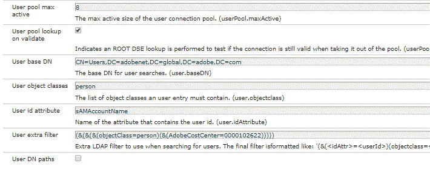
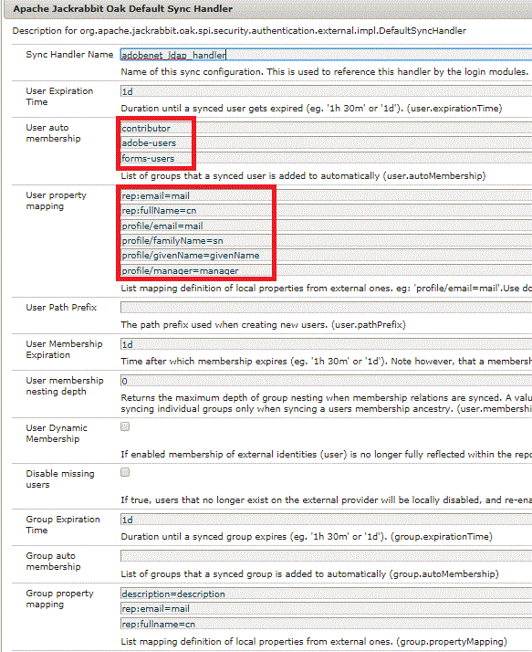
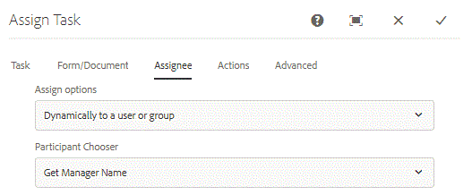

# Using LDAP with AEM Forms Workflow 

Assigning AEM Forms workflow task to the submitter's manager.

When using Adaptive Form in AEM workflow, you would want to dynamically assign a task to the form submitter's manager. To accomplish this use case, we will have to configure AEM with Ldap.

The steps needed to configure AEM with LDAP are explained in [detail here.](https://helpx.adobe.com/experience-manager/6-5/sites/administering/using/ldap-config.html)

For the purpose of this article, I am attaching configuration files used in configuring AEM with Adobe Ldap. These files are included in the package which can be imported using the package manager.

In the screenshot below, we are fetching all users belonging to a particular cost center. If you want to fetch all the users in your LDAP you may not use the extra filter.



In the screenshot below, we assign the groups to the users fetched from LDAP into AEM. Notice the forms-users group assigned to the imported users. The user needs to be a member of this group for interaction with AEM Forms. We also store the manager property under the profile/manager node in AEM.



Once you have configured LDAP and imported users into AEM, we can create a workflow which will assign the task to the submitters' manager. For the purpose of this article, we have developed a simple one-step approval workflow.

The first step in the workflow set the value of  initialstep  to No. The business rule in the adaptive form will disable the "Submitter Details" panel and show the "Approved By" panel based on the  initialstep  value.

The second step assigns the task to the submitter's manager. We get the submitter's manager using the custom code.

 

```java
public String getParticipant(WorkItem workItem, WorkflowSession wfSession, MetaDataMap arg2) throws WorkflowException{
resourceResolver = wfSession.adaptTo(ResourceResolver.class);
UserManager userManager = resourceResolver.adaptTo(UserManager.class);
Authorizable workflowInitiator = userManager.getAuthorizable(workItem.getWorkflow().getInitiator());
.
.
String managerPorperty = workflowInitiator.getProperty("profile/manager")[0].getString();
.
.

}

```

The code snippet is responsible to fetch the managers id and assign the task to the manager.

We get hold of the person who initiated the workflow. We then get the value of the manager property.

Depending on how the manager property is stored in your LDAP, you may have to do some string manipulation to get the manager id.

Please read this article to implement your own [  ParticipantChooser .](https://helpx.adobe.com/experience-manager/using/dynamic-steps.html)

To test this on your system(For Adobe Employees you can use this sample out of the box)

* [Download and deploy the setvalue bundle](/help/forms/assets/common-osgi-bundles/SetValueApp.core-1.0-SNAPSHOT.jar). This is the custom OSGI bundle for setting the manager's property.
* [Download and Install the DevelopingWithServiceUserBundle](/help/forms/assets/common-osgi-bundles/DevelopingWithServiceUser.jar)
* [Import the Assets associated with this article into AEM using the package manager](assets/aem-forms-ldap.zip).Included as part of this package are LDAP configuration files, workflow, and an adaptive form.
* Configure AEM with your LDAP using appropriate LDAP credentials.
* Login to AEM using your LDAP credentials.
* Open the [timeoffrequestform](http://localhost:4502/content/dam/formsanddocuments/helpx/timeoffrequestform/jcr:content?wcmmode=disabled)
* Fill out the form and submit.
* The submitter's manager should get the form for review.

>[!NOTE]
>
>This custom code for extracting the manager name has been tested against Adobe LDAP. If you are executing this code against a different LDAP, you will have to modify or write your own getParticipant implementation to get the manager's name.
