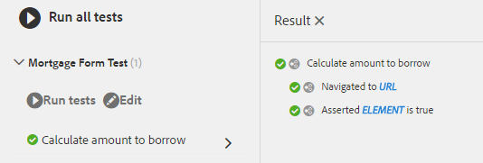

# Using Automated Tests with AEM Adaptive Forms {#using-automated-tests-with-aem-adaptive-forms}

Automated testing of Adaptive Forms using Calvin SDK

Calvin SDK is a utility API for Adaptive Forms developers to test Adaptive Forms. Calvin SDK is built on top of the [Hobbes.js testing framework](https://experienceleague.adobe.com/docs/experience-manager-release-information/aem-release-updates/previous-updates/aem-previous-versions.html). Calvin SDK is available with AEM Forms 6.3 onwards.

In this tutorial, you will create the following:

* Test Suite
* Test Suite will contain one or more test cases
* Test Cases will contain one or more actions

## Getting started {#getting-started}

[Download and Install the Assets using Package Manager](assets/testingadaptiveformsusingcalvinsdk1.zip)The package contains sample scripts and several Adaptive Forms.These Adaptive Forms are built using AEM Forms 6.3 version. It is recommended to create new forms specific to your version of AEM Forms if you are testing this on AEM Forms 6.4 or higher. The sample scripts demonstrate various Calvin SDK API's available to test Adaptive Forms. The general steps for testing AEM Adaptive Forms are:

* Navigate to the form that needs to be tested
* Set field's value
* Submit the Adaptive Form
* Check for error messages

The sample scripts in the package demonstrate all the above actions.
Let's explore the code of `mortgageForm.js`

```javascript

var mortgageFormTS = new hobs.TestSuite("Mortgage Form Test", {
        path: '/etc/clientlibs/testingAFUsingCalvinSDK/mortgageForm.js',
        register: true
})
```

The code above creates a new Test Suite.

* The name of the TestSuite in this case is ' `Mortgage Form Test` '. 
* Provided is the absolute path in AEM to the js file which contains the test suite.
* The register parameter when set to ' `true` ', makes the Test Suite available in the testing UI.

```javascript
.addTestCase(new hobs.TestCase("Calculate amount to borrow")
        // navigate to the mortgage form  which is to be tested
        .navigateTo("/content/forms/af/cal/mortgageform.html?wcmmode=disabled")
  .asserts.isTrue(function () {
            return calvin.isFormLoaded()
        })
```

>[!NOTE]
>
>If your are testing this capability on AEM Forms 6.4 or above, please create a new Adaptive Form and use it to do your testing.Using the Adaptive Form provided with the package is not recommended.

Test cases can be added to test suite to be executed against an adaptive form.

* To add a test case to test suite, use the `addTestCase` method of TestSuite object. 
* The `addTestCase` method takes an TestCase Object as a parameter. 
* To create TestCase use the `hobs.TestCase(..)` method. 
* Note: The first parameter is the name of the Test Case that will appear in the UI.
* Once you have created a test case you can then add actions to your test case. 
* Actions including `navigateTo`, `asserts.isTrue` can be added as actions to the test case.

## Running the automated tests {#running-the-automated-tests}

[Openthetestsuite](http://localhost:4502/libs/granite/testing/hobbes.html)Expand the Test Suite and run the tests. If everything runs successfully, you will see the following output.

 

## Try out the sample test suites {#try-out-the-sample-test-suites}

As part of the sample package there are three additional test suites. You can try them by including the appropriate files in the js.txt file of the clientlibrary as shown below:

```javascript
#base=.

scriptingTest.js
validationTest.js
prefillTest.js
mortgageForm.js
```
