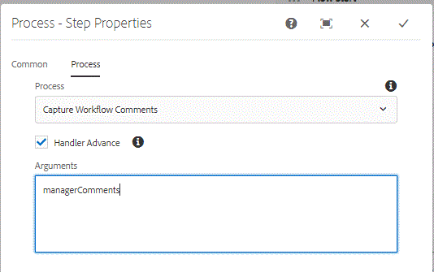

# Capturing workflow comments in Adaptive Forms Workflow{#capturing-workflow-comments-in-adaptive-forms-workflow}

>[Applies only to AEM Forms 6.4. In AEM Forms 6.5 please use the variables feature to achieve this use case]

A common request is for the ability to include the comments entered by the task reviewer in an email. In AEM Forms 6.4 there is no out of the box mechanism to capture the user entered comments and include these comments in email.

To meet this requirement, a sample OSGi bundle is provided that can be used to capture comments and store these comments as workflow metadata property.

The following screenshot shows you how to use process step in [AEM Workflow](http://localhost:4502/editor.html/conf/global/settings/workflow/models/CaptureComments.html) to capture comments and store them as metadata property. The "Capture Workflow Comments" is the name of the java class that needs to be used in the process step. You need to pass the metadata property name that will hold the comments. In the screenshot below,managerComments is the metadata property that will store the comments.

To test this capability on your system, please follow the following steps:
* [Make sure the process step in the workflow is configure to use the Capture Workflow Comments](http://localhost:4502/editor.html/conf/global/settings/workflow/models/CaptureComments.html)

* [Deploy the Developingwithserviceuser bundle](/help/forms/assets/common-osgi-bundles/DevelopingWithServiceUser.jar)

* [Deploy the SetValue bundle](/help/forms/assets/common-osgi-bundles/SetValueApp.core-1.0-SNAPSHOT.jar). This bundle contains the sample code to capture the comments and store it as a metadata property

* [Download and unzip the assets related to this article on to your file system](assets/capturecomments.zip) The assets contain workflow model and sample Adaptive Form.

* Import the 2 zip files into AEM using package manager

* [Preview the form by browsing to this URL](http://localhost:4502/content/dam/formsanddocuments/capturecomments/jcr:content?wcmmode=disabled)

* Fill in the form fields and submit the form

* [Check your AEM inbox](http://localhost:4502/aem/inbox)

* Open the task from the inbox and submit the form. Please enter some comments when prompted.

The comments will be stored in the metadata property called managerComments in crx. To check for the comments login to crx as admin. The workflow instances are stored in the following path

/var/workflow/instances/server0

Select the appropriate workflow instance and check for the property managerComments in the metadata node.

