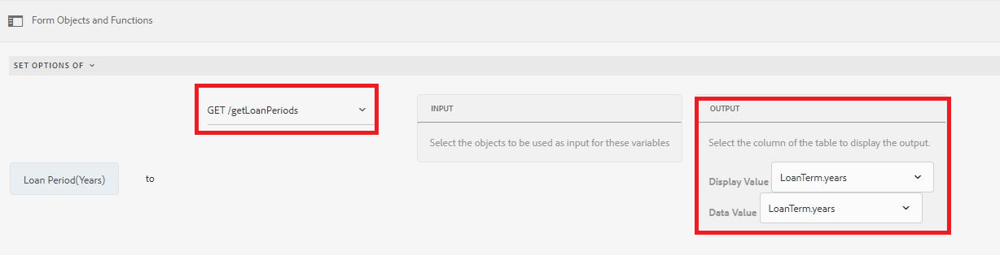

# Adding items dynamically to choice group component

 AEM Forms 6.5 introduced the ability to add items dynamically to an Adaptive Forms choice group component such as CheckBox, Radio Button and Image List.


You can add items using the visual editor as well as the code editor depending on your use case.

**Using the visual editor:** You can populate the items of the choice group from the results of a function call or service call. For example, you can set the items of the choice group by consuming the response of a REST API call.

In the screenshot below, we are setting the options of Loan Period(years) to the results of a service call called getLoanPeriods.



**Using the code editor**: When you want to set the items in the choice group dynamically based on the values entered in the form. For example, the following code snippet sets the items of the checkbox to the values entered in the applicant name and spouse fields of the Adaptive Form.

In the code snippet, we are setting the items of WorkingMembers which is a checkbox component. The array for the items is being built dynamically by fetching the values of the applicantName and spouse text fields of the adaptive forms

```javascript
 
 if(MaritalStatus.value=="Married")
  {
WorkingMembers.items =["spouse="+spouse.value,"applicant="+applicantName.value];
  }
else
  {
    WorkingMembers.items =["applicant="+applicantName.value];
  }
```

The submitted data is as follows

```xml
<afUnboundData>

<data>

<applicantName>John Jacobs</applicantName>

<MaritalStatus>Married</MaritalStatus>

<spouse>Gloria Rios</spouse>

<WorkingMembers>spouse,applicant</WorkingMembers>

</data>

</afUnboundData>
```

**Adding items using the rule editor**

>[!VIDEO](https://video.tv.adobe.com/v/26847?quality=12&learn=on)

**Adding items using the code editor**

>[!VIDEO](https://video.tv.adobe.com/v/26848?quality=12&learn=on)
 
To try this on your system:

**Using the code editor to add items**

* [Download the assets](assets/usingthecodeeditor.zip)
* [Open Forms And Documents](http://localhost:4502/aem/forms.html/content/dam/formsanddocuments)
* Click on "Create | File Upload" and upload the file you downloaded in the previous step
* [Preview the forms](http://localhost:4502/content/dam/formsanddocuments/simpleform/jcr:content?wcmmode=disabled)
* Enter Applicant Name and select the Marital Status to Married
* Enter the spouse name
* Click Next
* You should see checkbox populated with the applicant name and with the spouse name if the marital status is married

**Using the visual editor to add items**

* [Download the assets](assets/usingthevisualeditor.zip)
* Install Tomcat if you do not have it already. [Instructions to install tomcat are available here](https://experienceleague.adobe.com/docs/experience-manager-learn/forms/ic-print-channel-tutorial/introduction.html)
* [Deploy the SampleRest.war file contained in this zip file in your Tomcat](assets/sample-rest.zip)
* [Open Forms And Documents](http://localhost:4502/aem/forms.html/content/dam/formsanddocuments)
* Click on "Create | File Upload" and upload the file you downloaded in the previous step
* [Preview the forms](http://localhost:4502/content/dam/formsanddocuments/amortizationschedule/jcr:content?wcmmode=disabled)
* Enter Loan amount and tab out of the field. This will trigger the rule which displays the loan period field.
* Select the appropriate loan period(The items for the loan period are populated from the rest call)
* Select the interest rate and click on "Get Amortization Schedule"
* The amortization table should get populated. The amortization schedule is fetched using a REST call.

>[!NOTE]
> It is assumed that tomcat is running on port 8080 and AEM on port 4502
