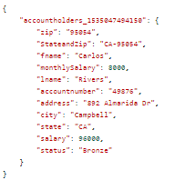

# Creating Computed Form Data Model Elements in AEM Forms{#creating-computed-form-data-model-elements-in-aem-forms}

Computed form data model elements allow you to store the manipulation result on one or more form data model elements. For example, you may want to calculate and store the monthly salary by performing a mathematical operation on the salary field. To do this you will divide the salary by 12 and store the result in computed form data model element called monthlySalary.

Another example for creating computed form data model is to concatenate two or more form data model elements. For example, you can concatenate state and zip form data model elements with a hyphen between the two elements.

The following screenshot shows you the computed elements StateaandZip and monthlySalary

## Creating monthly salary computed element

>[!VIDEO](https://video.tv.adobe.com/v/23855?quality=9&learn=on)

### Creating StateandZip computed element

>[!VIDEO](https://video.tv.adobe.com/v/23856/?quality=9&learn=on)

