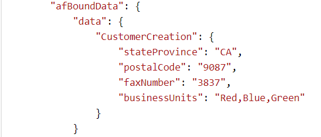
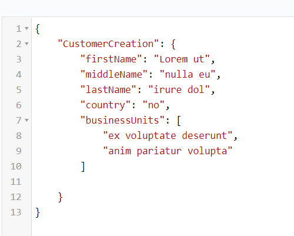
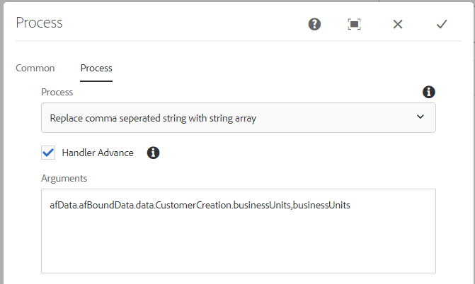

# Converting comma separated string into string array {#setting-value-of-json-data-element-in-aem-forms-workflow}

When your form is based on a form data model which has an array of strings as an input parameter, you need to manipulate the submitted adaptive form data to insert an array of strings. As an example if you have bound a checkbox field to a form data model element of type string array, the data from the checkbox field is in a comma separated string format. The sample code listed below shows you how to replace the comma separated string with an array of strings.

## Create a process step

A process step is used in an AEM workflow when we want our workflow to execute a certain logic. The process step can be associated with a ECMA script or an OSGi service. Our custom process step executes the OSGi service.

The submitted data is in the following format. The businessUnits element's value is a comma separated string, that needs to be converted into an array of string.



The input data for the rest endpoint associated with the form data model expects an array of strings as shown in this screen shot. The custom code in the process step converts the submitted data in to the correct format.



We pass the JSON object path and the element name to the process step. The code in the process step replaces the comma separated values of the element into an array of strings.
 

>[!NOTE]
>
>Make sure the Data File path in the Adaptive Form's submission options is set to "Data.xml". This is because the code in the process step looks for a file called Data.xml under the payload folder.

## Process step code

```java
import java.io.BufferedReader;
import java.io.ByteArrayInputStream;
import java.io.InputStream;
import java.io.InputStreamReader;

import javax.jcr.Binary;
import javax.jcr.Node;
import javax.jcr.Session;

import org.osgi.framework.Constants;
import org.osgi.service.component.annotations.Component;
import org.slf4j.Logger;
import org.slf4j.LoggerFactory;

import com.adobe.granite.workflow.WorkflowException;
import com.adobe.granite.workflow.WorkflowSession;
import com.adobe.granite.workflow.exec.WorkItem;
import com.adobe.granite.workflow.exec.WorkflowProcess;
import com.adobe.granite.workflow.metadata.MetaDataMap;
import com.google.gson.JsonArray;
import com.google.gson.JsonObject;
import com.google.gson.JsonParser;

@Component(property = {
    Constants.SERVICE_DESCRIPTION + "=Create String Array",
    Constants.SERVICE_VENDOR + "=Adobe Systems",
    "process.label" + "=Replace comma seperated string with string array"
})

public class CreateStringArray implements WorkflowProcess {
    private static final Logger log = LoggerFactory.getLogger(CreateStringArray.class);
    @Override
    public void execute(WorkItem workItem, WorkflowSession workflowSession, MetaDataMap arg2) throws WorkflowException {
        log.debug("The string I got was ..." + arg2.get("PROCESS_ARGS", "string").toString());
        String[] arguments = arg2.get("PROCESS_ARGS", "string").toString().split(",");
        String objectName = arguments[0];
        String propertyName = arguments[1];

        String objects[] = objectName.split("\\.");
        System.out.println("The params is " + propertyName);
        log.debug("The params string is " + objectName);
        String payloadPath = workItem.getWorkflowData().getPayload().toString();
        log.debug("The payload  in set Elmement Value in Json is  " + workItem.getWorkflowData().getPayload().toString());
        String dataFilePath = payloadPath + "/Data.xml/jcr:content";
        Session session = workflowSession.adaptTo(Session.class);
        Node submittedDataNode = null;
        try {
            submittedDataNode = session.getNode(dataFilePath);

            InputStream submittedDataStream = submittedDataNode.getProperty("jcr:data").getBinary().getStream();
            BufferedReader streamReader = new BufferedReader(new InputStreamReader(submittedDataStream, "UTF-8"));
            StringBuilder stringBuilder = new StringBuilder();

            String inputStr;
            while ((inputStr = streamReader.readLine()) != null)
                stringBuilder.append(inputStr);
            JsonParser jsonParser = new JsonParser();
            JsonObject jsonObject = jsonParser.parse(stringBuilder.toString()).getAsJsonObject();
            System.out.println("The json object that I got was " + jsonObject);
            JsonObject targetObject = null;

            for (int i = 0; i < objects.length - 1; i++) {
                System.out.println("The object name is " + objects[i]);
                if (i == 0) {
                    targetObject = jsonObject.get(objects[i]).getAsJsonObject();
                } else {
                    targetObject = targetObject.get(objects[i]).getAsJsonObject();

                }

            }

            System.out.println("The final object is " + targetObject.toString());
            String businessUnits = targetObject.get(propertyName).getAsString();
            System.out.println("The values of " + propertyName + " are " + businessUnits);

            JsonArray jsonArray = new JsonArray();

            String[] businessUnitsArray = businessUnits.split(",");
            for (String name: businessUnitsArray) {
                jsonArray.add(name);
            }

            targetObject.add(propertyName, jsonArray);
            System.out.println(" After updating the property " + targetObject.toString());
            InputStream is = new ByteArrayInputStream(jsonObject.toString().getBytes());
            System.out.println("The changed json data  is " + jsonObject.toString());
            Binary binary = session.getValueFactory().createBinary(is);
            submittedDataNode.setProperty("jcr:data", binary);
            session.save();

        } catch (Exception e) {
            System.out.println(e.getMessage());
        }

    }
}

```

The sample bundle can be [downloaded from here](assets/CreateStringArray.CreateStringArray.core-1.0-SNAPSHOT.jar)
