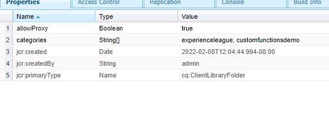
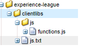

# Custom functions

 AEM Forms 6.5 introduced the ability to define JavaScript functions that can be used in defining complex business rules using the rule editor.
 AEM Forms provides a number of such custom functions out of the box, but you will have the need to define your own custom functions and use them across multiple forms.

 To define your first custom function, please follow the following steps:
* [Log into crx](http://localhost:4502/crx/de/index.jsp#/apps/experience-league/clientlibs)
* Create a new folder under apps called experience-league(This folder name can be a name of your choice)
* Save your changes.
* Under experience-league folder create a new node of type cq:ClientLibraryFolder called clientlibs.
* Select the newly create clientlibs folder and add the allowProxy and categories properties as shown in the screen shot and save your changes.

 
* Create a folder called **js** under the **clientlibs** folder
* Create a file called **functions.js** under the **js** folder
* Create a file called **js.txt** under the **clientlibs** folder. Save your changes.
* Your folder structure should look like the screen-shot below.

 

* Double click functions.js to open the editor.
Copy the following code into functions.js and save your changes.

```javascript
/**
* Get List of County names
* @name getCountyNamesList Get list of county names
* @return {OPTIONS} drop down options 
 */
function getCountyNamesList()
{
    var countyNames= [];
    countyNames[0] = "Santa Clara";
    countyNames[1] = "Alameda";
    countyNames[2] = "Buxor";
    countyNames[3] = "Contra Costa";
    countyNames[4] = "Merced";

    return countyNames;

}
/**
* Covert UTC to Local Time
* @name convertUTC Convert UTC Time to Local Time
* @param {string} strUTCString in Stringformat
* @return {string}
*/
function convertUTC(strUTCString)
{
    var dt = new Date(strUTCString);
    console.log(dt.toLocaleString());
    return dt.toLocaleString();
}

```

Please [refer to jsdoc ](https://jsdoc.app/index.html)for more details on annotating javascript functions.
The above code has two functions:
 **getCountyNamesList** - returns an array of string
**convertUTC** - Converts UTC time stamp to local time zone

Open the js.txt and paste the following code and save your changes.

``` javascript
#base=js
functions.js
```

The line #base=js specifies in which directory the JavaScript files are located.
The lines below indicate the location of JavaScript file relative to the base location.

If you are having trouble in creating the custom functions, feel free to [download and install this package](assets/custom-functions.zip) in your AEM instance.

## Using the custom functions

The following video walks you through the steps involved in using custom function in the rule editor of an adaptive form
>[!VIDEO](https://video.tv.adobe.com/v/340305?quality=9&learn=on)
