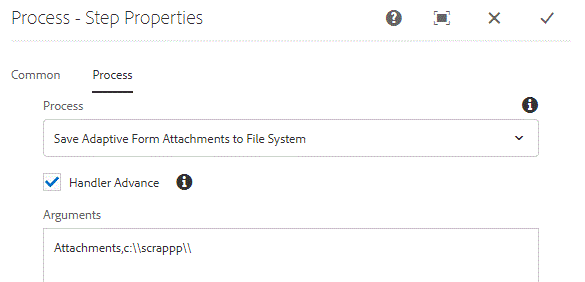

# Custom Process Step

This tutorial is intended for AEM Forms customers needing to implement custom process step. A process step can execute ECMA script or call custom java code to perform operations. This tutorial will explain the steps needed to implement WorkflowProcess that gets executed by the process step.

The main reason for implementing custom process step is to extend the AEM Workflow. For example, if you are using AEM Forms components in your workflow model, you may want to perform the following operations

* Save the Adaptive Form attachment(s) to the file system
* Manipulate the submitted data

To accomplish the above use case, you will typically write an OSGi service that gets executed by the process step.

## Create Maven Project

The first step is to create an maven project using the appropriate Adobe Maven Archetype. The detailed steps are listed in this [article](https://experienceleague.adobe.com/docs/experience-manager-learn/forms/create-your-first-osgi-bundle.html?lang=en). Once you have your maven project imported into eclipse, you are ready to start writing your first OSGi component that can be used in your process step.


### Create class that implements WorkflowProcess

Open the maven project in your eclipse IDE. Expand **projectname** > **core** folder. Expand the src/main/java folder. You should see a package that ends with "core". Create Java class that implements WorkflowProcess in this package. You will need to override execute method. The signature of execute method is as follows
public void execute(WorkItem workItem, WorkflowSession workflowSession, MetaDataMap processArguments)throws WorkflowException 
The execute method gives access to the following 3 variables

**WorkItem**: The workItem variable will give access to data related to workflow. The public API documentation is available [here.](https://helpx.adobe.com/experience-manager/6-3/sites/developing/using/reference-materials/diff-previous/changes/com.adobe.granite.workflow.WorkflowSession.html)

 **WorkflowSession**: This workflowSession variable will give you the ability to control workflow. The public API documentation is available [here](https://helpx.adobe.com/experience-manager/6-3/sites/developing/using/reference-materials/diff-previous/changes/com.adobe.granite.workflow.WorkflowSession.html)

 **MetaDataMap**: All the metadata associated with the workflow. Any process arguments that are passed to the process step are available using the MetaDataMap object.[API Documentation](https://helpx.adobe.com/experience-manager/6-5/sites/developing/using/reference-materials/javadoc/com/adobe/granite/workflow/metadata/MetaDataMap.html)

In this tutorial, we are going to write the attachments added to Adaptive Form to the file system as part of the AEM Workflow.

To accomplish this use case, the following java class was written

Let's take a look at this code

``` java
package com.learningaemforms.adobe.core;

import java.io.File;
import java.io.InputStream;
import java.util.HashMap;
import java.util.Map;

import javax.jcr.Node;
import javax.jcr.Session;

import org.osgi.framework.Constants;
import org.osgi.service.component.annotations.Component;
import org.osgi.service.component.annotations.Reference;
import org.slf4j.Logger;
import org.slf4j.LoggerFactory;

import com.adobe.aemfd.docmanager.Document;
import com.adobe.granite.workflow.WorkflowException;
import com.adobe.granite.workflow.WorkflowSession;
import com.adobe.granite.workflow.exec.WorkItem;
import com.adobe.granite.workflow.exec.WorkflowProcess;
import com.adobe.granite.workflow.metadata.MetaDataMap;
import com.day.cq.search.PredicateGroup;
import com.day.cq.search.Query;
import com.day.cq.search.QueryBuilder;
import com.day.cq.search.result.Hit;
import com.day.cq.search.result.SearchResult;

@Component(property = {
	Constants.SERVICE_DESCRIPTION + "=Write Adaptive Form Attachments to File System",
	Constants.SERVICE_VENDOR + "=Adobe Systems",
	"process.label" + "=Save Adaptive Form Attachments to File System"
})
public class WriteFormAttachmentsToFileSystem implements WorkflowProcess {

	private static final Logger log = LoggerFactory.getLogger(WriteFormAttachmentsToFileSystem.class);
	@Reference
	QueryBuilder queryBuilder;

	@Override
	public void execute(WorkItem workItem, WorkflowSession workflowSession, MetaDataMap processArguments)
	throws WorkflowException {
		// TODO Auto-generated method stub
		log.debug("The string I got was ..." + processArguments.get("PROCESS_ARGS", "string").toString());
		String[] params = processArguments.get("PROCESS_ARGS", "string").toString().split(",");
		String attachmentsPath = params[0];
		String saveToLocation = params[1];
		log.debug("The seperator is" + File.separator);
		String payloadPath = workItem.getWorkflowData().getPayload().toString();
		Map<String, String> map = new HashMap<String, String> ();
		map.put("path", payloadPath + "/" + attachmentsPath);
		File saveLocationFolder = new File(saveToLocation);
		if (!saveLocationFolder.exists()) {
			saveLocationFolder.mkdirs();
		}

		map.put("type", "nt:file");
		Query query = queryBuilder.createQuery(PredicateGroup.create(map), workflowSession.adaptTo(Session.class));
		query.setStart(0);
		query.setHitsPerPage(20);

		SearchResult result = query.getResult();
		log.debug("Got  " + result.getHits().size() + " attachments ");
		Node attachmentNode = null;
		for (Hit hit: result.getHits()) {
			try {
				String path = hit.getPath();
				log.debug("The attachment title is  " + hit.getTitle() + " and the attachment path is  " + path);
				attachmentNode = workflowSession.adaptTo(Session.class).getNode(path + "/jcr:content");
				InputStream documentStream = attachmentNode.getProperty("jcr:data").getBinary().getStream();
				Document attachmentDoc = new Document(documentStream);
				attachmentDoc.copyToFile(new File(saveLocationFolder + File.separator + hit.getTitle()));
				attachmentDoc.close();
			} catch (Exception e) {
				log.debug("Error saving file " + e.getMessage());
			}
```

Line 1 - defines the properties for our component. The process.label property is what you will see when associating OSGi component with the process step as shown in one of the screenshots below.

Lines 13-15 - The process arguments passed to this OSGi component are split using the "," separator. The values for attachmentPath and saveToLocation are then extracted from the string array.

* attachmentPath - This is the same location that you have specified in the Adaptive Form when you configured the submit action of Adaptive Form to invoke AEM Workflow. This is a name of the folder that you want the attachments to be saved in AEM relative to the payload of the workflow.

* saveToLocation - This is the location that you want the attachments to be saved on your AEM server's file system.

These two values are passed as process arguments as shown in the screenshot below.



The QueryBuilder service is used to query nodes of type nt:file under the attachmentsPath folder. The rest of the code iterates through the search results to create Document object and save it to the file system


>[!NOTE]
>
>Since we are using Document object which is specific to AEM Forms, it is required that you include the aemfd-client-sdk dependency in your maven project. The group Id is com.adobe.aemfd and artefact id is aemfd-client-sdk.

#### Build and Deploy

[Build the bundle as described here](https://experienceleague.adobe.com/docs/experience-manager-learn/forms/create-your-first-osgi-bundle.html?lang=en#build-your-project)
[Make sure the bundle is deployed and in active state](http://localhost:4502/system/console/bundles)

Create a workflow model. Drag and drop process step in the workflow model. Associate the process step with "Save Adaptive Form Attachments to File System".

Provide the necessary process arguments separated by a comma. For example Attachments,c:\\scrappp\\. The first argument is the folder when your Adaptive Form attachments are going to be stored relative to the workflow payload. This has to be the same value you specified when configuring the submit action of Adaptive Form. The second argument is the location when you want the attachments to be stored.

Create an Adaptive Form. Drag and drop File Attachments component on to the form. Configure submit action of the form to invoke the workflow created in the earlier steps. Provide the appropriate attachment path.

Save the settings.

Preview the form. Add a couple of attachments and submit the form. The attachments should get saved to the file system in the location specified by you in the workflow.

