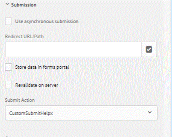

# Writing a Custom Submit in AEM Forms {#writing-a-custom-submit-in-aem-forms}

Quick and easy way to create your own custom submit action for Adaptive Form

This article will walk you through the steps needed to create a custom submit action for handling Adaptive Forms submission.

* Login to  crx 
* Create a node of type "sling  :folder " under apps. Let's call this node CustomSubmitHelpx.
* Save the newly created node.
* Add the following three properties to the newly created node

| Property Name      | Property Value                   |
|----------------    | ---------------------------------|
| guideComponentType | fd/af/components/guidesubmittype |
| guideDataModel     | xfa,xsd,basic                    |
| jcr :description   | CustomSubmitHelpx                |


* Save the changes
* Create a new file called post.POST.jsp under the CustomSubmitHelpx node.When an adaptive form is submitted, this JSP is called. You can write the JSP code as per your requirement in this file. The following code forwards the request to the servlet.

```java
<%
%><%@include file="/libs/foundation/global.jsp"%>
<%@taglib prefix="cq" uri="http://www.day.com/taglibs/cq/1.0"%>
<%@ page import="org.apache.sling.api.request.RequestParameter,com.day.cq.wcm.api.WCMMode,com.adobe.forms.common.submitutils.CustomParameterRequest,com.adobe.aemds.guide.submitutils.*" %>

<%@ page import="org.apache.sling.api.request.RequestParameter,com.day.cq.wcm.api.WCMMode" %>
<%@page session="false" %>
<%

   com.adobe.aemds.guide.utils.GuideSubmitUtils.setForwardPath(slingRequest,"/bin/storeafsubmission",null,null);

%>
```

* Create file called  addfields .jsp under the CustomSubmitHelpx node. This file will enable you to access the signed document.
* Add the following code to this file

```java

    <%@include file="/libs/fd/af/components/guidesglobal.jsp"%>

    <%@page import="org.slf4j.LoggerFactory" %>

    <%@page import="org.slf4j.Logger" %>

    <input type="hidden" id="useSignedPdf" name="_useSignedPdf" value=""/>;

```

* Save your changes

Now you will start seeing "CustomSubmitHelpx" in the submit actions of your Adaptive Form as shown in this image.


