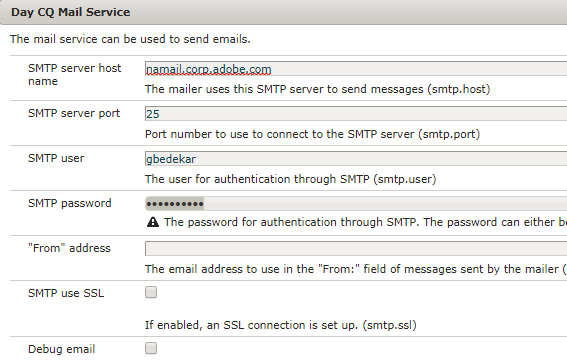
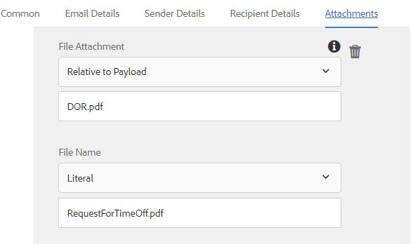

# Using Send Email Step of  Forms Workflow {#using-send-email-step-of-forms-workflow}

Send Email step was introduced in AEM Forms 6.4. Using this step we can build business processes or workflow which will allow you to send emails with or without attachments. The following video walks through the steps for configuring the send email component.

>[!VIDEO](https://video.tv.adobe.com/v/21499/?quality=9&learn=on)

As part of this article, we will walk you through the following use case:

1. A user fills out Time Off Request Form
1. On form submission, AEM Workflow is triggered
1. The AEM Workflow utilizes the Send Email component to send an email with the DoR as an attachment

Before you use Send Email step make sure you configure the Day CQ Mail Service from the [configMgr](http://localhost:4502/system/console/configMgr). Provide the values specific to your environment

As part of the assets associated with this article, You will get the following

1. Adaptive Form which will trigger the workflow on submission
1. Sample workflow that will send an email with DOR as its attachment
1. OSGi bundle which creates the metadata properties

To get the sample running on your system, please do the following:

1. [Deploy the Developingwithserviceuser bundle](https://forms.enablementadobe.com/content/DemoServerBundles/DevelopingWithServiceUser.core-1.0-SNAPSHOT.jar)

1. [Download and install setvalue bundle](https://forms.enablementadobe.com/content/DemoServerBundles/SetValueApp.core-1.0-SNAPSHOT.jar)This bundle contains the code for creating the metadata properties as part of the process step of the workflow.
1. [Configure Day CQ Mail Service](https://helpx.adobe.com/experience-manager/6-5/sites/administering/using/notification.html)
1. [Import and install the assets associated with this article using the package manager into CRX](assets/emaildoraemformskt.zip)
1. Launch the [adaptive form](http://localhost:4502/content/dam/formsanddocuments/helpx/timeoffrequestform/jcr:content?wcmmode=disabled). Fill in the required fields and submit.
1. You should get an email with DocumentOfRecord as an attachment

Explore the [workflow model](http://localhost:4502/editor.html/conf/global/settings/workflow/models/emaildor.html)

Take a look at the process step of the workflow. The custom code associated with the process step will create metadata property names and sets its values from the submitted data.These values are then used by the send email component.
>[!NOTE] In AEM Forms 6.5 and above you do not need this custom code to create metadata properties. Please use the variables capability in AEM Workflow

Make sure the Attachments tab of the Send Email component is configured as per the screen shot below
The "DOR.pdf" value has to match the value specified in the Document of Record Path specified in the submission options of your adaptive form.

