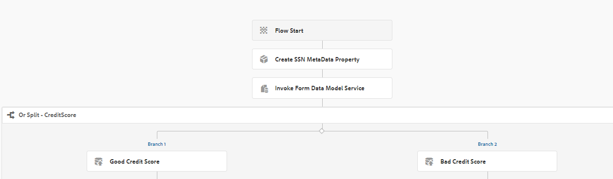

# Using Form Data Model Service as Step in Workflow {#using-form-data-model-service-as-step-in-workflow}

Starting with AEM Forms 6.4, we now have the ability to use Form Data Model as part of AEM Workflow. The following video walks thru the steps needed to configure Form Data Model step in AEM Workflow

>[!VIDEO](https://video.tv.adobe.com/v/21719/?quality=9)

To test this capability on your server, follow the below instructions
* [Download and deploy the setvalue bundle](https://forms.enablementadobe.com/content/DemoServerBundles/SetValueApp.core-1.0-SNAPSHOT.jar). This is the custom OSGI bundle which sets metadata properties.
>![NOTE]In AEM Forms 6.5 and above this capability is available out of the box as [describe here](form-data-model-service-as-step-in-aem65-workflow-video-use.md)

* Setup tomcat with SampleRest.war file as described [here](https://docs.adobe.com/content/help/en/experience-manager-learn/forms/ic-print-channel-tutorial/introduction.html).The war file deployed in Tomcat has the code to return the applicant's credit score. The credit score is random number between 200 and 800

* [Import the assets into AEM using package manager](assets/invoke-fdm-as-service-step.zip).The package contains the following:

  * Workflow model which uses FDM step.
  * Form Data Model that is used in the FDM step.
  * Adaptive form to trigger the workflow on submission.
* Open the [MortgageApplicationForm](http://localhost:4502/content/dam/formsanddocuments/loanapplication/jcr:content?wcmmode=disabled). Fill in the details and submit. On the form submission the [loanapplication workflow](http://http://localhost:4502/editor.html/conf/global/settings/workflow/models/LoanApplication2.html) is triggered.

.
 The workflow utilizes Or Split component to route the application to admin if the credit score is over 500. If the credit score is less than 500 the application is routed to cavery
