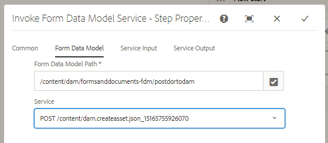
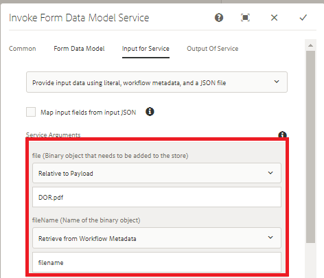

# Using Form Data Model To Post Binary Data{#using-form-data-model-to-post-binary-data}

Starting with AEM Forms 6.4, we now have the ability to invoke Form Data Model Service as a step in AEM Workflow. This article will walk you through a sample use case for posting Document of Record using Form Data Model Service.

The use case is as follows:

1. A user fills and submits Adaptive Form.
1. The adaptive form is configured to generate Document Of Record.
1. On submission of this adaptive forms, AEM Workflow is triggered which will use the invoke Form Data Model Service to POST the Document Of Record to AEM DAM.

Form Data Model Tab - Properties

In the Service Input tab we map the following

* file(The Binary Object that needs to be stored) with DOR.pdf property relative to payload. What that means is when the Adatpive Form is submitted, the Document Of Record that is generated will be stored in a file called DOR.pdf relative to the workflow payload.**Make sure this DOR.pdf is the same that you provide when configuring the Adaptive Form's submission property.**

* fileName - This is the name by which the binary object will be stored in DAM. So you want this property to be dynamically generated, so that each fileName would be unique per submission. For this purpose we have used the process step in the workflow to create metadata property called filename and set its value to combination of Member Name and Account Number of the person submitting the form. For example if the member name of the person is John Jacobs and his account number is 9846, the file name would be John Jacobs_9846.pdf

Service Input

>[!NOTE]
>
>Trouble Shooting Tips - If for some reason the DOR.pdf is not created in DAM, reset the data source authentication settings by clicking [here](http://localhost:4502/mnt/overlay/fd/fdm/gui/components/admin/fdmcloudservice/properties.html?item=%2Fconf%2Fglobal%2Fsettings%2Fcloudconfigs%2Ffdm%2Fpostdortodam). These are the AEM authentication settings, which by default is admin/admin.

To test this capability on your server, please follow the steps mentioned below:

1. [Download and deploy the setvalue bundle](https://forms.enablementadobe.com/content/DemoServerBundles/SetValueApp.core-1.0-SNAPSHOT.jar).This custom OSGI bundle is used to create metadata property and set its value from the submitted form data.

1. [Import the assets](assets/postdortodam.zip) associated with this article into AEM using the package manager.You will get the following

    1. Workflow Model
    1. Adaptive Form configured to submit to the AEM Workflow
    1. Data source configured to use PostToDam.JSON file
    1. Form Data Model which uses the Data Source

1. Point your [browser to open the Adaptive Form](http://localhost:4502/content/dam/formsanddocuments/helpx/timeoffrequestform/jcr:content?wcmmode=disabled)
1. Fill the form and submit.
1. Check the Assets application if the Document of Record is created and stored.

[Swagger File](http://localhost:4502/conf/global/settings/cloudconfigs/fdm/postdortodam/jcr:content/swaggerFile) used in creating the data source is available for your reference
