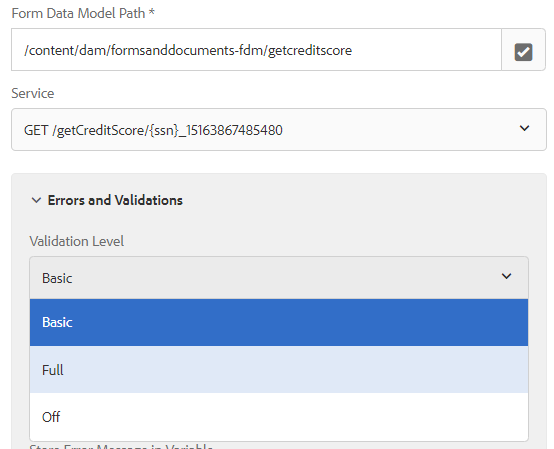
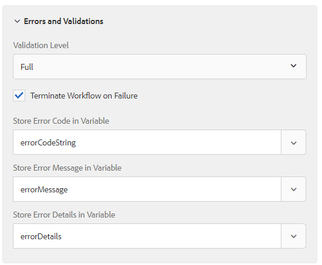

# Capturing Error Messages in Invoke Form Data Model Service Step

Starting with AEM Forms 6.5.1, we now have the option to capture error messages and specify validation options. Invoke Form Data Model Service step has been enhanced to provide the following capabilities.

* Providing an option for 3 tier validation  ("OFF", "BASIC" and "FULL") to handle Exceptions encountered on invoking Form Data Model Service. The 3 options successively denote a stricter version of checking Database-specific requirements.

 
* Providing a checkbox for customizing the execution of Workflow. Hence, user now have the flexibility to go ahead with the Workflow Execution, even if Invoke Form Data Model step throws Exceptions.

* Storing important information of Error arising due to validation exceptions. Three Autocomplete-type variable selectors have been incorporated to select relevant variables to store the ErrorCode(String), ErrorMessage(String) and ErrorDetails(JSON). The ErrorDetails however would be set to null incase the exception is not a DermisValidationException. 


With these changes, Invoke Form Data Model Service step makes sure the input values adhere to the data constraints provided in the swagger file. For example the following error message is thrown when the accountId and balance values are not compliant to the data constraints specified in the swagger file.

```json
{
    "errorCode": "AEM-FDM-001-049"
    "errorMessage": "Input validations failed during operation execution"
    "violations": {
        "/accountId": ["numeric instance is greater than the required maximum (maximum: 20, found: 97)"],
        "/newAccount/balance": ["instance type (string) does not match any allowed primitive type (allowed: [\"integer\",\"number\"])"]
    }   
}
```
