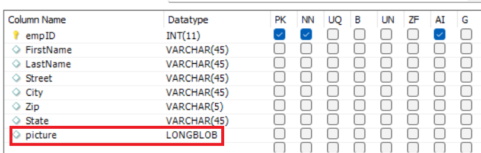
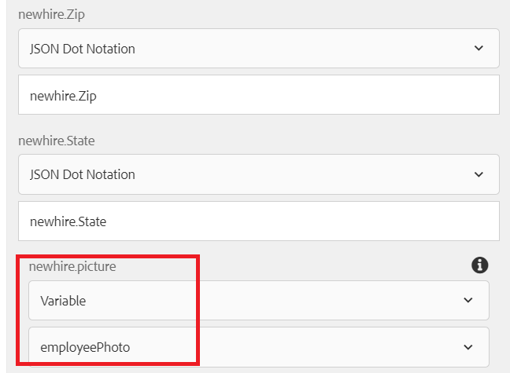
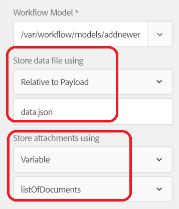

# Inserting form attachment in database

This article will walk through the use case of storing form attachment in MySQL database.

A common ask from customers is to store captured form data and the form attachment in a database table.
To accomplish this use case the following steps were followed

## Create database table to hold the form data and the attachment

A table called newhire was created to hold the form data. Notice the column name picture of type **LONGBLOB** to store the form attachment
 

## Create Form Data Model

A form data model was created to communicate with the MySQL database. You will need to create the following

* [JDBC Datasource in AEM](./data-integration-technical-video-setup.md)
* [Form Data Model based on the JDBC Datasource](./jdbc-data-model-technical-video-use.md) 

## Create workflow

Configuring your Adaptive Form to submit to an AEM workflow, you have the option to save the form attachments in a workflow variable or save the attachments in a specified folder under the payload. For this use case, we need to save the attachments in a workflow variable of type ArrayList of Document. From this ArrayList we need to extract the first item and initialize a document variable. The workflow variables called **listOfDocuments** and **employeePhoto** were created.
When the adaptive form is submitted to trigger the workflow, a step in the workflow will initialize the employeePhoto variable using the ECMA script. The following is the ECMA script code

``` javascript
log.info("executing script now...");
var metaDataMap = graniteWorkItem.getWorkflow().getWorkflowData().getMetaDataMap();
var listOfAttachments = [];
// Make sure you have a workflow variable caled listOfDocuments defined
listOfAttachments = metaDataMap.get("listOfDocuments");
log.info("$$$  got listOfAttachments");
//Make sure you have a workflow variable caled employeePhoto defined
var employeePhoto = listOfAttachments[0];
metaDataMap.put("employeePhoto", employeePhoto);
log.info("Employee Photo updated");

```

The next step in the workflow is to insert data and the form attachment into the table using Invoke Form Data Model service component.

[The complete workflow with the sample ecma script can be downloaded from here](assets/add-new-employee.zip).

>[!NOTE]
> You will have to create new JDBC based form data model and use that form data model in the workflow

## Create Adaptive Form 

Create your adaptive form based on the form data model created in the earlier step. Drag and drop the form data model elements on the form. Configure the form submission to trigger the workflow and specify the following properties as shown in the screen shot below

