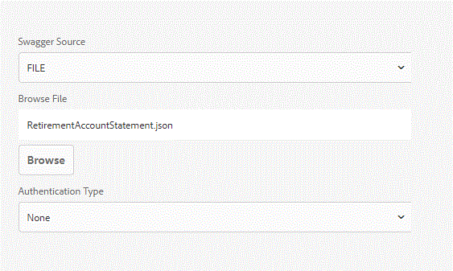
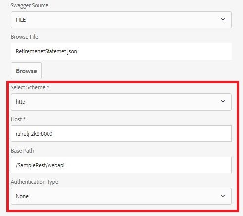

# Ability to modify Data Source Configuration Settings{#ability-to-modify-data-source-configuration-settings}

Up until the AEM Forms 6.4 release, once a data source was configured you could not change scheme, Host, Base Path for RESTful service. This was problematic if you wanted to test your data sources against different environments.

With the release of AEM Forms 6.5, you can now easily change the above-mentioned properties. With this new capability, you can now create Form Data Models against development environments and once you are satisfied with the results, you can change the properties to point to a different environment.

The screenshots below show the data source configuration settings in AEM Forms 6.4 and Forms 6.5

 **Data Source Configuration in AEM 6.4**

**Editable Data Source Configuration in AEM 6.5 and above**

