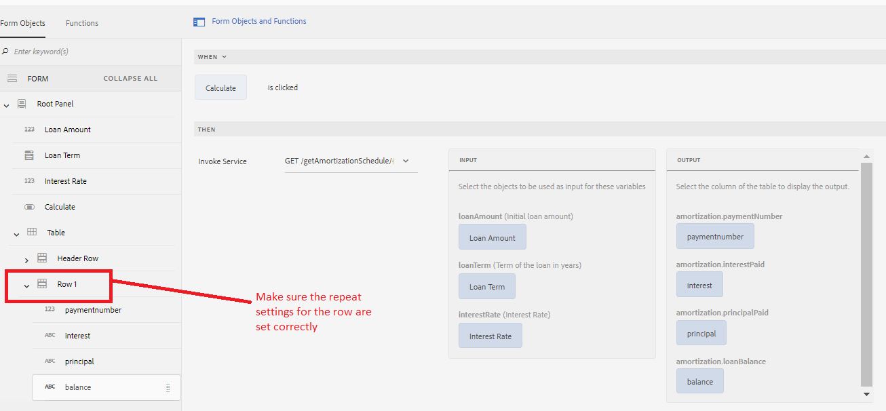
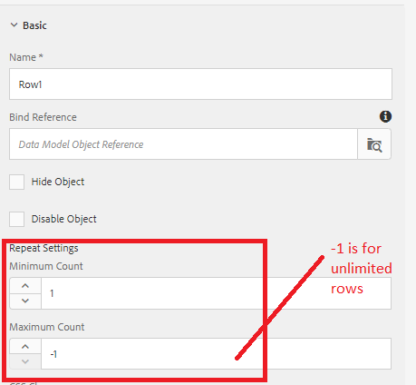

# Populate Adaptive Form Table with the results of Form Data Model Service Invocation

[Live form is hosted here](https://forms.enablementadobe.com/content/dam/formsanddocuments/amortization/jcr:content?wcmmode=disabled)
In this article we take a look at populating adaptive forms table by fetching data from form data model service invocation. We are going to create an amortization schedule in a table that lists each regular payment on a mortgage over time. The amortization results are returned by our Form Data Model. The Form Data Model's service is invoked on the click event of calculate button as shown in the screenshot. The input and the output parameters of the service invocation are mapped appropriately as shown in the screen shot. The output is mapped to the columns of Row1
 

Row1 is configured to be grow depending on the data returned by the service call. Notice the repeat settings that are specified here. A value of -1 indicates unlimited number of rows in the table

## Deploy this on your server

[Install Tomcat as specified here](/help/forms/ic-print-channel-tutorial/set-up-tomcat.md)
[Deploy the SampleRest.war file contained in this zip file in your Tomcat](assets/sample-rest.zip)
[Install the assets ](assets/amortizationschedule.zip) using AEM package manager
[Open the Amortization Schedule Form](http://localhost:4502/content/dam/formsanddocuments/amortization/jcr:content?wcmmode=disabled)
Enter the appropriate value and click on calculate
Amortization Schedule should get populated in your form
