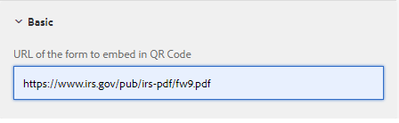

# Sample QR Code component

Embedding a QR code in an Adaptive Form can greatly enhance the convenience and efficiency for the users to access additional information related to the form.

The sample component makes use of [QRCode.js](https://davidshimjs.github.io/qrcodejs/).

The QRCode.js is a javascript library for making QRCode, it supports Cross-browser with HTML5 Canvas and table tag in DOM.

The component generates the QR code based on the value specified in the configuration property of the component.


The following code was used in the body.jsp of the qr-code-generator component.

The "url" is the url that needs to be embedded in the qr code. This url is specified in the configuration properties of the QR code component.

```java
<%@include file="/libs/foundation/global.jsp"%>
<body>
    <h2>Scan the QR Code for more information related to this form</h2>
    <div data-url="<%=properties.get("url")%>">
    </div>
    <div id="qrcode">
    </div>
</body>


```


The following code makes use of the makeCode method of the QRCode.js library in the client library of the qr-code-generator component.The generated QR code is appended to the div identified by id **"qrcode"**.

``` javascript
$(document).ready(function()
  {
      var qrcode = new QRCode("qrcode");
      qrcode.makeCode(document.querySelector("[data-url]").getAttribute("data-url"));
      
 });


```

## Deploy the assets on your local server

* [Download and install the QR code component using Package Manager.](assets/qrcode.zip)
* [Download and install the sample adaptive form using Package Manager.](assets/form-with-qr-code.zip)
* [Preview the form](http://localhost:4502/content/dam/formsanddocuments/qrcode/w9form/jcr:content?wcmmode=disabled). The help section of the form has the QR code.


