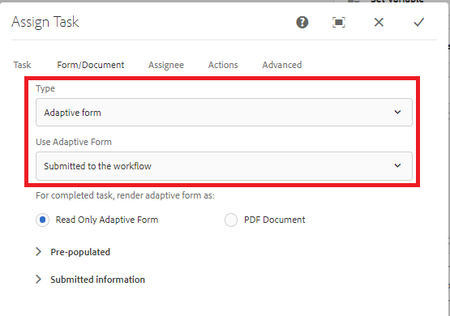

# Create Re-Usable AEM Forms Workflow Models{#create-re-usable-aem-forms-workflow-models}

Starting with AEM Forms 6.5 release, we can now create workflow models which are not tied to a specific Adaptive Form. With this capability, you can now create one workflow model that can be invoked on different adaptive form submissions. With this capability, you can have a generic workflow to handle all adaptive form submissions for review and approval.

To design such a workflow, please perform the following steps

1. Login to AEM
1. Point your browser to [workflow model](http://localhost:4502/libs/cq/workflow/admin/console/content/models.html)
1. Click Create | Create Model to Add Workflow Model
1. Provide the appropriate Name and Title to the workflow model and then click on Done
1. Open the newly created model in edit mode
1. Drag and drop Assign Task component on to your workflow model
1. Open the Assign Task component's configuration properties
1. Tab to the Forms and Documents tab
1. Select the Type - Adaptive Form or Read-Only Adaptive Form.

There are 3 ways by which the form path can be specified

1. Available at an absolute path - This means the workflow will be tightly coupled with adaptive form. This is not what we want here
1. **Submitted to the workflow** - This means when the adaptive form is submitted, the workflow engine will extract the name of the form from the submitted data. This is the option that needs to be selected
1. Available at a path in a variable- This means the adaptive form will be picked up from the workflow variable
The following screenshot shows you the correct option that you need to choose for de-coupling workflow from adaptive form

