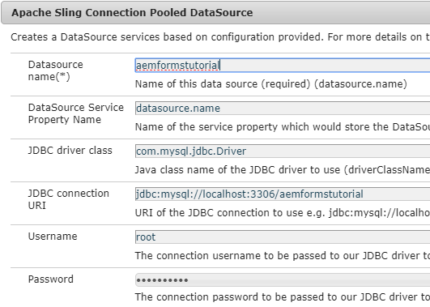

---

title: Saving and Retrieving Adaptive Form Data
seo-title: Saving and Retrieving Adaptive Form Data
description: Saving and retrieving adaptive form data from database. This capability  allows form fillers to save the form and continue filling the form at a later date.
seo-description: Saving and retrieving adaptive form data from database. This capability  allows form fillers to save the form and continue filling the form at a later date.
feature: adaptive-forms
topics: developing
audience: developer,implementer
doc-type: article
activity: setup
version: 6.3,6.4,6.5
---

# Saving and Retrieving Adaptive Form Data 

This article will walk you through the steps involved in saving and retrieving Adaptive Form Data from Database. MySQL database was used to store the Adaptive Form data. At a high-level, the following are the steps to achieve the use case:

* [Configure Data Source](#Configure-Data-Source)
* [Create Servlet to write data to the database](#create-servlet)
* [Create OSGI Service to fetch stored data](#create-osgi-service)
* [Create Client Library](#create-client-library)
* [Create Adaptive Form Template and Page Component](#form-template-and-page-component)
* [Capability Demonstration](#capability-demo)
* [Deploy on your server](#deploy-on-your-server)

## Configure Data Source {#Configure-Data-Source}

 Apache Sling Connection Pooled DataSource is configured to point to the database that is going to be used to store the Adaptive Form data. The following screenshot shows the configuration for my instance. The following properties can be copied and pasted

* Datasource Name:aemformstutorial - This is the name used in my code.

* JDBC Driver Class:com.mysql.jdbc.Driver

* JDBC Connection URL:jdbc:mysql://localhost:3306/aemformstutorial



### Create Servlet {#create-servlet}

The following is the code of the servlet that inserts/updates Adaptive Form data in the database. The Apache Sling Connection Pooled DataSource is configured using the AEM ConfigMgr and the same is referenced in line 26. The rest of the code is fairly straightforward. The code either inserts a new row in the database or updates an existing row. The stored Adaptive Form data is associated with a GUID. The same GUID is then used to update the form data.

```java {.line-numbers}
package com.techmarketing.core.servlets;
import java.io.IOException;
import java.sql.Connection;
import java.sql.PreparedStatement;
import java.sql.SQLException;
import java.util.UUID;
import javax.servlet.Servlet;
import javax.sql.DataSource;
import org.apache.sling.api.SlingHttpServletRequest;
import org.apache.sling.api.SlingHttpServletResponse;
import org.apache.sling.api.servlets.SlingAllMethodsServlet;
import org.json.JSONException;
import org.json.JSONObject;
import org.osgi.service.component.annotations.Component;
import org.osgi.service.component.annotations.Reference;
import org.slf4j.Logger;
import org.slf4j.LoggerFactory;
 
@Component(service = { Servlet.class}, property = {"sling.servlet.methods=post","sling.servlet.paths=/bin/storeafdata"})
public class StoreDataInDB extends SlingAllMethodsServlet {
     private static final Logger log = LoggerFactory.getLogger(StoreDataInDB.class);
        private static final long serialVersionUID = 1L;
     @Reference(target = "(&(objectclass=javax.sql.DataSource)(datasource.name=aemformstutorial))")
        private DataSource dataSource;
    public String updateData(String afdata,String guid)
    {
         String updateTableSQL = "update aemformstutorial.formdata set afdata= ? where guid = ?";
         Connection c = getConnection();
            PreparedStatement pstmt = null;
            try {
      
                pstmt = null;
                pstmt = c.prepareStatement(updateTableSQL);
                pstmt.setString(1,afdata);
                pstmt.setString(2,guid);
                log.debug("Executing the insert statment  " + pstmt.executeUpdate());
                c.commit();
                 
      
            } catch (SQLException e) {
      
                log.error("Getting errors", e);
            } finally {
                if (pstmt != null) {
                    try {
                        pstmt.close();
                    } catch (SQLException e) {
                        // TODO Auto-generated catch block
                        e.printStackTrace();
                    }
                }
                if (c != null) {
                    try {
                        c.close();
                    } catch (SQLException e) {
                        // TODO Auto-generated catch block
                        e.printStackTrace();
                    }
                }
            }
            return guid;
     
         
    }
     public String insertData(String afdata) {
            log.debug("### Insert Data #### The json object I got to insert was " + afdata);
            String insertTableSQL = "INSERT INTO aemformstutorial.formdata(guid,afdata) VALUES(?,?)";
            UUID uuid = UUID.randomUUID();
            String randomUUIDString = uuid.toString();
            log.debug("The query is " + insertTableSQL);
            Connection c = getConnection();
            PreparedStatement pstmt = null;
            try {
      
                pstmt = null;
                pstmt = c.prepareStatement(insertTableSQL);
                pstmt.setString(1,randomUUIDString);
                pstmt.setString(2,afdata);
                log.debug("Executing the insert statment  " + pstmt.executeUpdate());
                c.commit();
                 
      
            } catch (SQLException e) {
      
                log.error("Getting errors", e);
            } finally {
                if (pstmt != null) {
                    try {
                        pstmt.close();
                    } catch (SQLException e) {
                        // TODO Auto-generated catch block
                        e.printStackTrace();
                    }
                }
                if (c != null) {
                    try {
                        c.close();
                    } catch (SQLException e) {
                        // TODO Auto-generated catch block
                        e.printStackTrace();
                    }
                }
            }
            return randomUUIDString;
        }
      
     public Connection getConnection() {
            log.debug("Getting Connection ");
            Connection con = null;
            try {
                con = dataSource.getConnection();
                log.debug("got connection");
                return con;
            } catch (Exception e) {
                log.error("not able to get connection ", e);
            }
            return null;
        }
    protected void doPost(SlingHttpServletRequest request,SlingHttpServletResponse response)
    {
        log.debug("Inside my save af data servlet");
        if(request.getParameter("operation").equalsIgnoreCase("update"))
        {
            log.debug("The operation is update");
            log.debug("The data I got was "+request.getParameter("formdata"));
            String guid = updateData(request.getParameter("formdata"),request.getParameter("guid"));
            log.debug("The guid I got was  "+guid);
            JSONObject jsonResponse = new JSONObject();
            try {
                jsonResponse.put("guid",guid);
                response.setContentType("application/json");
                response.setCharacterEncoding("UTF-8");
                response.getWriter().write(jsonResponse.toString());
            } catch (JSONException e) {
                // TODO Auto-generated catch block
                e.printStackTrace();
            } catch (IOException e) {
                // TODO Auto-generated catch block
                e.printStackTrace();
            }
        }
        if(request.getParameter("operation").equalsIgnoreCase("insert"))
        {
            log.debug("The data I got was +request.getParameter("formdata");
            String guid = insertData(request.getParameter("formdata"));
            log.debug("The guid on inserting data  "+guid);
            JSONObject jsonResponse = new JSONObject();
            try {
                jsonResponse.put("guid",guid);
                response.setContentType("application/json");
                response.setCharacterEncoding("UTF-8");
                response.getWriter().write(jsonResponse.toString());

} catch (JSONException e) {
                // TODO Auto-generated catch block
                e.printStackTrace();
            } catch (IOException e) {
                // TODO Auto-generated catch block
                e.printStackTrace();
            }
        }
 
}
```

## Create OSGI Service to Fetch Data {#create-osgi-service}

The following code was written to fetch the stored Adaptive Form data. A simple query is used to fetch the Adaptive Form data associated with a given GUID. The fetched data is then returned to the calling application. The same data source created in the first step referenced in this code.

``` java {.line-numbers}
package com.techmarketing.core.impl;
import java.sql.Connection;
import java.sql.ResultSet;
import java.sql.SQLException;
import java.sql.Statement;
 
import javax.sql.DataSource;
 
import org.osgi.service.component.annotations.Component;
import org.osgi.service.component.annotations.Reference;
import org.slf4j.Logger;
import org.slf4j.LoggerFactory;
 
import com.techmarketing.core.AemFormsAndDB;
 
 
@Component(service=AemFormsAndDB.class,immediate = true)
public class AemformWithDB implements AemFormsAndDB {
    private final Logger log = LoggerFactory.getLogger(getClass());
     @Reference(target = "(&(objectclass=javax.sql.DataSource)(datasource.name=aemformstutorial))")
        private DataSource dataSource;
 
    @Override
    public String getData(String guid) {
        System.out.println("### inside my getData of AemformWithDB");
        Connection con = getConnection();
        try {
            Statement st = con.createStatement();
            String query = "SELECT afdata FROM aemformstutorial.formdata where guid = '"+guid+"'"+"";
            log.debug(" Got Result Set"+query);
            ResultSet rs = st.executeQuery(query);
            while(rs.next())
            {
                return rs.getString("afdata");
            }
        } catch (SQLException e) {
            // TODO Auto-generated catch block
            e.printStackTrace();
        }
 
        return null;
    }
     public Connection getConnection() {
            log.debug("Getting Connection ");
            Connection con = null;
            try {
                con = dataSource.getConnection();
                log.debug("got connection");
                return con;
            } catch (Exception e) {
                log.debug("not able to get connection ");
                e.printStackTrace();
            }
            return null;
        }
 
 
}
```

## Create Client Library {#create-client-library}

AEM Client Library manages all your client side javascript code. For this article, I have created a simple javascript to fetch the Adaptive Form data using the guide bridge API. Once the Adaptive Form data is fetched, the POST call is made to the servlet to either insert or update the adaptive form data in the database. The function getALLUrlParams returns the parameters in the URL. This is used when you want to update the data. The rest of the functionality is handled in the code associated with the click event of .savebutton class. If the guid parameter is present in the URL, then we need to perform the update operation, if not it is an insert operation.

``` javascript {.line-numbers}

function getAllUrlParams(url) {
 
  // get query string from url (optional) or window
  var queryString = url ? url.split('?')[1] : window.location.search.slice(1);
 
  // we'll store the parameters here
  var obj = {};
 
  // if query string exists
  if (queryString) {
 
    // stuff after # is not part of query string, so get rid of it
    queryString = queryString.split('#')[0];
 
    // split our query string into its component parts
    var arr = queryString.split('&');
 
    for (var i = 0; i < arr.length; i++) {
      // separate the keys and the values
      var a = arr[i].split('=');
 
      // set parameter name and value (use 'true' if empty)
      var paramName = a[0];
      var paramValue = typeof (a[1]) === 'undefined' ? true : a[1];
 
      // (optional) keep case consistent
      paramName = paramName.toLowerCase();
      if (typeof paramValue === 'string') paramValue = paramValue.toLowerCase();
 
      // if the paramName ends with square brackets, e.g. colors[] or colors[2]
      if (paramName.match(/\[(\d+)?\]$/)) {
 
        // create key if it doesn't exist
        var key = paramName.replace(/\[(\d+)?\]/, '');
        if (!obj[key]) obj[key] = [];
 
        // if it's an indexed array e.g. colors[2]
        if (paramName.match(/\[\d+\]$/)) {
          // get the index value and add the entry at the appropriate position
          var index = /\[(\d+)\]/.exec(paramName)[1];
          obj[key][index] = paramValue;
        } else {
          // otherwise add the value to the end of the array
          obj[key].push(paramValue);
        }
      } else {
        // we're dealing with a string
        if (!obj[paramName]) {
          // if it doesn't exist, create property
          obj[paramName] = paramValue;
        } else if (obj[paramName] && typeof obj[paramName] === 'string'){
          // if property does exist and it's a string, convert it to an array
          obj[paramName] = [obj[paramName]];
          obj[paramName].push(paramValue);
        } else {
          // otherwise add the property
          obj[paramName].push(paramValue);
        }
      }
    }
  }
 
  return obj;
}
 
$(document).ready(function()
   {
        var linktext = guideBridge.resolveNode("guide[0].guide1[0].guideRootPanel[0].info[0].linktxt[0]");
        var linktext1 = guideBridge.resolveNode("guide[0].guide1[0].guideRootPanel[0].info[0].linktext1[0]");
       linktext.visible = false;
       linktext1.visible = false;
        $(".savebutton").click(function(){
           var params = getAllUrlParams(window.location.href);
           console.log(getAllUrlParams(window.location.href));
            window.guideBridge.getDataXML({
                 success:function(guideResultObject) 
                 {
                     console.log("The data is "+guideResultObject.data);
                     let xhr = new XMLHttpRequest();
                      xhr.open('POST','/bin/storeafdata');
                     let formData = new FormData();
                     if(typeof(params.guid)!="undefined")
                     {
                         formData.append("operation","update");
                         formData.append("guid",params.guid);
 
                     }
                     if(typeof(params.guid)=="undefined")
                     {
                         formData.append("operation","insert");
 
 
                     }
 
 
                formData.append("formdata",guideResultObject.data);
                xhr.send(formData);
                     xhr.onload = function(e)
                {
                    console.log("The data is ready");
                    if (this.status == 200)
                        {
                            var jsonResponse = JSON.parse(this.response);
                            console.log(jsonResponse.guid);
                            var linktext = guideBridge.resolveNode("guide[0].guide1[0].guideRootPanel[0].info[0].linktxt[0]");
                            var linktext1 = guideBridge.resolveNode("guide[0].guide1[0].guideRootPanel[0].info[0].linktext1[0]");
                            linktext1.visible = true;
                            linktext.value = "http://localhost:4502/content/dam/formsanddocuments/saveformdata/jcr:content?wcmmode=disabled&guid="+jsonResponse.guid;
                            linktext.visible = true;
                            guideBridge.setFocus("guide[0].guide1[0].guideRootPanel[0].info[0].linktxt[0]");
                        }
 
                }
                  }
             });
 
 
       });
 
 
});
```

## Create Adaptive Form Template and Page Component {#form-template-and-page-component}


>[!VIDEO](https://video.tv.adobe.com/v/27828?quality=9)

### Demonstration of the capability {#capability-demo}

>[!VIDEO](https://video.tv.adobe.com/v/27829?quality=9)

#### Deploy on your server {#deploy-on-your-server}

To test this capability on your AEM Forms instance, please follow the following steps

* [Download and unzip the DemoAssets.zip on to your local system](assets/demoassets.zip)
* Deploy and start the techmarketingdemos.jar and mysqldriver.jar bundles using Felix web console.
*** Import the aemformstutorial.sql using MYSQL Workbench. This will create the necessary schema and tables in your database
* Import StoreAndRetrieve.zip using AEM package manager. This package contains the Adaptive Form template, page component client lib, and sample adaptive form and data source configuration. 
* Login to configMgr. Search for "Apache Sling Connection Pooled DataSource. Open the data source entry associated with aemformstutorial and enter the username and password specific to your database instance.
* Open the Adaptive Form
* Fill in some details and click on the "Save And Continue Later" button
* You should get back a URL with a GUID in it.
* Copy the URL and paste it in a new browser tab
* Adaptive Form should get populated with the data from the previous step**
