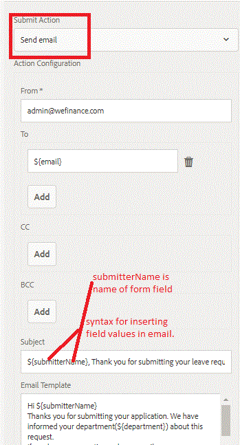

# Sending Email on Adaptive Form Submission {#sending-email-on-adaptive-form-submission}

One of the common actions is to send a confirmation email to the submitter on successful submission of Adaptive Form. To accomplish this we will select the "Send Email" as submit action.

You can use email template or just type in the body of the email as shown in this screenshot below.

Notice the syntax to insert form field values in the email.We also have the option to include form attachments in the email, by selecting the checkbox "include attachments" in the configuration properties.

When the Adaptive Form is submitted, the recipient will get email.

## Configurations Needed {#configurations-needed}

You will have to configure Day CQ Mail service. This can be configured by pointing your browser to [Felix Configuration Manager](http://localhost:4502/system/console/configMgr)

The screenshot shows you the configuration properties for adobe mail server.

To try this on your server follow these instructions:

* [Import the assets](assets/timeoffrequest.zip) associated with this article in AEM using the package manager.

* Open the [TimeOffRequestForm](http://localhost:4502/content/dam/formsanddocuments/helpx/timeoffrequestform/jcr:content?wcmmode=disabled).

* Fill in the details.Make sure you provide a valid email address in the email field.

* Submit the form.
