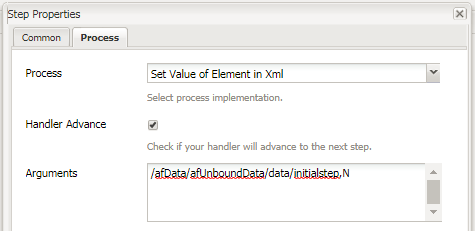

# Using setvalue in AEM Forms workflow

Set Value of an XML Element in Adaptive Forms submitted data in AEM Forms OSGI workflow.

 
 
LiveCycle used to have a set value component which would allow you set an XML element's value.

Based on this value, when the form is populated with the XML you can hide/disable certain fields or panels of the form.

In AEM Forms OSGI- we will have to write a custom OSGi bundle to set value in the XML. The bundle is provided as part of this tutorial.
We use Process Step in AEM workflow. We associate the "Set Value of Element in XML" OSGi bundle with this process step.
We need to pass two arguments to the set value bundle. The first argument is the XPath of the XML element whose value needs to be set. The second argument is the value that needs to be set.
For example, in the above screenshot, we are setting the value of the intialstep element to "N".
Based on this value certain panels in the Adaptive Forms are hidden or shown.
In our example, we have a simple Time Off Request Form. The initiator of this form fills in his/her name and the time off dates. On submission, this form goes to "admin" for review. When admin opens the form, fields on the first panel are disabled. This because we have set the value of the initial step element in the XML to "N".

Based on the initial step fields value we show the second panel where the "admin" can approve or reject the request

Please take a look at the rules set against "Time Off Requested by" field using the rule editor.

To deploy the assets on your local system, please follow the steps below:

* [Deploy the Developingwithserviceuser bundle](/help/forms/assets/common-osgi-bundles/DevelopingWithServiceUser.jar)

* [Deploy the sample bundle](/help/forms/assets/common-osgi-bundles/SetValueApp.core-1.0-SNAPSHOT.jar). This is the custom OSGI bundle which allows you to set the values of an element in the submitted xml data

* [Download and extract the contents of the zip file](assets/setvalueassets.zip)
* Point your browser to [package manager](http://localhost:4502/crx/packmgr/index.jsp)
* Import and install the setValueWorkflow.zip. This has the sample workflow model.
* Point your browser to [Forms and Documents](http://localhost:4502/aem/forms.html/content/dam/formsanddocuments)
* Click Create | File Upload
* Upload the TimeOfRequestForm.zip
* Open the [TimeOffRequestform](http://localhost:4502/content/dam/formsanddocuments/timeoffapplication/jcr:content?wcmmode=disabled)
* Fill in the 3 required fields and submit
* Login as 'admin" in to AEM(If you have not already)
* Go to ["AEM Inbox"](http://localhost:4502/aem/inbox)
* Open the "Review Time Off Request" form
* Notice the fields in the first panel are disabled. This is because the form is being opened by reviewer. Also, notice the panel for approving or declining the request is now visible

>[!NOTE]
>
>You can enable debug logging by enabling logger for
>com.aemforms.setvalue.core.SetValueinXml
>by pointing your browser to http://localhost:4502/system/console/slinglog

>[!NOTE]
>
>Make sure the Data File path in the Adaptive Form's submission options is set to "Data.xml". This is because the process step looks for a file called Data.xml under the payload folder
