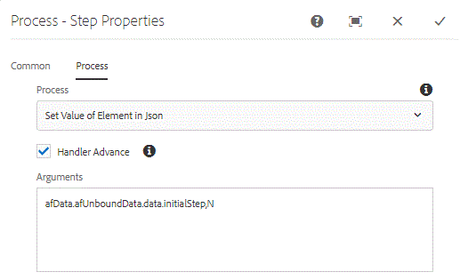

# Setting value of JSON Data Element in AEM Forms Workflow {#setting-value-of-json-data-element-in-aem-forms-workflow}

As an Adaptive Form is routed to different users in AEM Workflow, there will be requirements to hide or disable certain fields or panels based on the person reviewing the form. To satisfy these use cases we typically set a value of a hidden field. Based on this hidden field's value business rules can be authored to hide/disable appropriate panels or fields.

 
 
In AEM Forms OSGI- we will have to write a custom OSGi bundle to set JSON data element's value. The bundle is provided as part of this tutorial.

We use Process Step in AEM workflow. We associate the "Set Value of Element in Json" OSGi bundle with this process step.

We need to pass two arguments to the set value bundle. The first argument is the path to the element whose value needs to be set. The second argument is the value that needs to be set.

For example, in the above screenshot, we are setting the value of the intialStep element to "N"

afData.afUnboundData.data.initialStep,N

In our example, we have a simple Time Off Request Form. The initiator of this form fills in his/her name and the time off dates. On submission, this form goes to "manager" for review. When the manager opens the form, fields on the first panel are disabled. This because we have set the value of the initial step element in the JSON data to N.

Based on the initial step fields value we show the approver panel where the "manager" can approve or reject the request.

Please take a look at the rules set against "Initial Step". Based on the value of the initialStep field we fetch the user details using Form Data Model and populate the appropriate fields and hide/disable appropriate panels.

To deploy the assets on your local system:

* [Download and deploy DevelopingWitheServiceUserBundle](/help/forms/assets/common-osgi-bundles/DevelopingWithServiceUser.jar)

* [Download and deploy the setvalue bundle](/help/forms/assets/common-osgi-bundles/SetValueApp.core-1.0-SNAPSHOT.jar). This is the custom OSGI bundle which allows you to set the values of an element in the submitted json data.

* [Download and extract the contents of the zip file](assets/set-value-jsondata.zip)
  * Point your browser to [package manager](http://localhost:4502/crx/packmgr/index.jsp)
    * Import and install the SetValueOfElementInJSONDataWorkflow.zip.This package has the sample workflow model and Form Data Model associated with the form.

* Point your browser to [Forms and Documents](http://localhost:4502/aem/forms.html/content/dam/formsanddocuments)
* Click Create | File Upload
* Upload TimeOffRequestForm.zip file
 **This form was built using AEM Forms 6.4. Please make sure you are on AEM Forms 6.4 or above**
* Open the [form](http://localhost:4502/content/dam/formsanddocuments/timeoffrequest/jcr:content?wcmmode=disabled)
* Fill in the Start and End Dates and submit the form.
* Go to ["Inbox"](http://localhost:4502/aem/inbox)
* Open the form associated with the task.
* Notice the fields in the first panel are disabled.
* Notice the panel for approving or declining the request is now visible.

>[!NOTE]
>
>Since we are pre-populating the Adaptive Form using user profile, make sure the admin [user profile information ](http://localhost:4502/security/users.html). At the minimum make sure you have set the FirstName,LastName and Email field values.
>You can enable debug logging by enabling logger for com.aemforms.setvalue.core.SetValueInJson [from here](http://localhost:4502/system/console/slinglog)

>[!NOTE]
>
>The OSGi bundle for setting value of data elements in JSON Data currently supports the ability to set one element value at one time. If you want to set multiple element values, you will need to use process step multiple times.
>
>Make sure the Data File path in the Adaptive Form's submission options is set to "Data.xml". This is because the code in the process step looks for a file called Data.xml under the payload folder.
