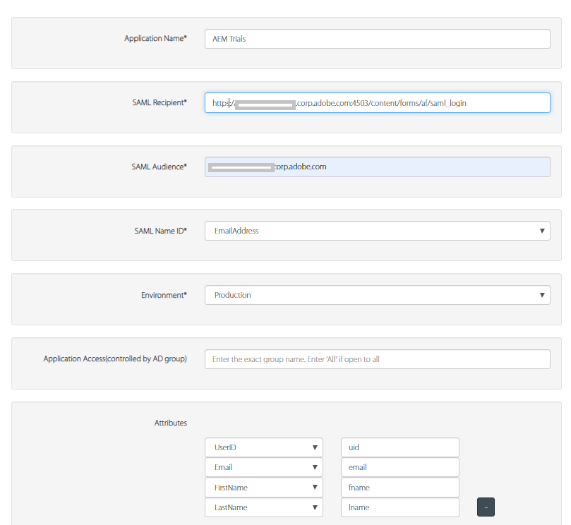
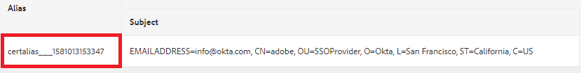
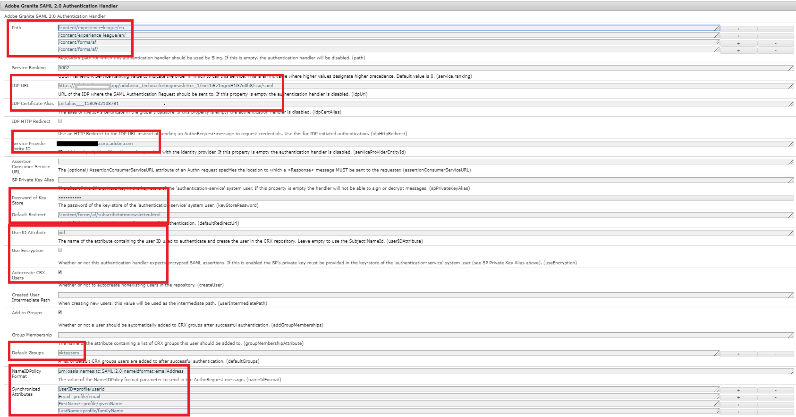
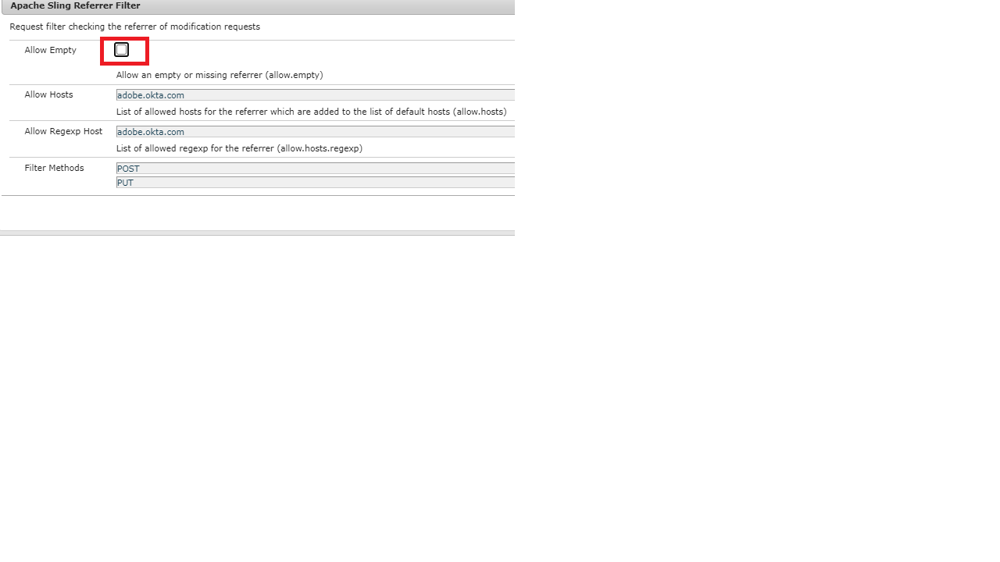

# Authenticate to AEM Author using OKTA

The first step is to configure your app on OKTA portal. Once your app is approved by your OKTA administrator you will have access to IdP certificate and single sign on URL. The following are the settings typically used in registering new application.

* **Application Name:** This is your application name. Make sure you give a unique name to your application.
* **SAML Recipient:** After authentication from OKTA, this is the URL which would be hit on your AEM instance with the SAML response. SAML authentication handler normally intercepts all the URL'S with / saml_login but it would be preferable to append it after your application root.
* **SAML Audience**: This is the domain URL of your application. Do not use protocol(http or https) in the domain URL.
* **SAML Name ID:** Select Email from the drop down list.
* **Environment**: Choose your appropriate environment.
* **Attributes**: These are the attributes you get about the user in the SAML response. Specify them as per your needs.

## Add the OKTA (IdP) Certificate to the AEM Trust Store

Since SAML assertions are encrypted, we need to add the IdP (OKTA) certificate to the AEM trust store, to allow secure communication between OKTA and AEM.
[Initialize trust store](http://localhost:4502/libs/granite/security/content/truststore.html), if not initialized already.
Remember the trust store password. We will need to use this password later in this process.

* Navigate to [Global Trust Store](http://localhost:4502/libs/granite/security/content/truststore.html).
* Click on "Add Certificate from CER file". Add the IdP certificate provided by OKTA and click submit.

  >[!NOTE]
  >
  >Please do not map the certificate to any user

On adding the certificate to trust store you should get certificate alias as shown in the screen shot below. The alias name could be different in your case.

**Make a note of the certificate alias. You need this in the later steps.**

### Configure SAML authentication handler

Navigate to [configMgr](http://localhost:4502/system/console/configMgr).
Search and open "Adobe Granite SAML 2.0 Authentication Handler".
Provide the following properties as specified below
The following are the key properties that need to be specified:

* **path** - This is the path where the authentication handler is triggered
* **IdP Url**:This is your IdP url which is provided by OKTA
* **IDP Certificate Alias**:This the alias you got when you added the IdP certificate into AEM trust store
* **Service Provider Entity Id**:This is the name of your AEM Server
* **Password of Key store**:This is the trust store password that you used 
* **Default Redirect**:This is the URL to redirect to on successful authentication
* **UserID Attribute**:uid
* **Use Encryption**:false
* **Autocreate CRX Users**:true
* **Add to Groups**:true
* **Default Groups**:oktausers(This is the group to which the users are added. You can provide any existing group within AEM)
* **NamedIDPolicy**: Specifies constraints on the name identifier to be used to represent the requested subject. Copy and paste the following highlighted string **urn:oasis:names:tc:SAML:2.0:nameidformat:emailAddress**
* **Synchronized Attributes** - These are the attributes that are being stored from SAML assertion in AEM profile

### Configure Apache Sling Referrer Filter

Navigate to [configMgr](http://localhost:4502/system/console/configMgr).
Search and open "Apache Sling Referrer Filter".Set the following properties as specified below:

* **Allow Empty**: false
* **Allow Hosts**: IdP's hostname (This is different in your case)
* **Allow Regexp Host**: IdP's hostname (This is different in your case)
The Sling Referrer Filter Referrer properties screenshot

#### Configure DEBUG Logging for the OKTA integration

When setting up the OKTA integration on AEM, it can be helpful to review the DEBUG logs for AEM's SAML Authentication handler. To set the log level to DEBUG, create a new Sling Logger configuration via the AEM OSGi Web Console.

Remember to remove or disable this logger on Stage and Production to reduce log-noise.

When setting up the OKTA integration on AEM, it can be helpful to review DEBUG logs for AEM's SAML Authentication handler. To set the log level to DEBUG, create a new Sling Logger configuration via the AEM OSGi Web Console.
**Remember to remove or disable this logger on Stage and Production to reduce log-noise.**
* Navigate to [configMgr](http://localhost:4502/system/console/configMgr)

* Search and open "Apache Sling Logging Logger Configuration"
* Create a logger with the following configuration:
  * **Log Level**: Debug
  * **Log File**: logs/saml.log
  * **Logger**: com.adobe.granite.auth.saml
* Click on save to save your settings

#### Test your OKTA configuration

Logout of your AEM instance. Try accessing the link. You should see OKTA SSO in action.
